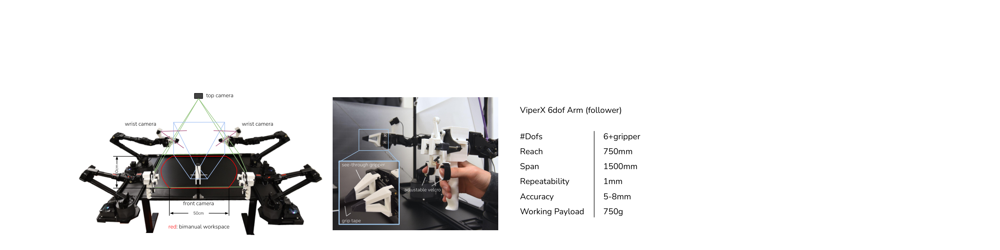
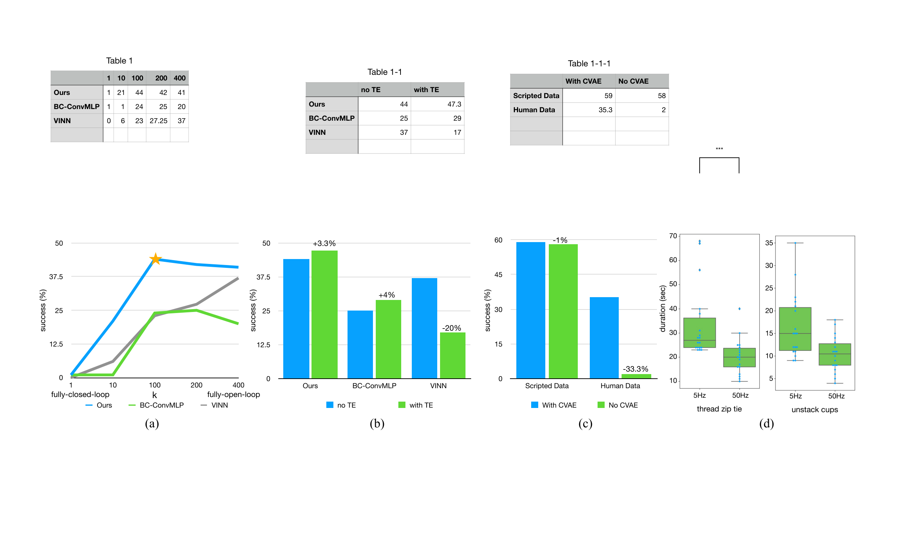
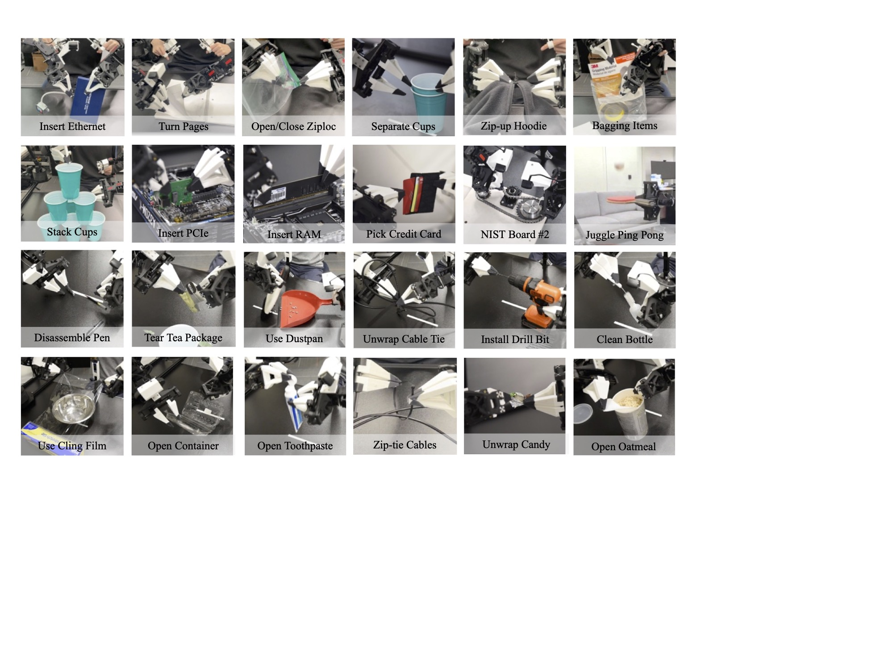
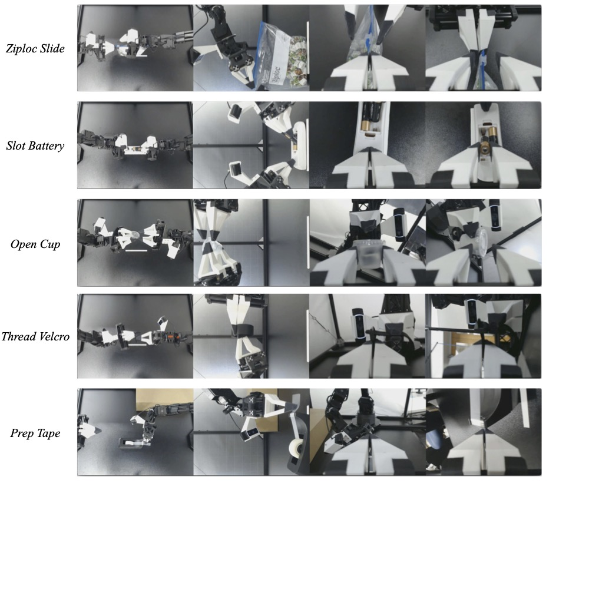
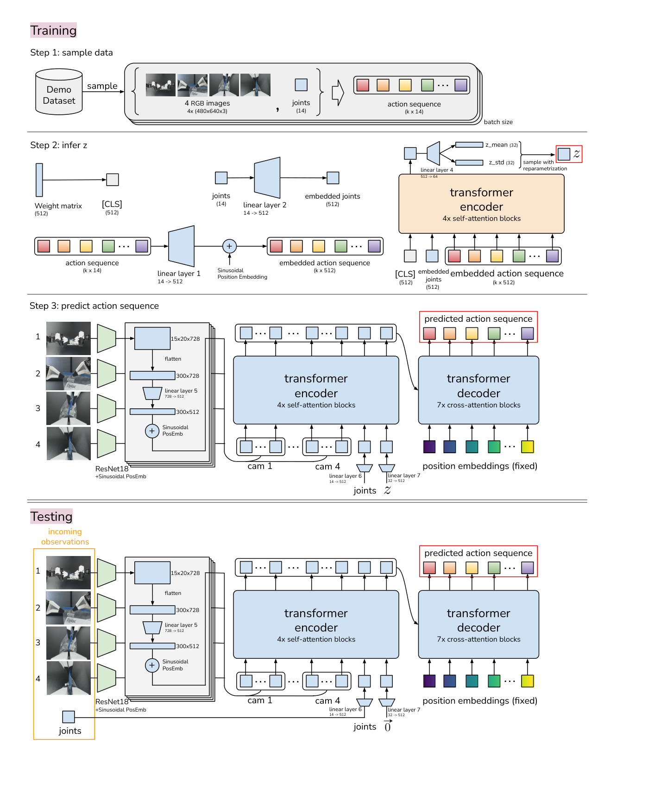

# D2 Source Figures Manifest

이 파일은 arXiv/LaTeX source에서 추출한 원본 figure asset 목록이다.
PDF figure는 첫 페이지를 PNG preview로 렌더링했다.

| Order | LaTeX reference | Source asset | Preview |
|---:|---|---|---|
| 1 | `figures/beach_emoji.png` | `D2_srcfig_01_beach_emoji.png` |  |
| 2 | `figures/setup.jpg` | `D2_srcfig_02_setup.jpg` |  |
| 3 | `figures/setup_close.pdf` | `D2_srcfig_03_setup_close.pdf` |  |
| 4 | `figures/algo.pdf` | `D2_srcfig_04_algo.pdf` |  |
| 5 | `figures/real_tasks.pdf` | `D2_srcfig_05_real_tasks.pdf` |  |
| 6 | `figures/sim_tasks.pdf` | `D2_srcfig_06_sim_tasks.pdf` |  |
| 7 | `figures/fm_data.pdf` | `D2_srcfig_07_fm_data.pdf` |  |
| 8 | `figures/teleop_tasks.jpg` | `D2_srcfig_08_teleop_tasks.jpg` |  |
| 9 | `figures/obs.jpg` | `D2_srcfig_09_obs.jpg` |  |
| 10 | `figures/detail_architecture.pdf` | `D2_srcfig_10_detail_architecture.pdf` |  |
| 11 | `figures/user_study_obj.jpeg` | `D2_srcfig_11_user_study_obj.jpeg` |  |
