# D3 Source Figures Manifest

이 파일은 arXiv/LaTeX source에서 추출한 원본 figure asset 목록이다.
PDF figure는 첫 페이지를 PNG preview로 렌더링했다.

| Order | LaTeX reference | Source asset | Preview |
|---:|---|---|---|
| 1 | `figures/droid_teaser.pdf` | `D3_srcfig_01_droid_teaser.pdf` |  |
| 2 | `figures/droid_setup.pdf` | `D3_srcfig_02_droid_setup.pdf` |  |
| 3 | `figures/droid_verb_objects_highres.pdf` | `D3_srcfig_03_droid_verb_objects_highres.pdf` |  |
| 4 | `figures/scene_distribution.pdf` | `D3_srcfig_04_scene_distribution.pdf` |  |
| 5 | `figures/droid_viewpoint_distribution.pdf` | `D3_srcfig_05_droid_viewpoint_distribution.pdf` | 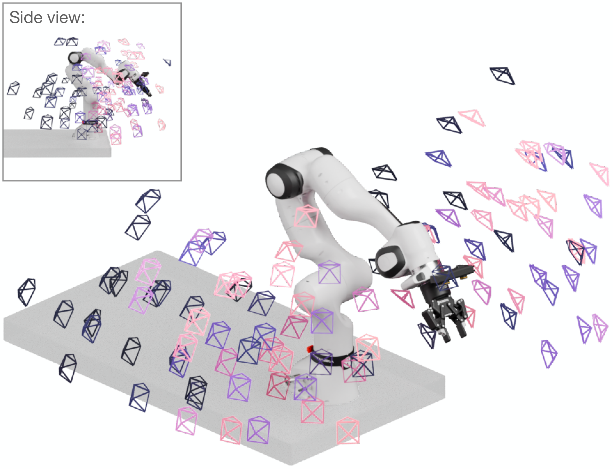 |
| 6 | `figures/droid_interaction_points.pdf` | `D3_srcfig_06_droid_interaction_points.pdf` |  |
| 7 | `figures/droid_eval_setups.pdf` | `D3_srcfig_07_droid_eval_setups.pdf` | 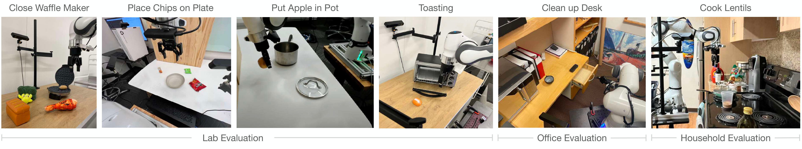 |
| 8 | `figures/cotrain.png` | `D3_srcfig_08_cotrain.png` |  |
| 9 | `figures/droid_qualitative_rollout.pdf` | `D3_srcfig_09_droid_qualitative_rollout.pdf` |  |
| 10 | `figures/filteredcotrain.png` | `D3_srcfig_10_filteredcotrain.png` |  |
| 11 | `figures/droid_gui.pdf` | `D3_srcfig_11_droid_gui.pdf` | 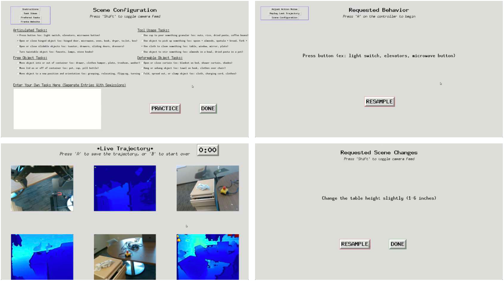 |
| 12 | `figures/droid_qualitative_examples.pdf` | `D3_srcfig_12_droid_qualitative_examples.pdf` | 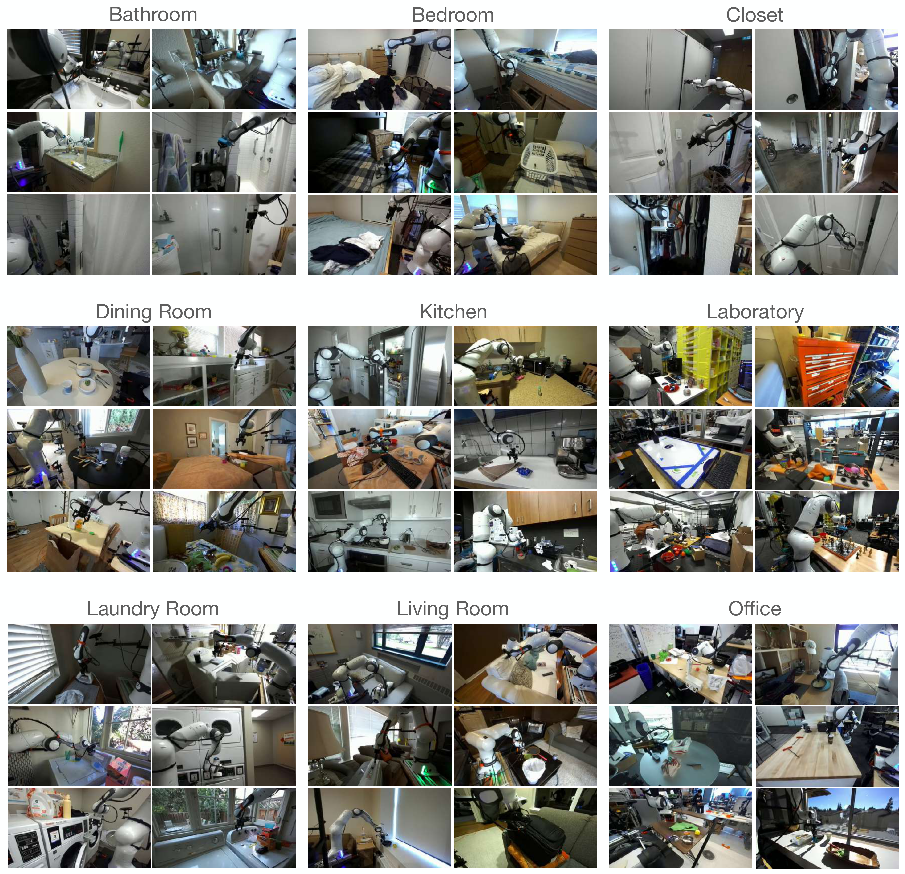 |
| 13 | `figures/cam2base_calib.jpg` | `D3_srcfig_13_cam2base_calib.jpg` |  |
| 14 | `figures/droid_cam2cam_wide.pdf` | `D3_srcfig_14_droid_cam2cam_wide.pdf` | 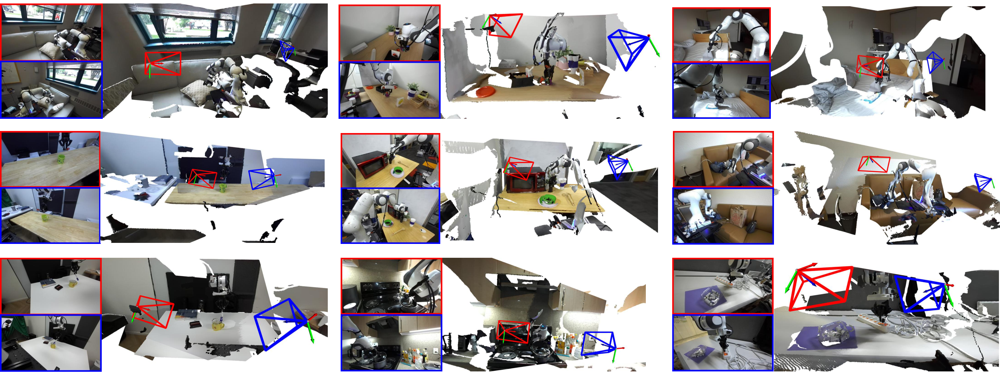 |
| 15 | `figures/droid_cam2cam_vis_2.pdf` | `D3_srcfig_15_droid_cam2cam_vis_2.pdf` | 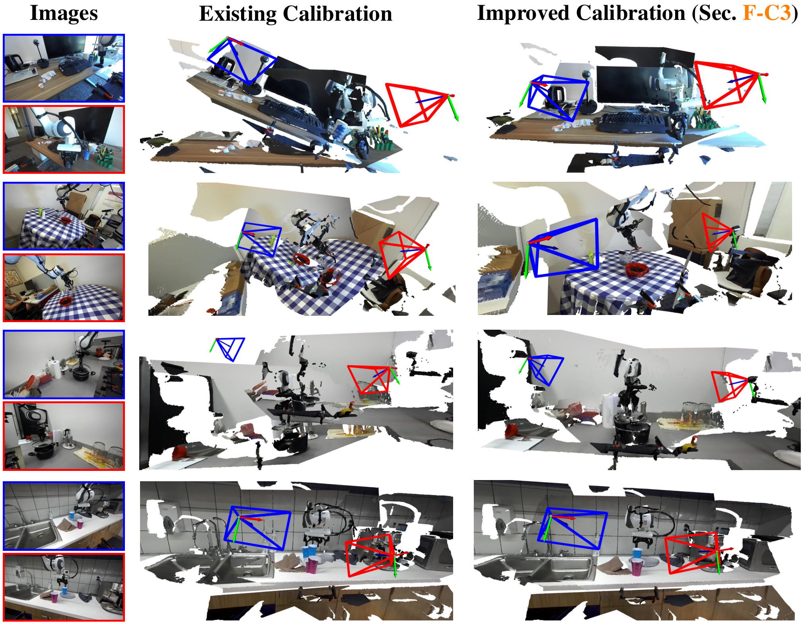 |
| 16 | `figures/cam2cam_plot.pdf` | `D3_srcfig_16_cam2cam_plot.pdf` | 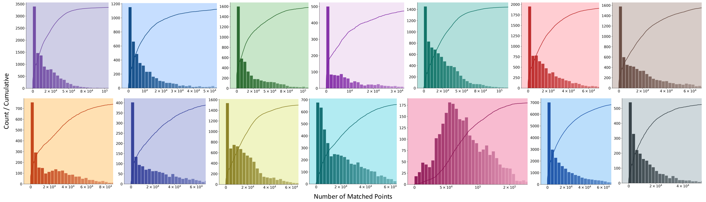 |
| 17 | `figures/cam2base_historgrams.pdf` | `D3_srcfig_17_cam2base_historgrams.pdf` | 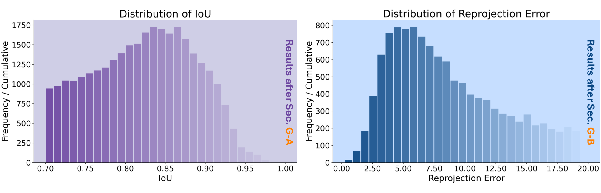 |
| 18 | `figures/verb_distributions.pdf` | `D3_srcfig_18_verb_distributions.pdf` | 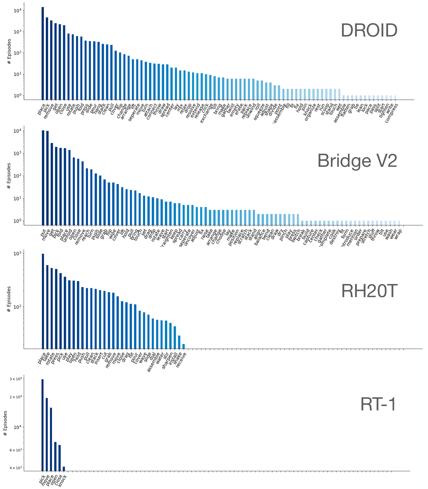 |
| 19 | `figures/object_distribution.pdf` | `D3_srcfig_19_object_distribution.pdf` | 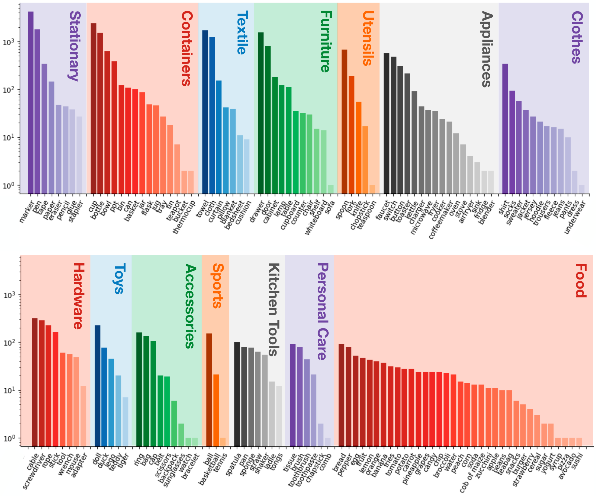 |
| 20 | `figures/droid_verb_object_heatmap.png` | `D3_srcfig_20_droid_verb_object_heatmap.png` | 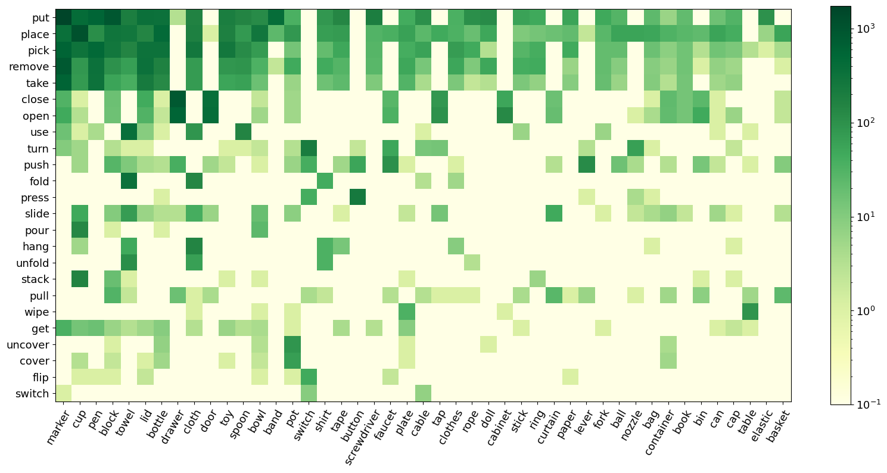 |