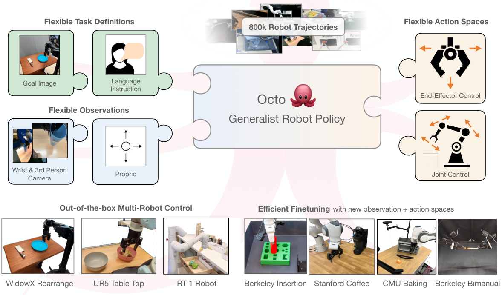
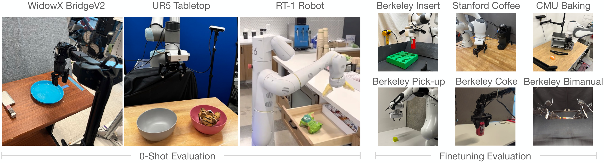
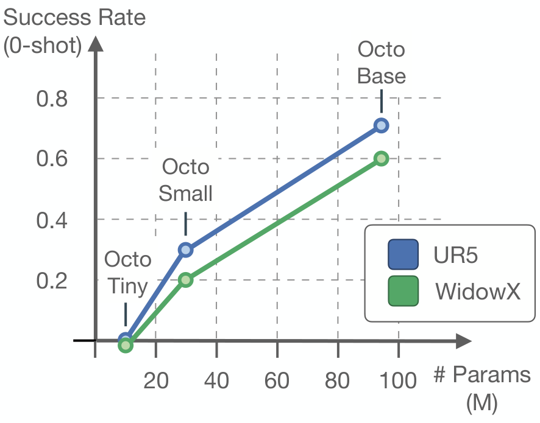
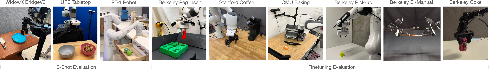

# D4 Source Figures Manifest

이 파일은 arXiv/LaTeX source에서 추출한 원본 figure asset 목록이다.
PDF figure는 첫 페이지를 PNG preview로 렌더링했다.

| Order | LaTeX reference | Source asset | Preview |
|---:|---|---|---|
| 1 | `#1` | `missing` |  |
| 2 | `figures/octo_teaser_figure.pdf` | `D4_srcfig_02_octo_teaser_figure.pdf` |  |
| 3 | `figures/architecture.pdf` | `D4_srcfig_03_architecture.pdf` |  |
| 4 | `figures/sampling_weights.pdf` | `D4_srcfig_04_sampling_weights.pdf` |  |
| 5 | `figures/eval_setups.pdf` | `D4_srcfig_05_eval_setups.pdf` |  |
| 6 | `figures/zero_shot.pdf` | `D4_srcfig_06_zero_shot.pdf` |  |
| 7 | `figures/orca_scaling.pdf` | `D4_srcfig_07_orca_scaling.pdf` |  |
| 8 | `figures/orca_eval_setups_final.pdf` | `D4_srcfig_08_orca_eval_setups_final.pdf` |  |