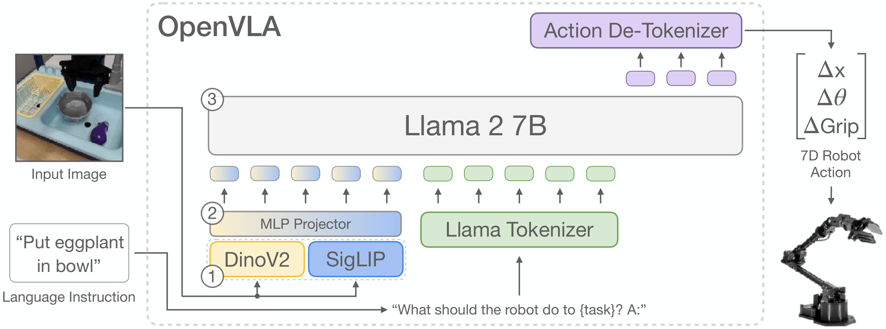
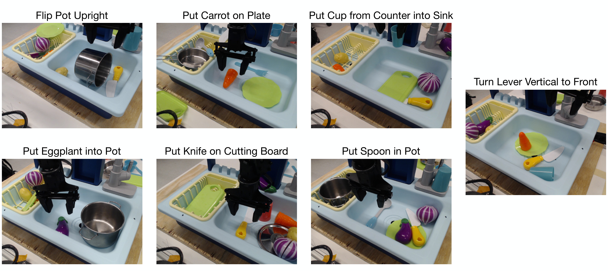
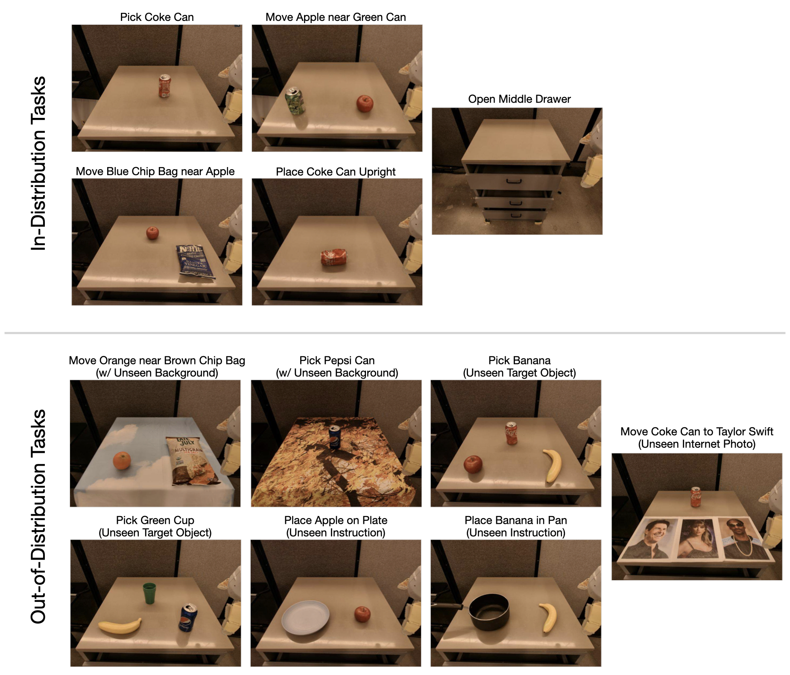
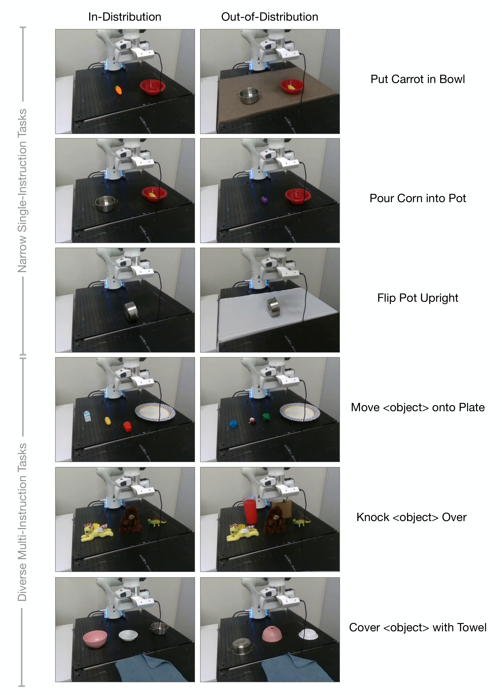
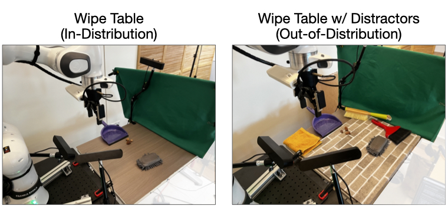

# D5 Source Figures Manifest

이 파일은 arXiv/LaTeX source에서 추출한 원본 figure asset 목록이다.
PDF figure는 첫 페이지를 PNG preview로 렌더링했다.

| Order | LaTeX reference | Source asset | Preview |
|---:|---|---|---|
| 1 | `figures/openvla_teaser.pdf` | `D5_srcfig_01_openvla_teaser.pdf` |  |
| 2 | `figures/openvla_model.pdf` | `D5_srcfig_02_openvla_model.pdf` |  |
| 3 | `figures/bridge_results.pdf` | `D5_srcfig_03_bridge_results.pdf` |  |
| 4 | `figures/rt1_results.pdf` | `D5_srcfig_04_rt1_results.pdf` |  |
| 5 | `figures/finetune_results.pdf` | `D5_srcfig_05_finetune_results.pdf` |  |
| 6 | `figures/inference_speed.pdf` | `D5_srcfig_06_inference_speed.pdf` |  |
| 7 | `figures/bridge_tasks_vertical.pdf` | `D5_srcfig_07_bridge_tasks_vertical.pdf` |  |
| 8 | `figures/original_bridge_tasks.pdf` | `D5_srcfig_08_original_bridge_tasks.pdf` |  |
| 9 | `figures/rt1_robot_tasks.jpeg` | `D5_srcfig_09_rt1_robot_tasks.jpeg` |  |
| 10 | `figures/franka_tabletop_tasks.pdf` | `D5_srcfig_10_franka_tabletop_tasks.pdf` |  |
| 11 | `figures/droid_wipe_task.jpeg` | `D5_srcfig_11_droid_wipe_task.jpeg` |  |