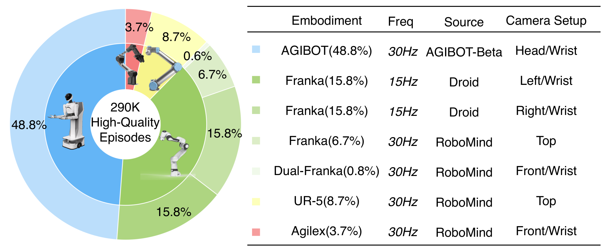
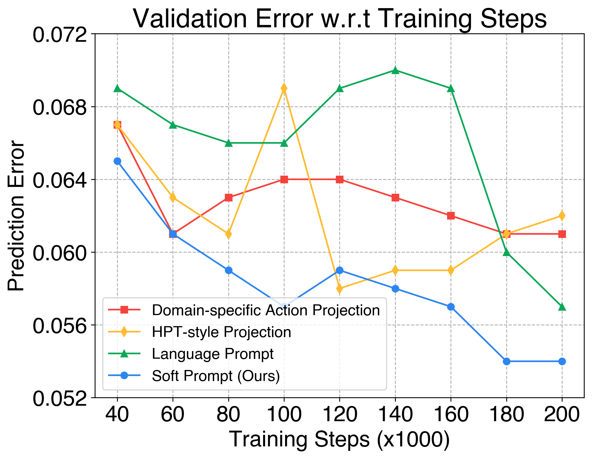
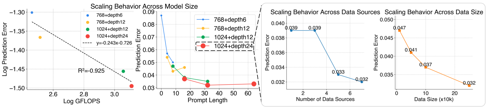
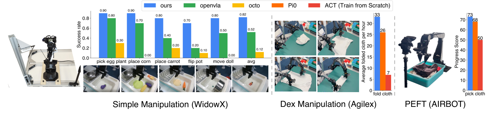
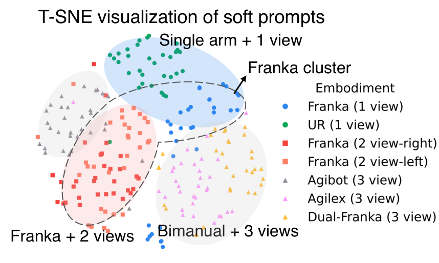
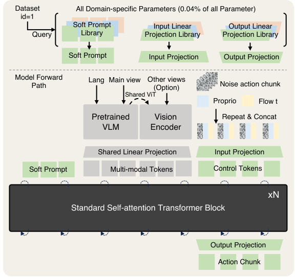
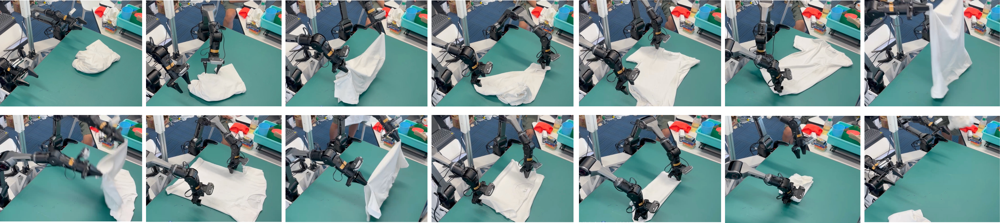
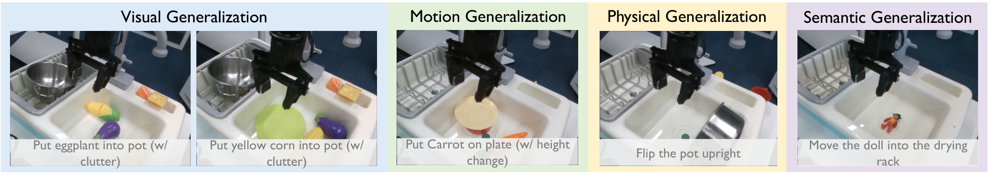
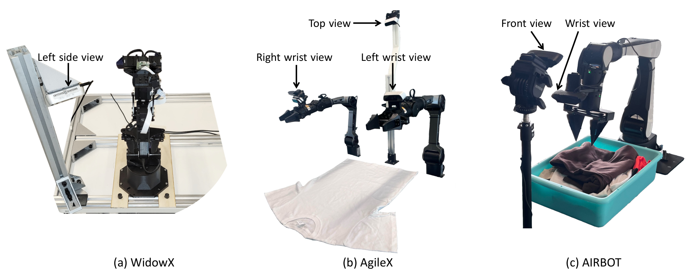

# D6 Source Figures Manifest

이 파일은 arXiv/LaTeX source에서 추출한 원본 figure asset 목록이다.
PDF figure는 첫 페이지를 PNG preview로 렌더링했다.

| Order | LaTeX reference | Source asset | Preview |
|---:|---|---|---|
| 1 | `Figures/intro_small.pdf` | `D6_srcfig_01_intro_small.pdf` |  |
| 2 | `Figures/compare_with_others.pdf` | `D6_srcfig_02_compare_with_others.pdf` |  |
| 3 | `Figures/data_mixture.pdf` | `D6_srcfig_03_data_mixture.pdf` |  |
| 4 | `Figures/line_plot_scaling_steps.png` | `D6_srcfig_04_line_plot_scaling_steps.png` |  |
| 5 | `Figures/compare_train_curve.png` | `missing` |  |
| 6 | `Figures/scaling.pdf` | `D6_srcfig_06_scaling.pdf` |  |
| 7 | `Figures/line_plot_num_diverse_data.png` | `missing` |  |
| 8 | `Figures/all_bench.pdf` | `D6_srcfig_08_all_bench.pdf` |  |
| 9 | `Figures/real_world.pdf` | `missing` |  |
| 10 | `Figures/real_exp.pdf` | `D6_srcfig_10_real_exp.pdf` |  |
| 11 | `Figures/tsne.pdf` | `D6_srcfig_11_tsne.pdf` |  |
| 12 | `Figures/prompt_comparison.png` | `D6_srcfig_12_prompt_comparison.png` |  |
| 13 | `Figures/archi.pdf` | `D6_srcfig_13_archi.pdf` |  |
| 14 | `Figures/softfold.pdf` | `D6_srcfig_14_softfold.pdf` |  |
| 15 | `Figures/fold.pdf` | `D6_srcfig_15_fold.pdf` |  |
| 16 | `Figures/widowx_tasks.pdf` | `D6_srcfig_16_widowx_tasks.pdf` |  |
| 17 | `Figures/all_setup.pdf` | `D6_srcfig_17_all_setup.pdf` |  |
