# D7 Source Figures Manifest

이 파일은 arXiv/LaTeX source에서 추출한 원본 figure asset 목록이다.
PDF figure는 첫 페이지를 PNG preview로 렌더링했다.

| Order | LaTeX reference | Source asset | Preview |
|---:|---|---|---|
| 1 | `main/figures/er/groot_vs_bctransformer_2x4.pdf` | `D7_srcfig_01_groot_vs_bctransformer_2x4.pdf` | 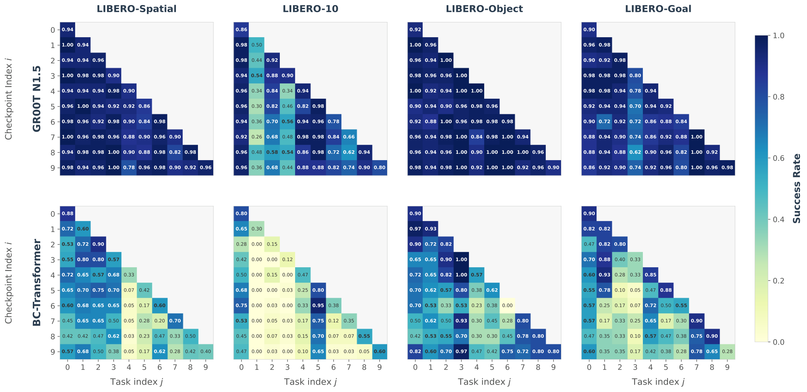 |
| 2 | `main/figures/methodology.pdf` | `D7_srcfig_02_methodology.pdf` | 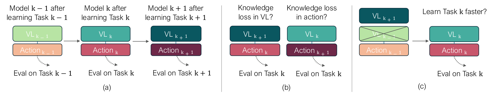 |
| 3 | `main/figures/mixing_bars.pdf` | `D7_srcfig_03_mixing_bars.pdf` | 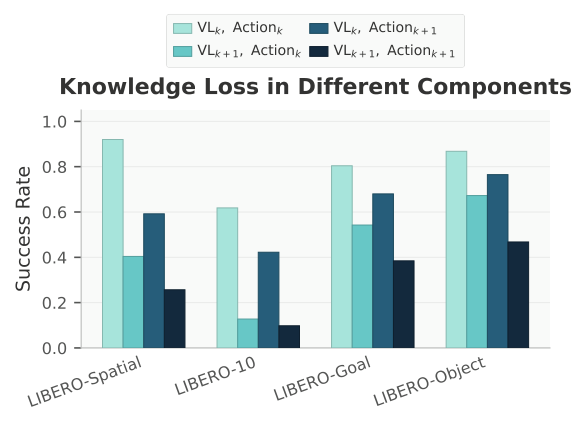 |
| 4 | `main/figures/comparison_plot.pdf` | `D7_srcfig_04_comparison_plot.pdf` | 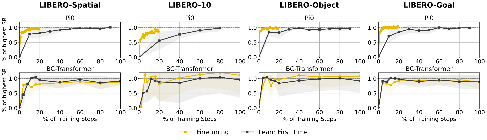 |
| 5 | `main/figures/er/libero-spatial/curve_plus_4mats.pdf` | `D7_srcfig_05_curve_plus_4mats.pdf` | 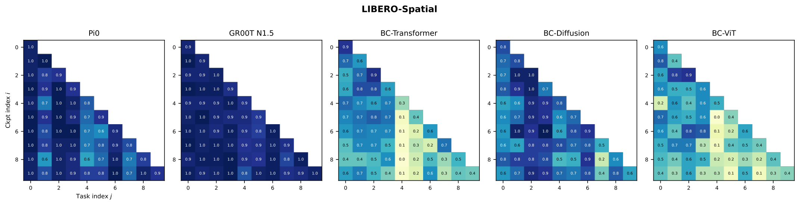 |
| 6 | `main/figures/er/libero-object/curve_plus_4mats.pdf` | `D7_srcfig_06_curve_plus_4mats.pdf` | 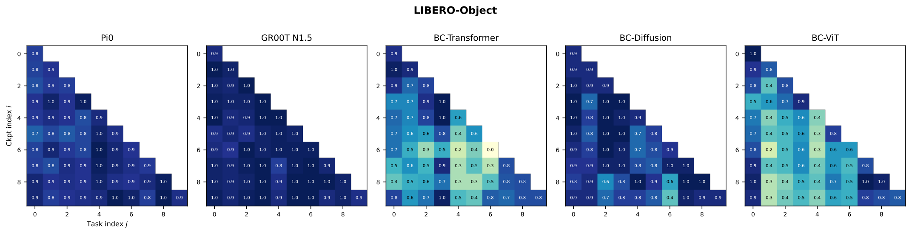 |
| 7 | `main/figures/er/libero-goal/curve_plus_4mats.pdf` | `D7_srcfig_07_curve_plus_4mats.pdf` | 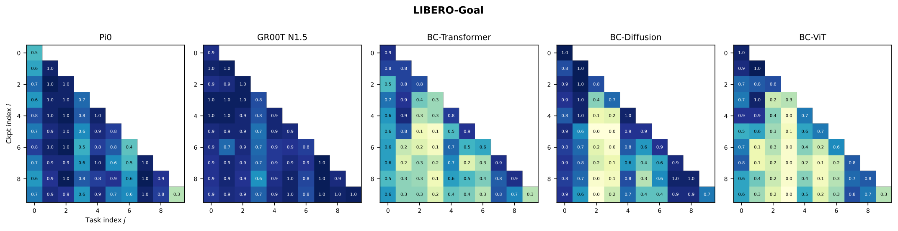 |
| 8 | `main/figures/er/libero-10/curve_plus_4mats.pdf` | `D7_srcfig_08_curve_plus_4mats.pdf` | 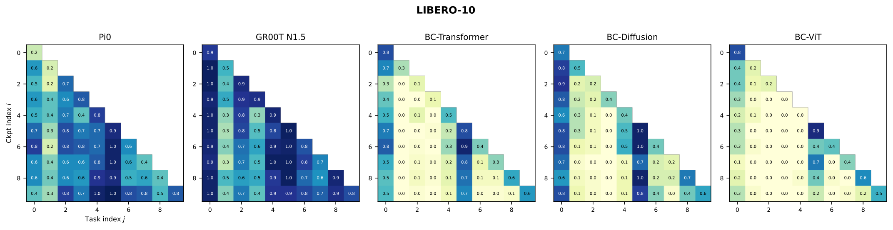 |
| 9 | `main/figures/nbt_libero10_abs_vs_norm.pdf` | `D7_srcfig_09_nbt_libero10_abs_vs_norm.pdf` |  |
| 10 | `main/figures/comparison_per_task_libero_spatial.pdf` | `D7_srcfig_10_comparison_per_task_libero_spatial.pdf` | 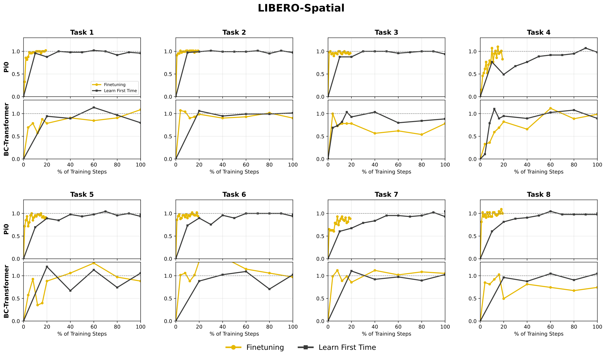 |
| 11 | `main/figures/comparison_per_task_libero_object.pdf` | `D7_srcfig_11_comparison_per_task_libero_object.pdf` | 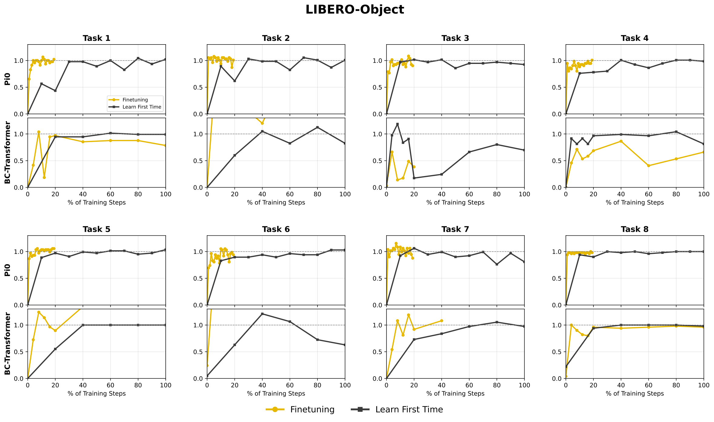 |
| 12 | `main/figures/comparison_per_task_libero_goal.pdf` | `D7_srcfig_12_comparison_per_task_libero_goal.pdf` | 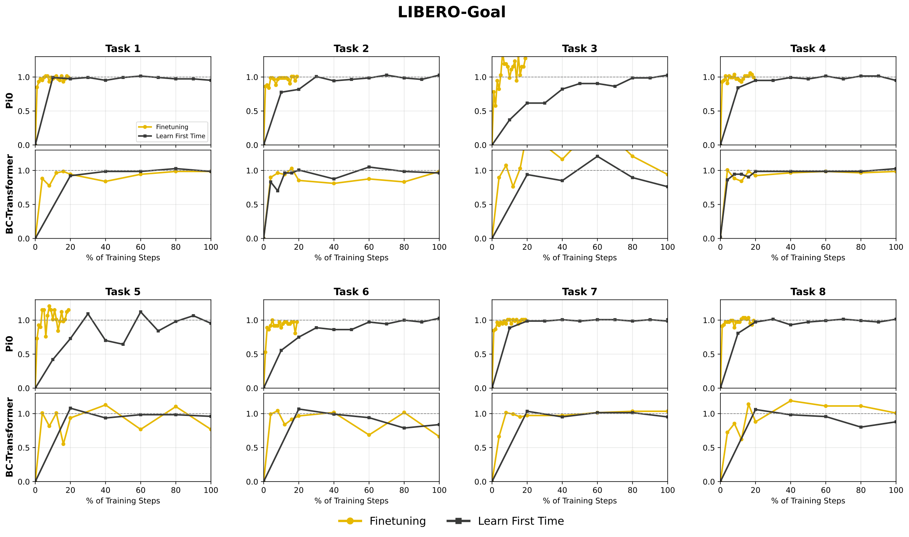 |
| 13 | `main/figures/comparison_per_task_libero_10.pdf` | `D7_srcfig_13_comparison_per_task_libero_10.pdf` | 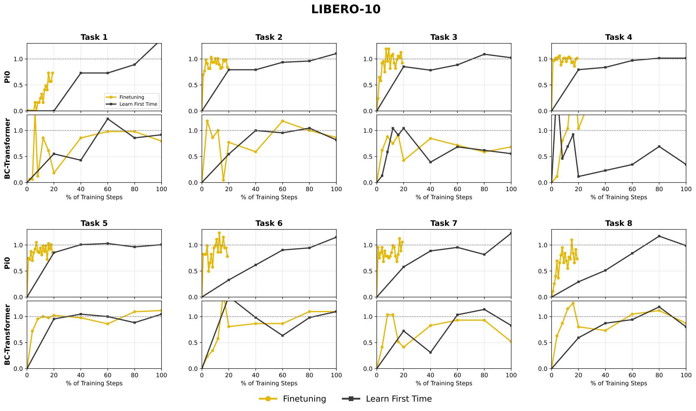 |
| 14 | `main/figures/bwt_vs_sample_size_linear_3bench_short.pdf` | `D7_srcfig_14_bwt_vs_sample_size_linear_3bench_short.pdf` |  |
| 15 | `main/figures/kt_curves_avg_across_benchmarks.pdf` | `D7_srcfig_15_kt_curves_avg_across_benchmarks.pdf` |  |
| 16 | `main/figures/bwt_vs_buffer_average.pdf` | `D7_srcfig_16_bwt_vs_buffer_average.pdf` | 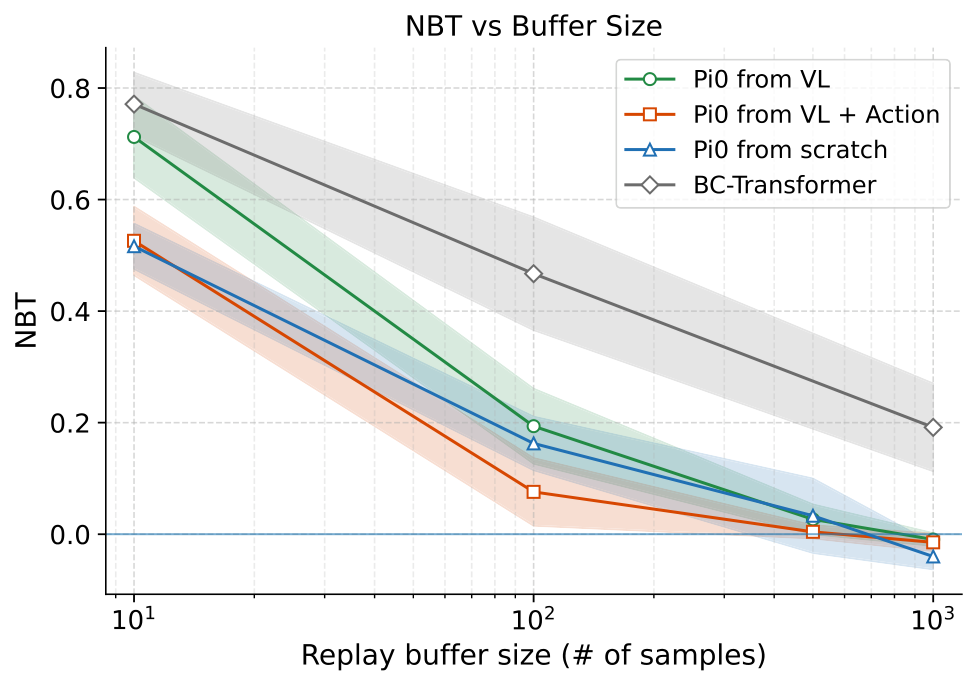 |
| 17 | `main/figures/0053_per_task_success_grouped_mem.pdf` | `D7_srcfig_17_0053_per_task_success_grouped_mem.pdf` | 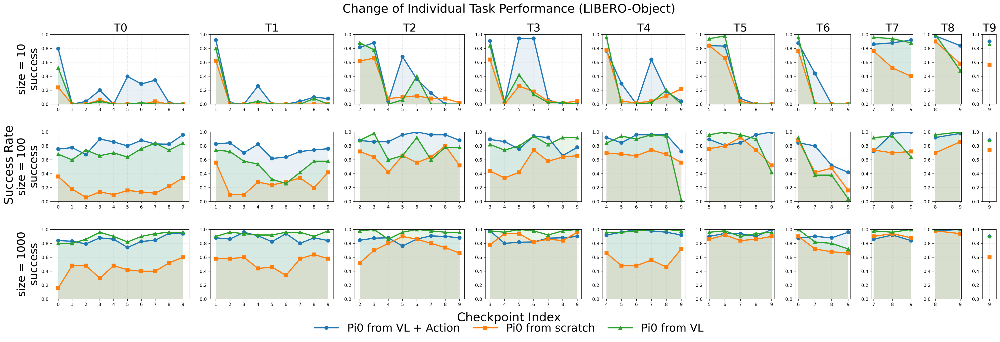 |
