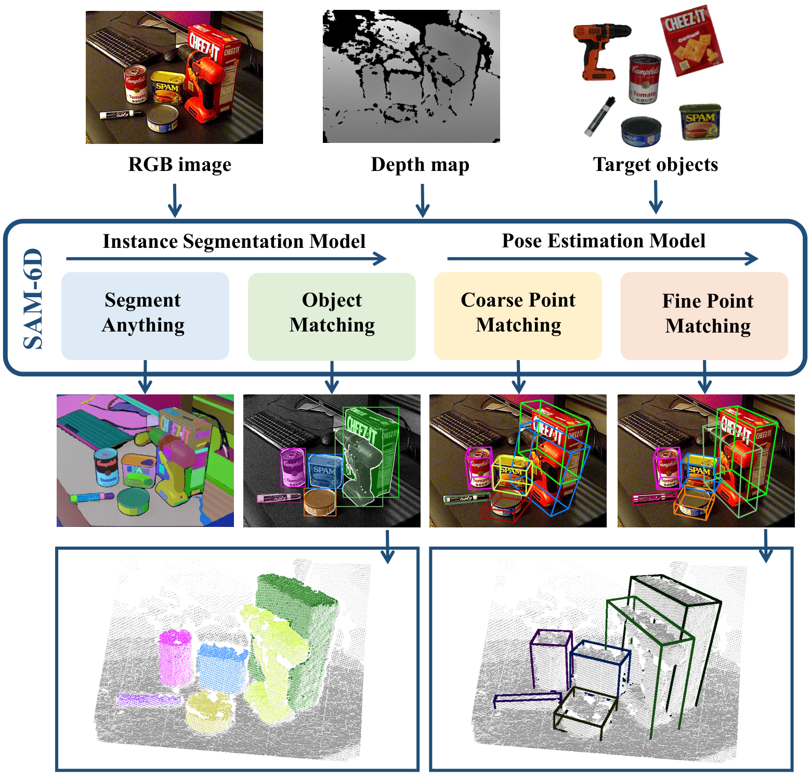
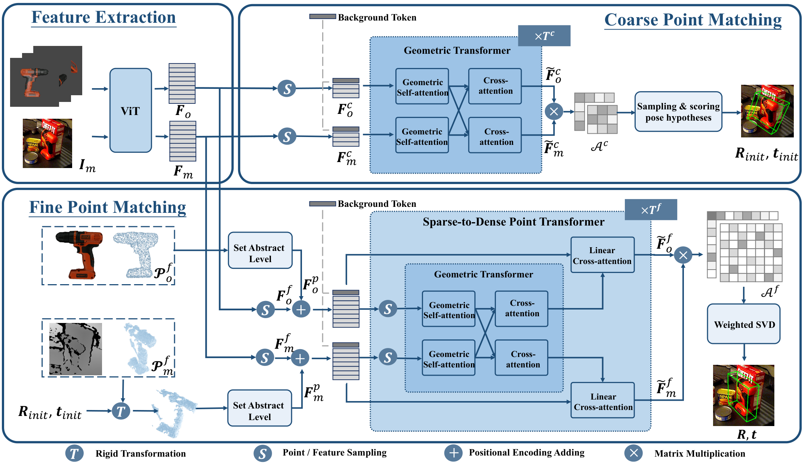
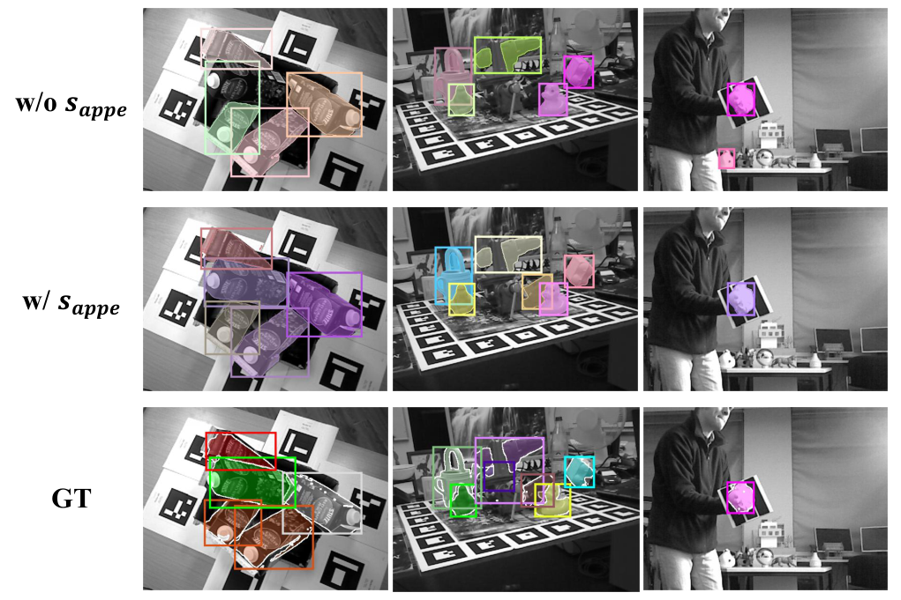
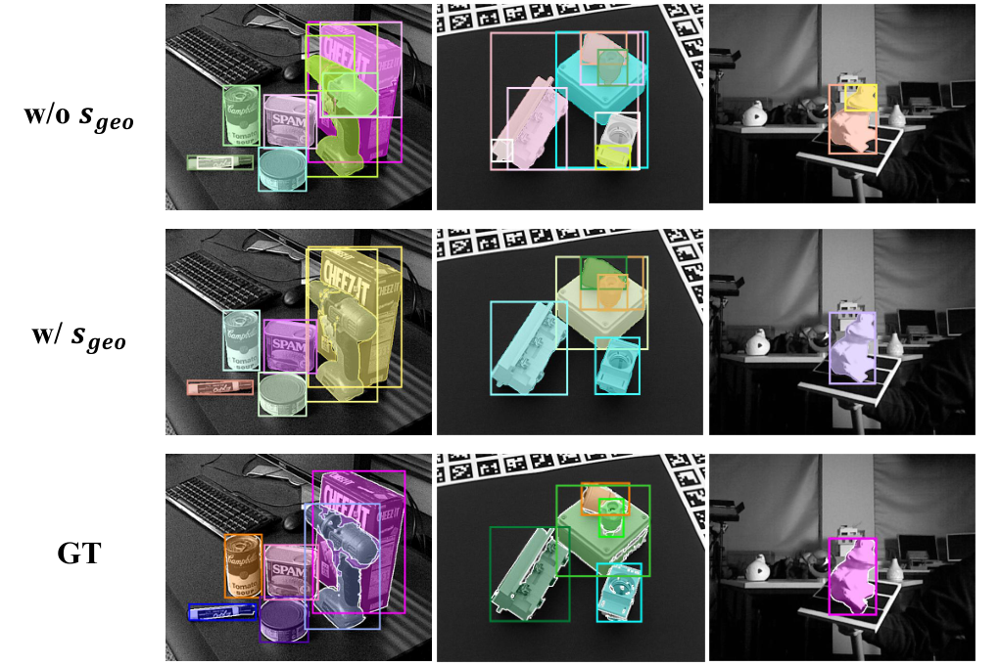
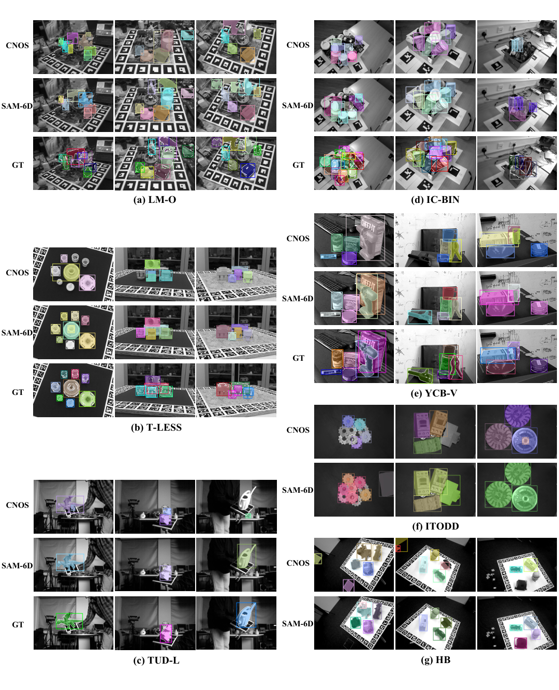
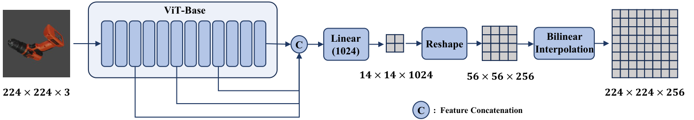
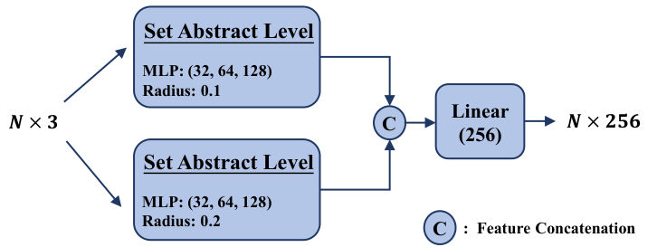
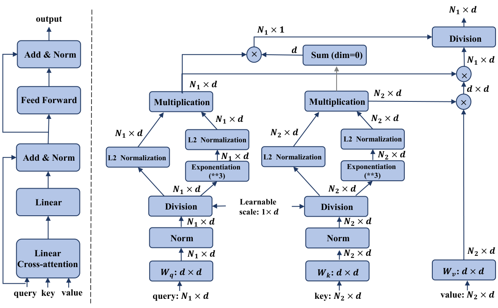

# E1 Source Figures Manifest

이 파일은 arXiv/LaTeX source에서 추출한 원본 figure asset 목록이다.
PDF figure는 첫 페이지를 PNG preview로 렌더링했다.

| Order | LaTeX reference | Source asset | Preview |
|---:|---|---|---|
| 1 | `fig/fig_vis_head.pdf` | `E1_srcfig_01_fig_vis_head.pdf` |  |
| 2 | `fig/fig_overview_head.pdf` | `E1_srcfig_02_fig_overview_head.pdf` |  |
| 3 | `fig/Fig_pem.pdf` | `E1_srcfig_03_Fig_pem.pdf` |  |
| 4 | `fig/fig_vis_seg_appe.pdf` | `E1_srcfig_04_fig_vis_seg_appe.pdf` |  |
| 5 | `fig/fig_vis_seg_geo.pdf` | `E1_srcfig_05_fig_vis_seg_geo.pdf` |  |
| 6 | `fig/fig_sam_sota.pdf` | `E1_srcfig_06_fig_sam_sota.pdf` |  |
| 7 | `fig/fig_pem_feat_arch.pdf` | `E1_srcfig_07_fig_pem_feat_arch.pdf` |  |
| 8 | `fig/fig_pem_pos_enc.pdf` | `E1_srcfig_08_fig_pem_pos_enc.pdf` |  |
| 9 | `fig/fig_arch_linear_atten.pdf` | `E1_srcfig_09_fig_arch_linear_atten.pdf` |  |
| 10 | `fig/fig_pose_sota.pdf` | `E1_srcfig_10_fig_pose_sota.pdf` |  |
