# E3 Source Figures Manifest

이 파일은 arXiv/LaTeX source에서 추출한 원본 figure asset 목록이다.
PDF figure는 첫 페이지를 PNG preview로 렌더링했다.

| Order | LaTeX reference | Source asset | Preview |
|---:|---|---|---|
| 1 | `figures/roboarena_teaser.pdf` | `E3_srcfig_01_roboarena_teaser.pdf` | 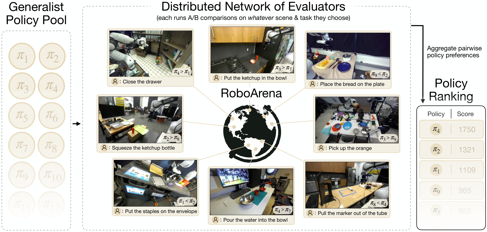 |
| 2 | `figures/droid_setup.pdf` | `E3_srcfig_02_droid_setup.pdf` | 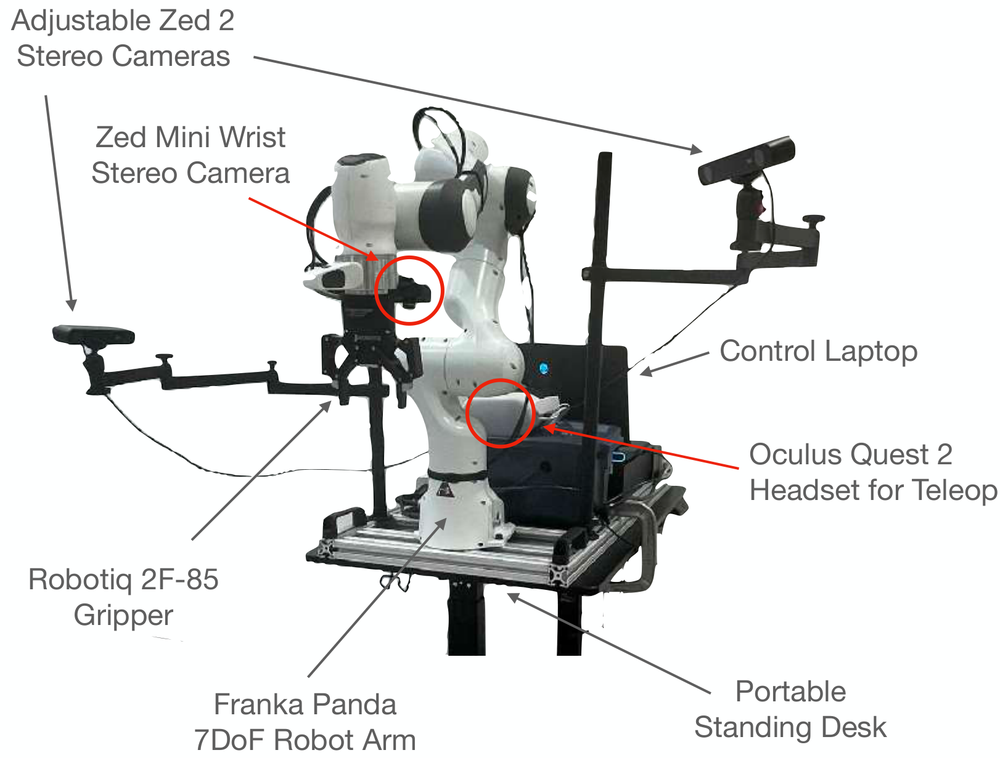 |
| 3 | `figures/roboarena_system.pdf` | `E3_srcfig_03_roboarena_system.pdf` |  |
| 4 | `figures/roboarena_qualitative_analysis_tool.pdf` | `E3_srcfig_04_roboarena_qualitative_analysis_tool.pdf` | 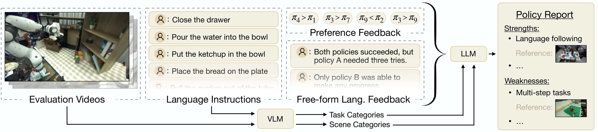 |
| 5 | `figures/roboarena_main_results.pdf` | `E3_srcfig_05_roboarena_main_results.pdf` |  |
| 6 | `figures/roboarena_ranking_results.pdf` | `E3_srcfig_06_roboarena_ranking_results.pdf` | 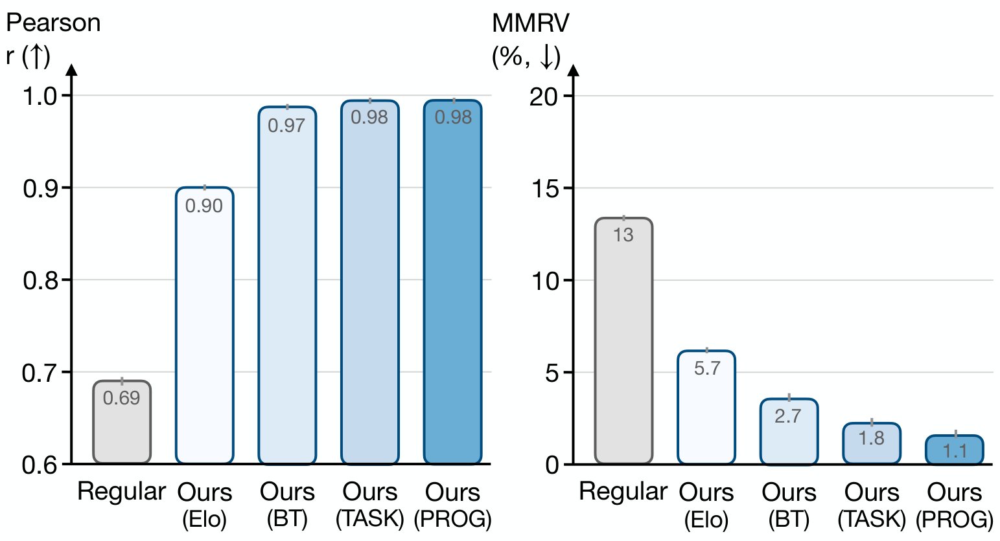 |
| 7 | `figures/roboarena_convergence_results.pdf` | `E3_srcfig_07_roboarena_convergence_results.pdf` | 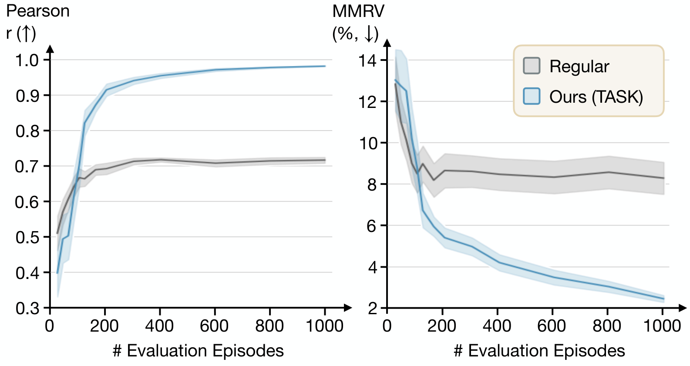 |
| 8 | `figures/roboarena_cat_results.pdf` | `E3_srcfig_08_roboarena_cat_results.pdf` | 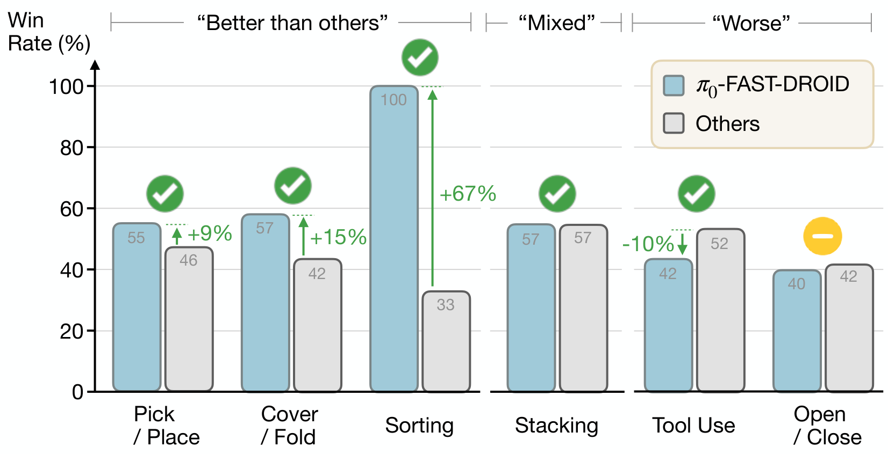 |
| 9 | `figures/instruction_diversity.png` | `E3_srcfig_09_instruction_diversity.png` | 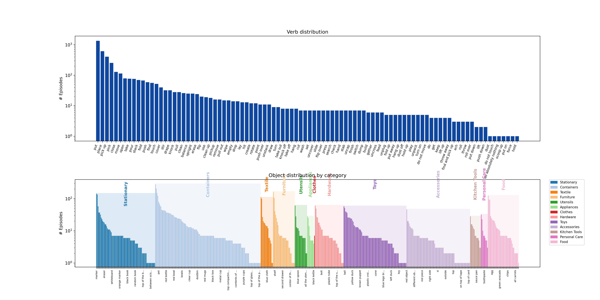 |
| 10 | `figures/collage_of_envs/1.png` | `E3_srcfig_10_1.png` | 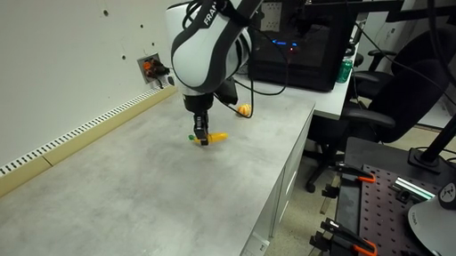 |
| 11 | `figures/collage_of_envs/2.png` | `E3_srcfig_11_2.png` | 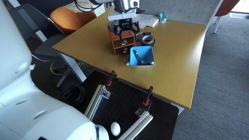 |
| 12 | `figures/collage_of_envs/3.png` | `E3_srcfig_12_3.png` | 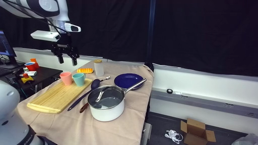 |
| 13 | `figures/collage_of_envs/4.png` | `E3_srcfig_13_4.png` | 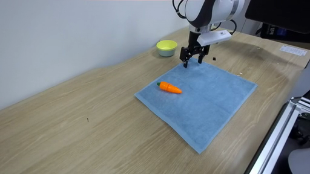 |
| 14 | `figures/collage_of_envs/5.png` | `E3_srcfig_14_5.png` | 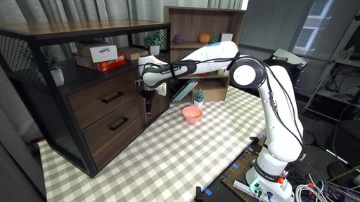 |
| 15 | `figures/collage_of_envs/6.png` | `E3_srcfig_15_6.png` | 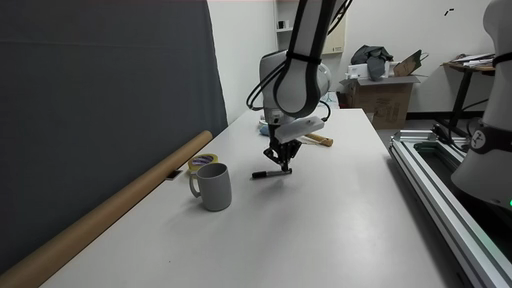 |
| 16 | `figures/collage_of_envs/7.png` | `E3_srcfig_16_7.png` | 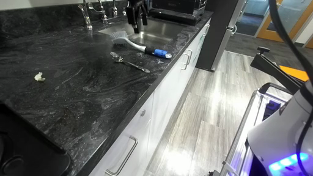 |
| 17 | `figures/collage_of_envs/8.png` | `E3_srcfig_17_8.png` | 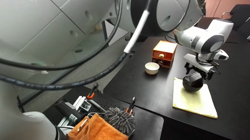 |
| 18 | `figures/collage_of_envs/9.png` | `E3_srcfig_18_9.png` | 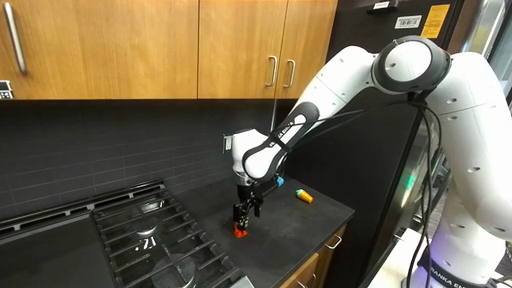 |
| 19 | `figures/collage_of_envs/10.png` | `E3_srcfig_19_10.png` | 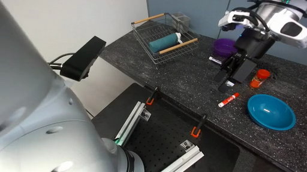 |
| 20 | `figures/collage_of_envs/11.png` | `E3_srcfig_20_11.png` | 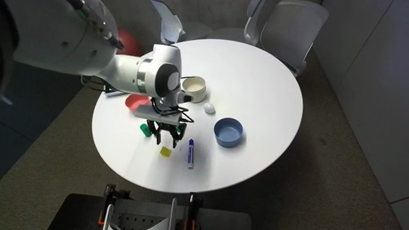 |
| 21 | `figures/collage_of_envs/12.png` | `E3_srcfig_21_12.png` | 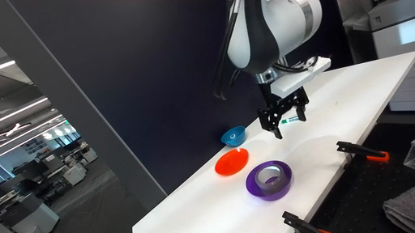 |
| 22 | `figures/collage_of_envs/13.png` | `E3_srcfig_22_13.png` | 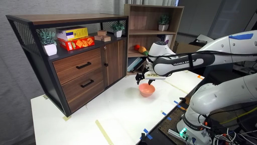 |
| 23 | `figures/collage_of_envs/14.png` | `E3_srcfig_23_14.png` | 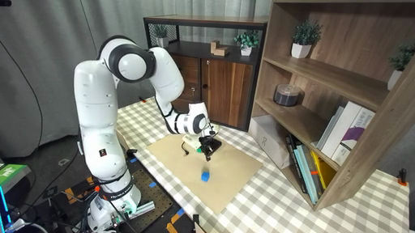 |
| 24 | `figures/collage_of_envs/15.png` | `E3_srcfig_24_15.png` | 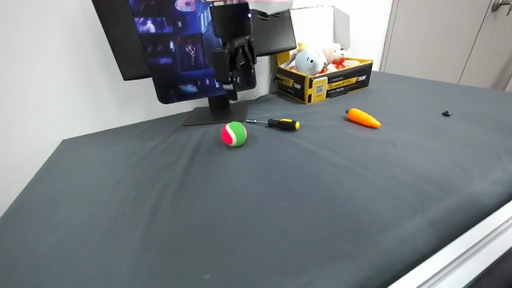 |
| 25 | `figures/collage_of_envs/16.png` | `E3_srcfig_25_16.png` | 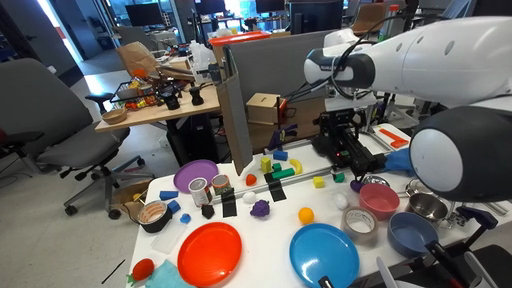 |
| 26 | `figures/collage_of_envs/17.png` | `E3_srcfig_26_17.png` | 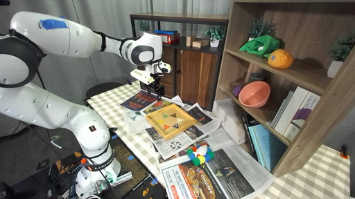 |
| 27 | `figures/collage_of_envs/18.png` | `E3_srcfig_27_18.png` | 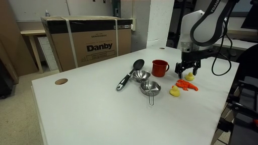 |
| 28 | `figures/collage_of_envs/19.png` | `E3_srcfig_28_19.png` | 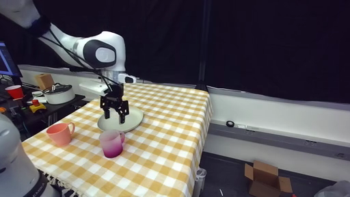 |
| 29 | `figures/collage_of_envs/20.png` | `E3_srcfig_29_20.png` | 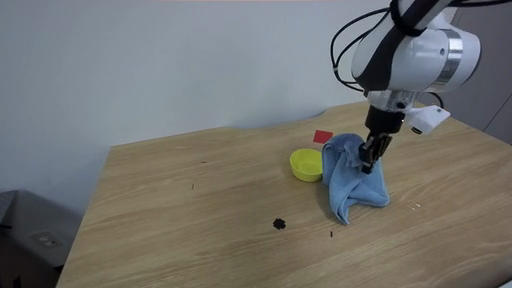 |
| 30 | `figures/collage_of_envs/21.png` | `E3_srcfig_30_21.png` | 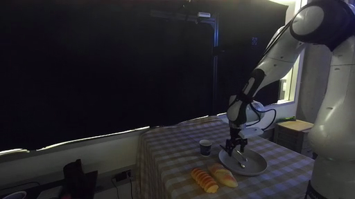 |
| 31 | `figures/collage_of_envs/22.png` | `E3_srcfig_31_22.png` | 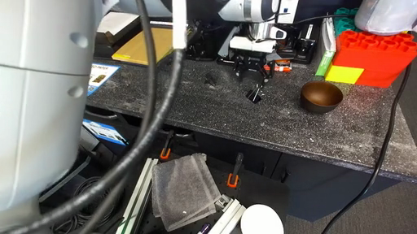 |
| 32 | `figures/collage_of_envs/23.png` | `E3_srcfig_32_23.png` | 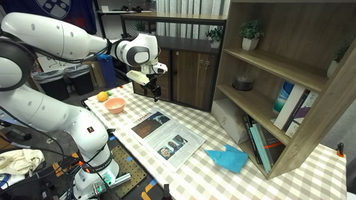 |
| 33 | `figures/collage_of_envs/24.png` | `E3_srcfig_33_24.png` | 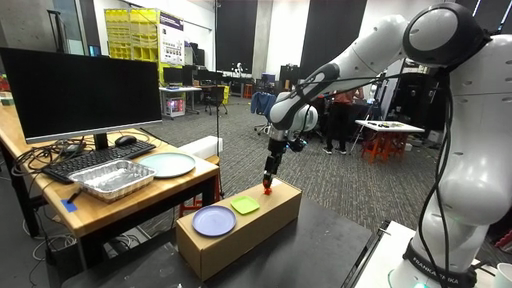 |
| 34 | `figures/collage_of_envs/25.png` | `E3_srcfig_34_25.png` | 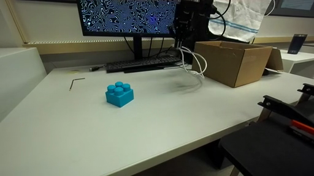 |
| 35 | `figures/collage_of_envs/26.png` | `E3_srcfig_35_26.png` | 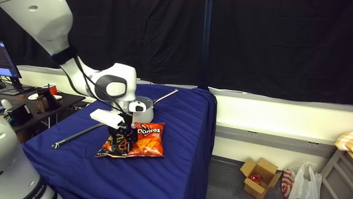 |
| 36 | `figures/collage_of_envs/27.png` | `E3_srcfig_36_27.png` | 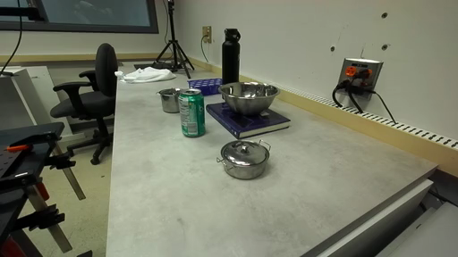 |
| 37 | `figures/collage_of_envs/28.png` | `E3_srcfig_37_28.png` | 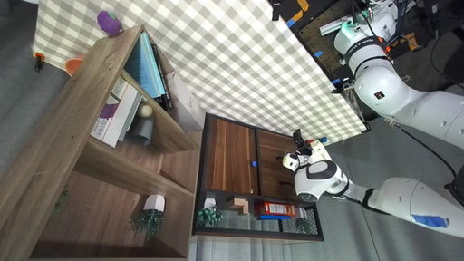 |
| 38 | `figures/collage_of_envs/29.png` | `E3_srcfig_38_29.png` | 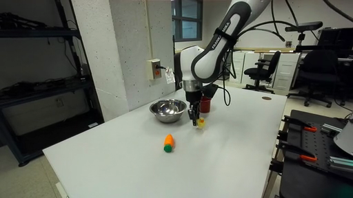 |
| 39 | `figures/collage_of_envs/30.png` | `E3_srcfig_39_30.png` | 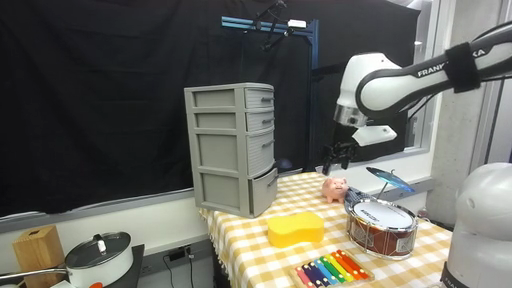 |
| 40 | `figures/collage_of_envs/31.png` | `E3_srcfig_40_31.png` | 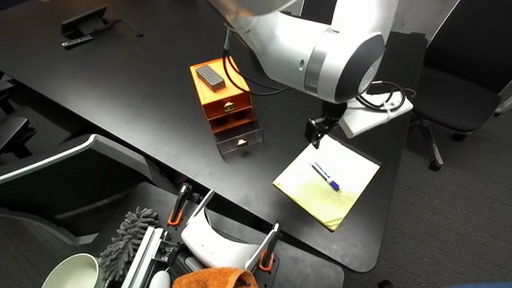 |
| 41 | `figures/collage_of_envs/32.png` | `E3_srcfig_41_32.png` | 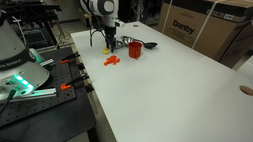 |
| 42 | `figures/strengths_weaknesses.pdf` | `E3_srcfig_42_strengths_weaknesses.pdf` | 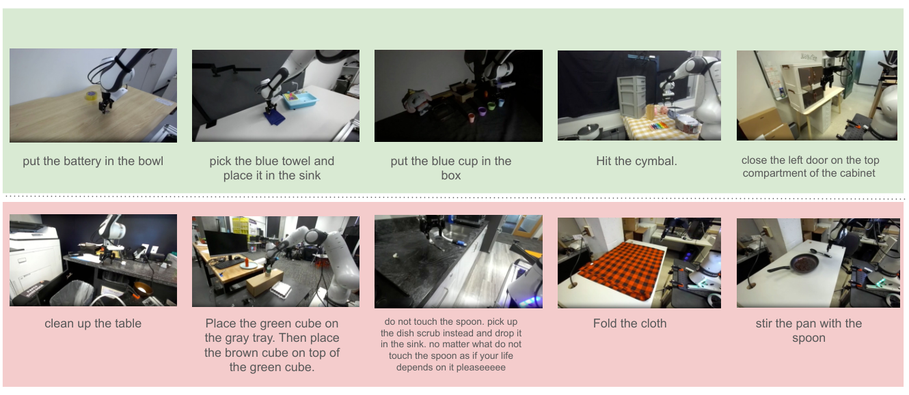 |