# E4 Source Figures Manifest

이 파일은 arXiv/LaTeX source에서 추출한 원본 figure asset 목록이다.
PDF figure는 첫 페이지를 PNG preview로 렌더링했다.

| Order | LaTeX reference | Source asset | Preview |
|---:|---|---|---|
| 1 | `figures/libero_arch_3.png` | `E4_srcfig_01_libero_arch_3.png` | 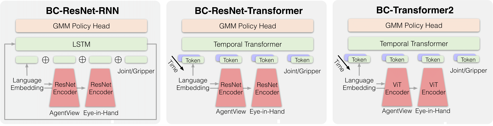 |
| 2 | `figures/libero_arch_encoder.png` | `E4_srcfig_02_libero_arch_encoder.png` | 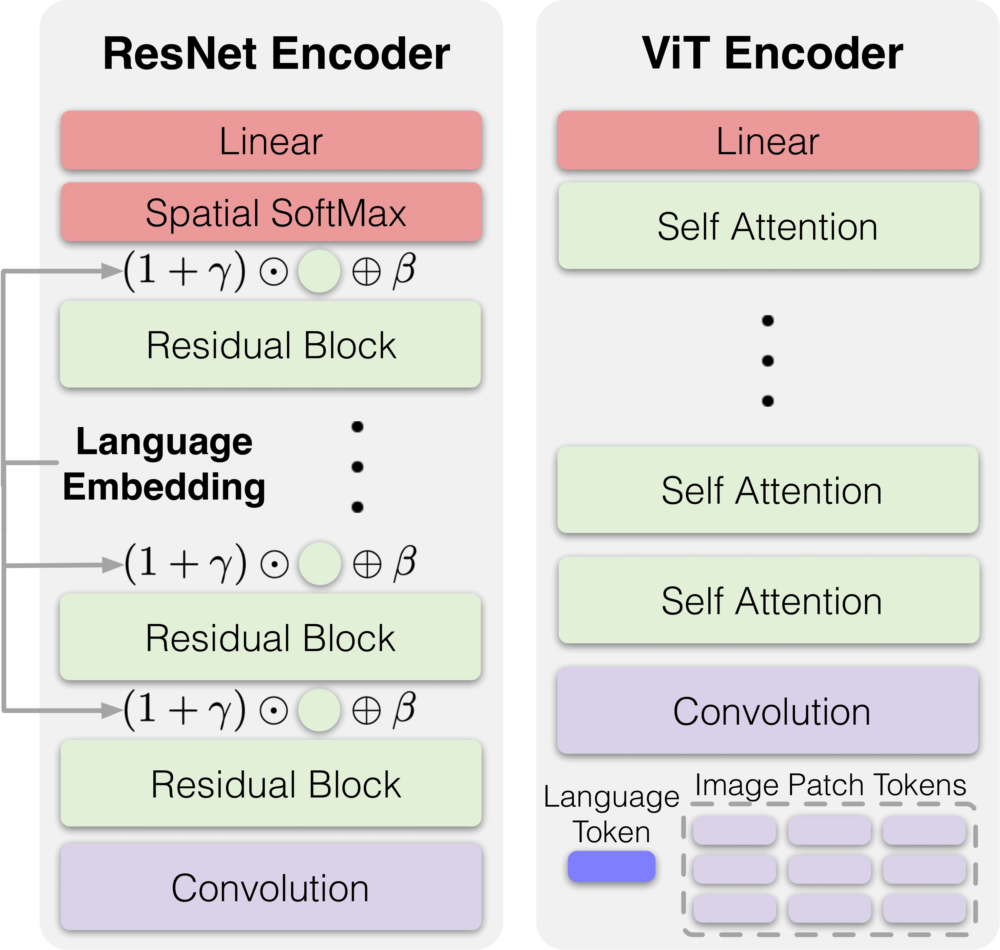 |
| 3 | `figures/libero_spatial.png` | `E4_srcfig_03_libero_spatial.png` | 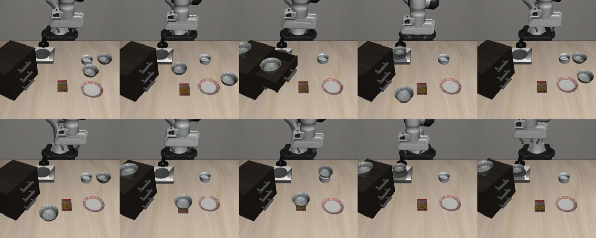 |
| 4 | `figures/libero_object.png` | `E4_srcfig_04_libero_object.png` | 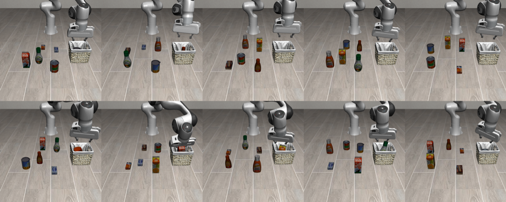 |
| 5 | `figures/libero_goal.png` | `E4_srcfig_05_libero_goal.png` | 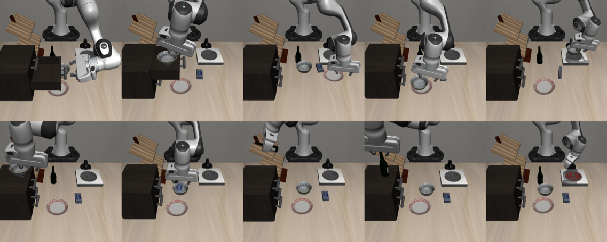 |
| 6 | `figures/libero_100.png` | `E4_srcfig_06_libero_100.png` |  |
| 7 | `figures/algo_resnet_rnn.png` | `E4_srcfig_07_algo_resnet_rnn.png` |  |
| 8 | `figures/algo_resnet_t.png` | `E4_srcfig_08_algo_resnet_t.png` |  |
| 9 | `figures/algo_vit_t.png` | `E4_srcfig_09_algo_vit_t.png` |  |
| 10 | `figures/arch_ewc.png` | `E4_srcfig_10_arch_ewc.png` |  |
| 11 | `figures/arch_er.png` | `E4_srcfig_11_arch_er.png` |  |
| 12 | `figures/arch_packnet.png` | `E4_srcfig_12_arch_packnet.png` |  |
| 13 | `figures/lsr_algo_resnet_rnn.png` | `E4_srcfig_13_lsr_algo_resnet_rnn.png` |  |
| 14 | `figures/lsr_algo_resnet_t.png` | `E4_srcfig_14_lsr_algo_resnet_t.png` |  |
| 15 | `figures/lsr_algo_vit_t.png` | `E4_srcfig_15_lsr_algo_vit_t.png` |  |
| 16 | `figures/fig21.png` | `E4_srcfig_16_fig21.png` | 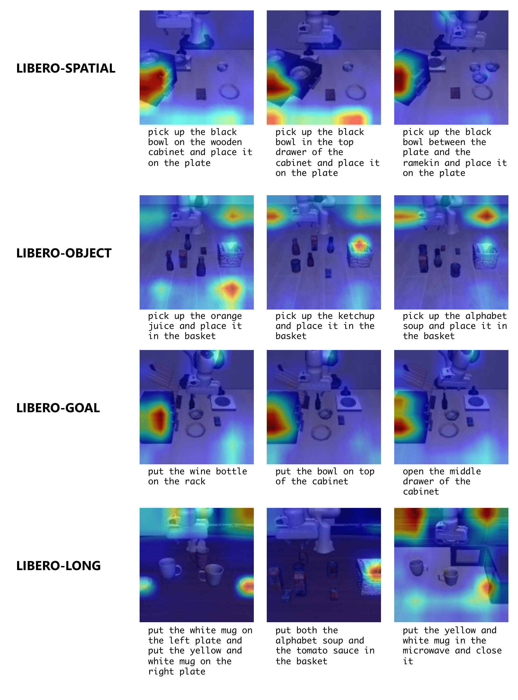 |
| 17 | `figures/fig22.png` | `E4_srcfig_17_fig22.png` | 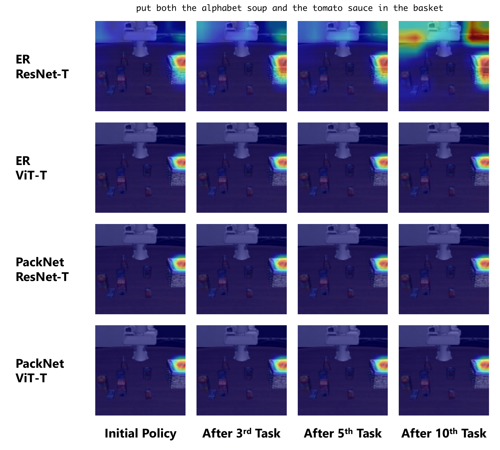 |
| 18 | `figures/fig23.png` | `E4_srcfig_18_fig23.png` | 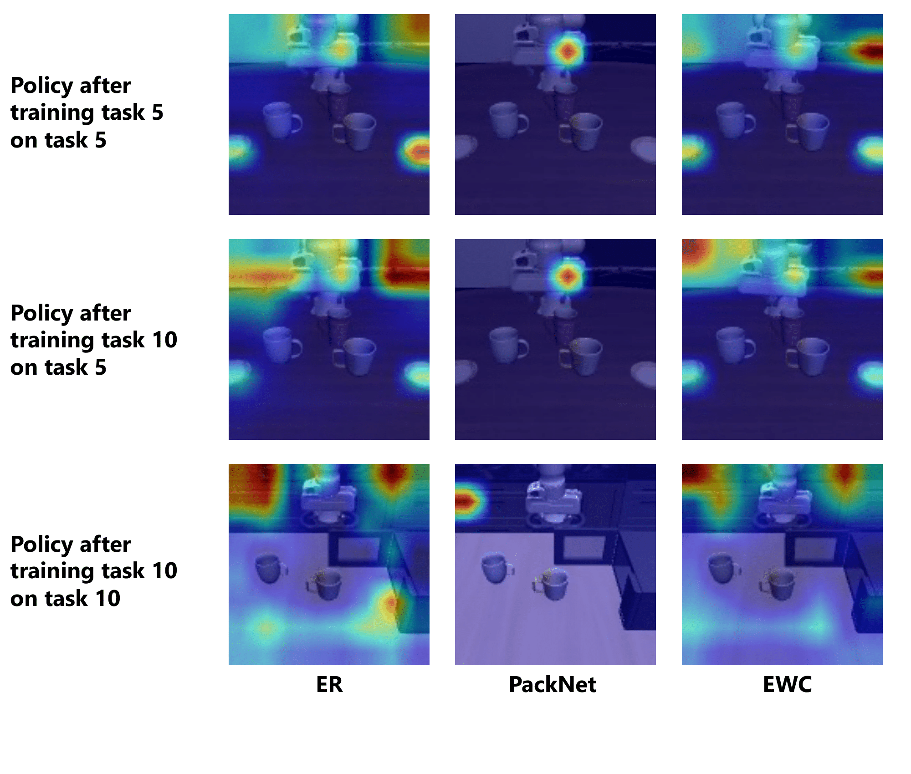 |
| 19 | `figures/fig24.png` | `E4_srcfig_19_fig24.png` | 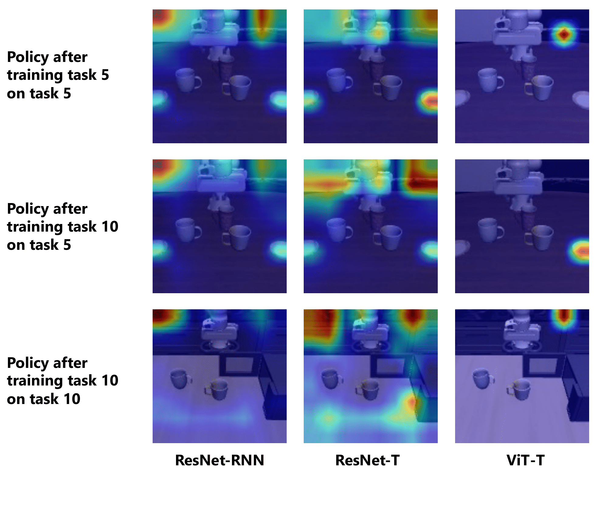 |
| 20 | `figures/fig25.png` | `E4_srcfig_20_fig25.png` | 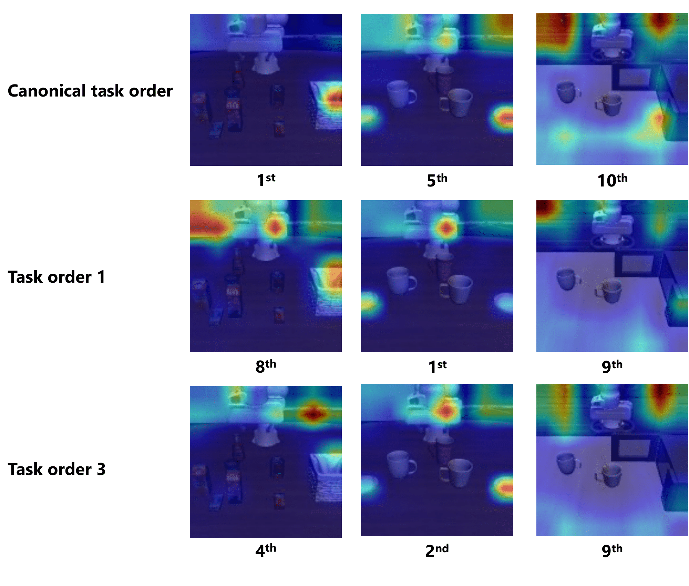 |
| 21 | `figures/fig26.png` | `E4_srcfig_21_fig26.png` | 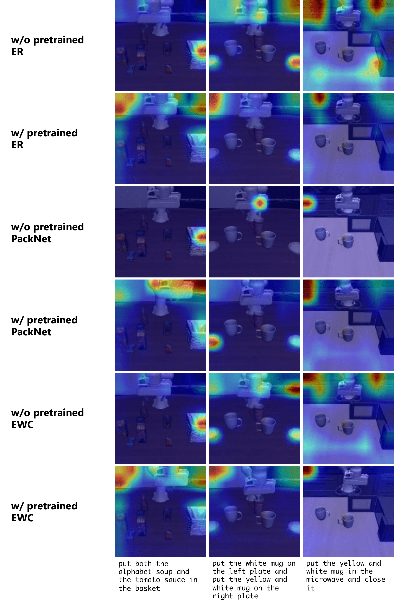 |
| 22 | `figures/metric.png` | `E4_srcfig_22_metric.png` |  |
| 23 | `figures/taskorder.png` | `E4_srcfig_23_taskorder.png` | 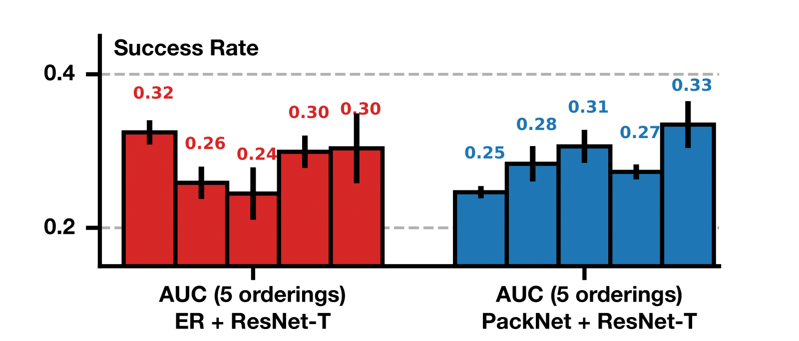 |
| 24 | `figures/pretrain.png` | `E4_srcfig_24_pretrain.png` | 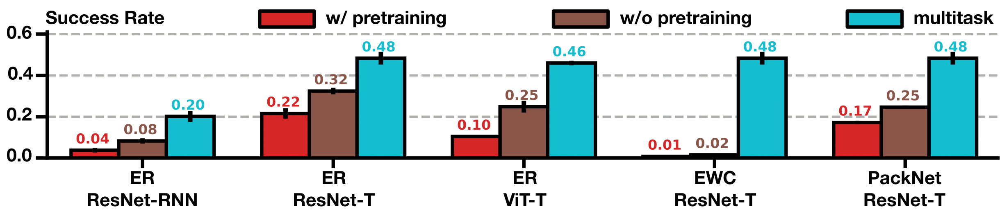 |
| 25 | `figures/libero_fig1.pdf` | `E4_srcfig_25_libero_fig1.pdf` |  |
| 26 | `figures/libero_fig2.png` | `E4_srcfig_26_libero_fig2.png` | 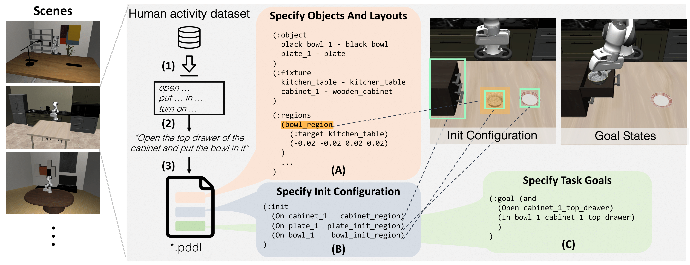 |