# G1 Source Figures Manifest

이 파일은 arXiv/LaTeX source에서 추출한 원본 figure asset 목록이다.
PDF figure는 첫 페이지를 PNG preview로 렌더링했다.

| Order | LaTeX reference | Source asset | Preview |
|---:|---|---|---|
| 1 | `figures/data_sequences.pdf` | `G1_srcfig_01_data_sequences.pdf` |  |
| 2 | `figures/diagram_train.pdf` | `G1_srcfig_02_diagram_train.pdf` |  |
| 3 | `figures/eval4x.png` | `G1_srcfig_03_eval4x.png` | 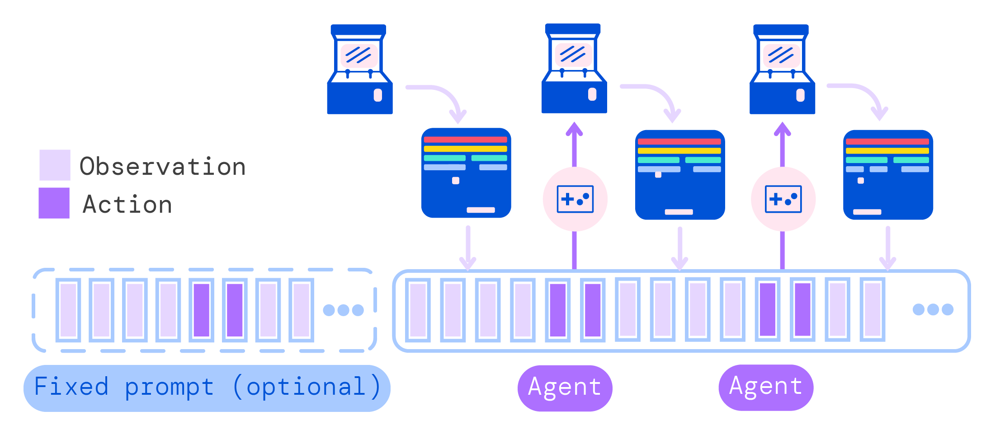 |
| 4 | `figures/skill_generalization_challenge` | `G1_srcfig_04_skill_generalization_challenge.pdf` |  |
| 5 | `figures/barplot_domains` | `G1_srcfig_05_barplot_domains.png` |  |
| 6 | `figures/image_captions_v3.pdf` | `G1_srcfig_06_image_captions_v3.pdf` | 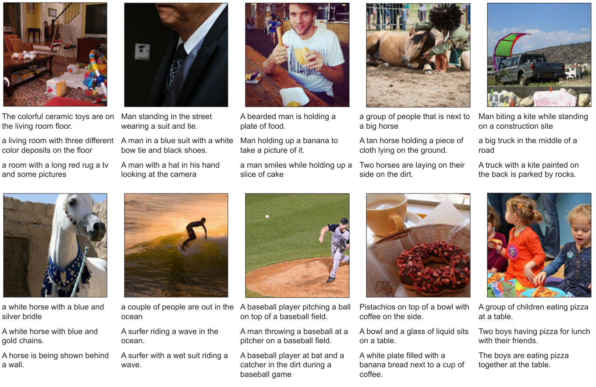 |
| 7 | `figures/dialogue_examples_g1.pdf` | `G1_srcfig_07_dialogue_examples_g1.pdf` |  |
| 8 | `figures/paper_scaling_law` | `G1_srcfig_08_paper_scaling_law.png` |  |
| 9 | `figures/ood_ablations` | `G1_srcfig_09_ood_ablations.pdf` | 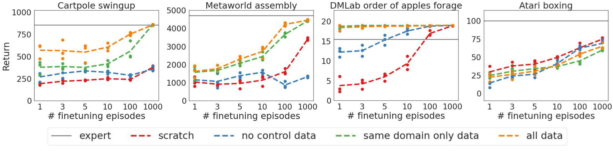 |
| 10 | `figures/skill_gen_real_fewshot` | `G1_srcfig_10_skill_gen_real_fewshot.png` | 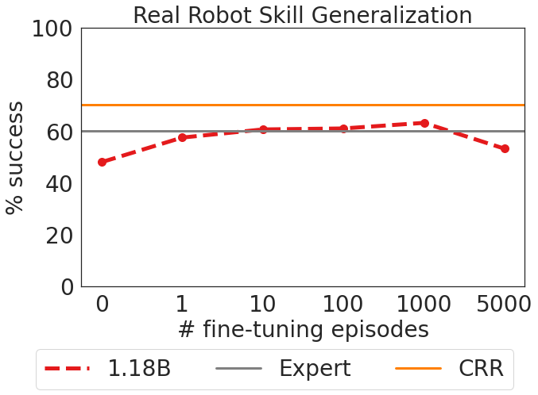 |
| 11 | `figures/skill_gen_sim_ablations` | `G1_srcfig_11_skill_gen_sim_ablations.png` | 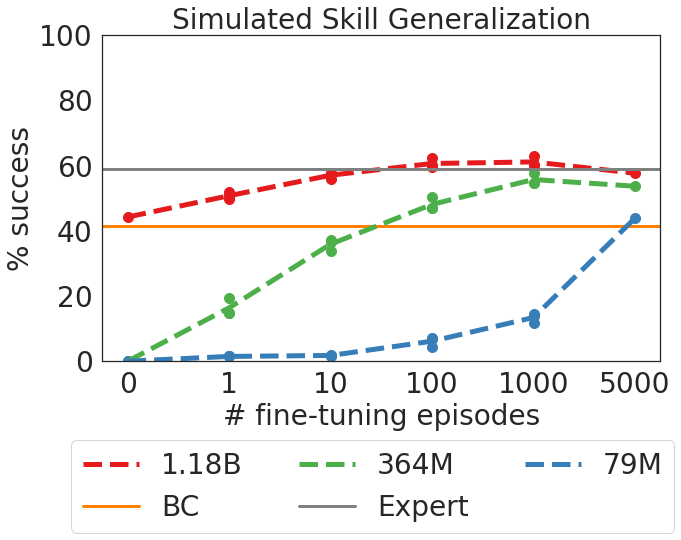 |
| 12 | `figures/real_robot_blue_on_green` | `G1_srcfig_12_real_robot_blue_on_green.png` | 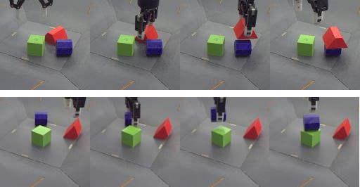 |
| 13 | `figures/gato_attention_vis.pdf` | `G1_srcfig_13_gato_attention_vis.pdf` | 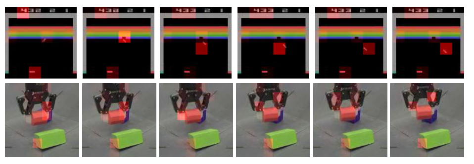 |
| 14 | `figures/gato_tsne.png` | `G1_srcfig_14_gato_tsne.png` | 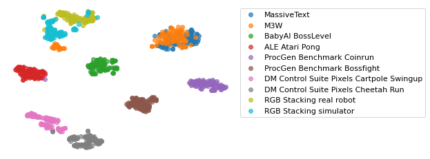 |
| 15 | `figures/proprio_tokenized.png` | `G1_srcfig_15_proprio_tokenized.png` | 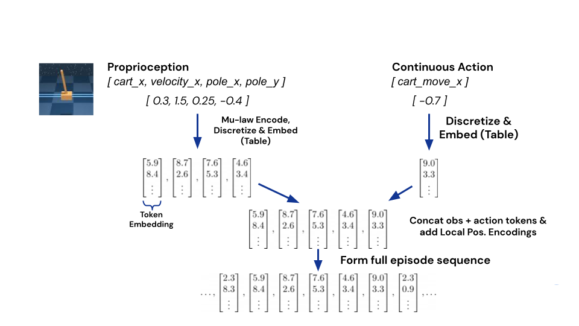 |
| 16 | `figures/image_tokenized` | `G1_srcfig_16_image_tokenized.png` | 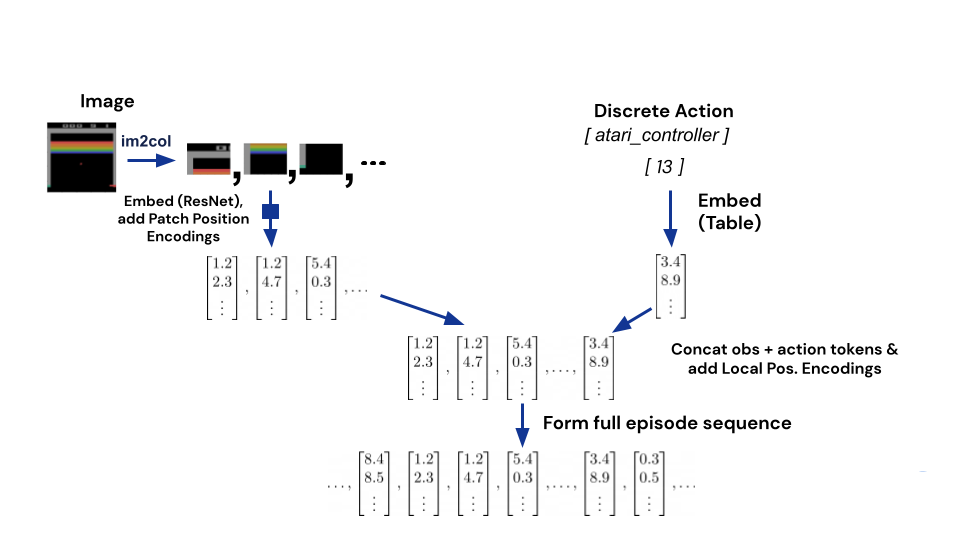 |
| 17 | `figures/resnet_column` | `G1_srcfig_17_resnet_column.png` | 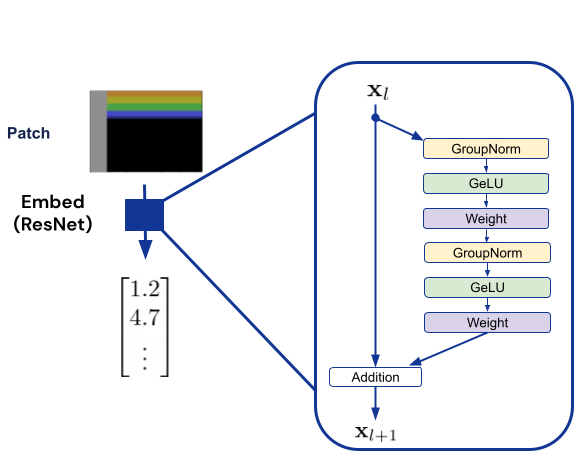 |
| 18 | `figures/patch_positions` | `G1_srcfig_18_patch_positions.png` | 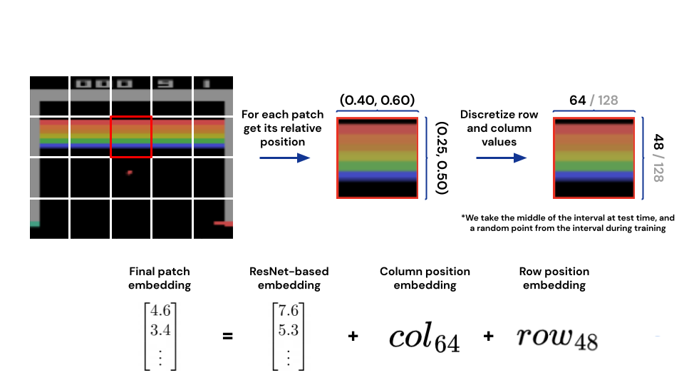 |
| 19 | `figures/local_position_encodings` | `G1_srcfig_19_local_position_encodings.png` | 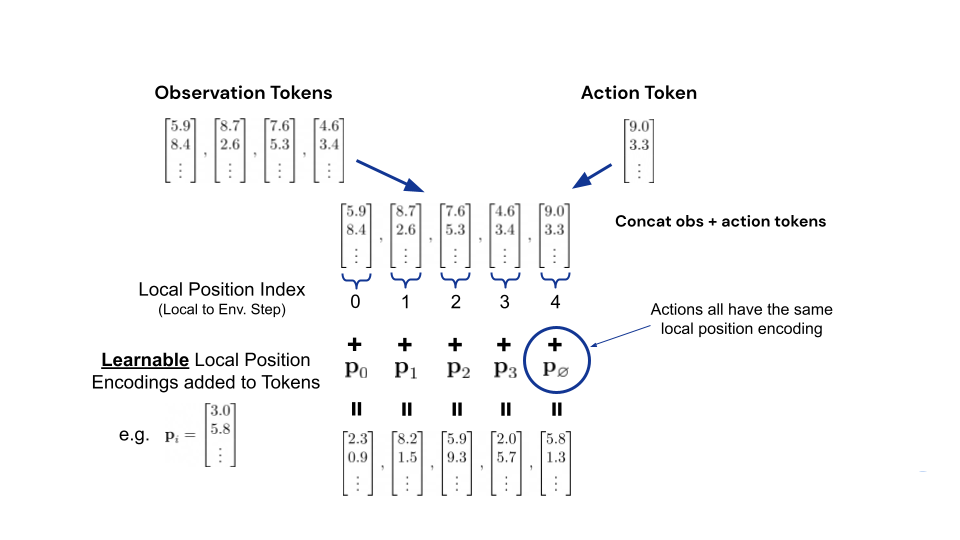 |
| 20 | `figures/skill_gen_sim_data_ablations` | `G1_srcfig_20_skill_gen_sim_data_ablations.png` | 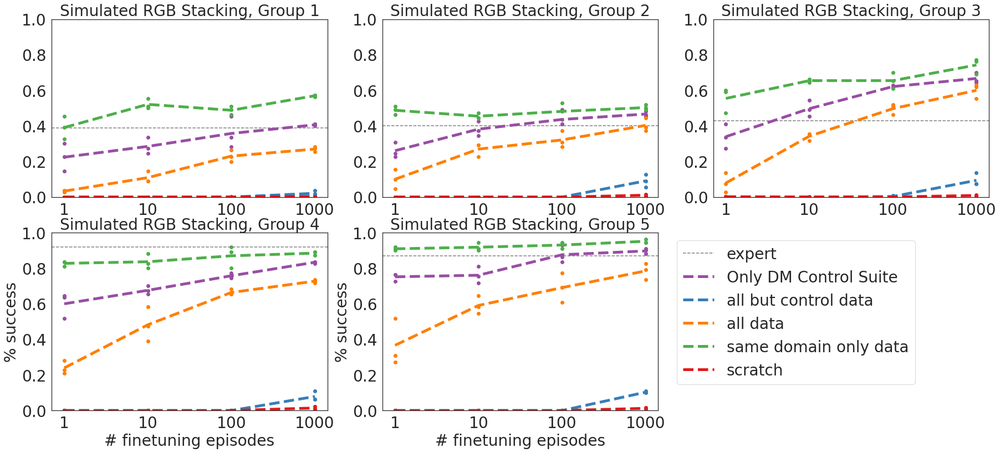 |
| 21 | `figures/gato_attention_vis_app.pdf` | `G1_srcfig_21_gato_attention_vis_app.pdf` | 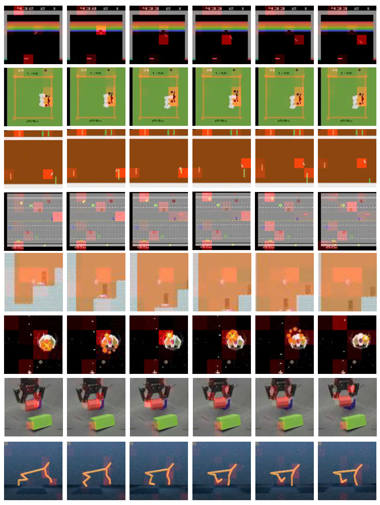 |