# G2 Source Figures Manifest

이 파일은 arXiv/LaTeX source에서 추출한 원본 figure asset 목록이다.
PDF figure는 첫 페이지를 PNG preview로 렌더링했다.

| Order | LaTeX reference | Source asset | Preview |
|---:|---|---|---|
| 1 | `intro.png` | `G2_srcfig_01_intro.png` |  |
| 2 | `vfs.png` | `G2_srcfig_02_vfs.png` |  |
| 3 | `vf_values_two.png` | `G2_srcfig_03_vf_values_two.png` | 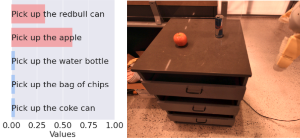 |
| 4 | `vf_values_none.png` | `G2_srcfig_04_vf_values_none.png` | 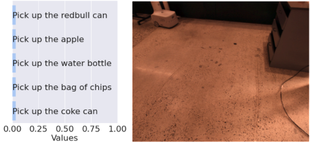 |
| 5 | `vfs_llm_all.png` | `G2_srcfig_05_vfs_llm_all.png` |  |
| 6 | `mk_setup.png` | `G2_srcfig_06_mk_setup.png` | 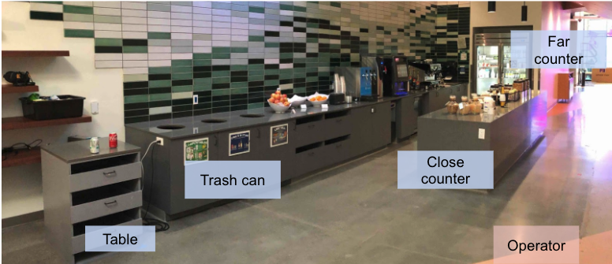 |
| 7 | `object_setup3.jpg` | `G2_srcfig_07_object_setup3.jpg` | 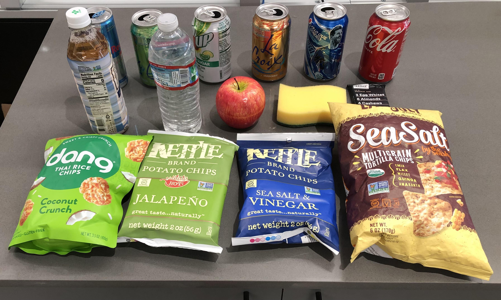 |
| 8 | `robot_setup.png` | `G2_srcfig_08_robot_setup.png` | 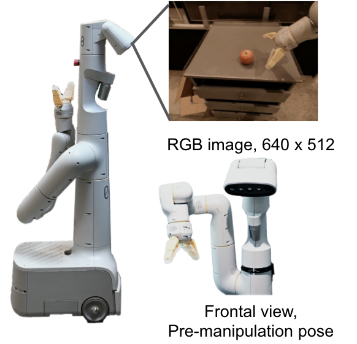 |
| 9 | `overhead_workout.png` | `G2_srcfig_09_overhead_workout.png` | 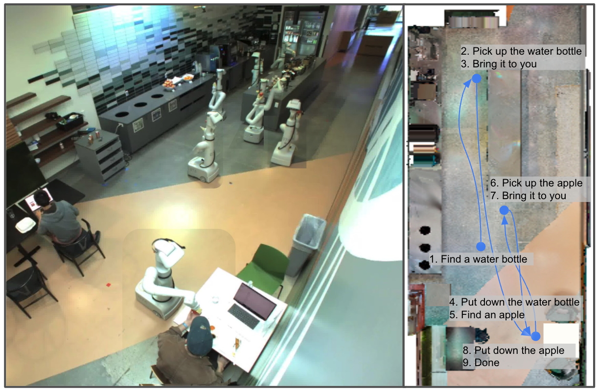 |
| 10 | `overhead_three_sponge.png` | `G2_srcfig_10_overhead_three_sponge.png` | 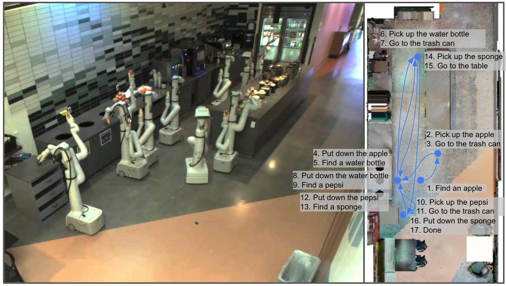 |
| 11 | `spill_coke_rc5.pdf` | `G2_srcfig_11_spill_coke_rc5.pdf` |  |
| 12 | `figures/drawer_seq.png` | `G2_srcfig_12_drawer_seq.png` | 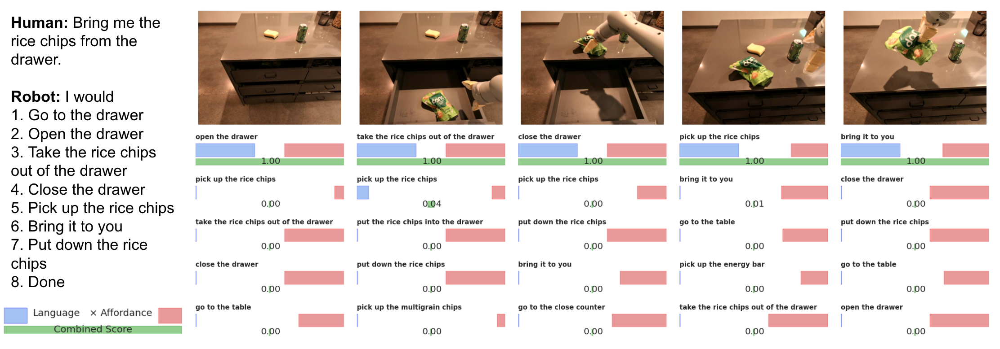 |
| 13 | `figures/open_source.png` | `G2_srcfig_13_open_source.png` | 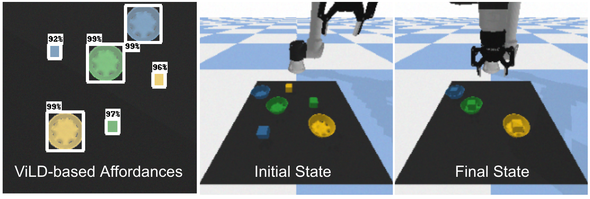 |
| 14 | `figures/rl_architecture.png` | `G2_srcfig_14_rl_architecture.png` | 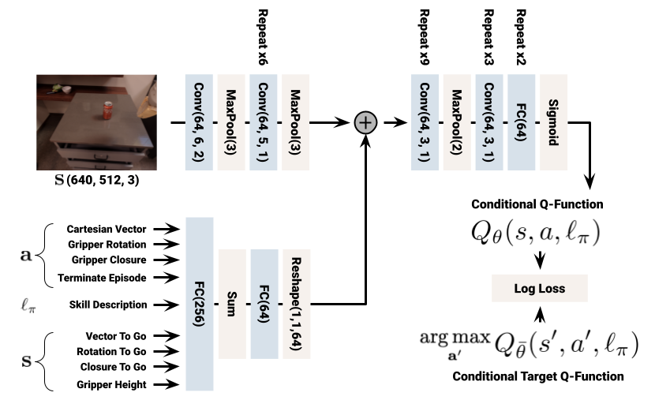 |
| 15 | `figures/bc_architecture.png` | `G2_srcfig_15_bc_architecture.png` |  |
| 16 | `figures/task_scaling.png` | `G2_srcfig_16_task_scaling.png` | 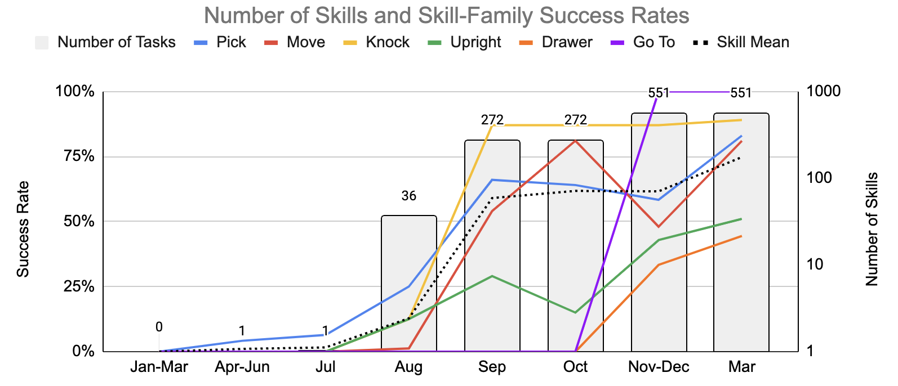 |
| 17 | `llm` | `G2_srcfig_17_llm.png` | 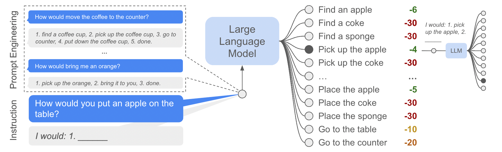 |
| 18 | `spill_coke_rc5_2.pdf` | `G2_srcfig_18_spill_coke_rc5_2.pdf` | 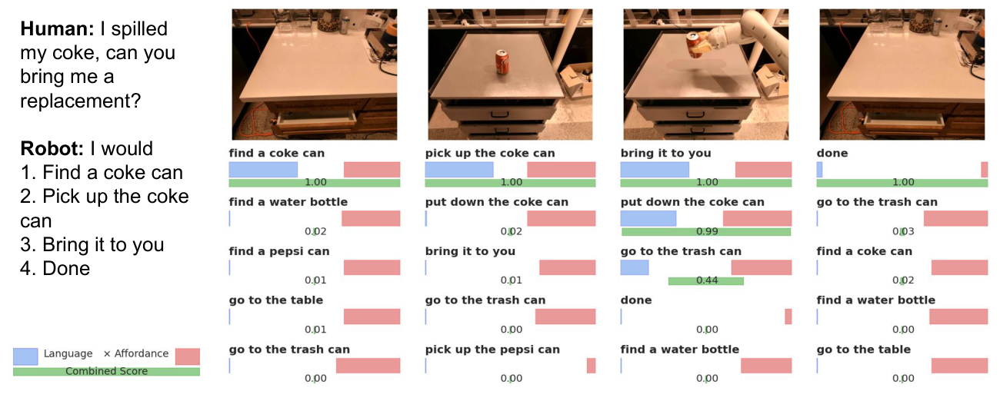 |
| 19 | `bring_me_a_fruit_mk.pdf` | `G2_srcfig_19_bring_me_a_fruit_mk.pdf` | 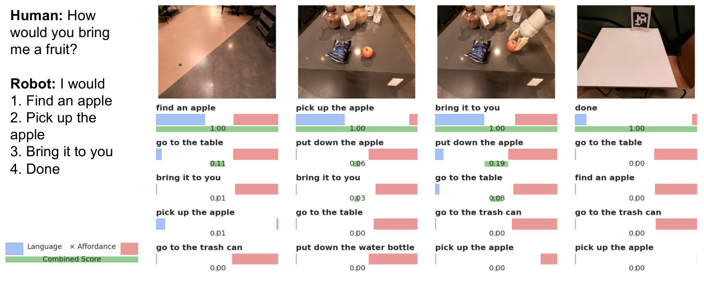 |
| 20 | `embodiment_example.pdf` | `G2_srcfig_20_embodiment_example.pdf` | 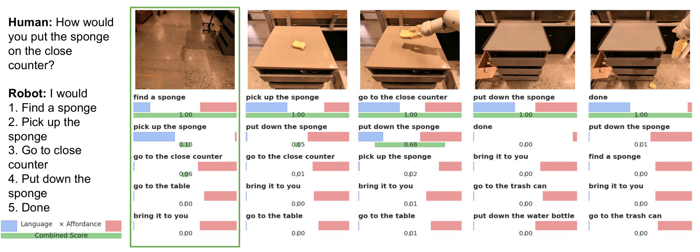 |
| 21 | `bring_two_different_soda.pdf` | `G2_srcfig_21_bring_two_different_soda.pdf` | 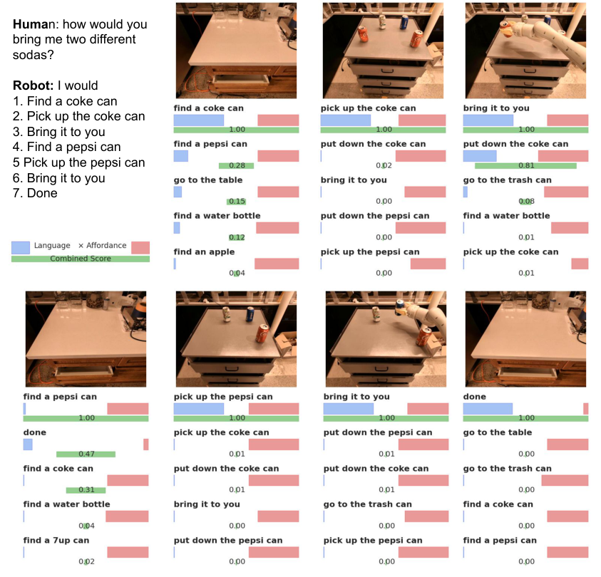 |
| 22 | `long_sequence_2.pdf` | `G2_srcfig_22_long_sequence_2.pdf` | 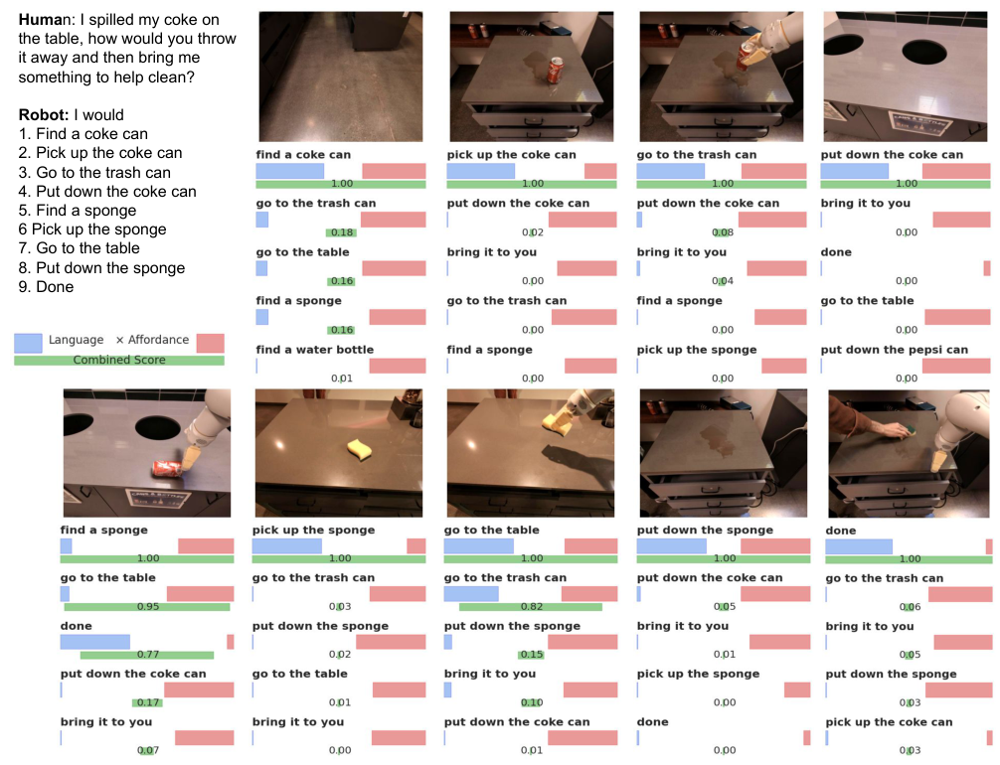 |
| 23 | `failure_case_lm.pdf` | `G2_srcfig_23_failure_case_lm.pdf` | 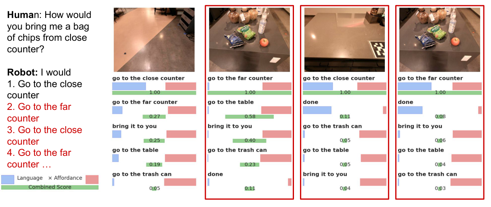 |
| 24 | `failure_case_vf.pdf` | `G2_srcfig_24_failure_case_vf.pdf` | 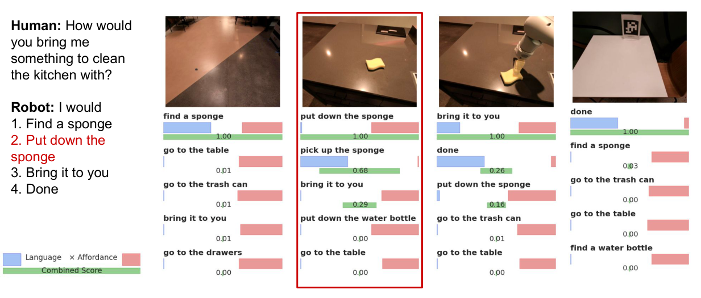 |
| 25 | `failure_early_stop.pdf` | `G2_srcfig_25_failure_early_stop.pdf` | 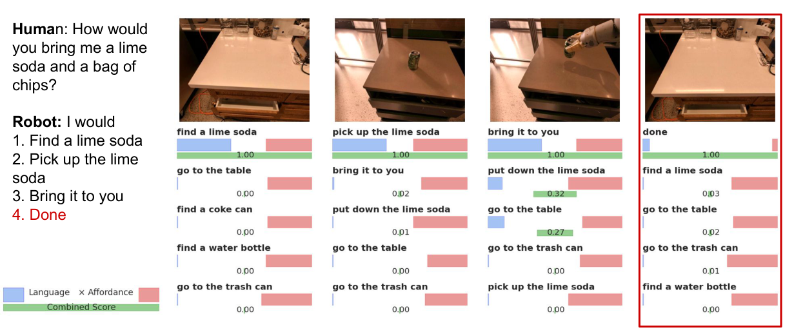 |