# G4 Source Figures Manifest

이 파일은 arXiv/LaTeX source에서 추출한 원본 figure asset 목록이다.
PDF figure는 첫 페이지를 PNG preview로 렌더링했다.

| Order | LaTeX reference | Source asset | Preview |
|---:|---|---|---|
| 1 | `rt1_teaser_model.pdf` | `G4_srcfig_01_rt1_teaser_model.pdf` | 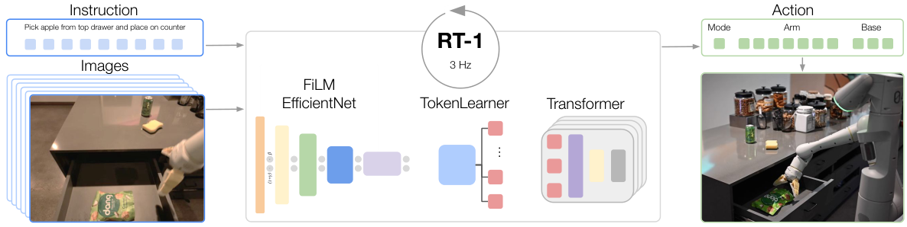 |
| 2 | `rt1_teaser_tasks.png` | `G4_srcfig_02_rt1_teaser_tasks.png` |  |
| 3 | `RT-1_Robot_Setup.png` | `G4_srcfig_03_RT-1_Robot_Setup.png` |  |
| 4 | `rt1_full_model.pdf` | `G4_srcfig_04_rt1_full_model.pdf` |  |
| 5 | `robustness2.png` | `G4_srcfig_05_robustness2.png` |  |
| 6 | `figures/main_baselines_flip.png` | `G4_srcfig_06_main_baselines_flip.png` |  |
| 7 | `figures/trajectories-bigger.pdf` | `G4_srcfig_07_trajectories-bigger.pdf` | 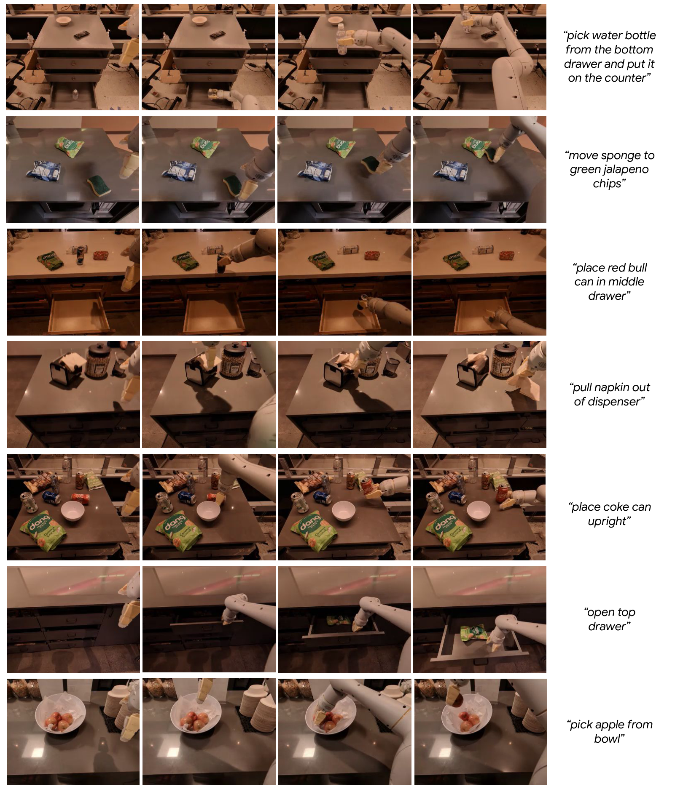 |
| 8 | `kanishka_data.png` | `G4_srcfig_08_kanishka_data.png` | 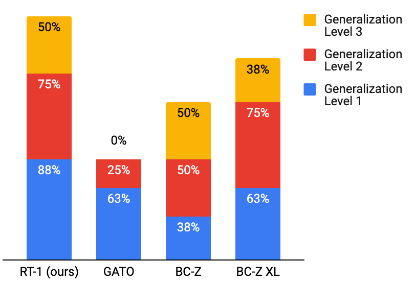 |
| 9 | `sim_delta.pdf` | `G4_srcfig_09_sim_delta.pdf` | 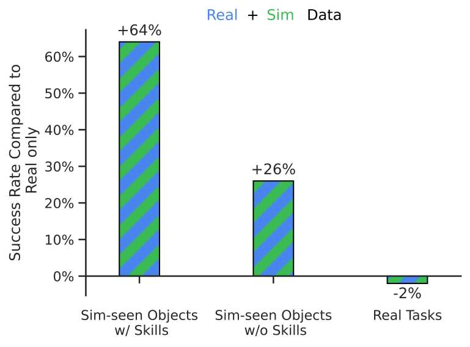 |
| 10 | `kuka_data_figure.png` | `G4_srcfig_10_kuka_data_figure.png` | 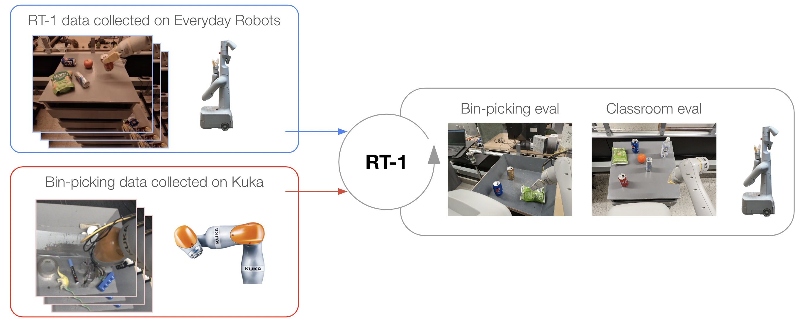 |
| 11 | `kuka_delta.pdf` | `G4_srcfig_11_kuka_delta.pdf` | 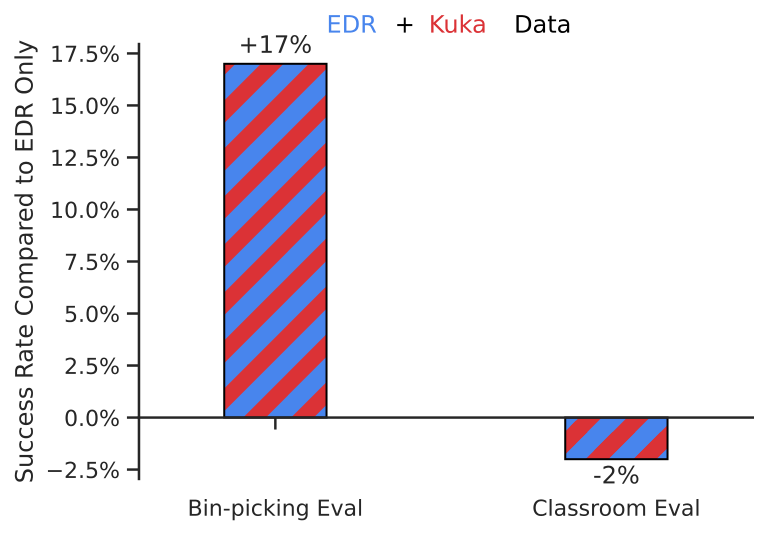 |
| 12 | `figures/data_ablation_simple` | `G4_srcfig_12_data_ablation_simple.png` | 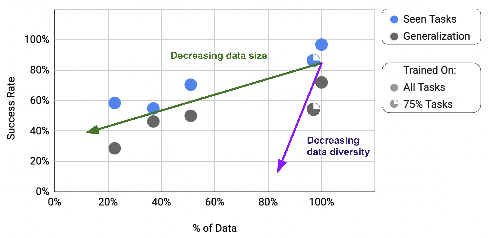 |
| 13 | `env_examples_v2.png` | `G4_srcfig_13_env_examples_v2.png` | 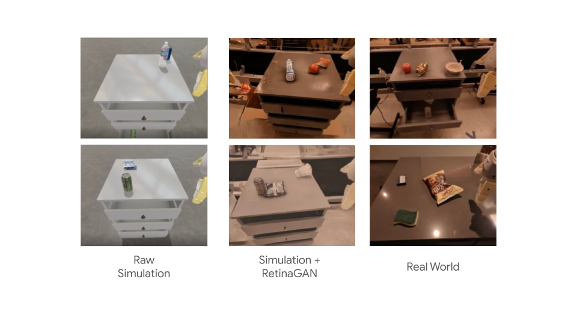 |
| 14 | `data_tasks_success.png` | `G4_srcfig_14_data_tasks_success.png` | 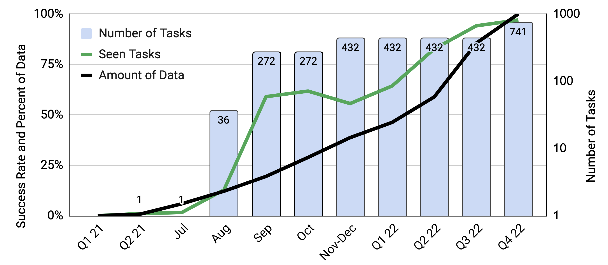 |
| 15 | `figures/backgrounds_trajectories.pdf` | `G4_srcfig_15_backgrounds_trajectories.pdf` | 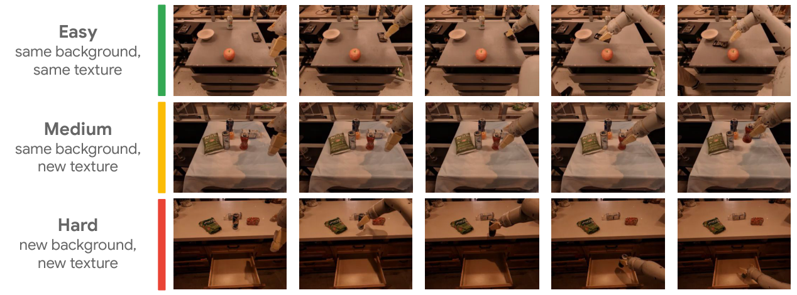 |
| 16 | `figures/generalization_trajectories.pdf` | `G4_srcfig_16_generalization_trajectories.pdf` | 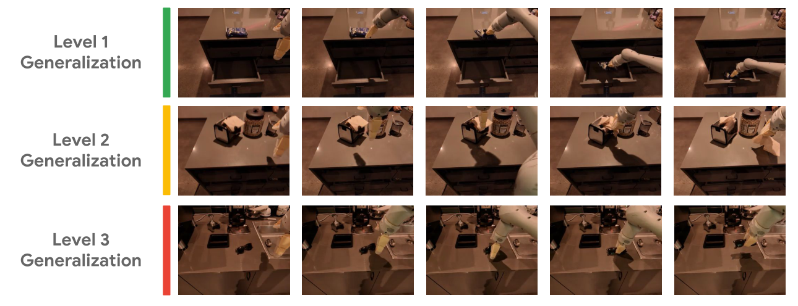 |
| 17 | `figures/distractors_trajectories.pdf` | `G4_srcfig_17_distractors_trajectories.pdf` | 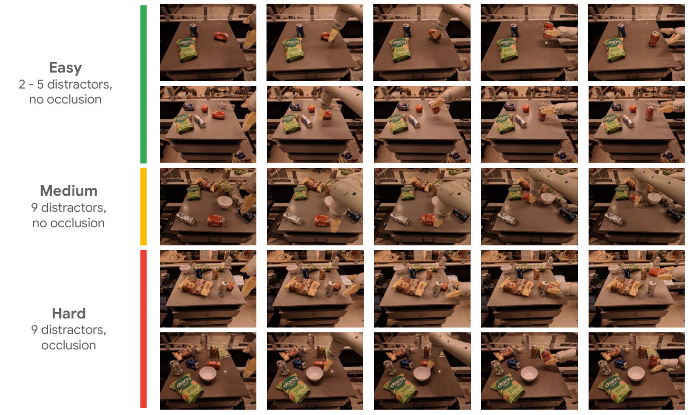 |
| 18 | `figures/model_ablation_with_baselines` | `G4_srcfig_18_model_ablation_with_baselines.png` | 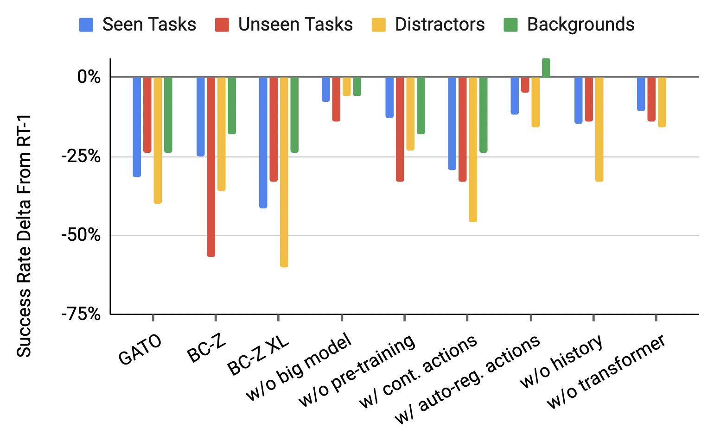 |
| 19 | `figures/viz_attention_map.pdf` | `G4_srcfig_19_viz_attention_map.pdf` | 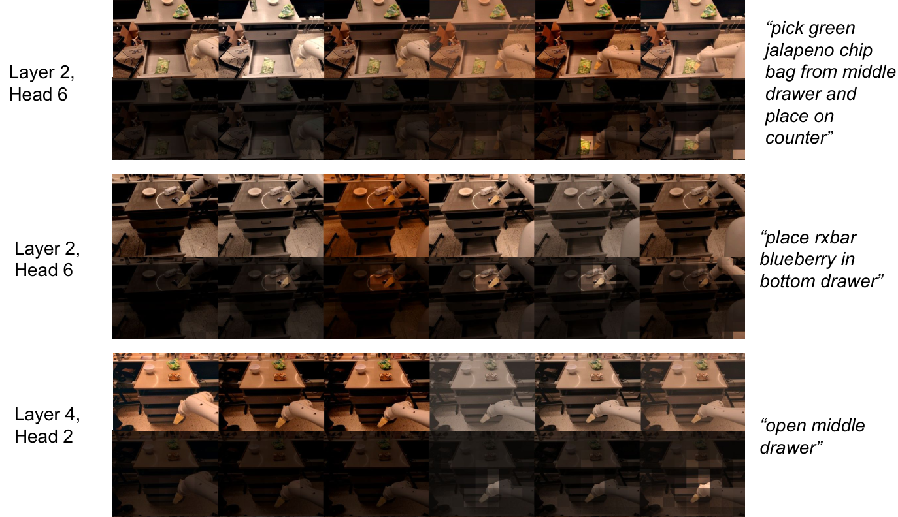 |