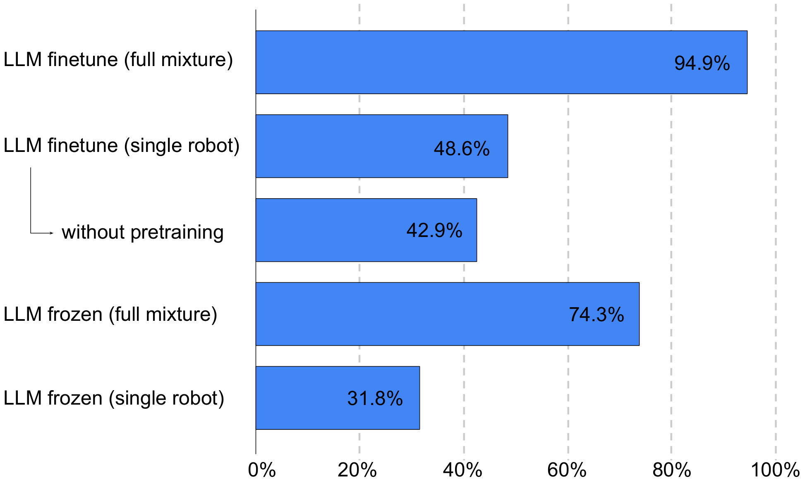
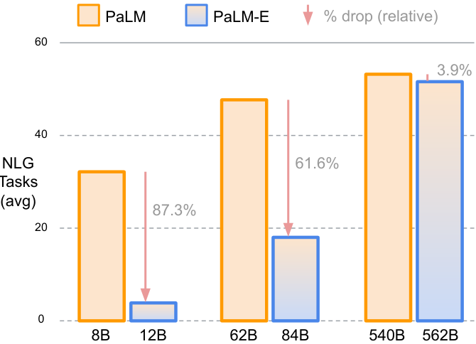
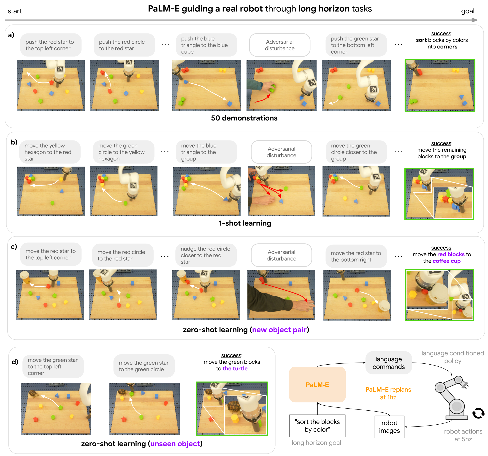
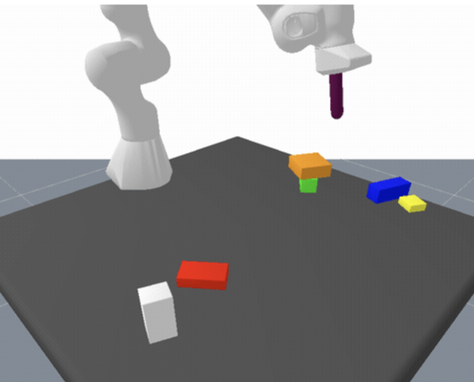
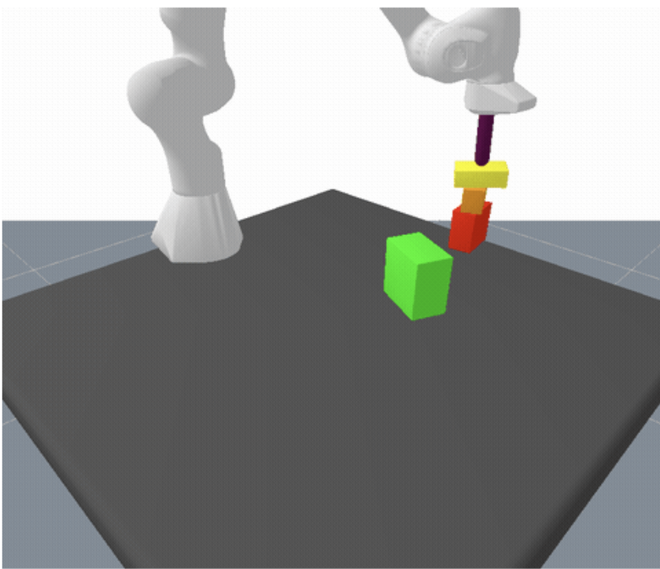

# G5 Source Figures Manifest

이 파일은 arXiv/LaTeX source에서 추출한 원본 figure asset 목록이다.
PDF figure는 첫 페이지를 PNG preview로 렌더링했다.

| Order | LaTeX reference | Source asset | Preview |
|---:|---|---|---|
| 1 | `color_snowflake` | `G5_srcfig_01_color_snowflake.pdf` |  |
| 2 | `figures/palm-e-teaser-v4-4.pdf` | `G5_srcfig_02_palm-e-teaser-v4-4.pdf` |  |
| 3 | `figures/Figure2-v4-5.pdf` | `G5_srcfig_03_Figure2-v4-5.pdf` |  |
| 4 | `figures/4_Transfer_figure_for_PaLM-E.pdf` | `G5_srcfig_04_4_Transfer_figure_for_PaLM-E.pdf` |  |
| 5 | `figures/TAMP_planning_summary.pdf` | `G5_srcfig_05_TAMP_planning_summary.pdf` |  |
| 6 | `figures/real/palm-e-real-robot-fractal-languagetable-v1.pdf` | `G5_srcfig_06_palm-e-real-robot-fractal-languagetable-v1.pdf` |  |
| 7 | `figures/NLG_half_width_figure_4.pdf` | `G5_srcfig_07_NLG_half_width_figure_4.pdf` |  |
| 8 | `figures/real/palm-e-real-robot-v4.pdf` | `G5_srcfig_08_palm-e-real-robot-v4.pdf` |  |
| 9 | `figures/damp.png` | `G5_srcfig_09_damp.png` |  |
| 10 | `figures/damp2.png` | `G5_srcfig_10_damp2.png` |  |
