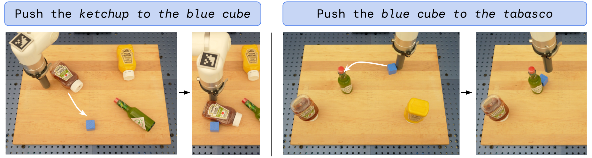
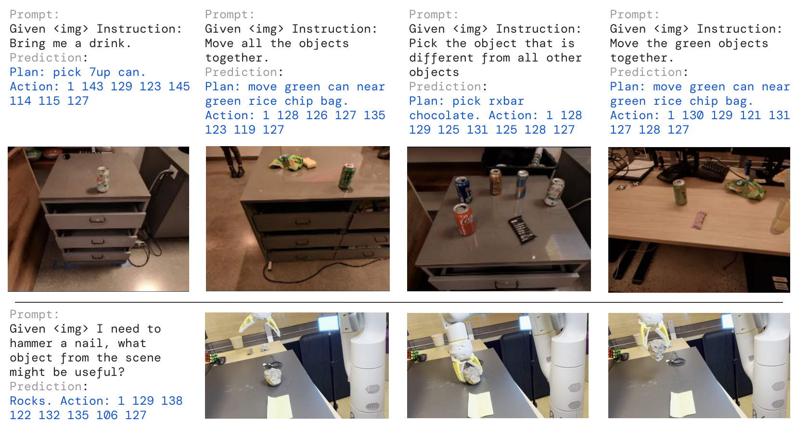

# G6 Source Figures Manifest

이 파일은 arXiv/LaTeX source에서 추출한 원본 figure asset 목록이다.
PDF figure는 첫 페이지를 PNG preview로 렌더링했다.

| Order | LaTeX reference | Source asset | Preview |
|---:|---|---|---|
| 1 | `figures/rt2_teaser.pdf` | `G6_srcfig_01_rt2_teaser.pdf` |  |
| 2 | `figures/RT2-capabilities-dm.png` | `G6_srcfig_02_RT2-capabilities-dm.png` |  |
| 3 | `figures/generalization_evals_dm.pdf` | `G6_srcfig_03_generalization_evals_dm.pdf` |  |
| 4 | `figures/rt2_overall_wide_dm.png` | `G6_srcfig_04_rt2_overall_wide_dm.png` |  |
| 5 | `figures/LangTable-R2-Narrow-DM.png` | `G6_srcfig_05_LangTable-R2-Narrow-DM.png` |  |
| 6 | `figures/rt2_emergent_dm.png` | `G6_srcfig_06_rt2_emergent_dm.png` |  |
| 7 | `figures/rt2_ablations_dm.png` | `G6_srcfig_07_rt2_ablations_dm.png` |  |
| 8 | `figures/RT2CoT_Narrow.pdf` | `G6_srcfig_08_RT2CoT_Narrow.pdf` |  |
