# P2 Source Figures Manifest

이 파일은 arXiv/LaTeX source에서 추출한 원본 figure asset 목록이다.
PDF figure는 첫 페이지를 PNG preview로 렌더링했다.

| Order | LaTeX reference | Source asset | Preview |
|---:|---|---|---|
| 1 | `figures/teaser_figure_v3.pdf` | `P2_srcfig_01_teaser_figure_v3.pdf` |  |
| 2 | `figures/method_v3.pdf` | `P2_srcfig_02_method_v3.pdf` | 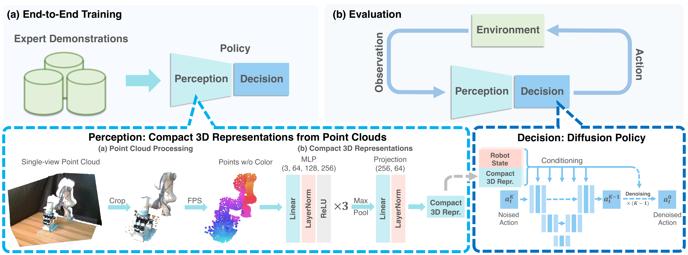 |
| 3 | `figures/example.pdf` | `P2_srcfig_03_example.pdf` | 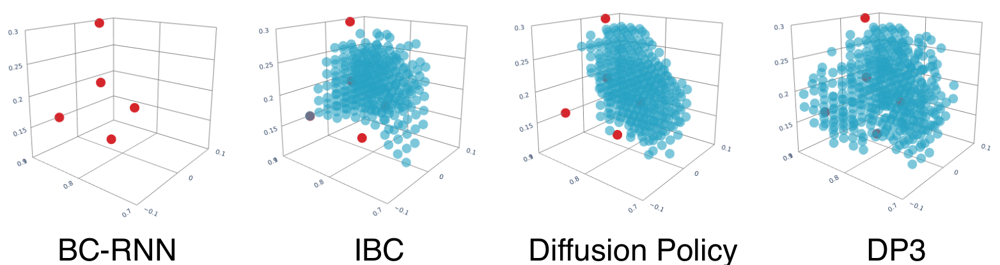 |
| 4 | `figures/sim3d.pdf` | `P2_srcfig_04_sim3d.pdf` | 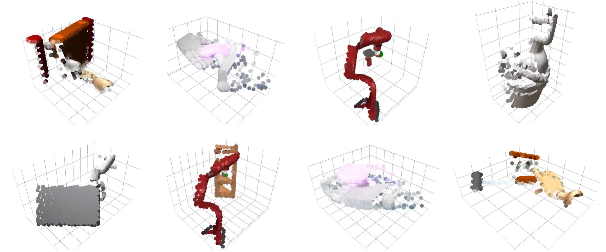 |
| 5 | `figures/learning_efficiency_multi.pdf` | `P2_srcfig_05_learning_efficiency_multi.pdf` |  |
| 6 | `figures/demo_scaling_multi.pdf` | `P2_srcfig_06_demo_scaling_multi.pdf` | 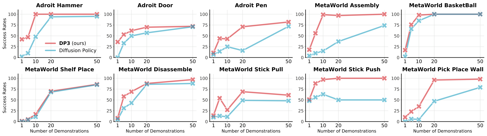 |
| 7 | `figures/learning_curves_noise_pred.pdf` | `P2_srcfig_07_learning_curves_noise_pred.pdf` | 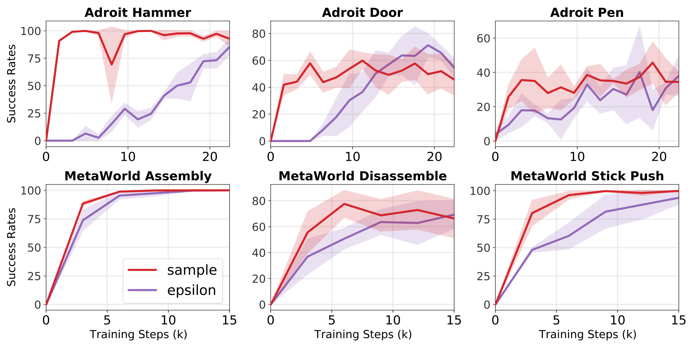 |
| 8 | `figures/setup_figure2.pdf` | `P2_srcfig_08_setup_figure2.pdf` | 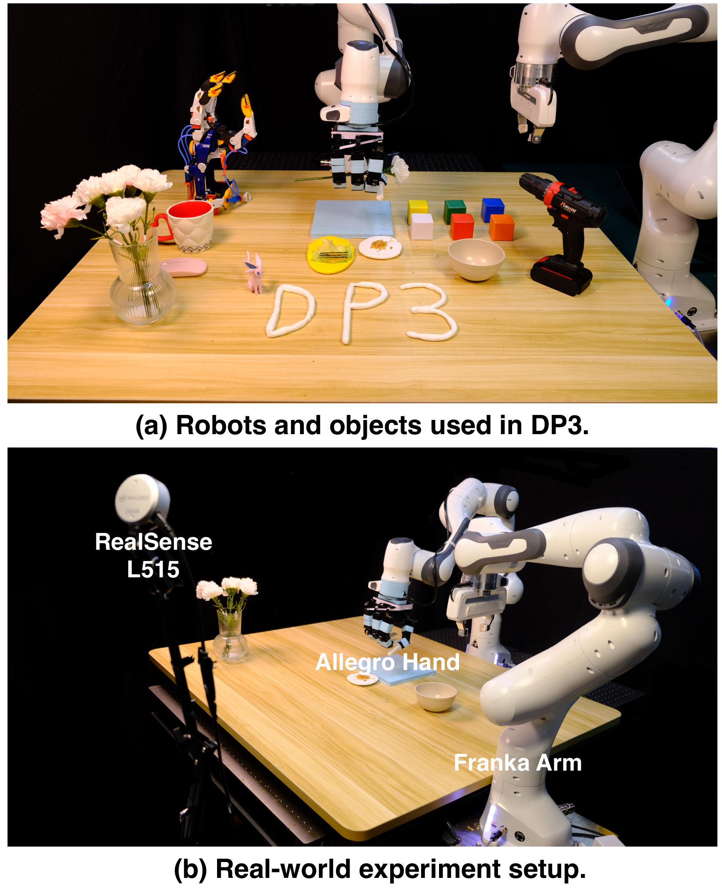 |
| 9 | `figures/task_randomness2.pdf` | `P2_srcfig_09_task_randomness2.pdf` | 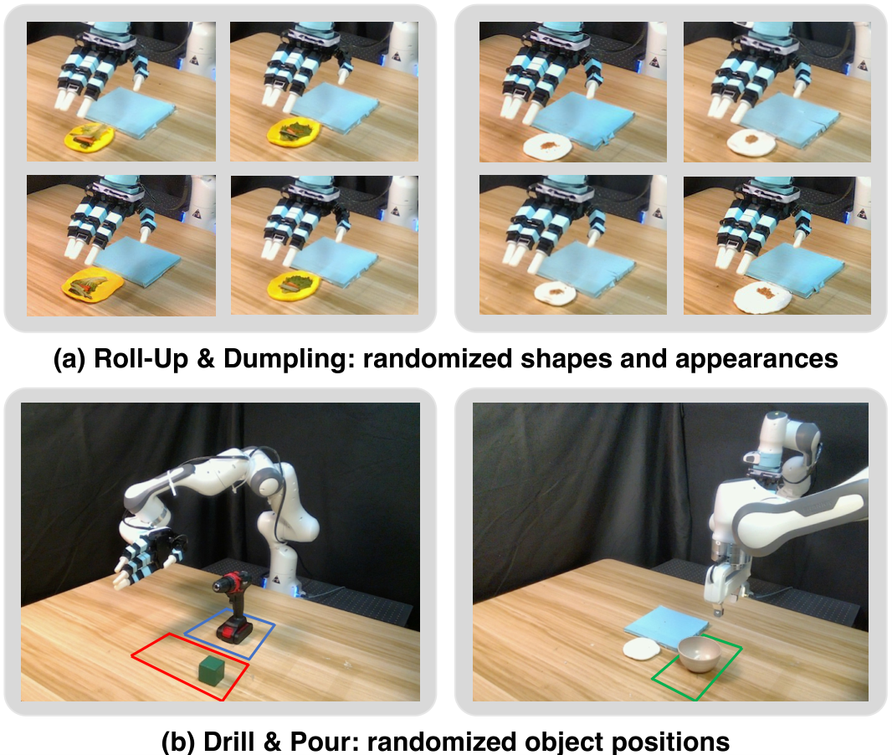 |
| 10 | `figures/real_task_visualization.pdf` | `P2_srcfig_10_real_task_visualization.pdf` |  |
| 11 | `figures/different_3d_repr.pdf` | `P2_srcfig_11_different_3d_repr.pdf` | 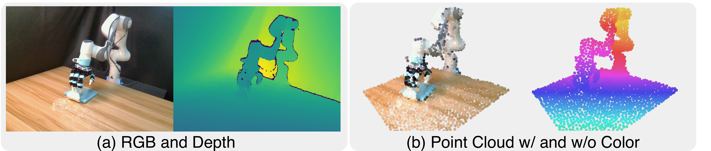 |
| 12 | `figures/simple_DP3.pdf` | `P2_srcfig_12_simple_DP3.pdf` | 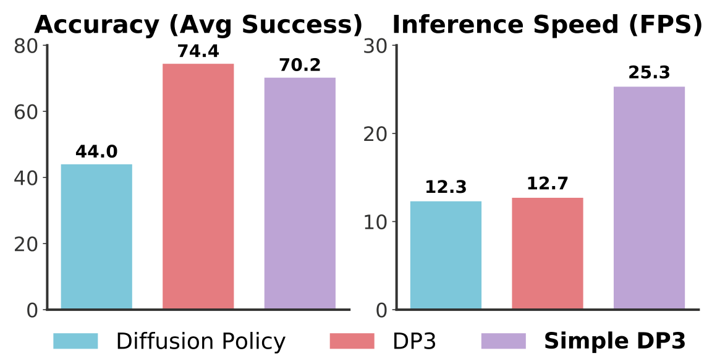 |
| 13 | `figures/cluttered.pdf` | `P2_srcfig_13_cluttered.pdf` | 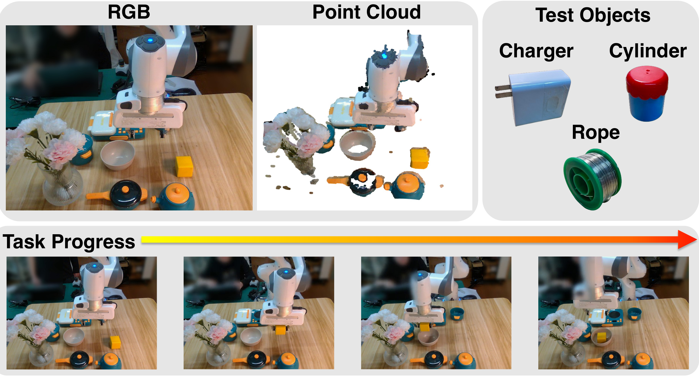 |
| 14 | `figures/gen_appear.pdf` | `P2_srcfig_14_gen_appear.pdf` | 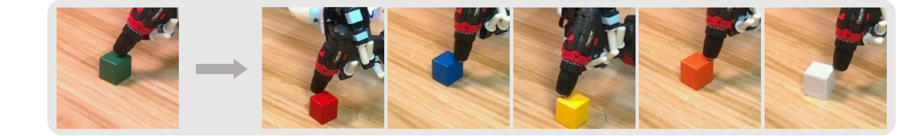 |
| 15 | `figures/appear_gen/green.jpg` | `P2_srcfig_15_green.jpg` | 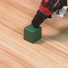 |
| 16 | `figures/appear_gen/red.jpg` | `P2_srcfig_16_red.jpg` | 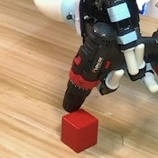 |
| 17 | `figures/appear_gen/blue.jpg` | `P2_srcfig_17_blue.jpg` | 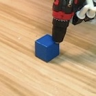 |
| 18 | `figures/appear_gen/yellow.jpg` | `P2_srcfig_18_yellow.jpg` | 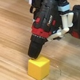 |
| 19 | `figures/appear_gen/orange.jpg` | `P2_srcfig_19_orange.jpg` | 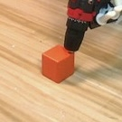 |
| 20 | `figures/appear_gen/white.jpg` | `P2_srcfig_20_white.jpg` | 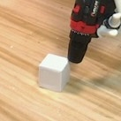 |
| 21 | `figures/instance.pdf` | `P2_srcfig_21_instance.pdf` | 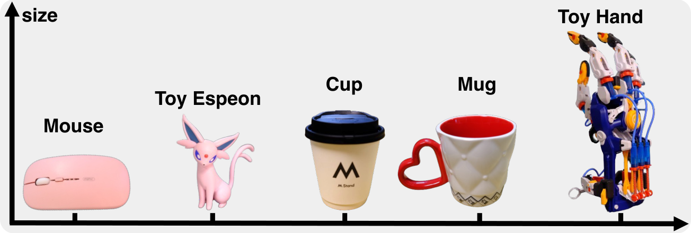 |
| 22 | `figures/instance_gen/cat.jpg` | `P2_srcfig_22_cat.jpg` |  |
| 23 | `figures/instance_gen/mouse.jpg` | `P2_srcfig_23_mouse.jpg` | 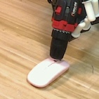 |
| 24 | `figures/instance_gen/latte.jpg` | `P2_srcfig_24_latte.jpg` | 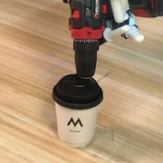 |
| 25 | `figures/instance_gen/cup.jpg` | `P2_srcfig_25_cup.jpg` | 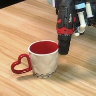 |
| 26 | `figures/instance_gen/hand.jpg` | `P2_srcfig_26_hand.jpg` | 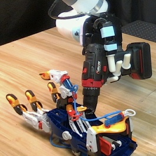 |
| 27 | `figures/safety.pdf` | `P2_srcfig_27_safety.pdf` | 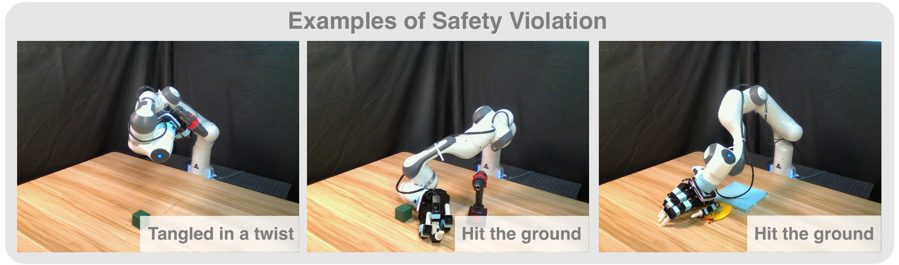 |
| 28 | `figures/spatial_generalization.pdf` | `P2_srcfig_28_spatial_generalization.pdf` | 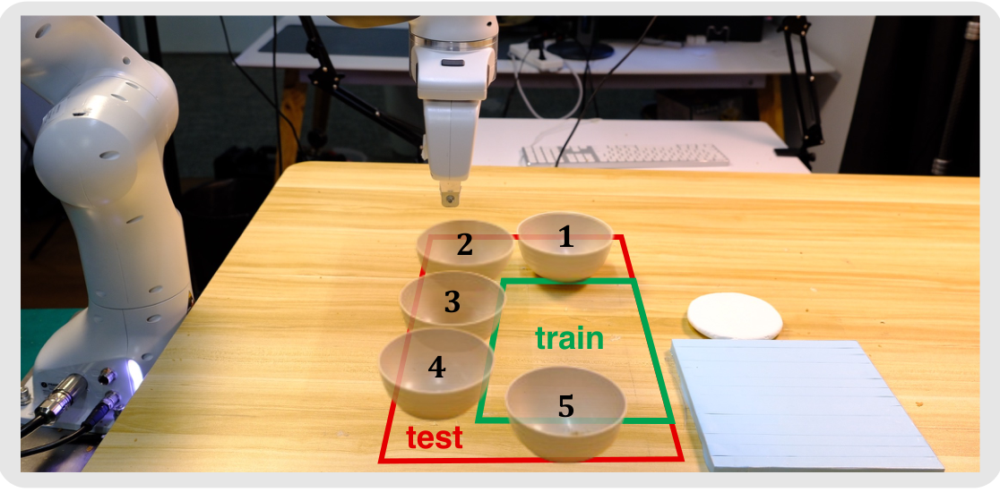 |
| 29 | `figures/task_visualization_compress.pdf` | `P2_srcfig_29_task_visualization_compress.pdf` | 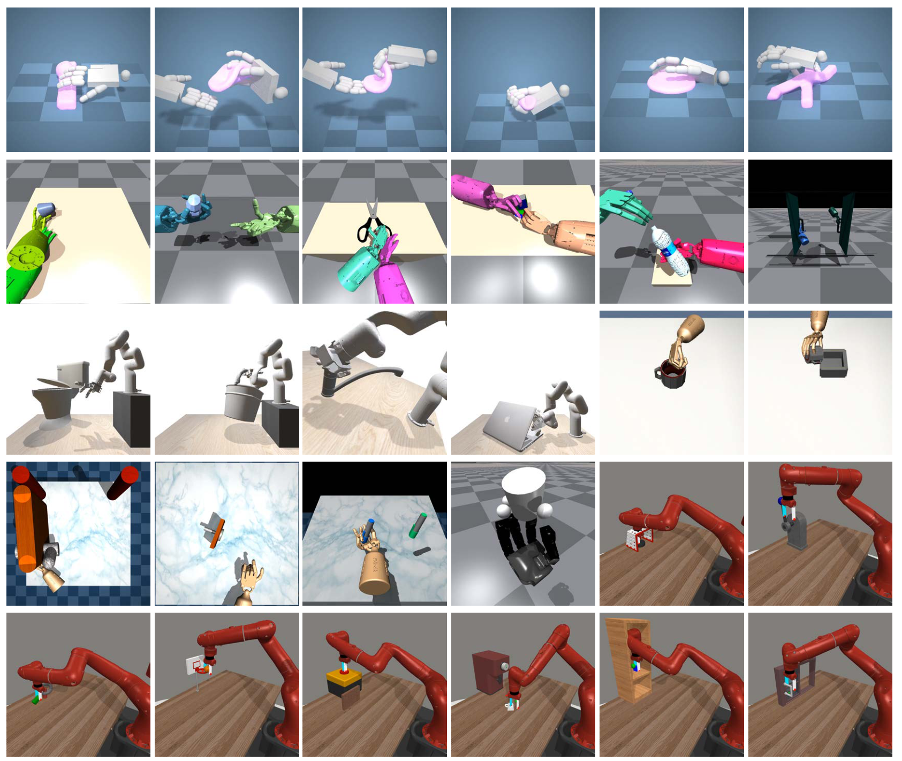 |
| 30 | `figures/view_gen.pdf` | `P2_srcfig_30_view_gen.pdf` |  |
