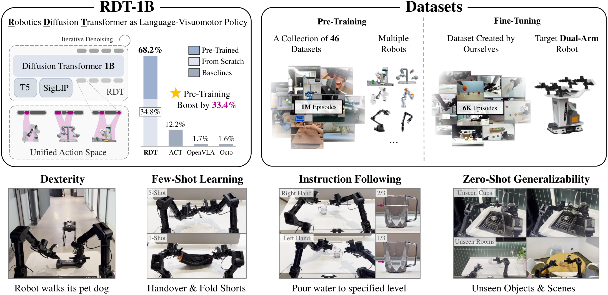
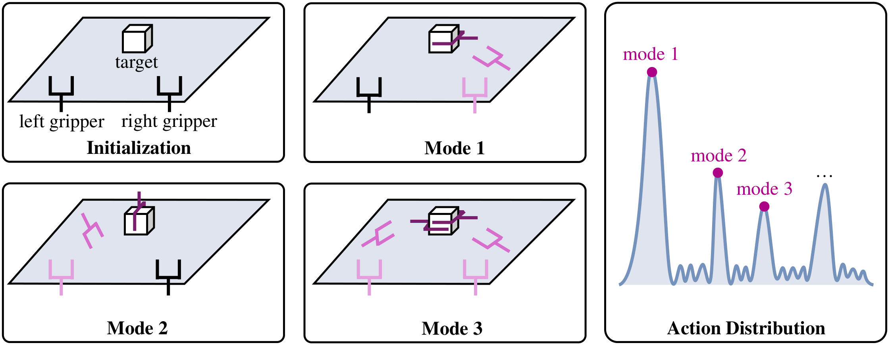
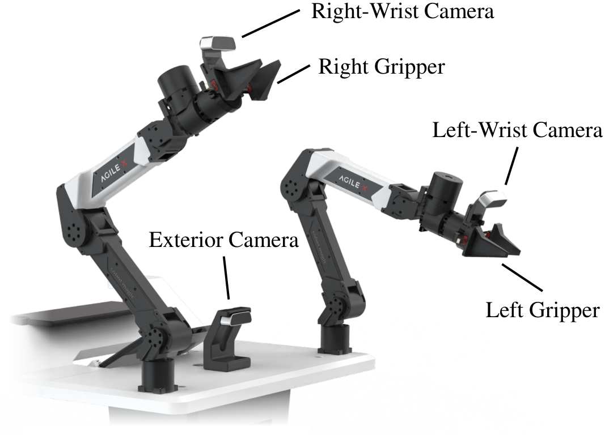
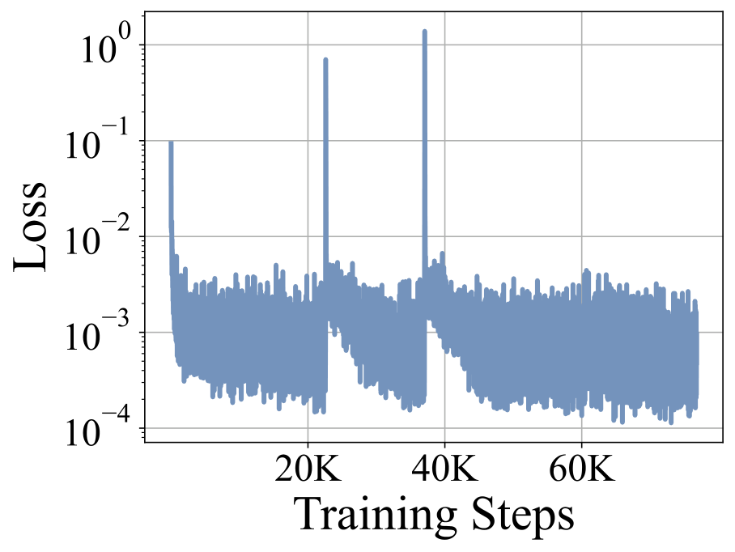

# P3 Source Figures Manifest

이 파일은 arXiv/LaTeX source에서 추출한 원본 figure asset 목록이다.
PDF figure는 첫 페이지를 PNG preview로 렌더링했다.

| Order | LaTeX reference | Source asset | Preview |
|---:|---|---|---|
| 1 | `head.pdf` | `P3_srcfig_01_head.pdf` |  |
| 2 | `multi-modality.pdf` | `P3_srcfig_02_multi-modality.pdf` |  |
| 3 | `bimanual_robot.pdf` | `P3_srcfig_03_bimanual_robot.pdf` |  |
| 4 | `framework.pdf` | `P3_srcfig_04_framework.pdf` |  |
| 5 | `loss2.pdf` | `P3_srcfig_05_loss2.pdf` |  |
| 6 | `ablation.pdf` | `P3_srcfig_06_ablation.pdf` |  |
| 7 | `loss.pdf` | `P3_srcfig_07_loss.pdf` |  |
| 8 | `exp.pdf` | `P3_srcfig_08_exp.pdf` |  |
| 9 | `ft_dataset.pdf` | `P3_srcfig_09_ft_dataset.pdf` |  |
| 10 | `aloha_figure.pdf` | `P3_srcfig_10_aloha_figure.pdf` |  |
| 11 | `openvla_train_acc.png` | `P3_srcfig_11_openvla_train_acc.png` |  |
| 12 | `octo_test_mse.png` | `P3_srcfig_12_octo_test_mse.png` |  |
| 13 | `water.pdf` | `P3_srcfig_13_water.pdf` |  |