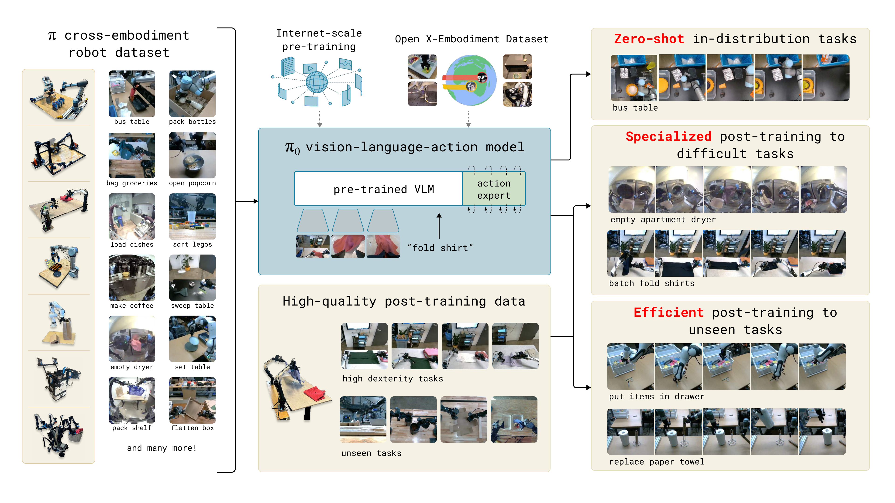
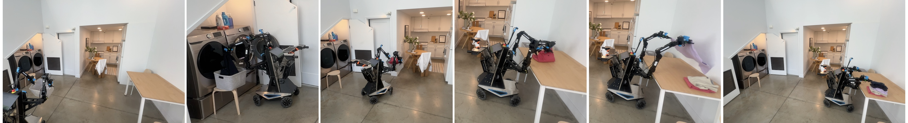
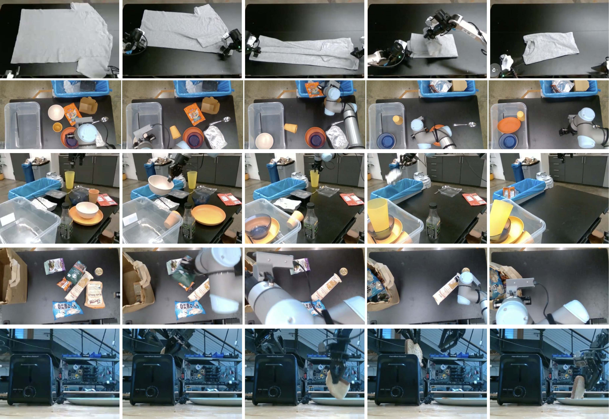
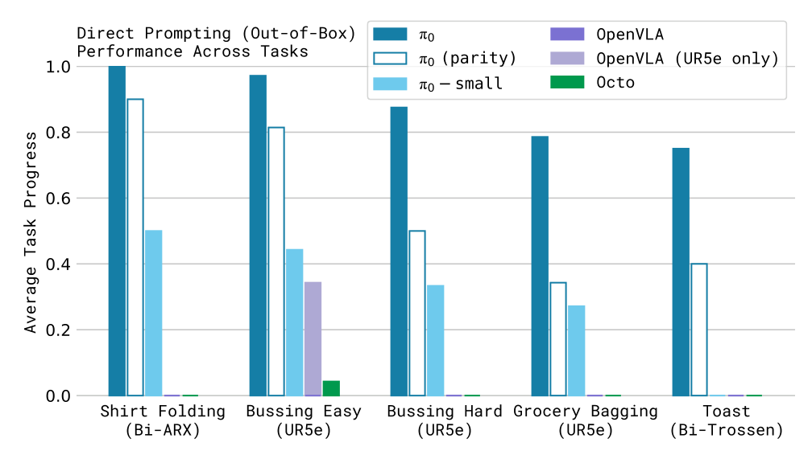
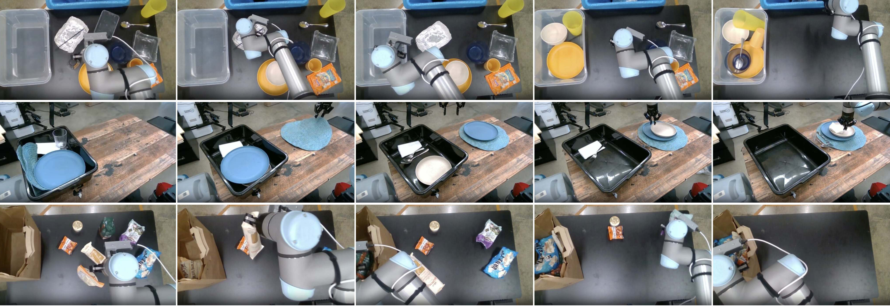
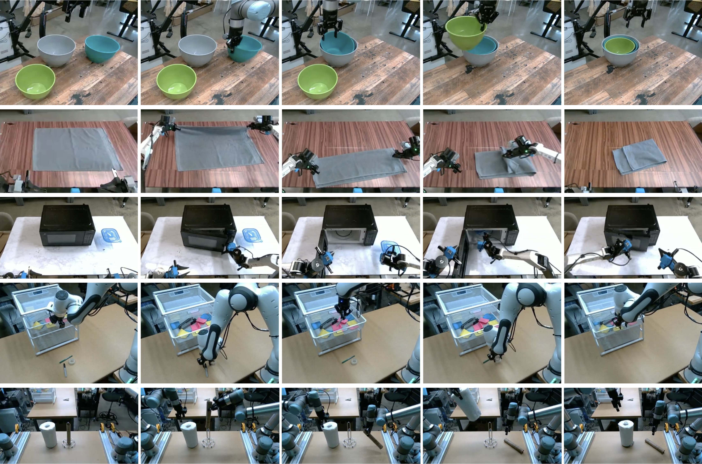
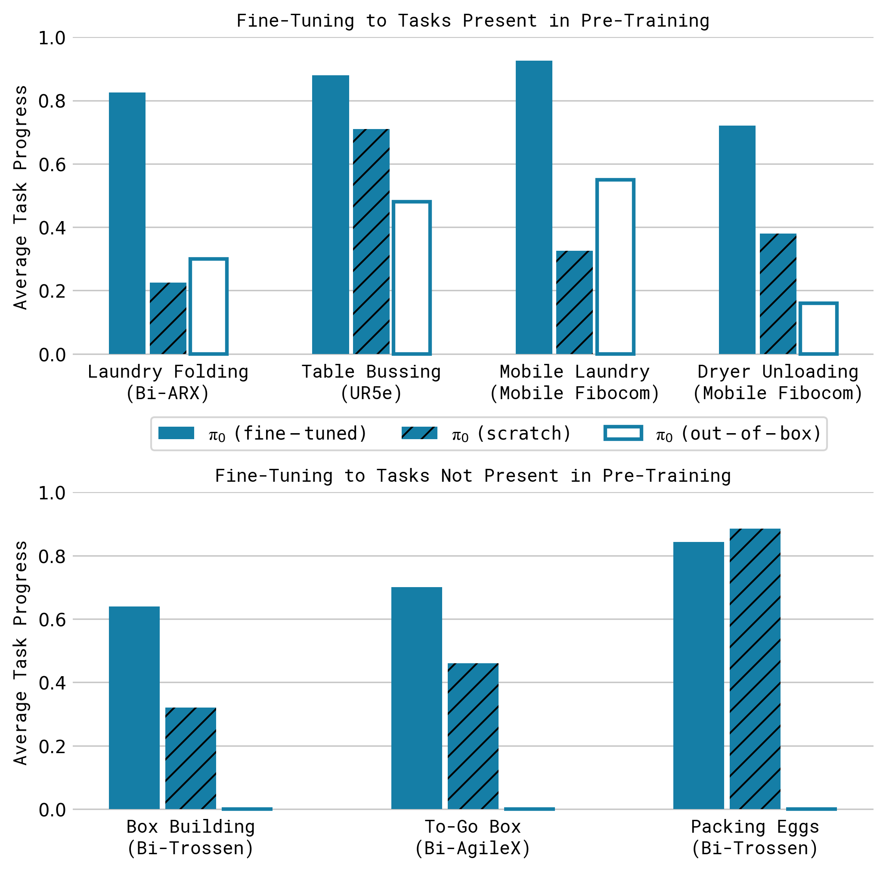
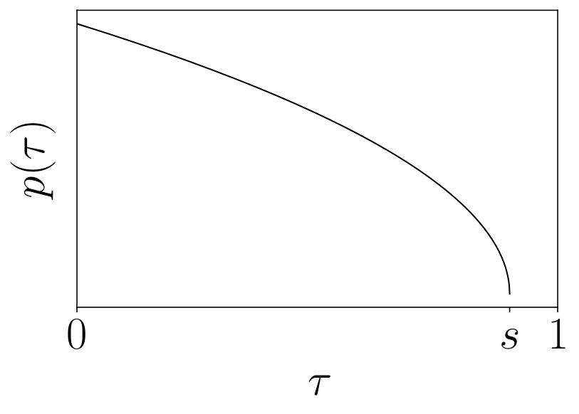

# P4 Source Figures Manifest

이 파일은 arXiv/LaTeX source에서 추출한 원본 figure asset 목록이다.
PDF figure는 첫 페이지를 PNG preview로 렌더링했다.

| Order | LaTeX reference | Source asset | Preview |
|---:|---|---|---|
| 1 | `figures/teaser_fig.pdf` | `P4_srcfig_01_teaser_fig.pdf` |  |
| 2 | `figures/fig2_final.jpeg` | `P4_srcfig_02_fig2_final.jpeg` |  |
| 3 | `figures/overview.pdf` | `P4_srcfig_03_overview.pdf` |  |
| 4 | `figures/combined-robot-allocation-chart.png` | `P4_srcfig_04_combined-robot-allocation-chart.png` |  |
| 5 | `figures/robots_compressed.pdf` | `P4_srcfig_05_robots_compressed.pdf` |  |
| 6 | `figures/pretrain_filmstrip_compressed.pdf` | `P4_srcfig_06_pretrain_filmstrip_compressed.pdf` |  |
| 7 | `figures/pretrain_tasks.pdf` | `P4_srcfig_07_pretrain_tasks.pdf` |  |
| 8 | `figures/language_guided_filmstrip_compressed.pdf` | `P4_srcfig_08_language_guided_filmstrip_compressed.pdf` |  |
| 9 | `figures/language_tasks.png` | `P4_srcfig_09_language_tasks.png` |  |
| 10 | `figures/learning_dexterous_tasks_filmstrip_compressed.pdf` | `P4_srcfig_10_learning_dexterous_tasks_filmstrip_compressed.pdf` |  |
| 11 | `figures/finetune_tasks_over_time.pdf` | `P4_srcfig_11_finetune_tasks_over_time.pdf` |  |
| 12 | `figures/multi_stage_filmstrip_compressed.pdf` | `P4_srcfig_12_multi_stage_filmstrip_compressed.pdf` |  |
| 13 | `figures/complex_finetune.png` | `P4_srcfig_13_complex_finetune.png` |  |
| 14 | `figures/timestep_sampling.pdf` | `P4_srcfig_14_timestep_sampling.pdf` |  |