# P5 Source Figures Manifest

이 파일은 arXiv/LaTeX source에서 추출한 원본 figure asset 목록이다.
PDF figure는 첫 페이지를 PNG preview로 렌더링했다.

| Order | LaTeX reference | Source asset | Preview |
|---:|---|---|---|
| 1 | `figures/pibnb-teaser-bedroom.pdf` | `P5_srcfig_01_pibnb-teaser-bedroom.pdf` | 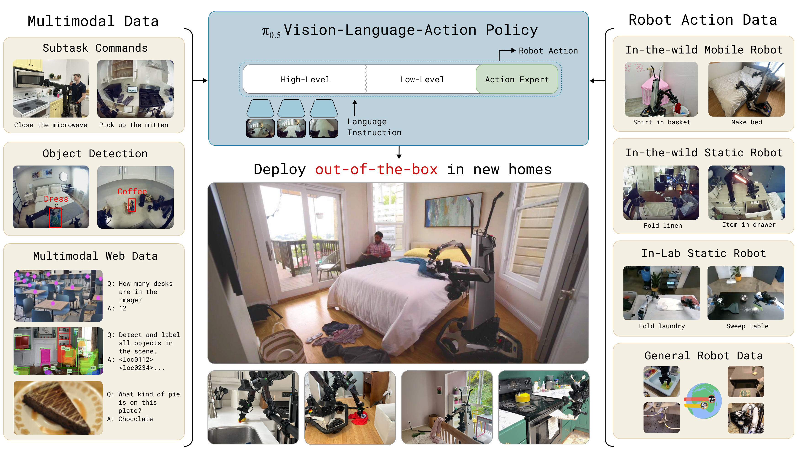 |
| 2 | `figures/final_fig2.pdf` | `P5_srcfig_02_final_fig2.pdf` | 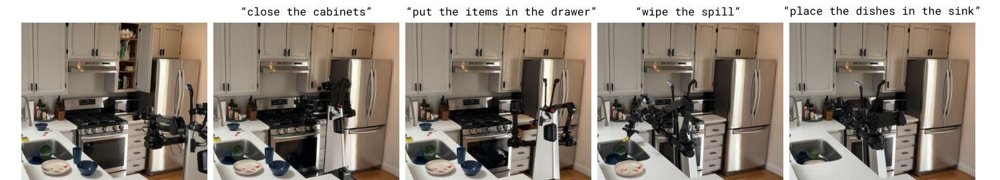 |
| 3 | `figures/Figure_3.pdf` | `P5_srcfig_03_Figure_3.pdf` |  |
| 4 | `figures/pretraining-finetuning-tasks.pdf` | `P5_srcfig_04_pretraining-finetuning-tasks.pdf` | 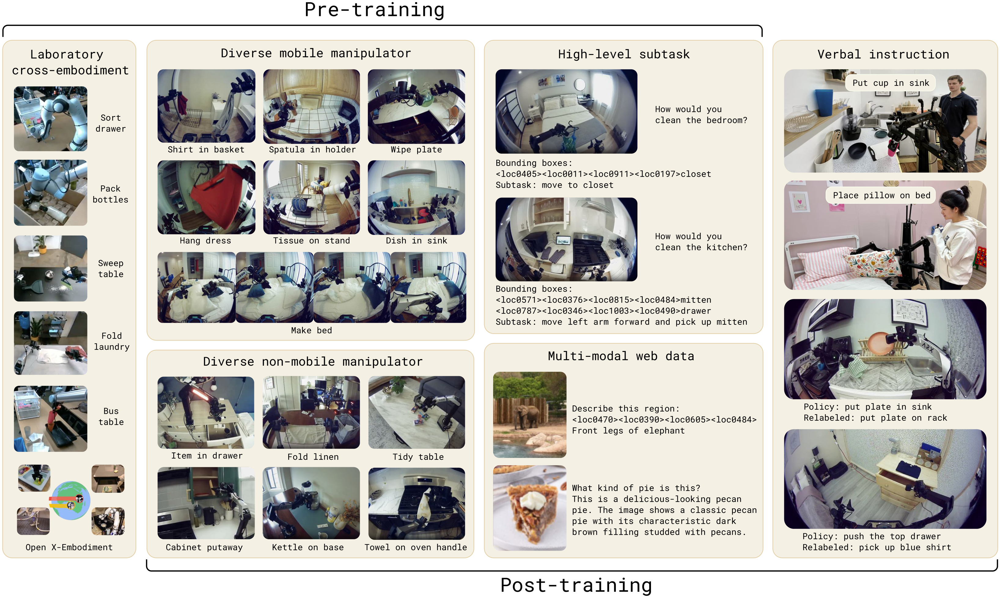 |
| 5 | `figures/robot_system_overview.pdf` | `P5_srcfig_05_robot_system_overview.pdf` |  |
| 6 | `figures/visualize_eval_envs.pdf` | `P5_srcfig_06_visualize_eval_envs.pdf` | 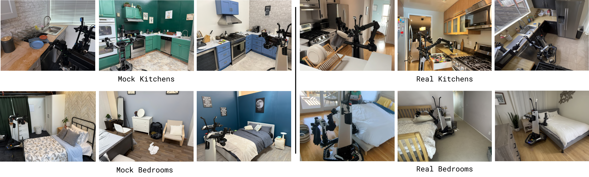 |
| 7 | `figures/final_real_home_eval_filmstrip.pdf` | `P5_srcfig_07_final_real_home_eval_filmstrip.pdf` | 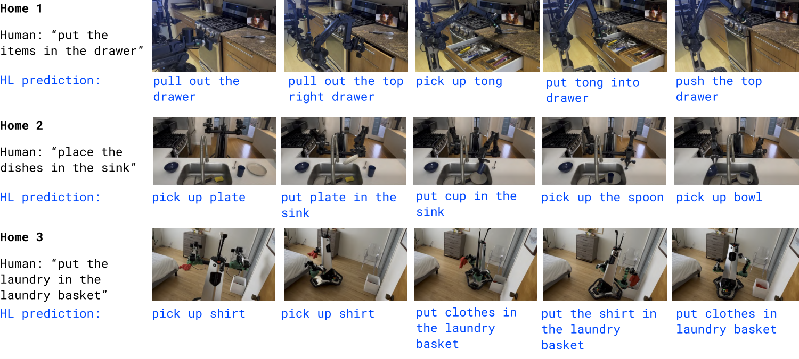 |
| 8 | `figures/real_home_quantitative_eval_plot.png` | `P5_srcfig_08_real_home_quantitative_eval_plot.png` |  |
| 9 | `figures/env_scaling.png` | `P5_srcfig_09_env_scaling.png` |  |
| 10 | `figures/env_scaling_results0.png` | `P5_srcfig_10_env_scaling_results0.png` | 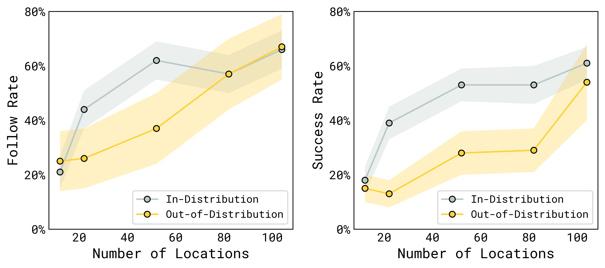 |
| 11 | `figures/performance_vs_ll_data.png` | `P5_srcfig_11_performance_vs_ll_data.png` |  |
| 12 | `figures/data_vs_generalization.png` | `P5_srcfig_12_data_vs_generalization.png` |  |
| 13 | `figures/performance_vs_ll_model.png` | `P5_srcfig_13_performance_vs_ll_model.png` | 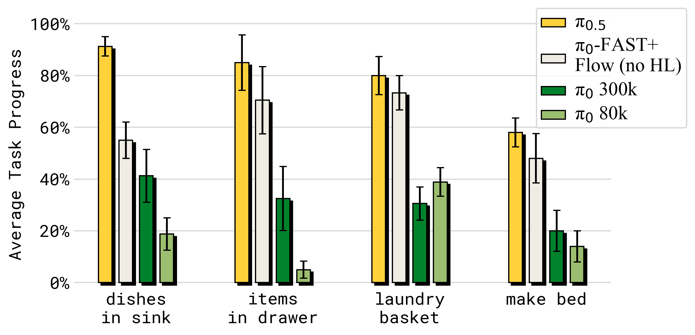 |
| 14 | `figures/performance_vs_hl_data.png` | `P5_srcfig_14_performance_vs_hl_data.png` | 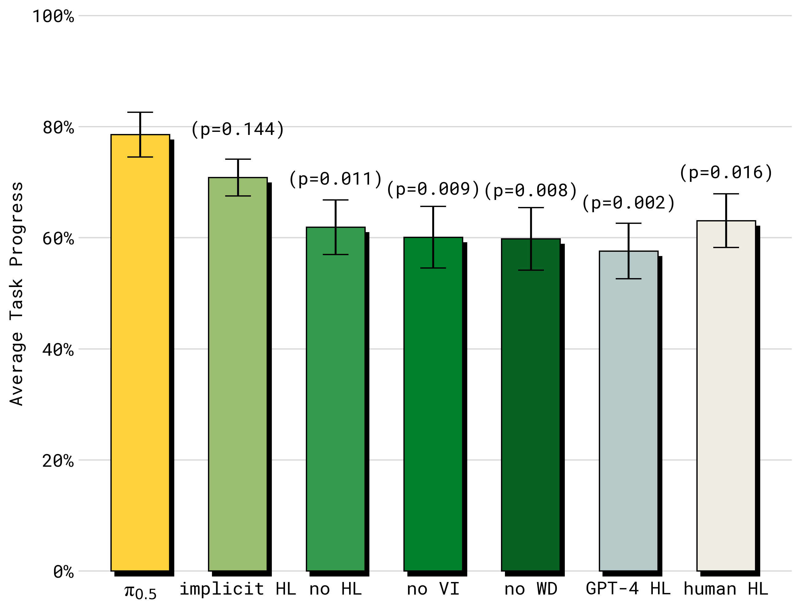 |
| 15 | `figures/ll_drawer.jpg` | `P5_srcfig_15_ll_drawer.jpg` | 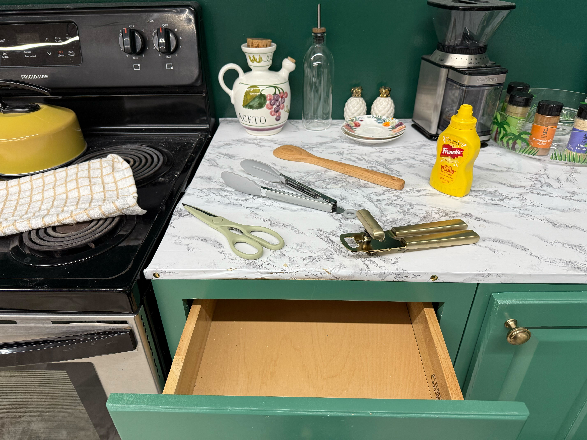 |
| 16 | `figures/ll_sink.jpg` | `P5_srcfig_16_ll_sink.jpg` |  |
| 17 | `figures/rare_objects.jpg` | `P5_srcfig_17_rare_objects.jpg` |  |
| 18 | `figures/language_vs_model.png` | `P5_srcfig_18_language_vs_model.png` | 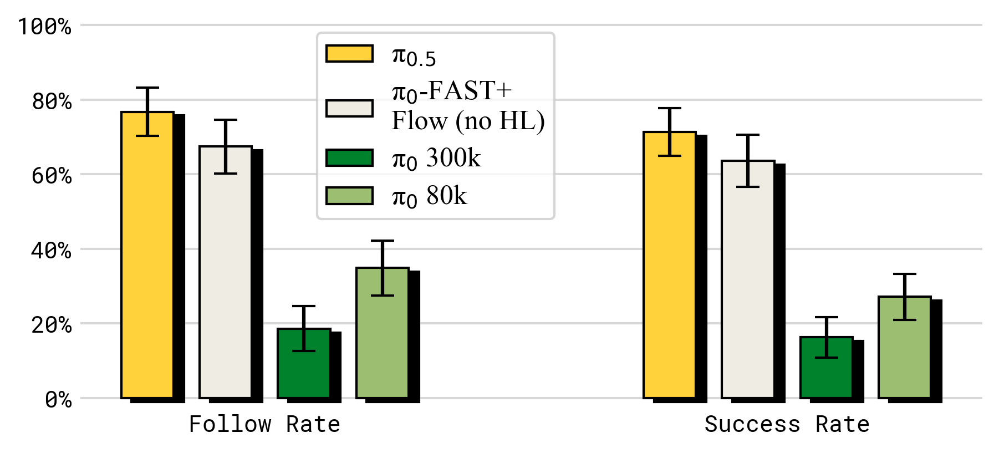 |
| 19 | `figures/overall_breakdown.png` | `P5_srcfig_19_overall_breakdown.png` | 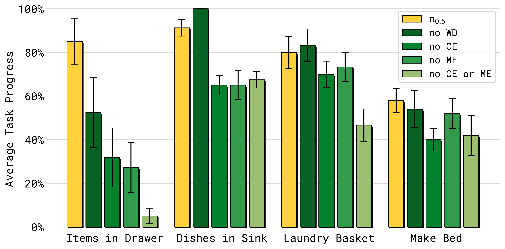 |
| 20 | `figures/HL_breakdowns.png` | `P5_srcfig_20_HL_breakdowns.png` | 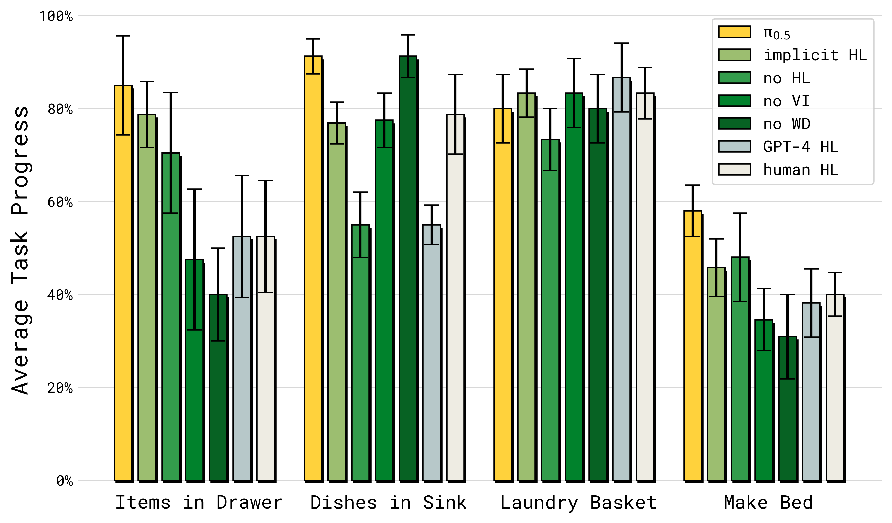 |
| 21 | `figures/attention_mask.png` | `P5_srcfig_21_attention_mask.png` |  |