# P6 Source Figures Manifest

이 파일은 arXiv/LaTeX source에서 추출한 원본 figure asset 목록이다.
PDF figure는 첫 페이지를 PNG preview로 렌더링했다.

| Order | LaTeX reference | Source asset | Preview |
|---:|---|---|---|
| 1 | `assets/sim_posttraining.pdf` | `P6_srcfig_01_sim_posttraining.pdf` | 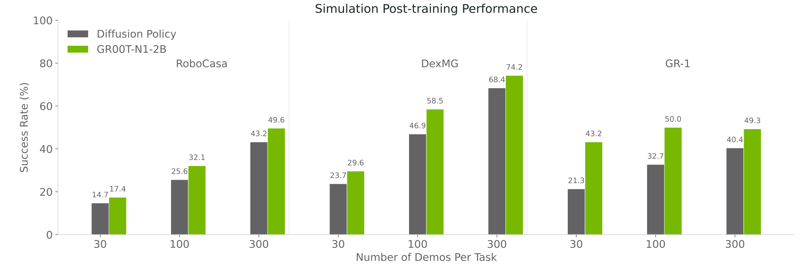 |
| 2 | `assets/gr1-pretraining-qualitative-examples.pdf` | `P6_srcfig_02_gr1-pretraining-qualitative-examples.pdf` | 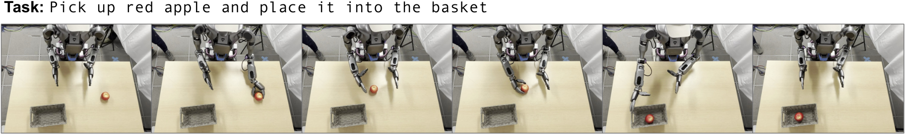 |
| 3 | `assets/gr1-qualitative-examples.pdf` | `P6_srcfig_03_gr1-qualitative-examples.pdf` | 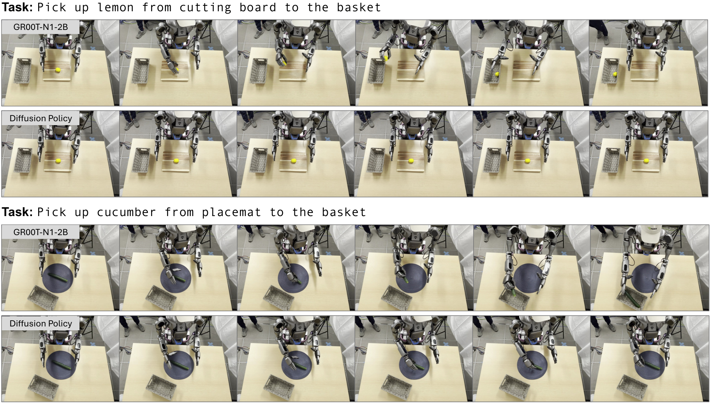 |
| 4 | `assets/appendix_dream.pdf` | `P6_srcfig_04_appendix_dream.pdf` | 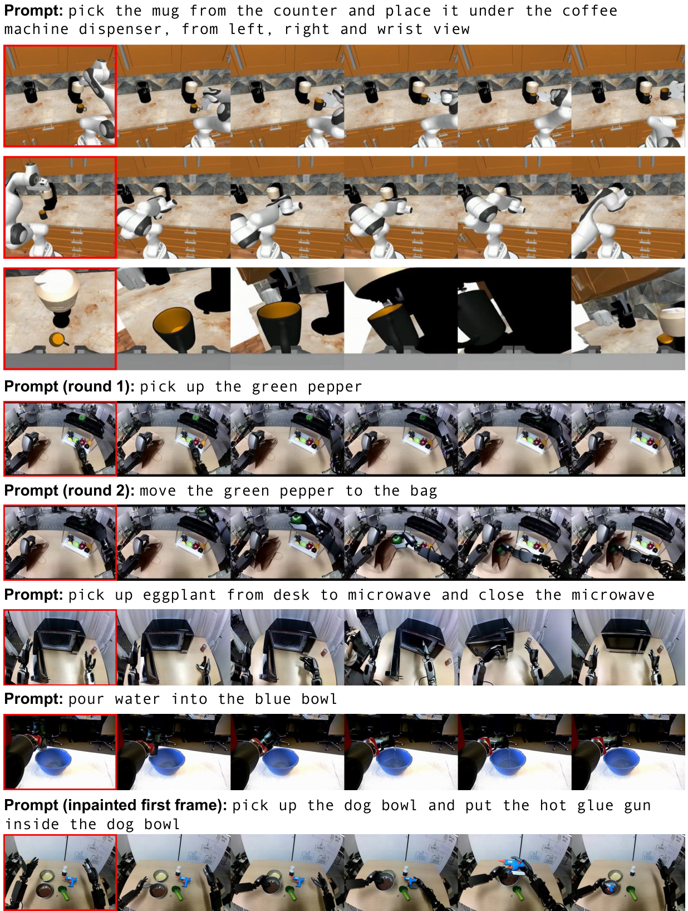 |
| 5 | `assets/human_video.pdf` | `P6_srcfig_05_human_video.pdf` | 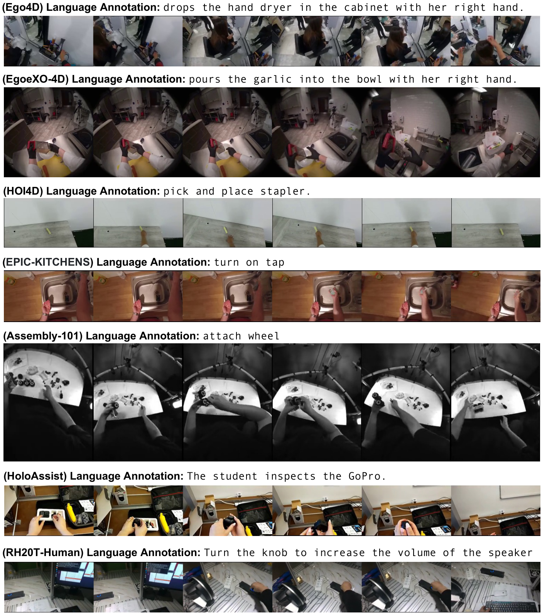 |
| 6 | `assets/qual_sim.pdf` | `P6_srcfig_06_qual_sim.pdf` | 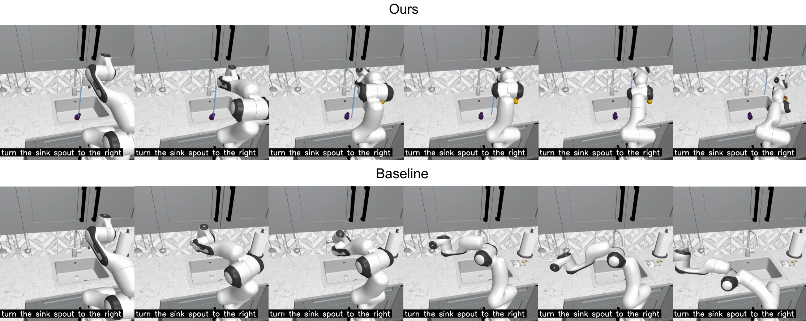 |
| 7 | `assets/multiview_dream1.pdf` | `missing` |  |
| 8 | `assets/multiview_dream2.pdf` | `missing` |  |
| 9 | `assets/multiview_dream3.pdf` | `missing` |  |
| 10 | `assets/groot-teleop.pdf` | `P6_srcfig_10_groot-teleop.pdf` | 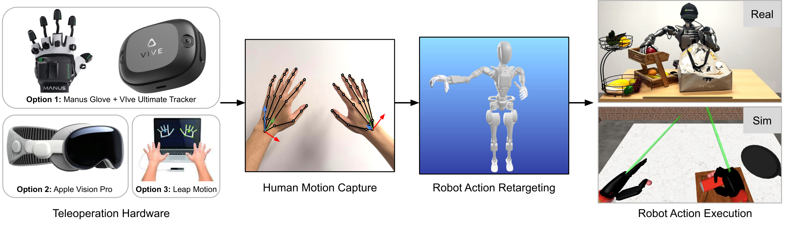 |
| 11 | `assets/simulation_tasks.pdf` | `missing` |  |
| 12 | `assets/fig_task_v4.pdf` | `missing` |  |
| 13 | `assets/fig_task_v5.pdf` | `missing` |  |
| 14 | `assets/fig_task_v6.pdf` | `P6_srcfig_14_fig_task_v6.pdf` | 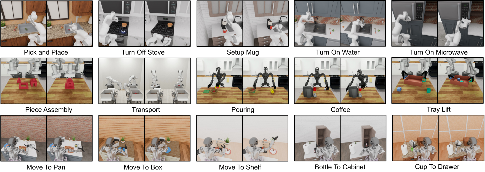 |
| 15 | `assets/real_gr1_task_figure.pdf` | `P6_srcfig_15_real_gr1_task_figure.pdf` | 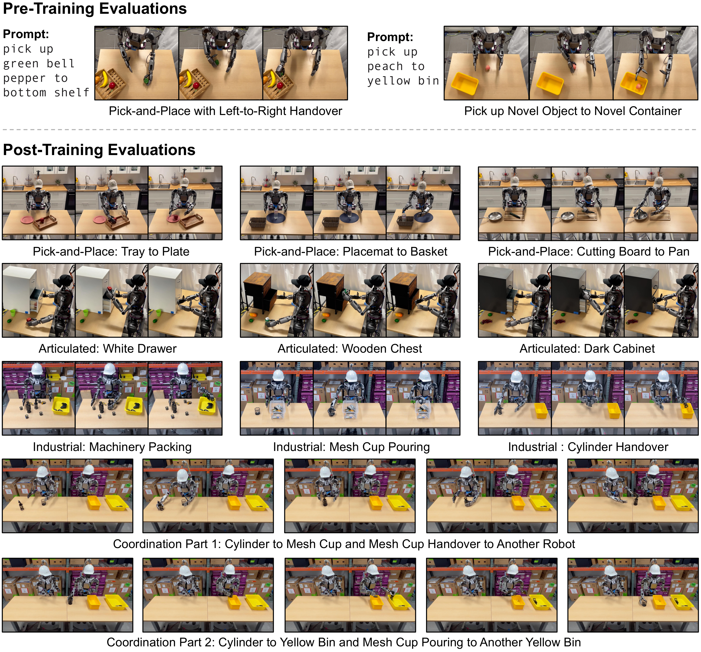 |
| 16 | `assets/zero_shot.pdf` | `P6_srcfig_16_zero_shot.pdf` | 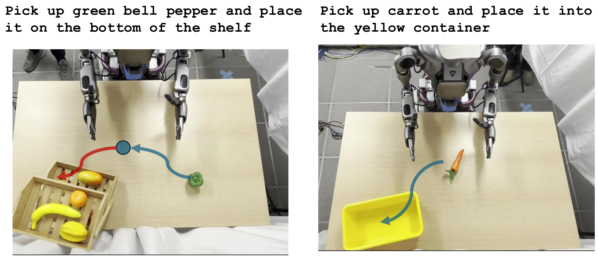 |
| 17 | `assets/real_gr1.pdf` | `P6_srcfig_17_real_gr1.pdf` | 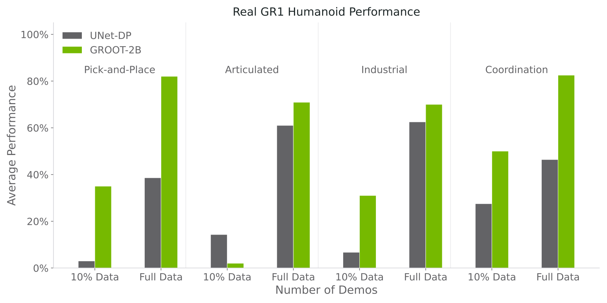 |
| 18 | `assets/dream_figure.pdf` | `P6_srcfig_18_dream_figure.pdf` | 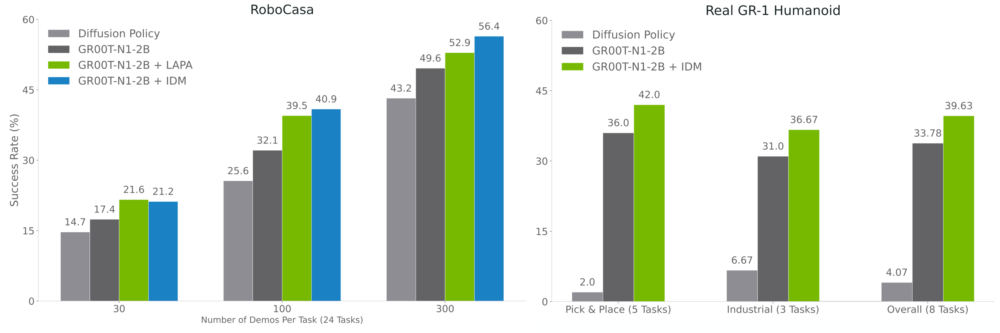 |
| 19 | `assets/data_pyramid.pdf` | `P6_srcfig_19_data_pyramid.pdf` |  |
| 20 | `assets/groot_inference_yuke_v2.pdf` | `P6_srcfig_20_groot_inference_yuke_v2.pdf` | 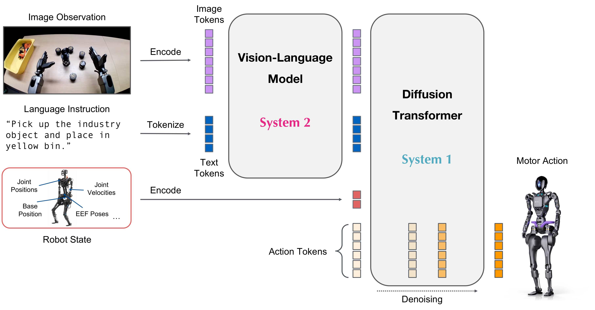 |
| 21 | `assets/groot_model_v6.pdf` | `P6_srcfig_21_groot_model_v6.pdf` |  |
| 22 | `assets/latent_action.pdf` | `P6_srcfig_22_latent_action.pdf` | 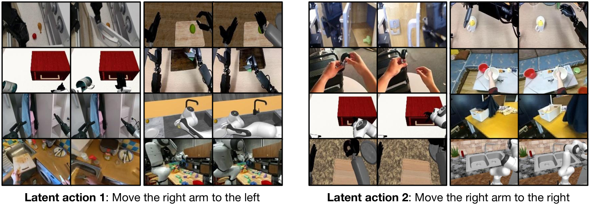 |
| 23 | `assets/dreams_0318.pdf` | `P6_srcfig_23_dreams_0318.pdf` |  |