# S3 Source Figures Manifest

이 파일은 arXiv/LaTeX source에서 추출한 원본 figure asset 목록이다.
PDF figure는 첫 페이지를 PNG preview로 렌더링했다.

| Order | LaTeX reference | Source asset | Preview |
|---:|---|---|---|
| 1 | `figures/1-agent-architecture.png` | `S3_srcfig_01_1-agent-architecture.png` |  |
| 2 | `figures/3-yann-agent-architecture.png` | `S3_srcfig_02_3-yann-agent-architecture.png` | 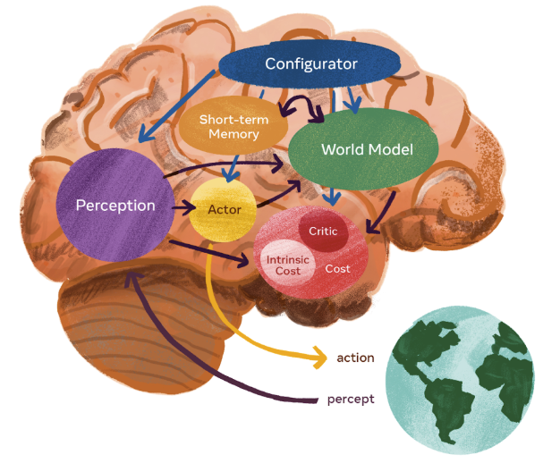 |
| 3 | `figures/vjepa2-mpc.pdf` | `S3_srcfig_03_vjepa2-mpc.pdf` | 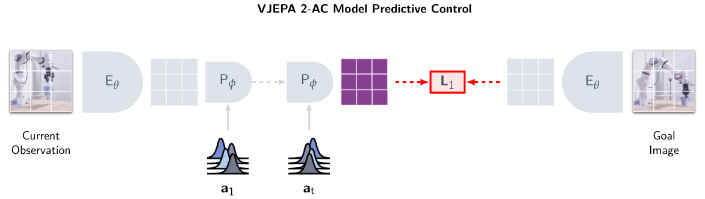 |
| 4 | `figures/3.1.2-VLWM.png` | `S3_srcfig_04_3.1.2-VLWM.png` |  |
| 5 | `figures/3.1.2-VLWM.pdf` | `missing` |  |
| 6 | `figures/3.1.2-mental-world-model.png` | `S3_srcfig_06_3.1.2-mental-world-model.png` | 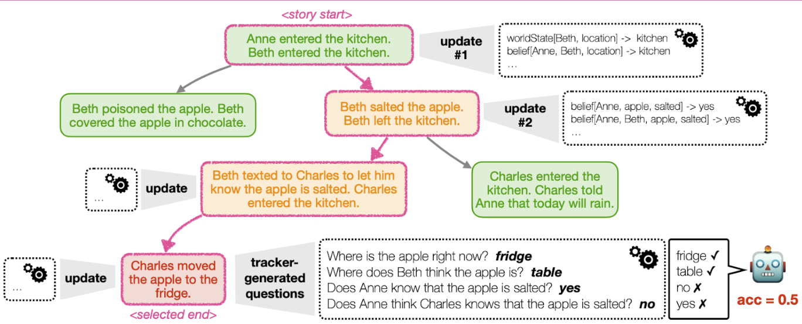 |
| 7 | `figures/3.6.1-video-minimal-pair.pdf` | `S3_srcfig_07_3.6.1-video-minimal-pair.pdf` | 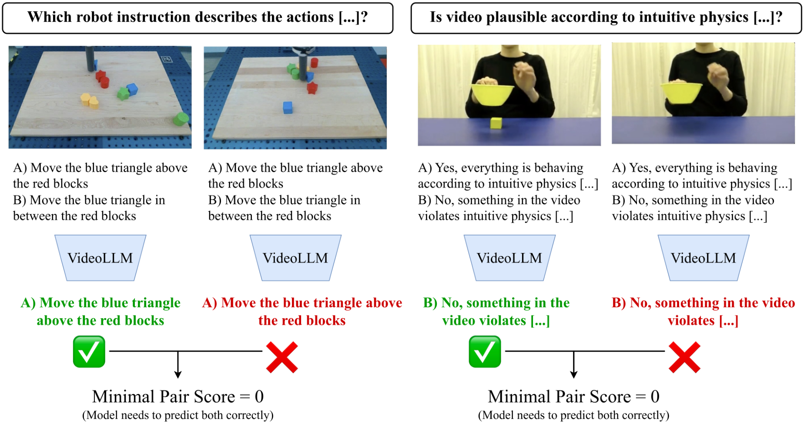 |
| 8 | `figures/3.6.2-IntPhys2.pdf` | `S3_srcfig_08_3.6.2-IntPhys2.pdf` | 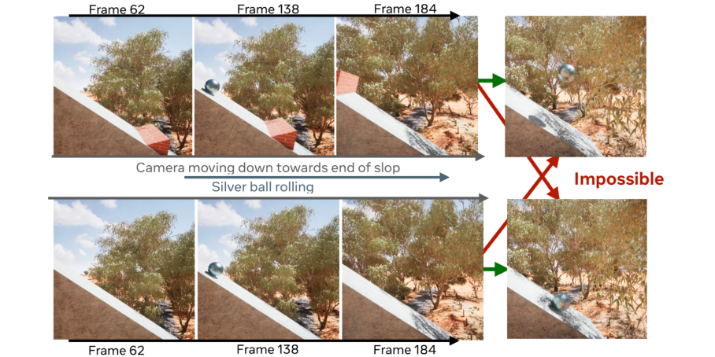 |
| 9 | `figures/3.6.3-CausalVQA.png` | `S3_srcfig_09_3.6.3-CausalVQA.png` | 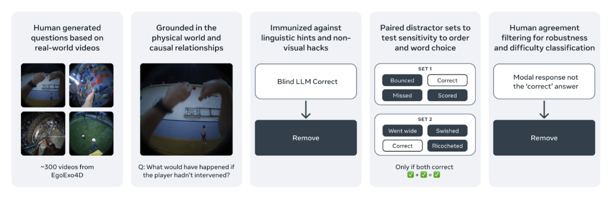 |
| 10 | `figures/3.6.4-WorldPrediction.pdf` | `S3_srcfig_10_3.6.4-WorldPrediction.pdf` | 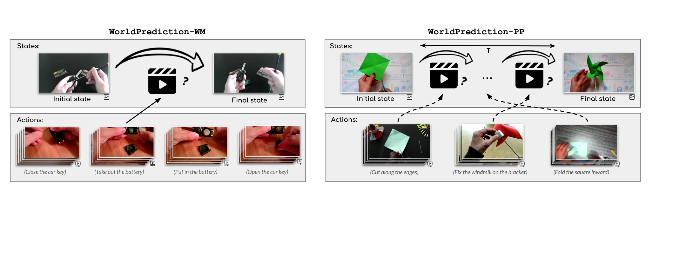 |
| 11 | `figures/4.2-speech-lm-motion.png` | `S3_srcfig_11_4.2-speech-lm-motion.png` |  |
| 12 | `figures/4.2-speech-lm-code-motion.png` | `S3_srcfig_12_4.2-speech-lm-code-motion.png` | 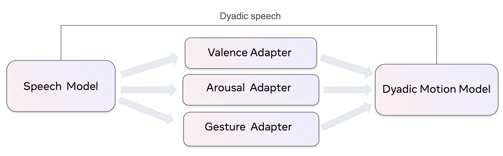 |
| 13 | `figures/4.2-motion.png` | `S3_srcfig_13_4.2-motion.png` | 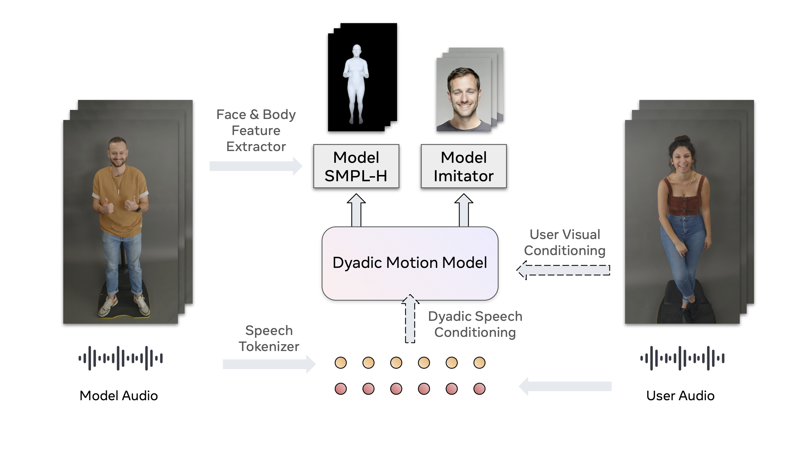 |
| 14 | `figures/5.2-wearable-agent-architecture.png` | `S3_srcfig_14_5.2-wearable-agent-architecture.png` | 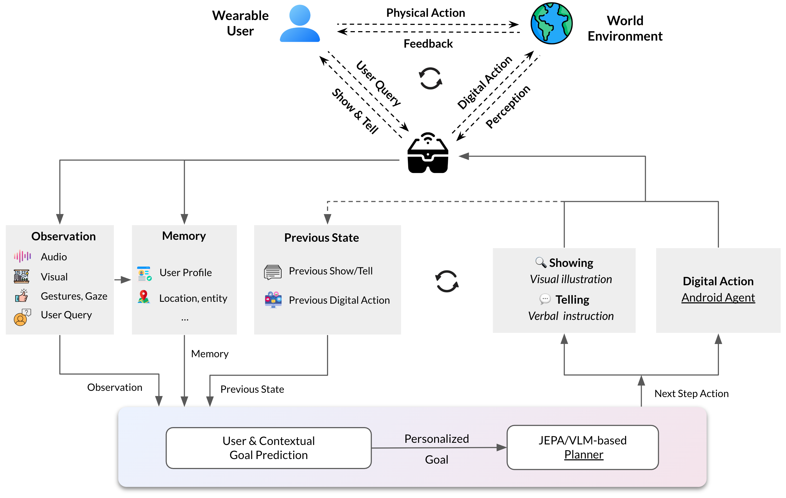 |
| 15 | `figures/5.3.1-goal-inference-benchmark.png` | `S3_srcfig_15_5.3.1-goal-inference-benchmark.png` | 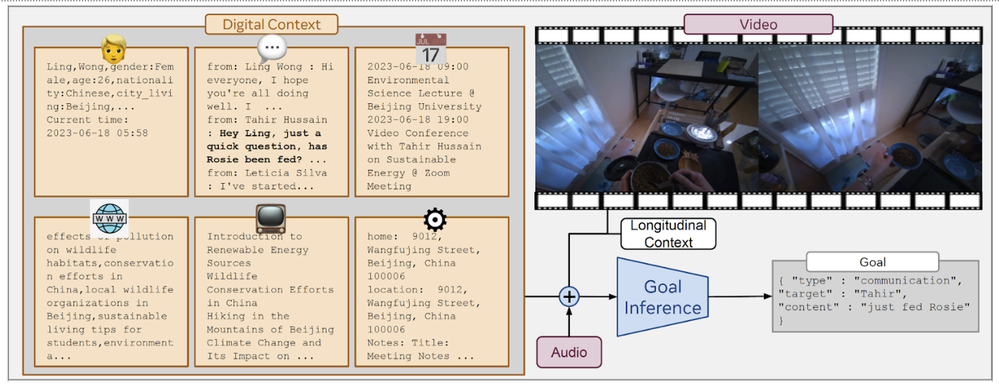 |
| 16 | `figures/5.3.2-WorldPrediction_actions.pdf` | `S3_srcfig_16_5.3.2-WorldPrediction_actions.pdf` | 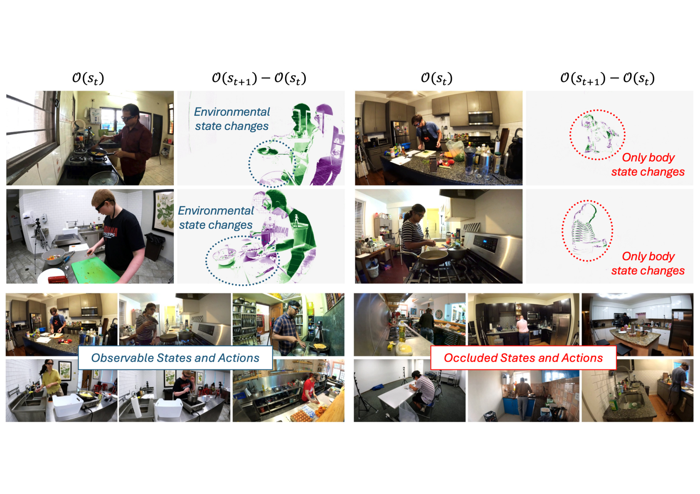 |
| 17 | `figures/6.2-robot-system-diagram2.png` | `S3_srcfig_17_6.2-robot-system-diagram2.png` | 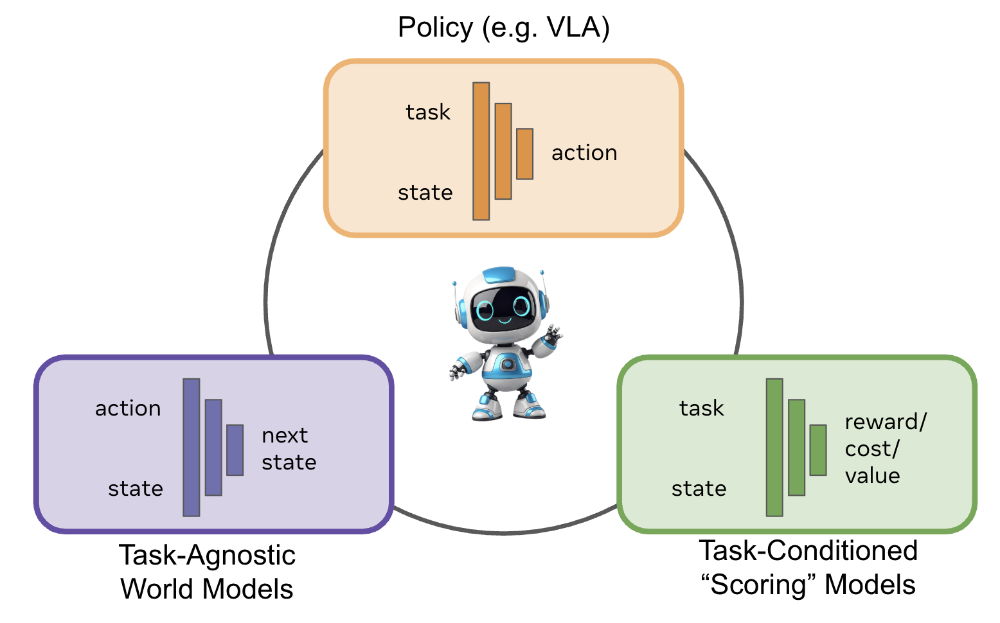 |
| 18 | `figures/6.1-embodied-taxonomy.png` | `S3_srcfig_18_6.1-embodied-taxonomy.png` | 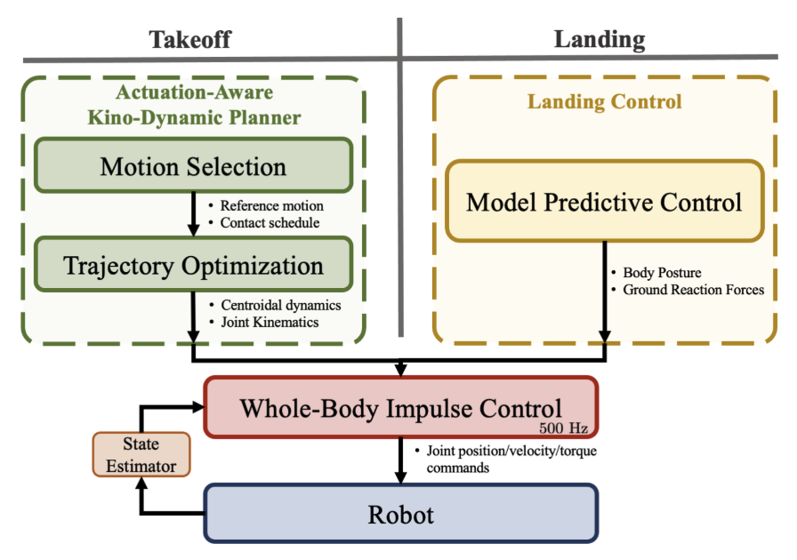 |
| 19 | `figures/7-system-a-b.png` | `S3_srcfig_19_7-system-a-b.png` | 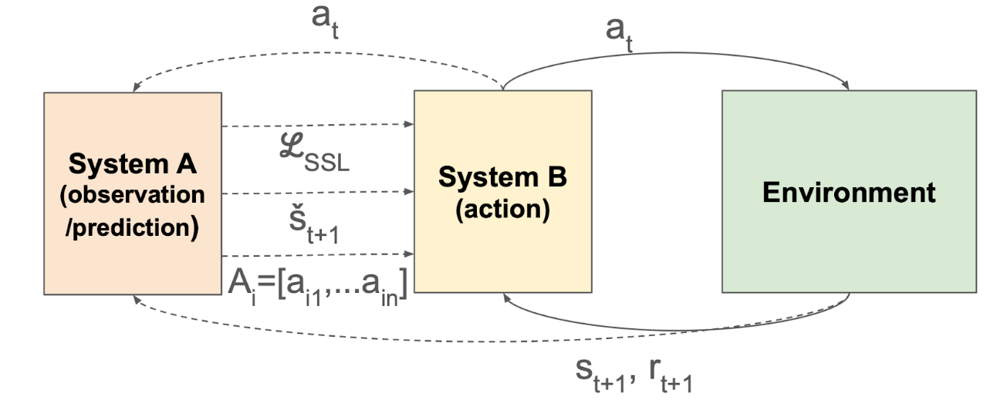 |
| 20 | `figures/8-multi-agent-system.png` | `S3_srcfig_20_8-multi-agent-system.png` | 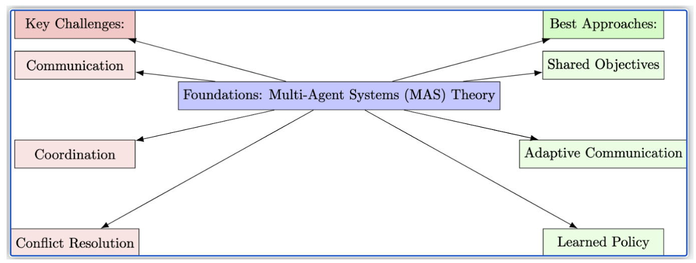 |