# V1 Source Figures Manifest

이 파일은 arXiv/LaTeX source에서 추출한 원본 figure asset 목록이다.
PDF figure는 첫 페이지를 PNG preview로 렌더링했다.

| Order | LaTeX reference | Source asset | Preview |
|---:|---|---|---|
| 1 | `figures/teaser-v8.pdf` | `V1_srcfig_01_teaser-v8.pdf` |  |
| 2 | `figures/method-V3.pdf` | `V1_srcfig_02_method-V3.pdf` |  |
| 3 | `figures/inference-V2.pdf` | `V1_srcfig_03_inference-V2.pdf` | 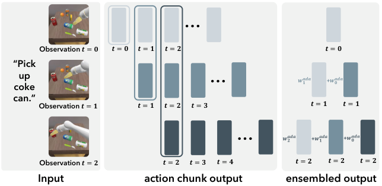 |
| 4 | `figures/task-realmanv2.pdf` | `V1_srcfig_04_task-realmanv2.pdf` | 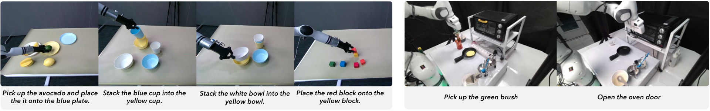 |
| 5 | `figures/real_man_robot_with_label.png` | `V1_srcfig_05_real_man_robot_with_label.png` | 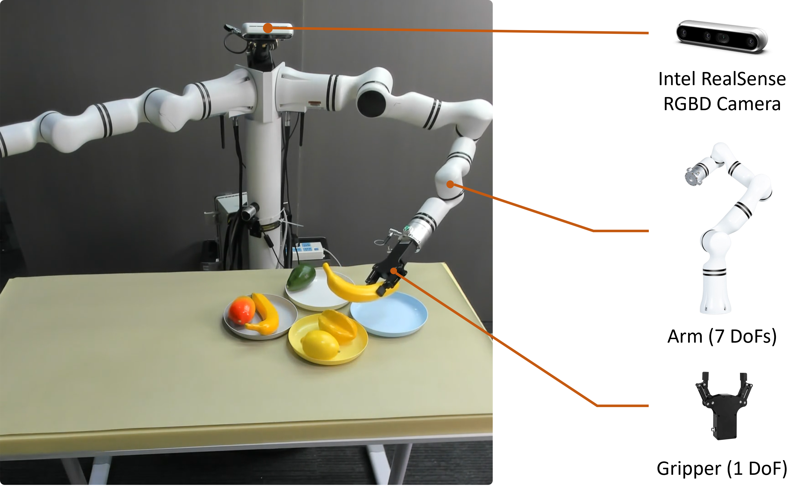 |
| 6 | `figures/franka_robot_with_label.png` | `V1_srcfig_06_franka_robot_with_label.png` | 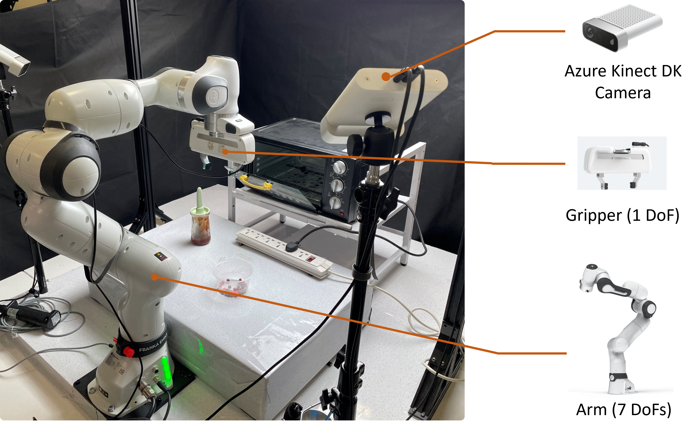 |
| 7 | `figures/seen_setting.pdf` | `V1_srcfig_07_seen_setting.pdf` | 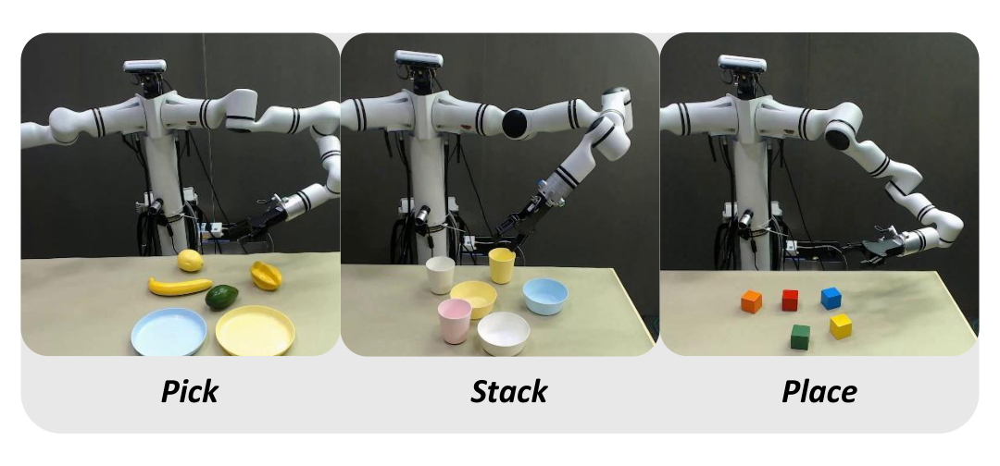 |
| 8 | `figures/unseen_setting.pdf` | `V1_srcfig_08_unseen_setting.pdf` | 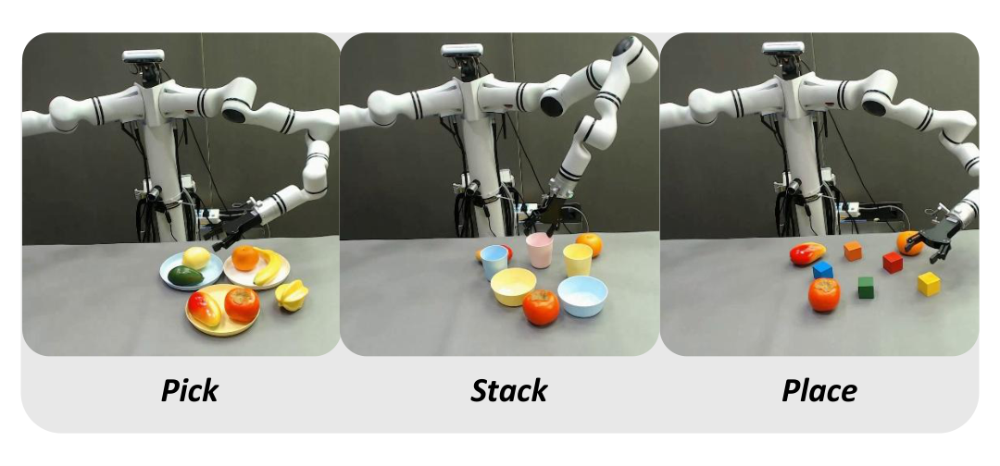 |
| 9 | `figures/google_robot_visual_video.pdf` | `V1_srcfig_09_google_robot_visual_video.pdf` | 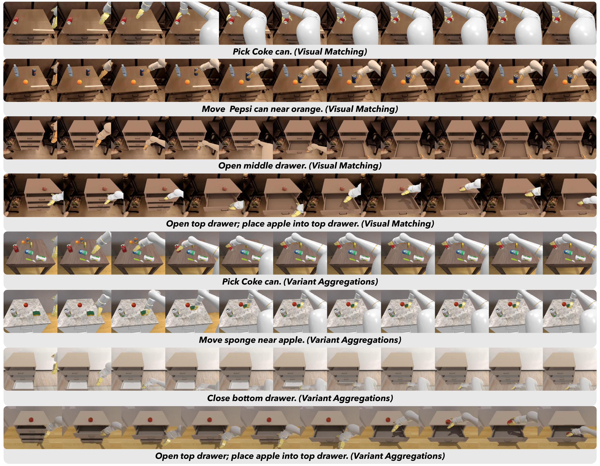 |
| 10 | `figures/widowx_visual_video.pdf` | `V1_srcfig_10_widowx_visual_video.pdf` | 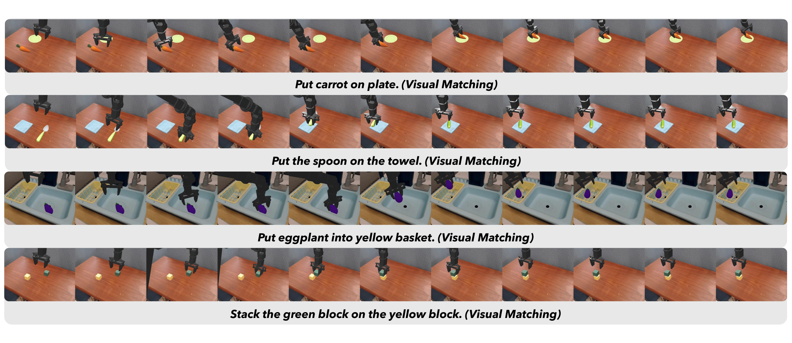 |
| 11 | `figures/realman_eval.pdf` | `V1_srcfig_11_realman_eval.pdf` | 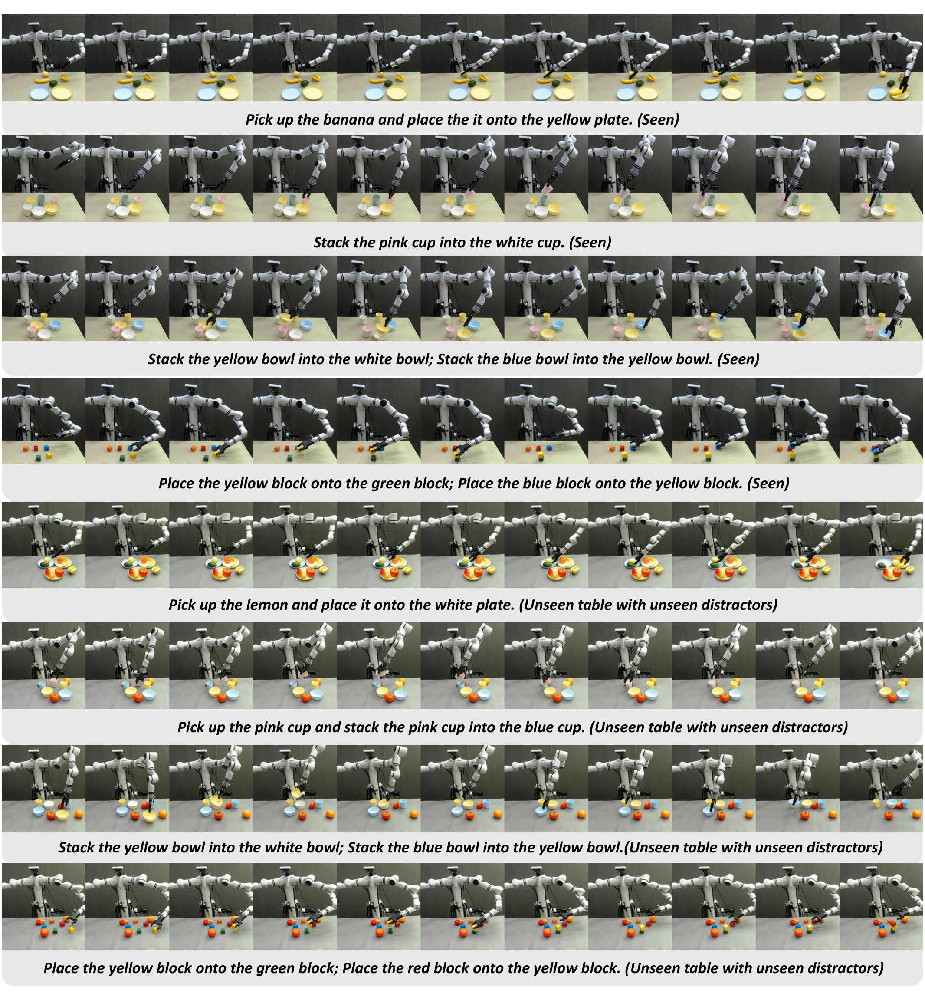 |
| 12 | `figures/realman_more_visual.pdf` | `V1_srcfig_12_realman_more_visual.pdf` | 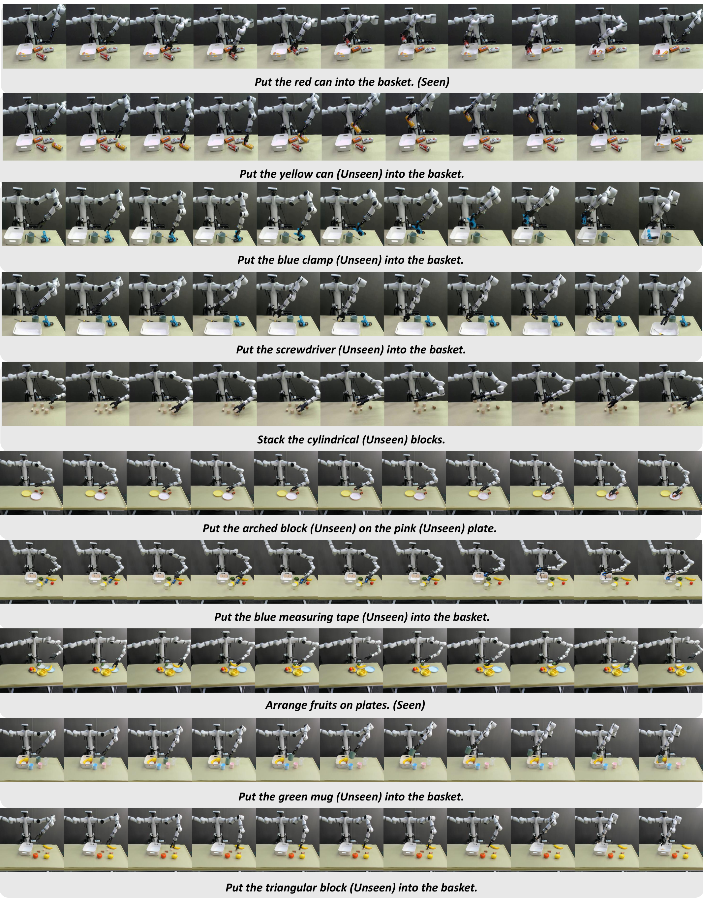 |
| 13 | `figures/franka_robot_eval.pdf` | `V1_srcfig_13_franka_robot_eval.pdf` | 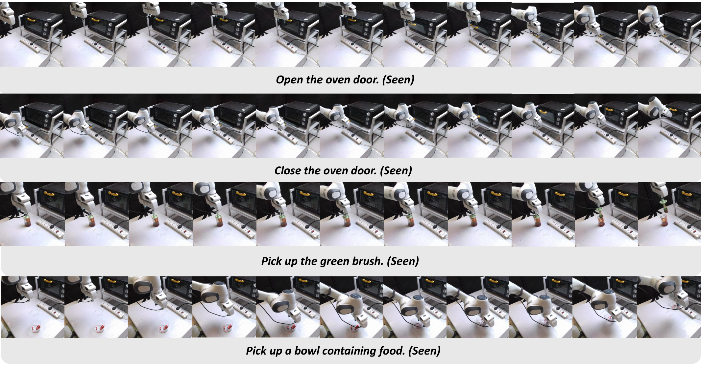 |
