# V2 Source Figures Manifest

이 파일은 arXiv/LaTeX source에서 추출한 원본 figure asset 목록이다.
PDF figure는 첫 페이지를 PNG preview로 렌더링했다.

| Order | LaTeX reference | Source asset | Preview |
|---:|---|---|---|
| 1 | `sec/figures/divla_framework.pdf` | `V2_srcfig_01_divla_framework.pdf` | 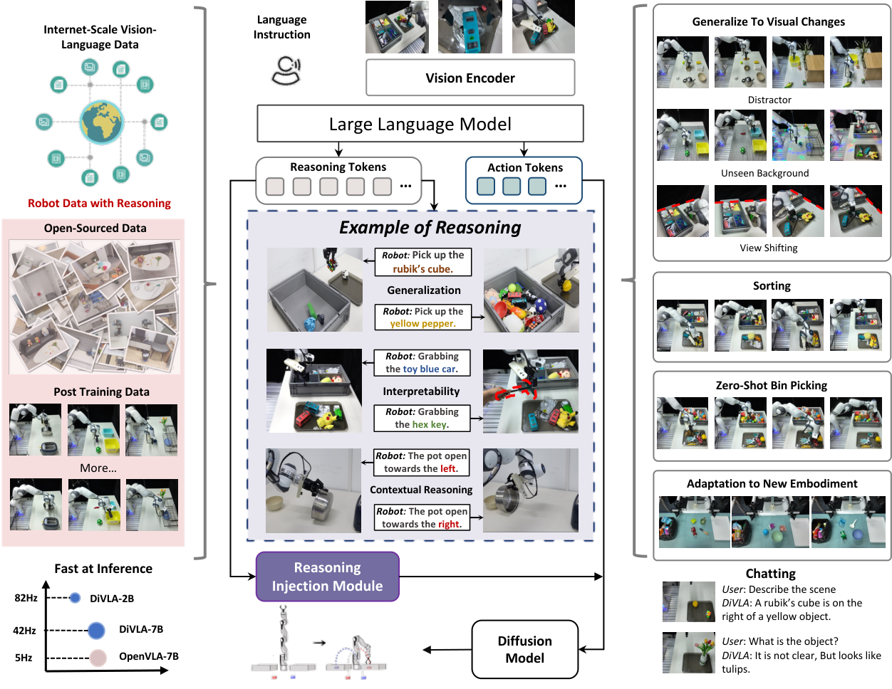 |
| 2 | `sec/figures/divla_sorting_2.pdf` | `V2_srcfig_02_divla_sorting_2.pdf` |  |
| 3 | `sec/figures/bin_sorting_results.pdf` | `V2_srcfig_03_bin_sorting_results.pdf` | 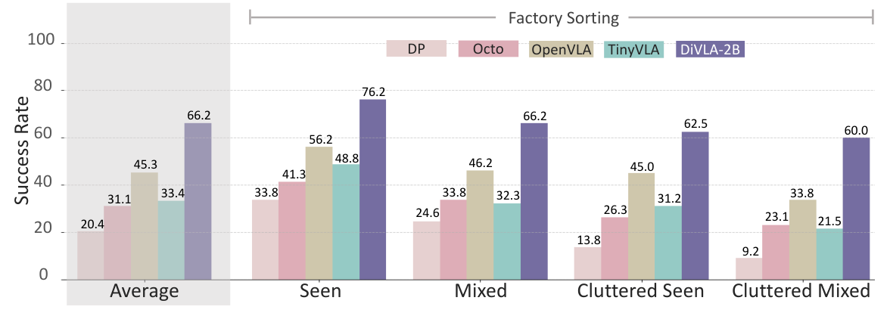 |
| 4 | `sec/figures/bin_picking_results.pdf` | `V2_srcfig_04_bin_picking_results.pdf` |  |
| 5 | `sec/figures/visual_change_example.pdf` | `V2_srcfig_05_visual_change_example.pdf` | 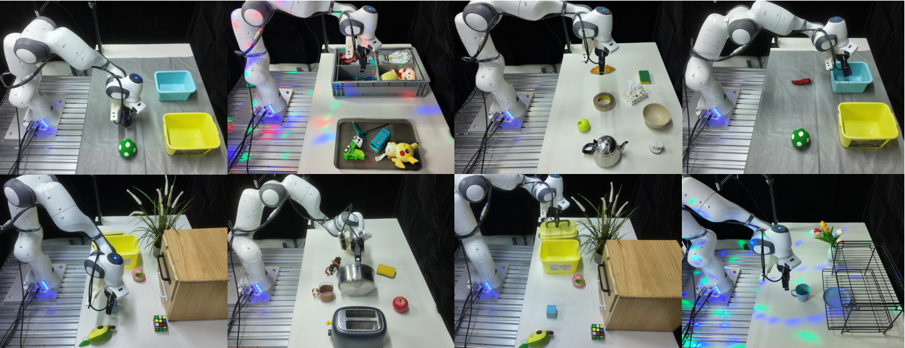 |
| 6 | `sec/figures/divla_reasoning.pdf` | `V2_srcfig_06_divla_reasoning.pdf` | 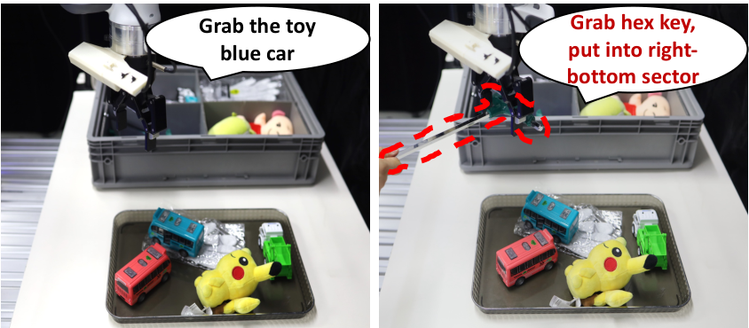 |
| 7 | `sec/figures/unseen_objects.pdf` | `V2_srcfig_07_unseen_objects.pdf` | 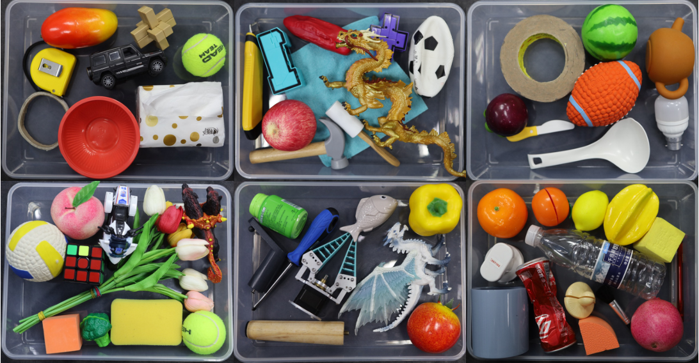 |
| 8 | `sec/figures/divla_size.pdf` | `V2_srcfig_08_divla_size.pdf` |  |
| 9 | `sec/figures/divla_bimanual_robot.pdf` | `V2_srcfig_09_divla_bimanual_robot.pdf` | 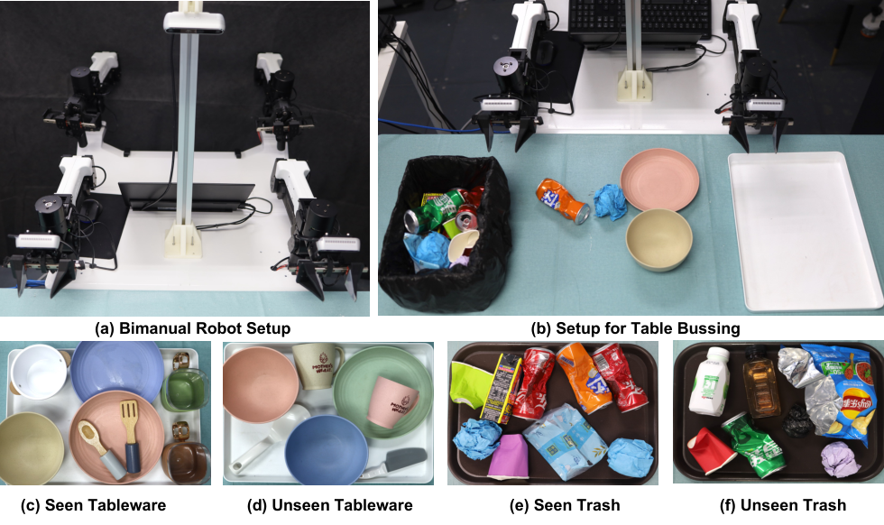 |
| 10 | `sec/figures/all_task_multi_task.pdf` | `V2_srcfig_10_all_task_multi_task.pdf` | 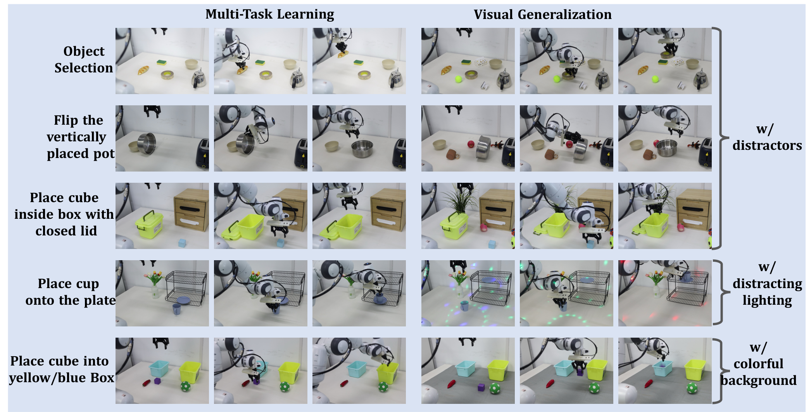 |
| 11 | `sec/figures/all_task_franka_and_aloha.pdf` | `V2_srcfig_11_all_task_franka_and_aloha.pdf` | 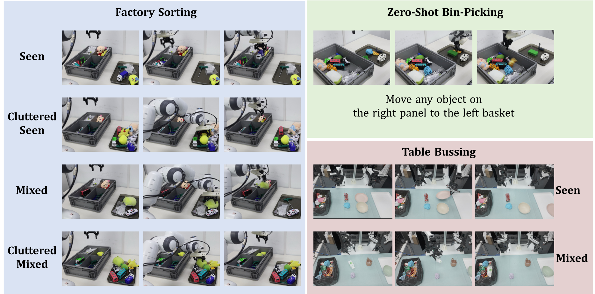 |
| 12 | `sec/figures/view_shift.pdf` | `V2_srcfig_12_view_shift.pdf` | 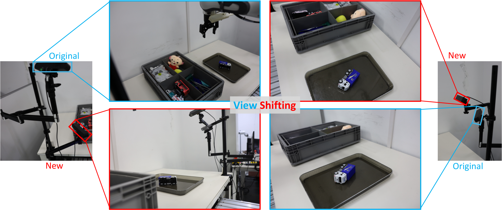 |
| 13 | `sec/figures/dragon.png` | `V2_srcfig_13_dragon.png` | 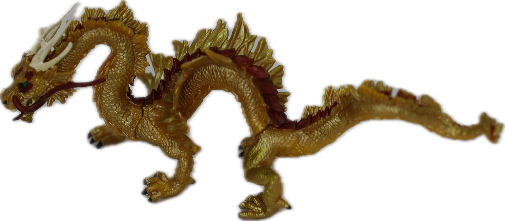 |
| 14 | `sec/figures/tulip.png` | `V2_srcfig_14_tulip.png` | 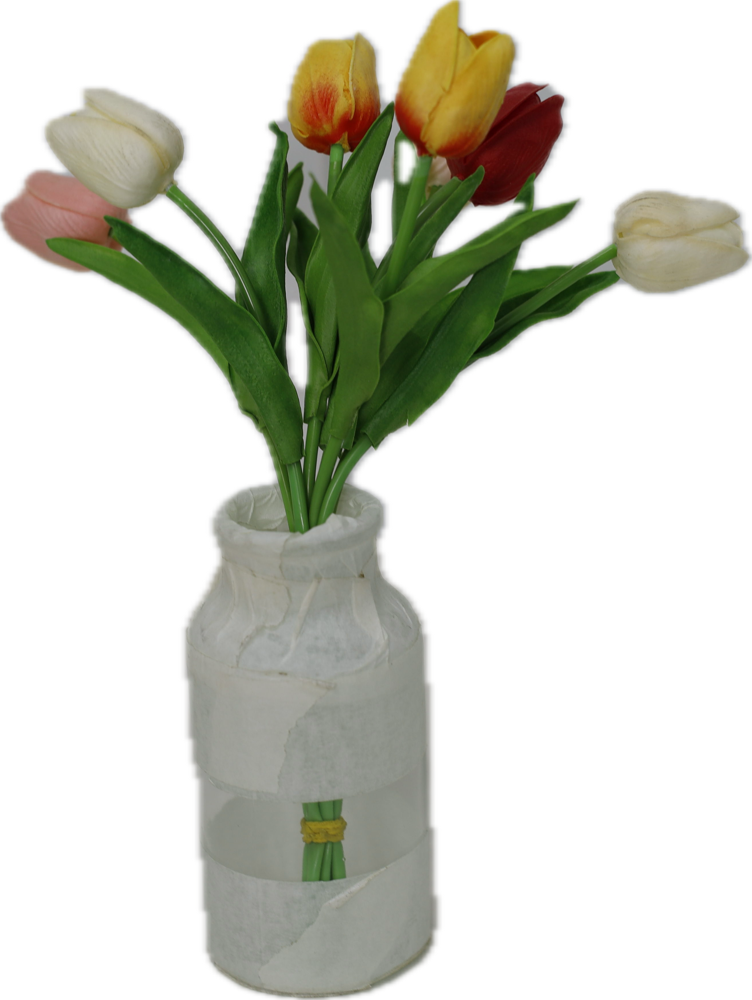 |
| 15 | `sec/figures/orange` | `V2_srcfig_15_orange.png` | 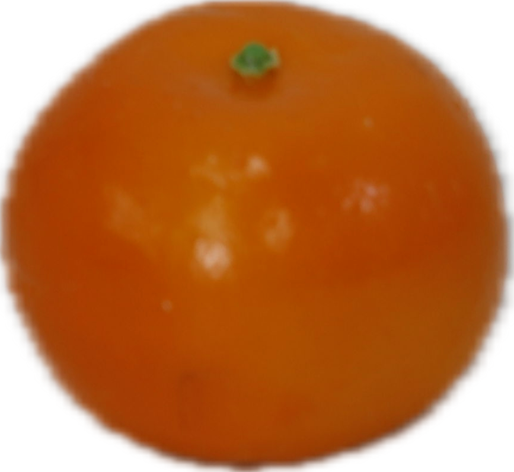 |
| 16 | `sec/figures/brown_cat.png` | `V2_srcfig_16_brown_cat.png` | 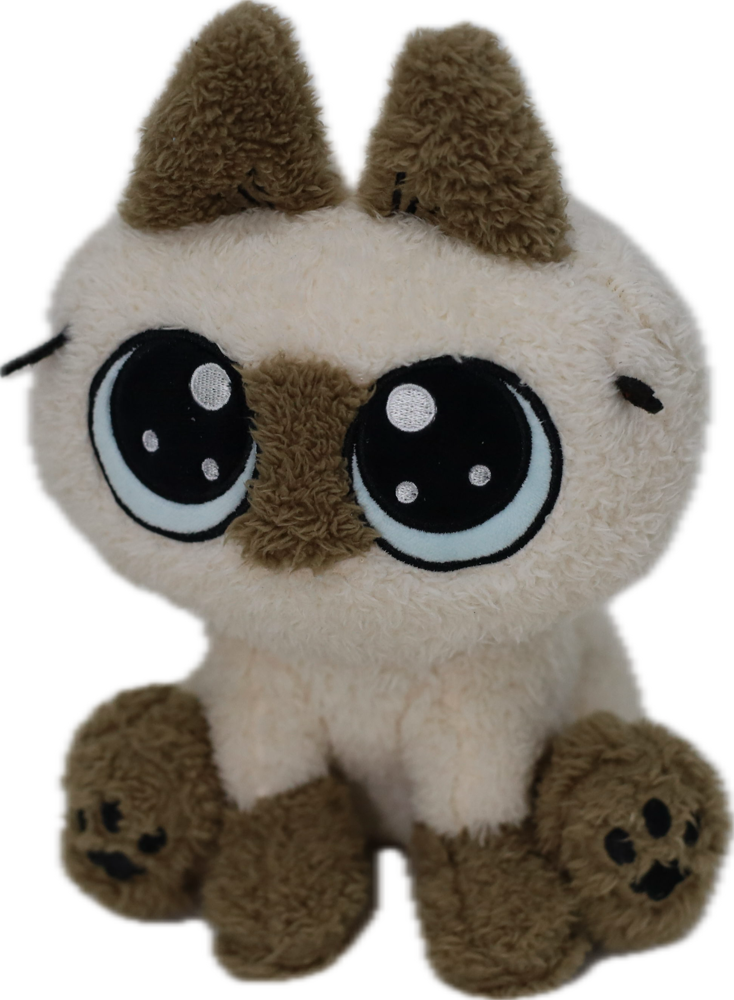 |
| 17 | `sec/figures/blue_ball.png` | `V2_srcfig_17_blue_ball.png` | 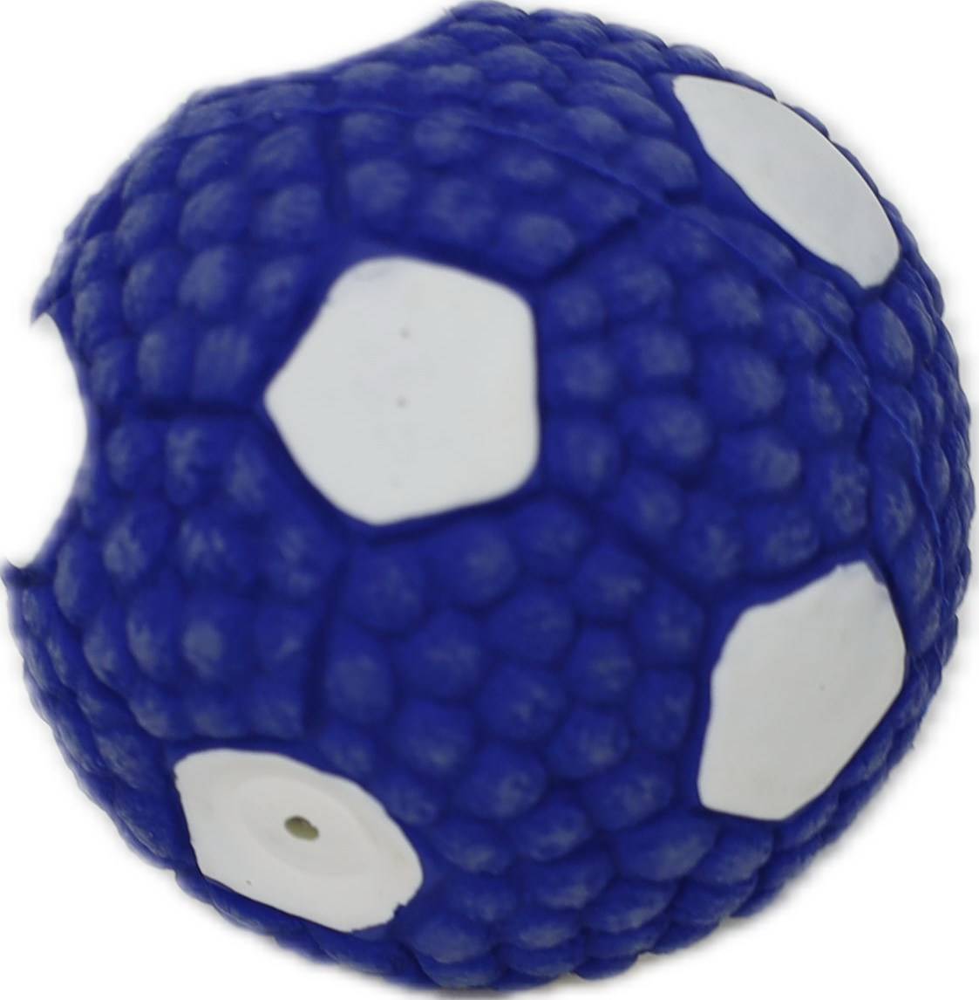 |
| 18 | `sec/figures/tennis.png` | `V2_srcfig_18_tennis.png` | 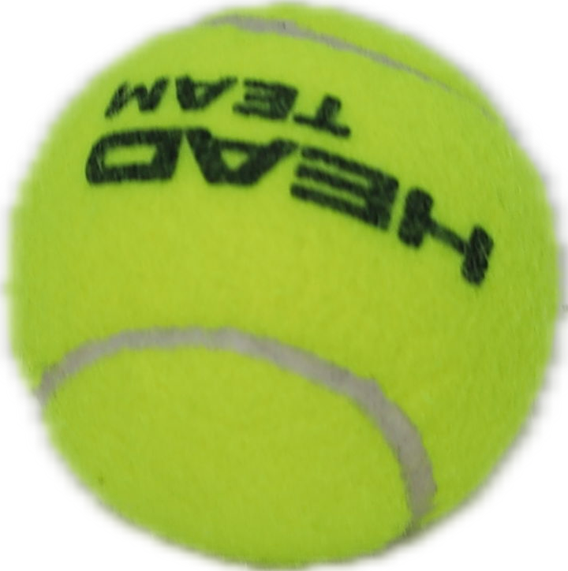 |
| 19 | `sec/figures/vqa_scene1.jpg` | `V2_srcfig_19_vqa_scene1.jpg` | 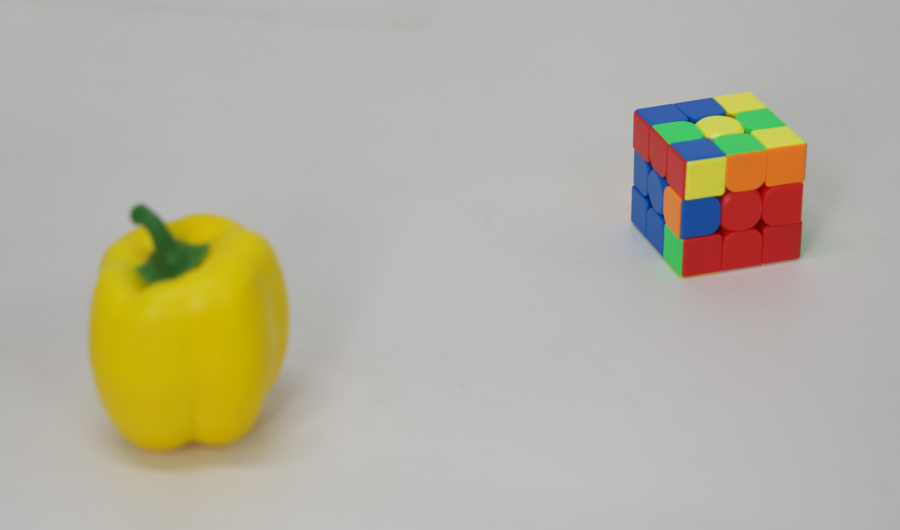 |
| 20 | `sec/figures/vqa_scene2.jpg` | `V2_srcfig_20_vqa_scene2.jpg` | 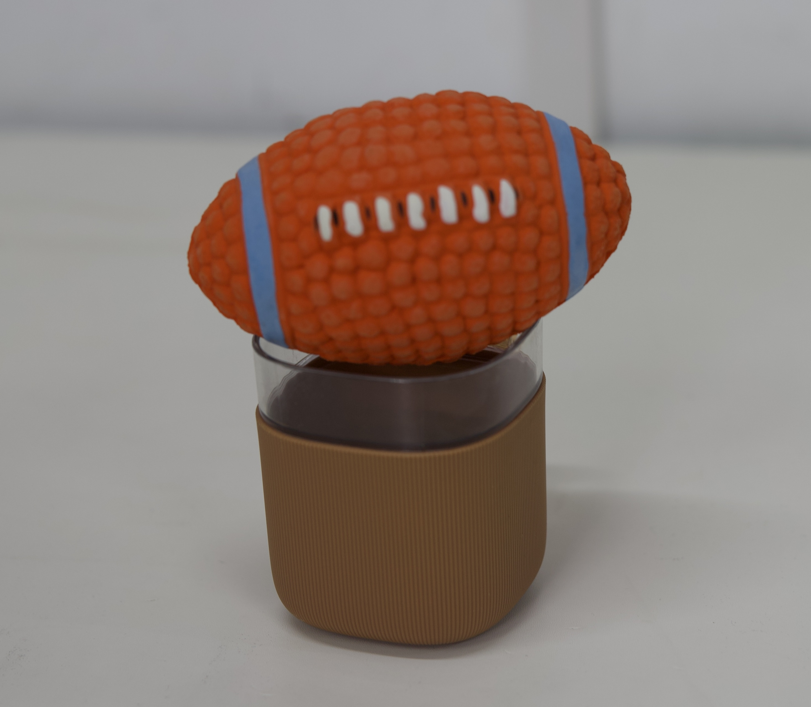 |
