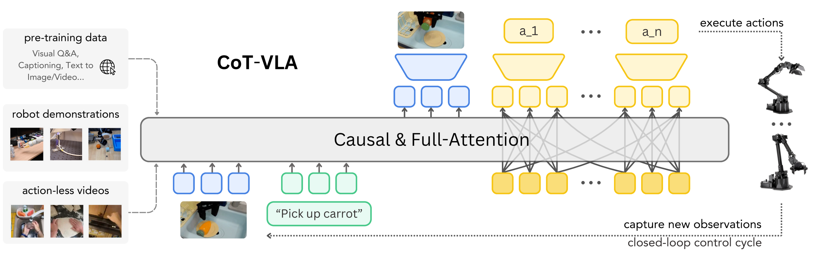
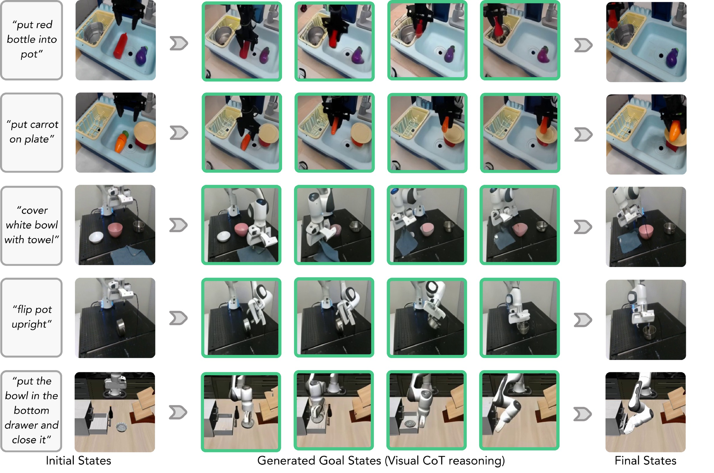

# V3 Source Figures Manifest

이 파일은 arXiv/LaTeX source에서 추출한 원본 figure asset 목록이다.
PDF figure는 첫 페이지를 PNG preview로 렌더링했다.

| Order | LaTeX reference | Source asset | Preview |
|---:|---|---|---|
| 1 | `figure/teaser.pdf` | `V3_srcfig_01_teaser.pdf` |  |
| 2 | `figure/method.pdf` | `V3_srcfig_02_method.pdf` |  |
| 3 | `figure/attention.pdf` | `V3_srcfig_03_attention.pdf` |  |
| 4 | `figure/franka.pdf` | `V3_srcfig_04_franka.pdf` |  |
| 5 | `figure/rollout.pdf` | `V3_srcfig_05_rollout.pdf` |  |
| 6 | `figure/ablation.pdf` | `V3_srcfig_06_ablation.pdf` |  |
