# V4 Source Figures Manifest

이 파일은 arXiv/LaTeX source에서 추출한 원본 figure asset 목록이다.
PDF figure는 첫 페이지를 PNG preview로 렌더링했다.

| Order | LaTeX reference | Source asset | Preview |
|---:|---|---|---|
| 1 | `figure/head.pdf` | `V4_srcfig_01_head.pdf` |  |
| 2 | `figure/head_anon.pdf` | `V4_srcfig_02_head_anon.pdf` | 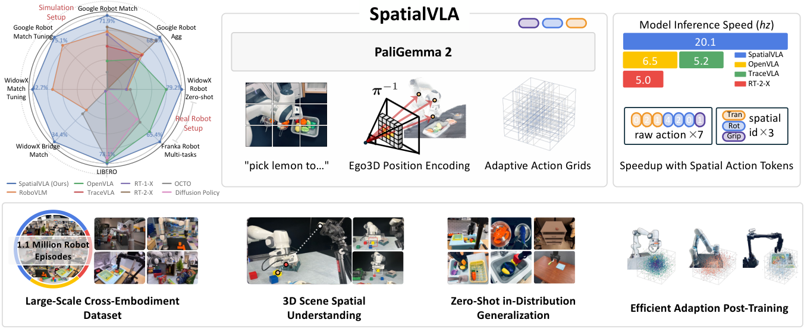 |
| 3 | `figure/logo_crop.png` | `V4_srcfig_03_logo_crop.png` |  |
| 4 | `figure/complex_task.pdf` | `V4_srcfig_04_complex_task.pdf` | 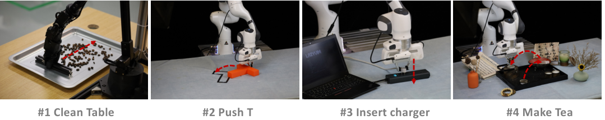 |
| 5 | `figure/depth.pdf` | `V4_srcfig_05_depth.pdf` | 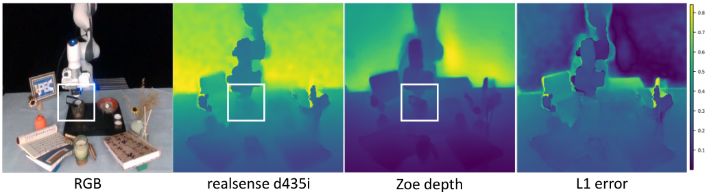 |
| 6 | `./figures/head.pdf` | `V4_srcfig_06_head.pdf` |  |
| 7 | `figure/pipeline.pdf` | `V4_srcfig_07_pipeline.pdf` | 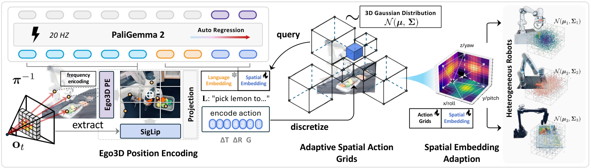 |
| 8 | `figure/action_grids.pdf` | `V4_srcfig_08_action_grids.pdf` | 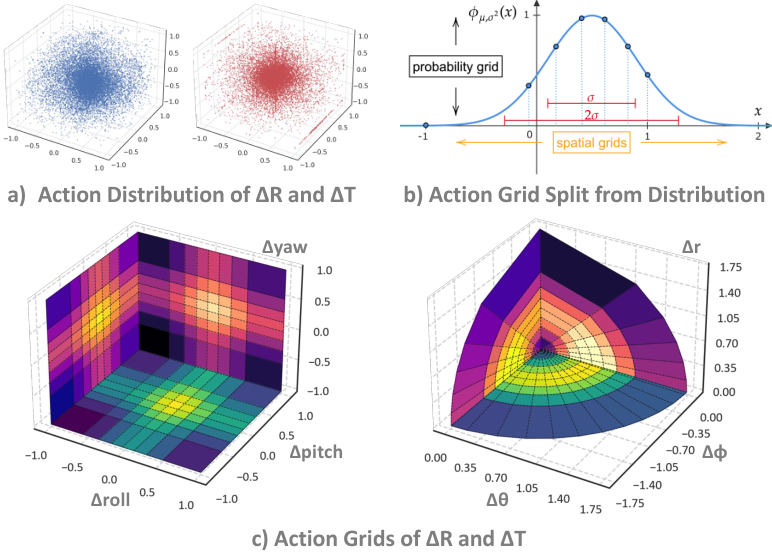 |
| 9 | `figure/experinment_overview.pdf` | `V4_srcfig_09_experinment_overview.pdf` |  |
| 10 | `figure/experinment_overview_anon.pdf` | `V4_srcfig_10_experinment_overview_anon.pdf` | 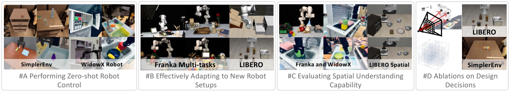 |
| 11 | `figure/windowx_zeroshot.pdf` | `V4_srcfig_11_windowx_zeroshot.pdf` |  |
| 12 | `figure/franka_robo_sft.pdf` | `V4_srcfig_12_franka_robo_sft.pdf` | 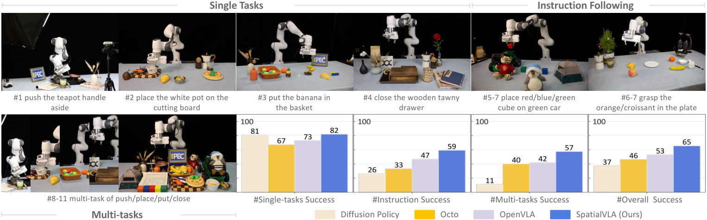 |
| 13 | `figure/franka_sft_anon.pdf` | `V4_srcfig_13_franka_sft_anon.pdf` | 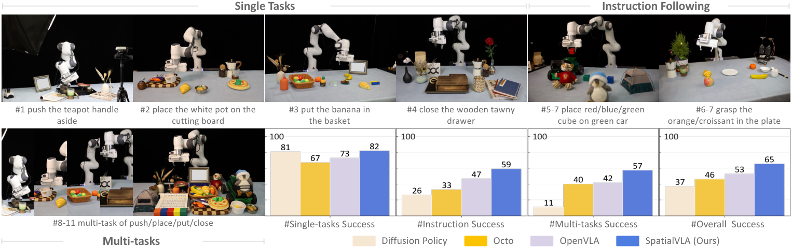 |
| 14 | `figure/spatial_setup.pdf` | `V4_srcfig_14_spatial_setup.pdf` |  |
| 15 | `figure/emb_adpt.pdf` | `V4_srcfig_15_emb_adpt.pdf` |  |
| 16 | `figure/dataset_pie.pdf` | `V4_srcfig_16_dataset_pie.pdf` | 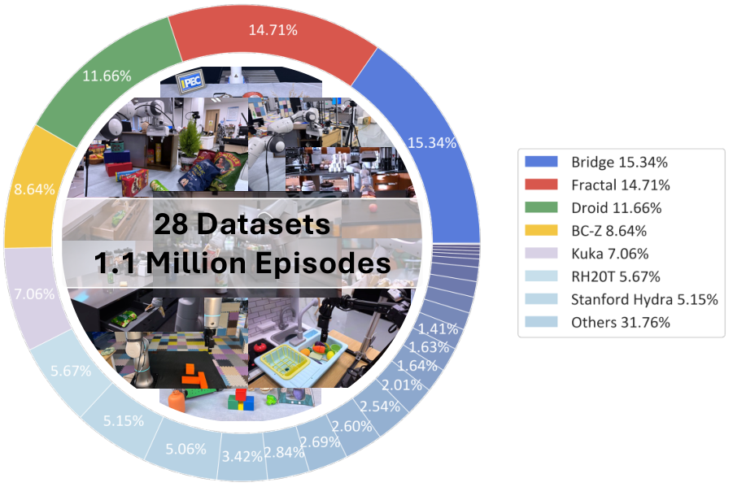 |
| 17 | `figure/dataset_mixture_anon.pdf` | `V4_srcfig_17_dataset_mixture_anon.pdf` | 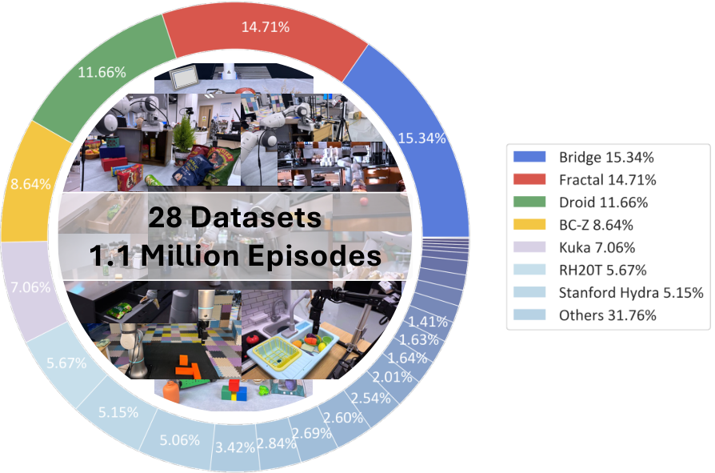 |
| 18 | `figure/train_accuracy` | `V4_srcfig_18_train_accuracy.pdf` | 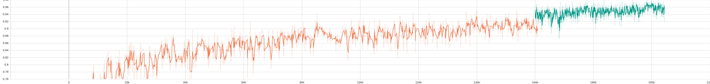 |
| 19 | `figure/train_loss` | `V4_srcfig_19_train_loss.pdf` | 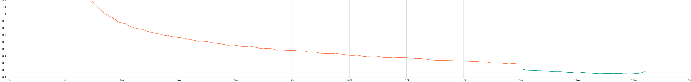 |
| 20 | `figure/dataset_supp.pdf` | `V4_srcfig_20_dataset_supp.pdf` | 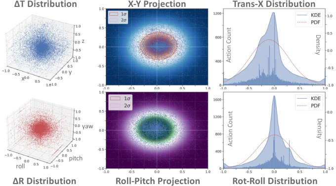 |
