# V5 Source Figures Manifest

이 파일은 arXiv/LaTeX source에서 추출한 원본 figure asset 목록이다.
PDF figure는 첫 페이지를 PNG preview로 렌더링했다.

| Order | LaTeX reference | Source asset | Preview |
|---:|---|---|---|
| 1 | `images/intro_v6.pdf` | `V5_srcfig_01_intro_v6.pdf` | 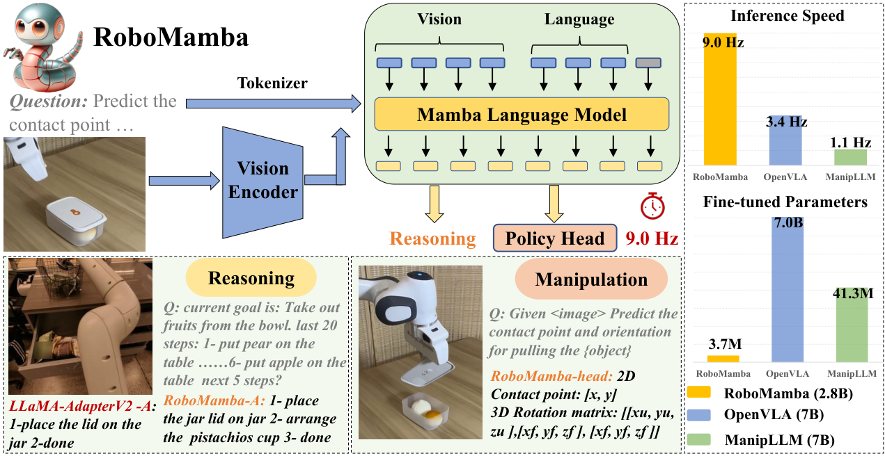 |
| 2 | `images/frame_v2.pdf` | `V5_srcfig_02_frame_v2.pdf` | 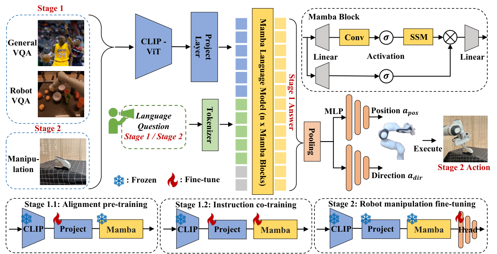 |
| 3 | `./images/icon/safe.png` | `V5_srcfig_03_safe.png` | 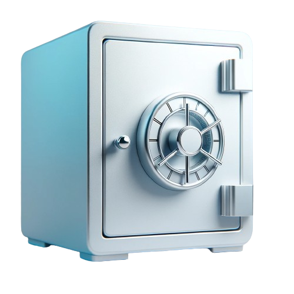 |
| 4 | `./images/icon/door.png` | `V5_srcfig_04_door.png` | 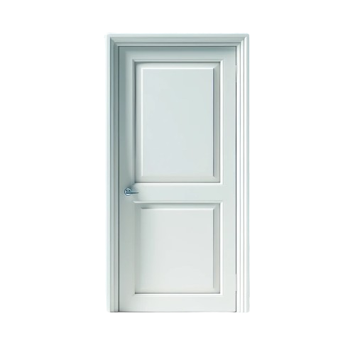 |
| 5 | `./images/icon/display.png` | `V5_srcfig_05_display.png` | 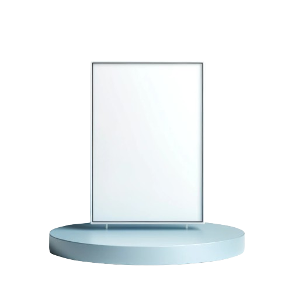 |
| 6 | `./images/icon/refrigerator.png` | `V5_srcfig_06_refrigerator.png` | 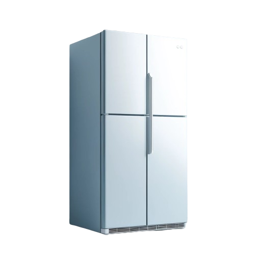 |
| 7 | `./images/icon/laptop.png` | `V5_srcfig_07_laptop.png` | 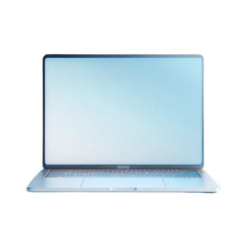 |
| 8 | `./images/icon/lighter.png` | `V5_srcfig_08_lighter.png` | 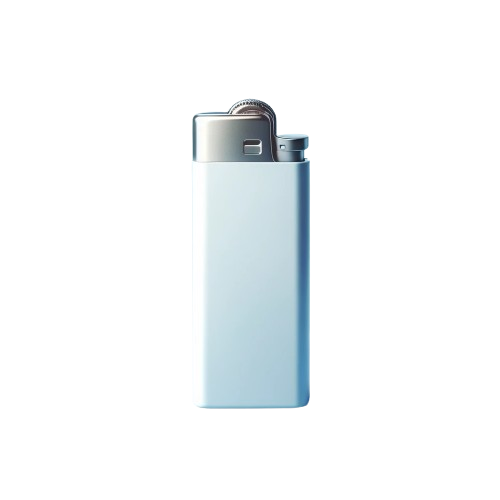 |
| 9 | `./images/icon/microwave.png` | `V5_srcfig_09_microwave.png` | 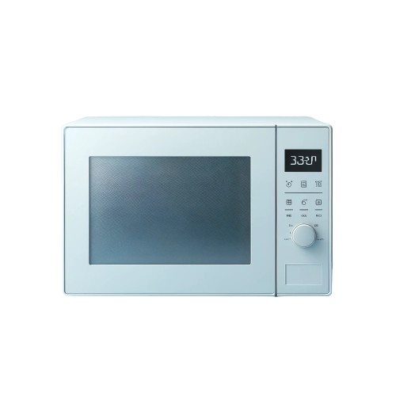 |
| 10 | `./images/icon/mouse.png` | `V5_srcfig_10_mouse.png` |  |
| 11 | `./images/icon/box.png` | `V5_srcfig_11_box.png` | 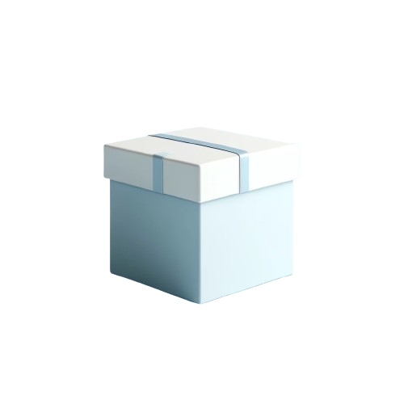 |
| 12 | `./images/icon/trash_can.png` | `V5_srcfig_12_trash_can.png` | 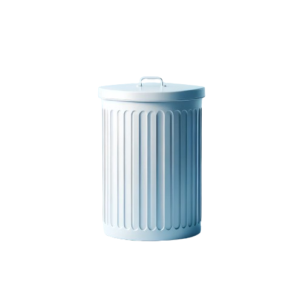 |
| 13 | `./images/icon/kitchen_pot.png` | `V5_srcfig_13_kitchen_pot.png` | 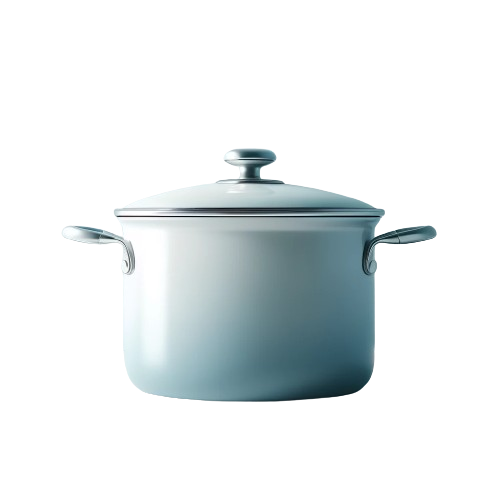 |
| 14 | `./images/icon/suitcase.png` | `V5_srcfig_14_suitcase.png` | 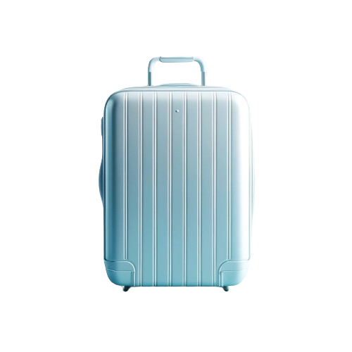 |
| 15 | `./images/icon/pliers.png` | `V5_srcfig_15_pliers.png` |  |
| 16 | `./images/icon/storage_furniture.png` | `V5_srcfig_16_storage_furniture.png` | 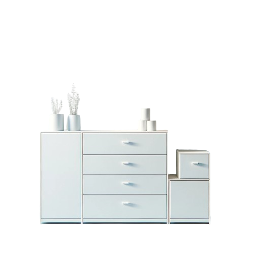 |
| 17 | `./images/icon/remote.png` | `V5_srcfig_17_remote.png` | 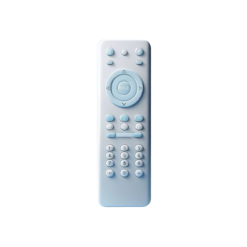 |
| 18 | `./images/icon/bottle.png` | `V5_srcfig_18_bottle.png` | 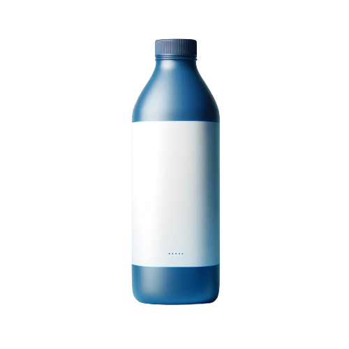 |
| 19 | `./images/icon/folding_chair.png` | `V5_srcfig_19_folding_chair.png` | 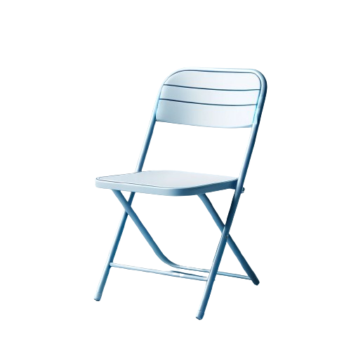 |
| 20 | `./images/icon/toaster.png` | `V5_srcfig_20_toaster.png` | 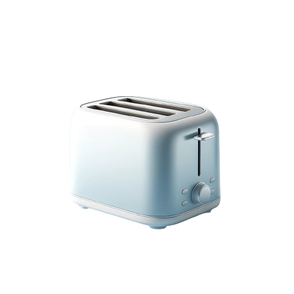 |
| 21 | `./images/icon/lamp.png` | `V5_srcfig_21_lamp.png` | 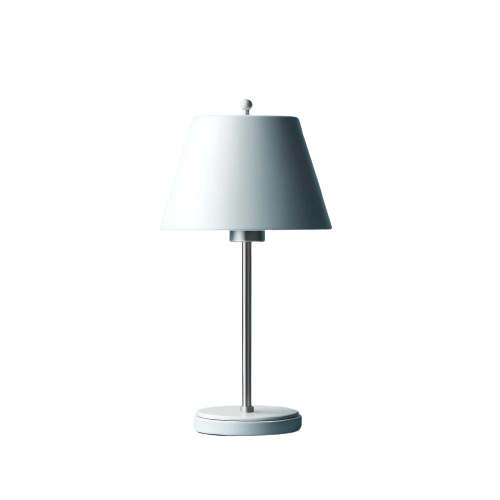 |
| 22 | `./images/icon/dispenser.png` | `V5_srcfig_22_dispenser.png` | 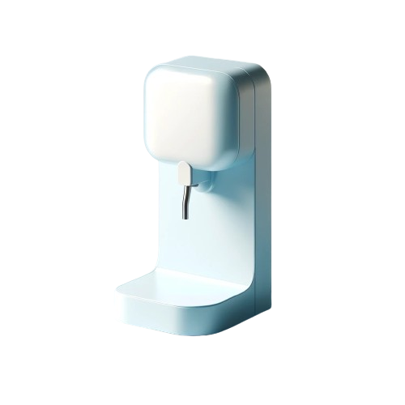 |
| 23 | `./images/icon/toilet.png` | `V5_srcfig_23_toilet.png` |  |
| 24 | `./images/icon/scissors.png` | `V5_srcfig_24_scissors.png` |  |
| 25 | `./images/icon/table.png` | `V5_srcfig_25_table.png` | 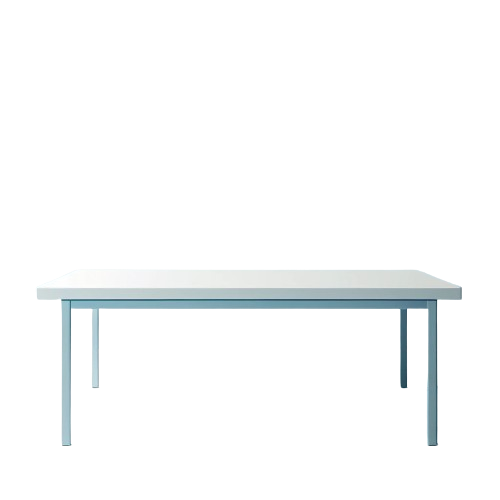 |
| 26 | `./images/icon/stapler.png` | `V5_srcfig_26_stapler.png` | 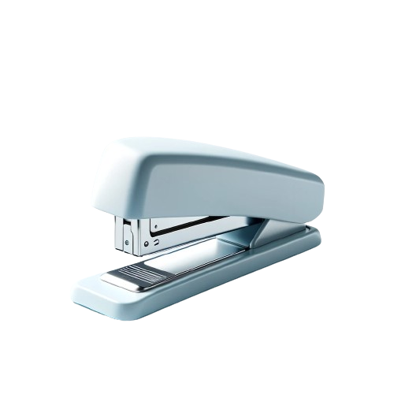 |
| 27 | `./images/icon/kettle.png` | `V5_srcfig_27_kettle.png` | 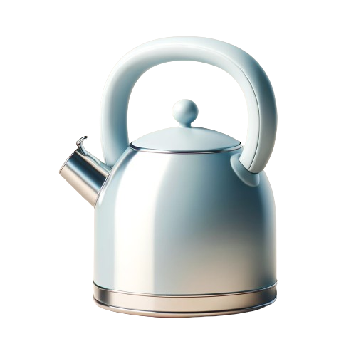 |
| 28 | `./images/icon/usb.png` | `V5_srcfig_28_usb.png` | 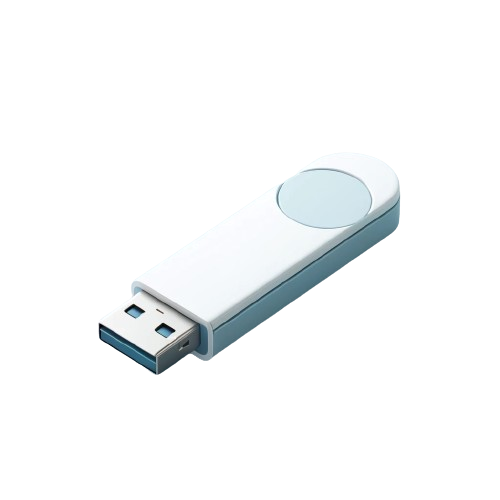 |
| 29 | `./images/icon/switch.png` | `V5_srcfig_29_switch.png` | 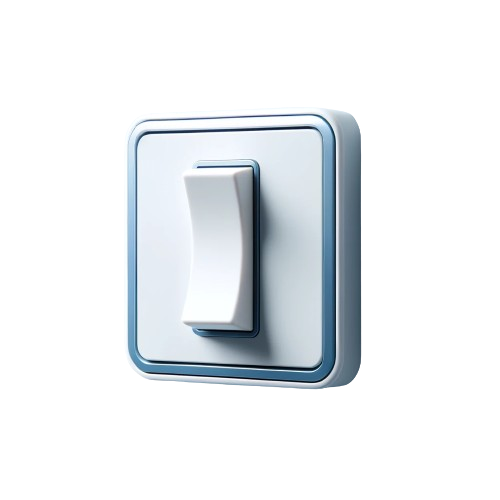 |
| 30 | `./images/icon/washing_machine.png` | `V5_srcfig_30_washing_machine.png` | 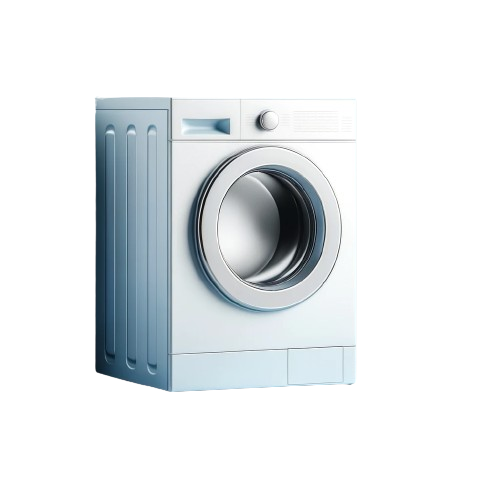 |
| 31 | `./images/icon/faucet.png` | `V5_srcfig_31_faucet.png` | 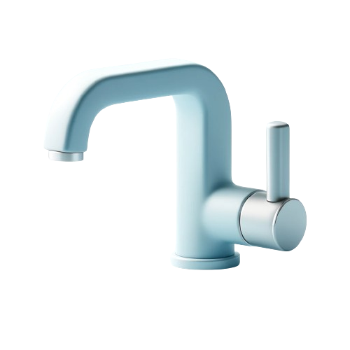 |
| 32 | `./images/icon/phone.png` | `V5_srcfig_32_phone.png` | 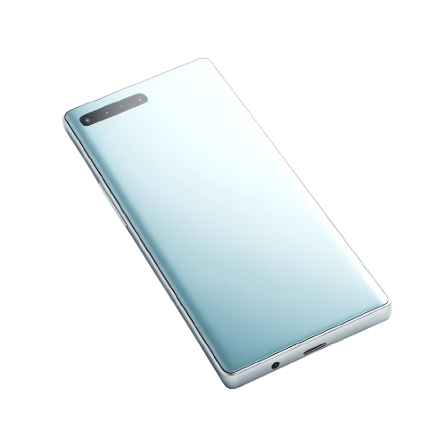 |
| 33 | `images/abla_v2.pdf` | `V5_srcfig_33_abla_v2.pdf` |  |
| 34 | `tables/appandix_pic.pdf` | `V5_srcfig_34_appandix_pic.pdf` | 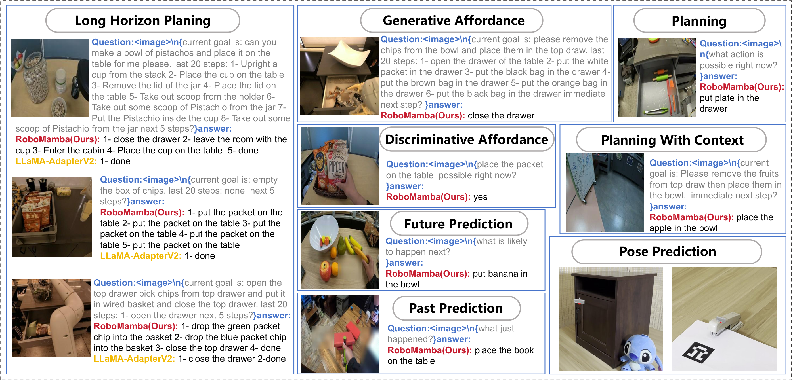 |
| 35 | `tables/mian_pic.pdf` | `V5_srcfig_35_mian_pic.pdf` |  |
| 36 | `images/reb_vis.pdf` | `V5_srcfig_36_reb_vis.pdf` | 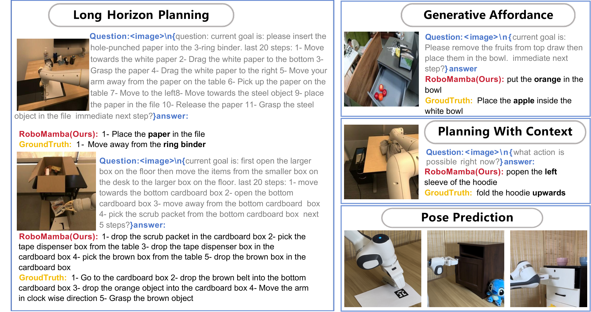 |