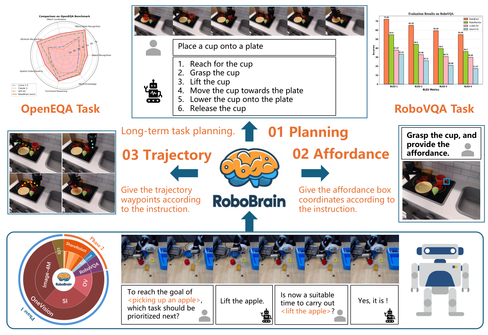
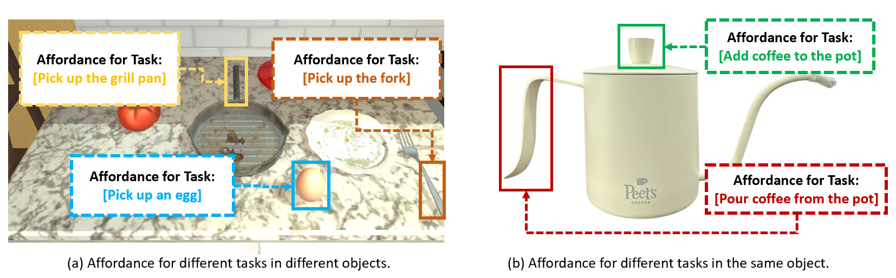
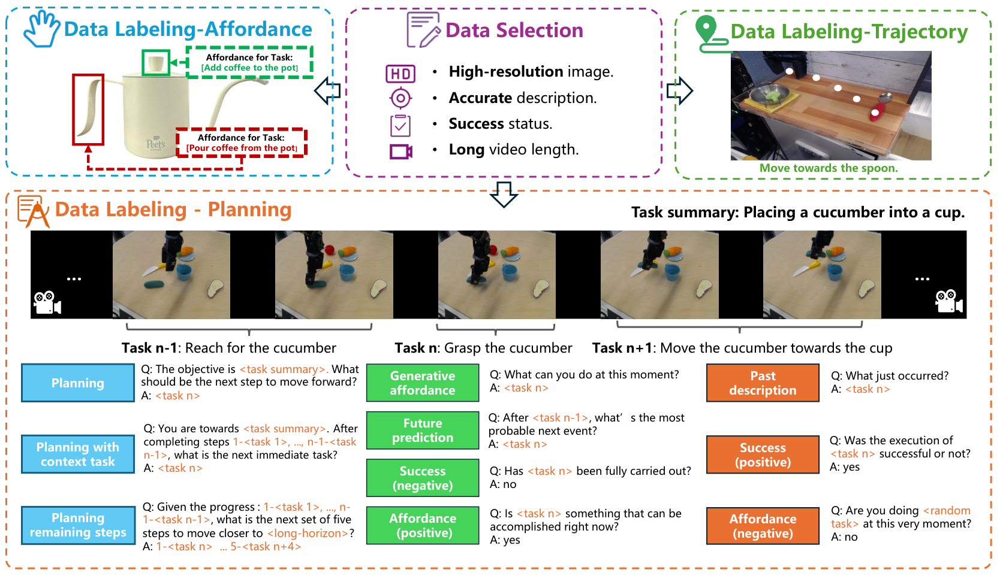
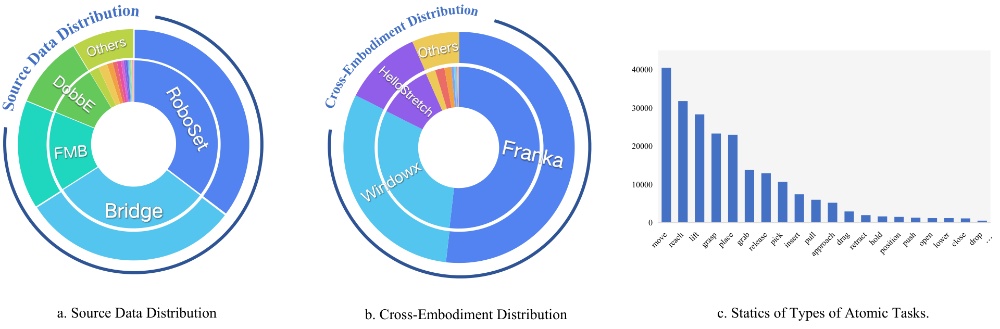
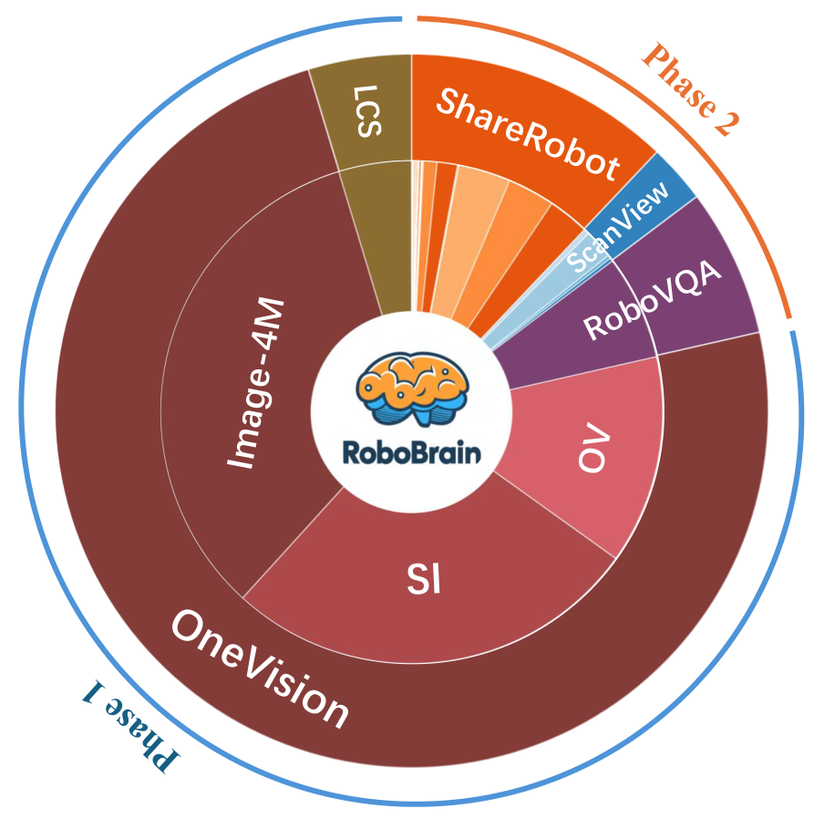
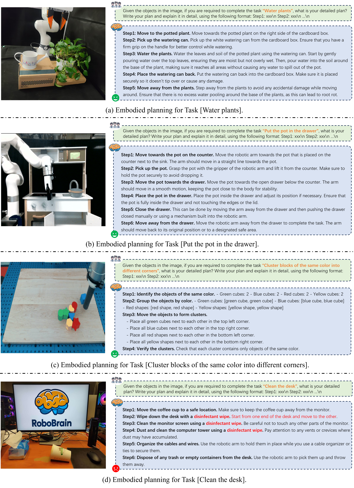
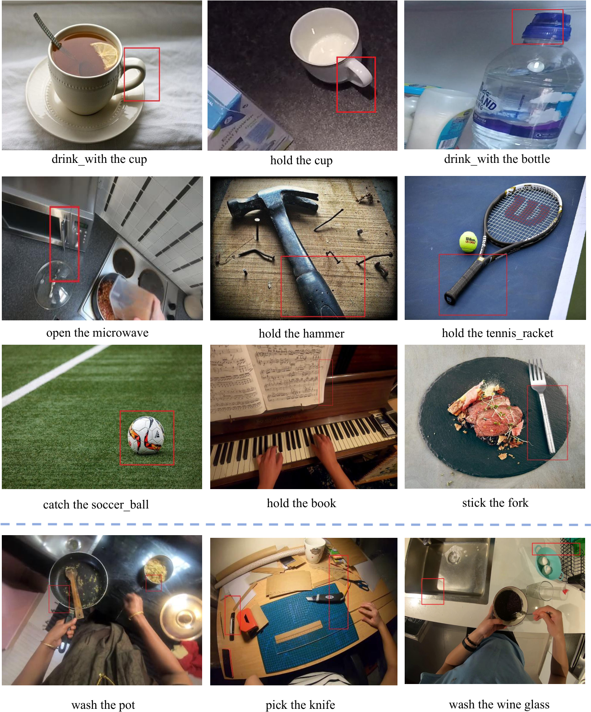
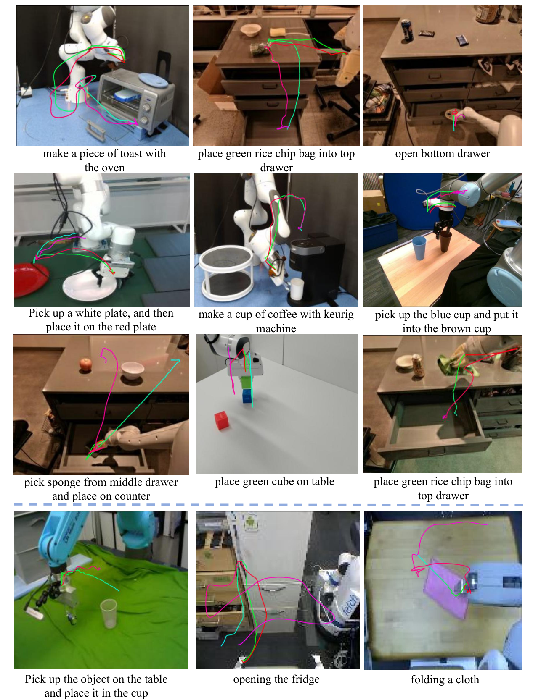
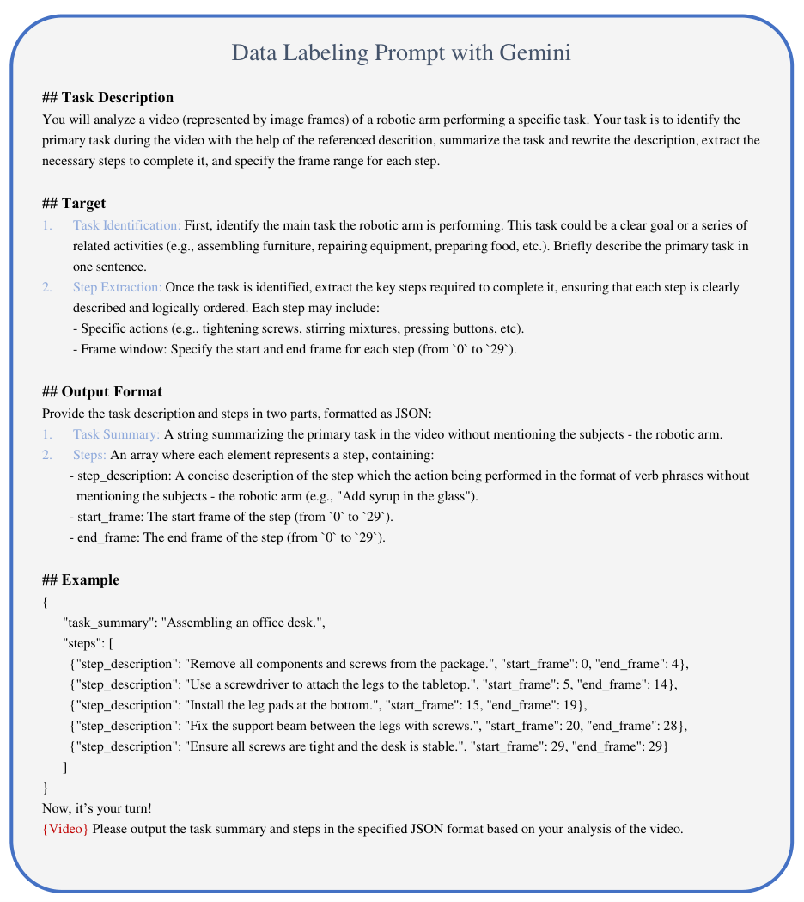
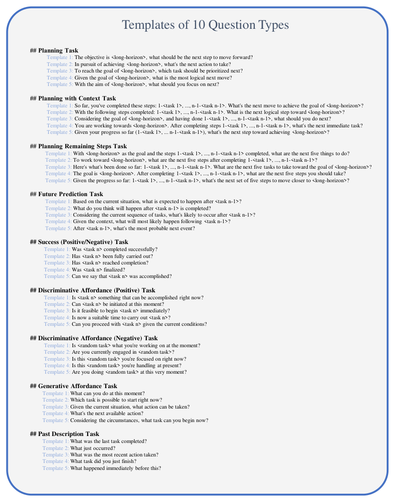

# V6 Source Figures Manifest

이 파일은 arXiv/LaTeX source에서 추출한 원본 figure asset 목록이다.
PDF figure는 첫 페이지를 PNG preview로 렌더링했다.

| Order | LaTeX reference | Source asset | Preview |
|---:|---|---|---|
| 1 | `images/teaser.pdf` | `V6_srcfig_01_teaser.pdf` |  |
| 2 | `images/rebuttal_aff.png` | `V6_srcfig_02_rebuttal_aff.png` |  |
| 3 | `images/dataset_pipeline_new.pdf` | `V6_srcfig_03_dataset_pipeline_new.pdf` |  |
| 4 | `images/diversity.pdf` | `V6_srcfig_04_diversity.pdf` |  |
| 5 | `images/pipeline_new.pdf` | `V6_srcfig_05_pipeline_new.pdf` |  |
| 6 | `images/training_process.pdf` | `V6_srcfig_06_training_process.pdf` |  |
| 7 | `images/result.pdf` | `V6_srcfig_07_result.pdf` |  |
| 8 | `images/demo.pdf` | `V6_srcfig_08_demo.pdf` |  |
| 9 | `images/affordance.pdf` | `V6_srcfig_09_affordance.pdf` |  |
| 10 | `images/training_data_new.pdf` | `V6_srcfig_10_training_data_new.pdf` |  |
| 11 | `images/suppl_planning_demo_with_bad_case.png` | `V6_srcfig_11_suppl_planning_demo_with_bad_case.png` |  |
| 12 | `images/affordance_visualization.pdf` | `V6_srcfig_12_affordance_visualization.pdf` |  |
| 13 | `images/some_trajectory_Visualization_v2.pdf` | `V6_srcfig_13_some_trajectory_Visualization_v2.pdf` |  |
| 14 | `images/prompts_new.pdf` | `V6_srcfig_14_prompts_new.pdf` |  |
| 15 | `images/templates_of_question_types.pdf` | `V6_srcfig_15_templates_of_question_types.pdf` |  |