# W10 Source Figures Manifest

이 파일은 arXiv/LaTeX source에서 추출한 원본 figure asset 목록이다.
PDF figure는 첫 페이지를 PNG preview로 렌더링했다.

| Order | LaTeX reference | Source asset | Preview |
|---:|---|---|---|
| 1 | `assets/#2` | `missing` |  |
| 2 | `assets/figure_1_neural.pdf` | `W10_srcfig_02_figure_1_neural.pdf` |  |
| 3 | `assets/figure2_3.pdf` | `W10_srcfig_03_figure2_3.pdf` | 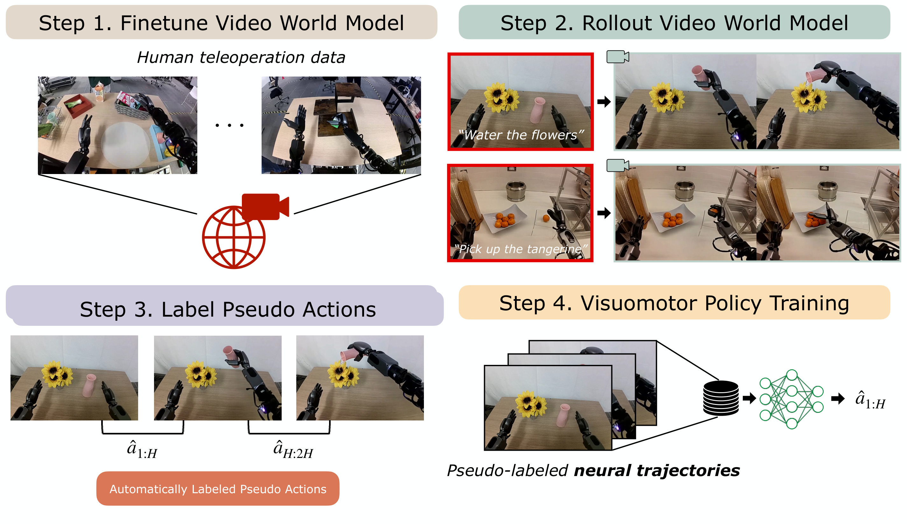 |
| 4 | `assets/idm.pdf` | `W10_srcfig_04_idm.pdf` | 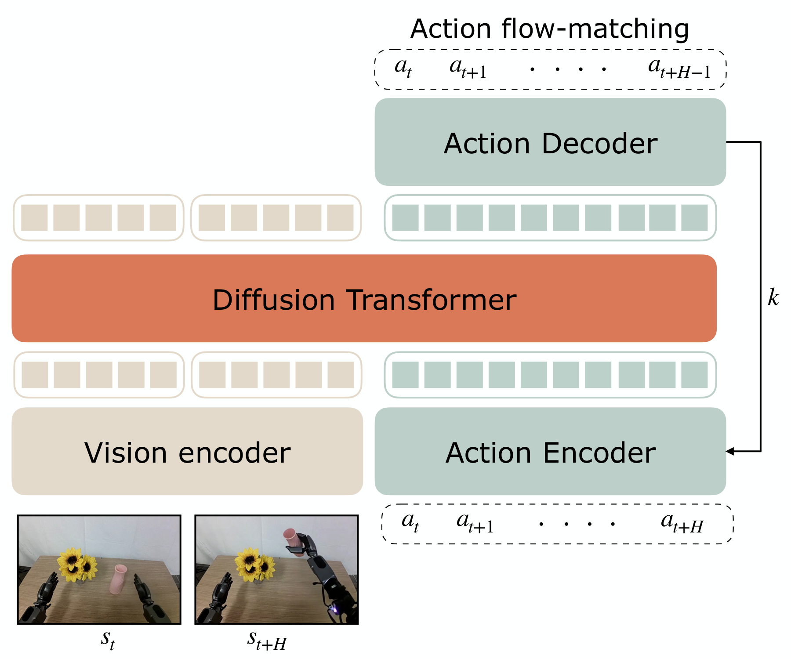 |
| 5 | `assets/lapa.pdf` | `W10_srcfig_05_lapa.pdf` | 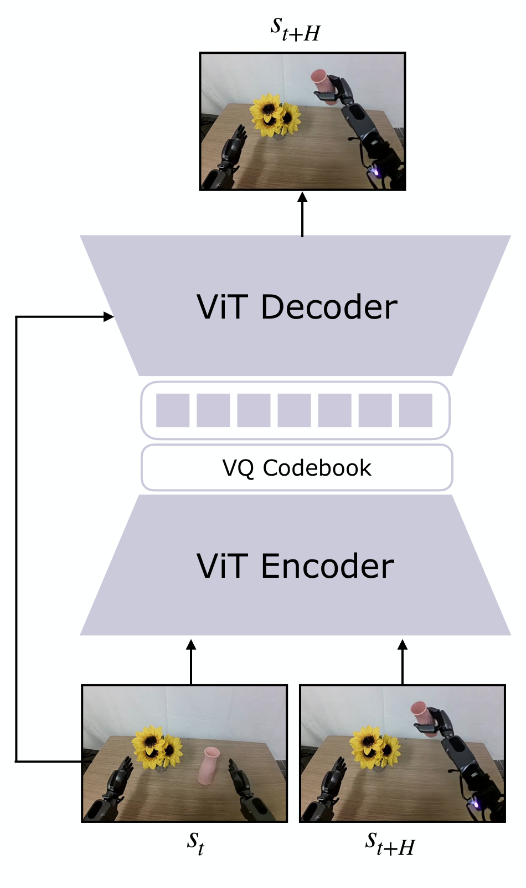 |
| 6 | `assets/sim_result_2.pdf` | `W10_srcfig_06_sim_result_2.pdf` |  |
| 7 | `assets/real_world_unified.pdf` | `W10_srcfig_07_real_world_unified.pdf` | 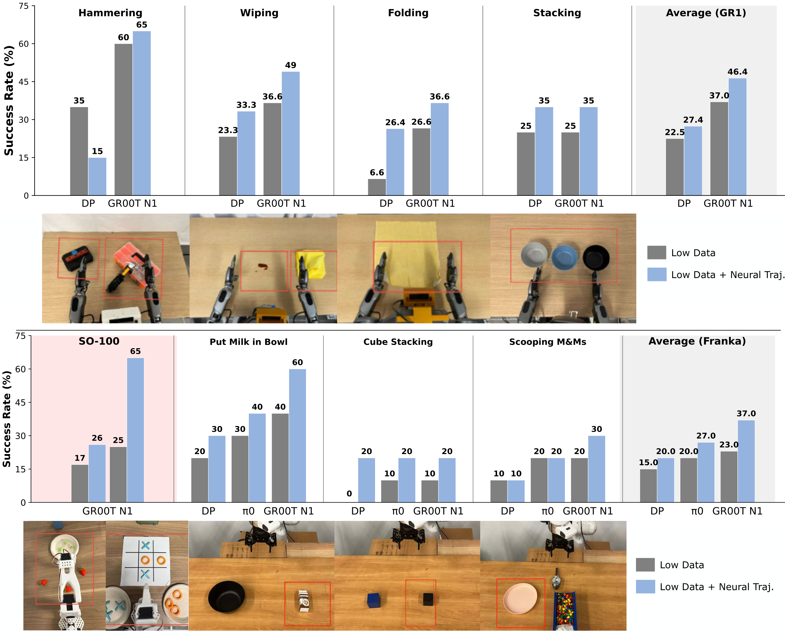 |
| 8 | `assets/real_world_franka_2.pdf` | `missing` |  |
| 9 | `assets/real_world_behavior_2.pdf` | `missing` |  |
| 10 | `assets/real_world_env_2.pdf` | `missing` |  |
| 11 | `assets/scatter_plot.pdf` | `W10_srcfig_11_scatter_plot.pdf` | 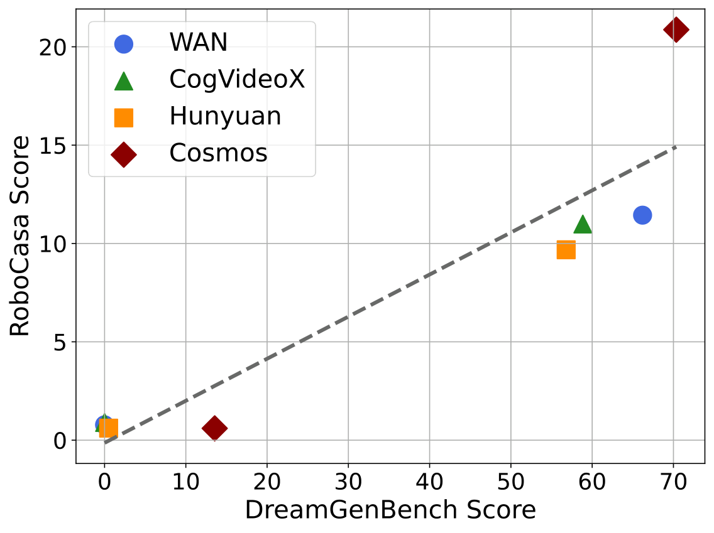 |
| 12 | `assets/idm_replay.pdf` | `W10_srcfig_12_idm_replay.pdf` | 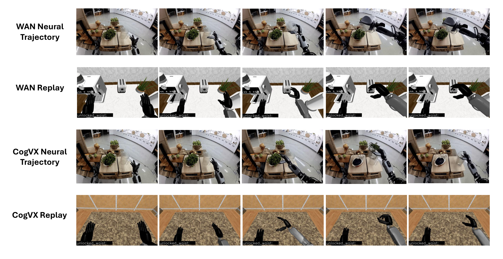 |
| 13 | `assets/gr1_env_example.pdf` | `W10_srcfig_13_gr1_env_example.pdf` | 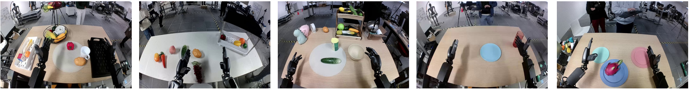 |
| 14 | `assets/env_example.pdf` | `W10_srcfig_14_env_example.pdf` | 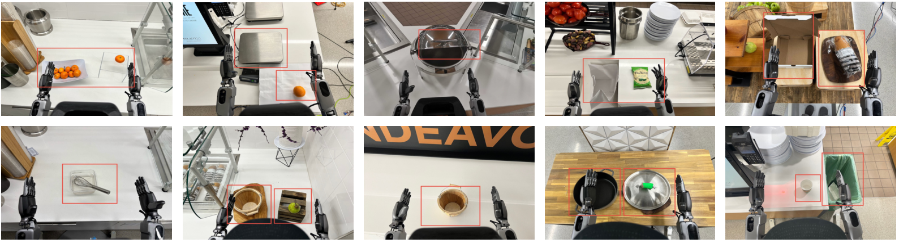 |
| 15 | `assets/multiview_example.pdf` | `W10_srcfig_15_multiview_example.pdf` | 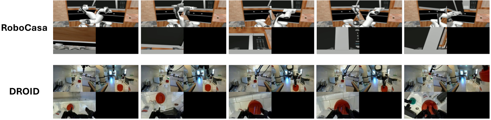 |
| 16 | `assets/eval_frames.pdf` | `W10_srcfig_16_eval_frames.pdf` | 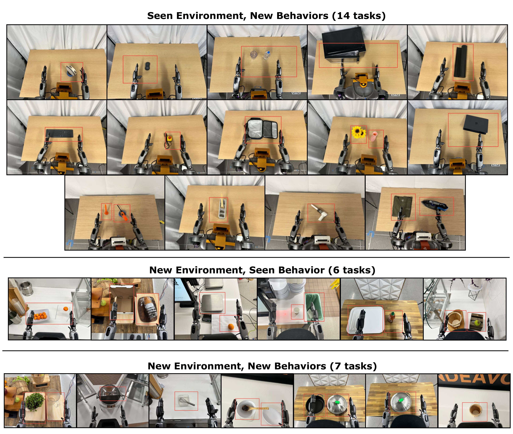 |
| 17 | `assets/figure1_new2.pdf` | `W10_srcfig_17_figure1_new2.pdf` | 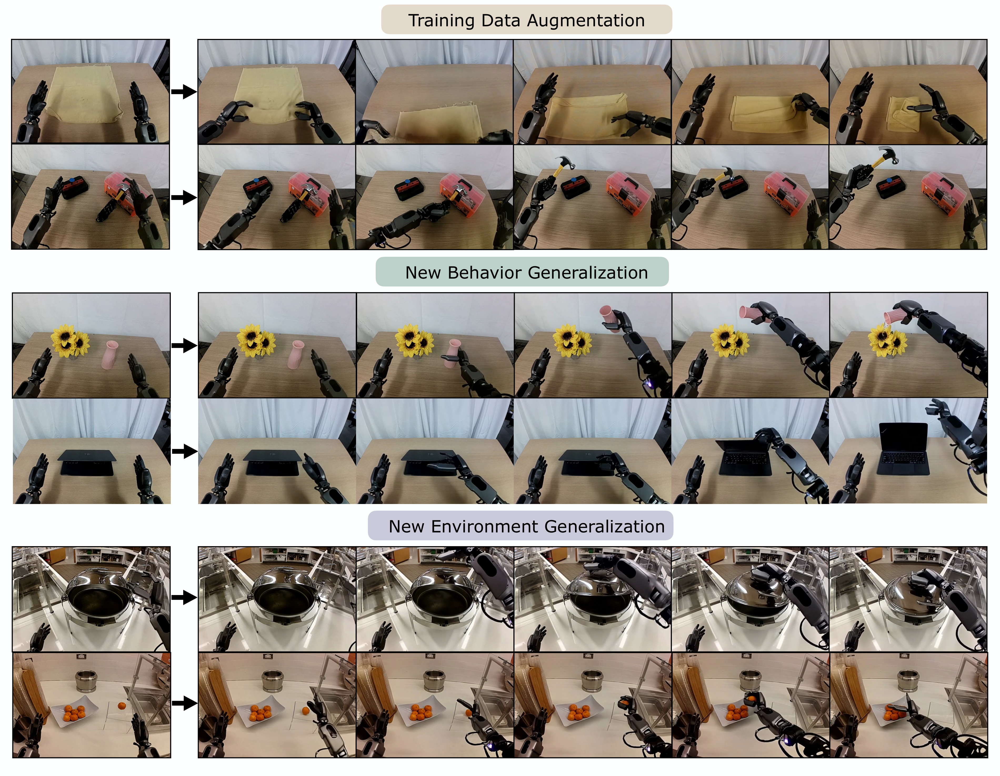 |
