# W3 Source Figures Manifest

이 파일은 arXiv/LaTeX source에서 추출한 원본 figure asset 목록이다.
PDF figure는 첫 페이지를 PNG preview로 렌더링했다.

| Order | LaTeX reference | Source asset | Preview |
|---:|---|---|---|
| 1 | `logo` | `W3_srcfig_01_logo.png` |  |
| 2 | `figures/actgen/actgen` | `W3_srcfig_02_actgen.pdf` |  |
| 3 | `figures/imag/imag` | `W3_srcfig_03_imag.pdf` | 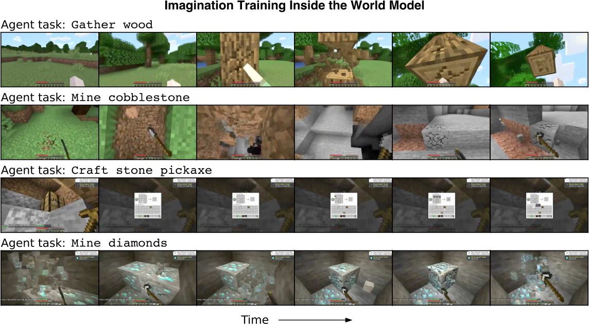 |
| 4 | `figures/inputs/image64` | `W3_srcfig_04_image64.png` |  |
| 5 | `figures/inputs/image128` | `W3_srcfig_05_image128.png` |  |
| 6 | `figures/inputs/image640` | `W3_srcfig_06_image640.png` |  |
| 7 | `figures/kitchens_more/kitchens` | `W3_srcfig_07_kitchens.jpg` | 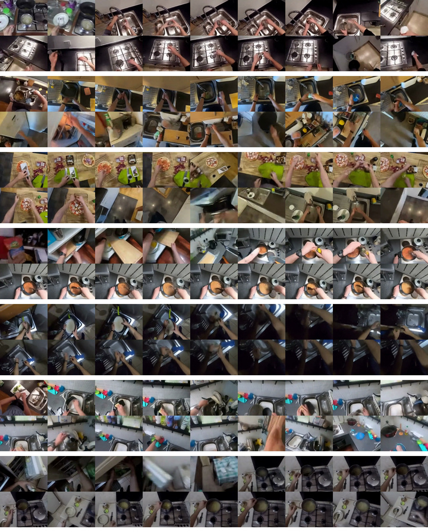 |
| 8 | `figures/method/tok` | `W3_srcfig_08_tok.pdf` | 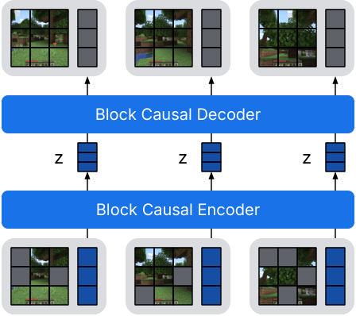 |
| 9 | `figures/method/dyn` | `W3_srcfig_09_dyn.pdf` |  |
| 10 | `figures/nfe/nfe` | `W3_srcfig_10_nfe.pdf` |  |
| 11 | `figures/openl/openl` | `W3_srcfig_11_openl.pdf` | 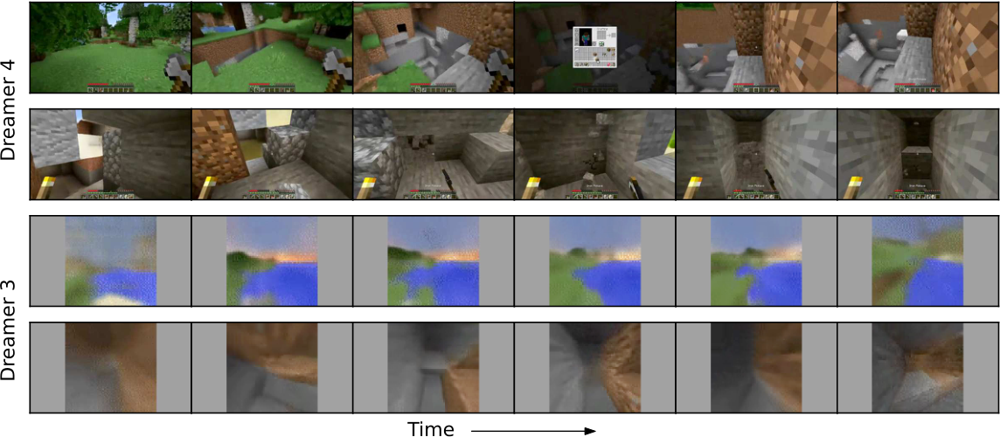 |
| 12 | `figures/rl/rl` | `W3_srcfig_12_rl.pdf` | 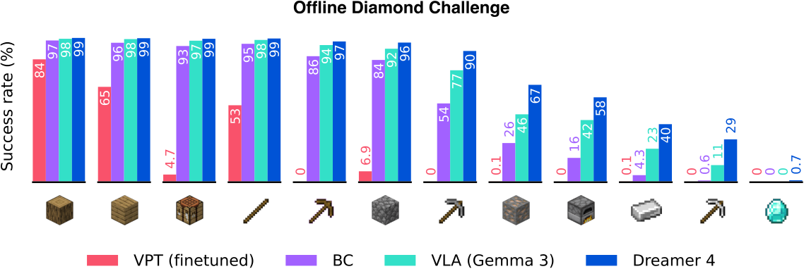 |
| 13 | `figures/rlabl/rlabl` | `W3_srcfig_13_rlabl.pdf` | 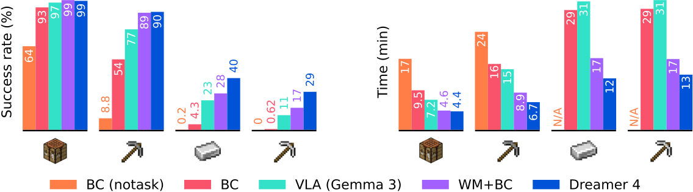 |
| 14 | `figures/robotics/soar1` | `W3_srcfig_14_soar1.jpg` |  |
| 15 | `figures/robotics/soar2` | `W3_srcfig_15_soar2.jpg` |  |
| 16 | `figures/robotics/soar3` | `W3_srcfig_16_soar3.jpg` | 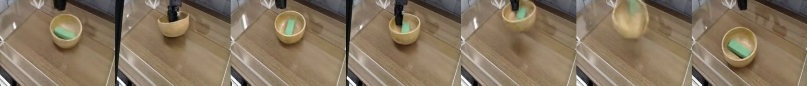 |
| 17 | `figures/wmtask/check.png` | `W3_srcfig_17_check.png` |  |
| 18 | `figures/wmtask/cross.png` | `W3_srcfig_18_cross.png` |  |
| 19 | `figures/wmtask/wmtask` | `W3_srcfig_19_wmtask.pdf` | 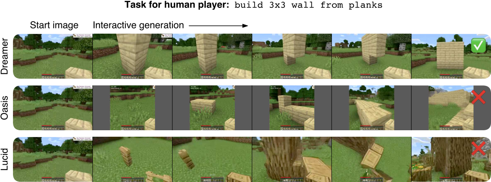 |
| 20 | `figures/wmtasks/lucid` | `W3_srcfig_20_lucid.pdf` | 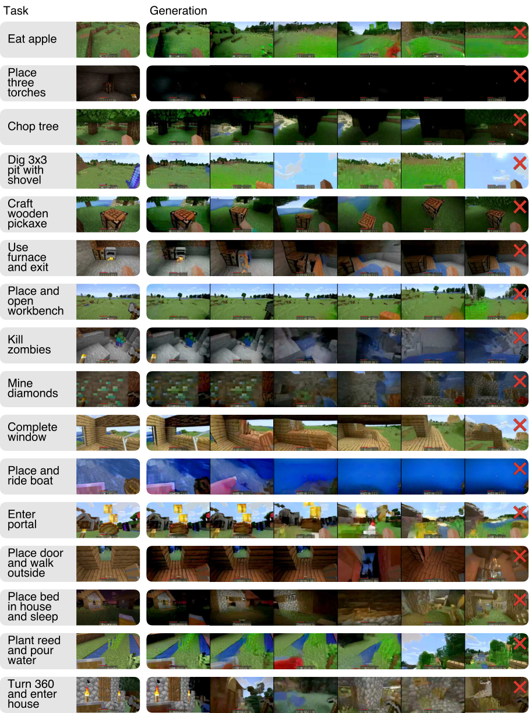 |
| 21 | `figures/wmtasks/oasis` | `W3_srcfig_21_oasis.pdf` | 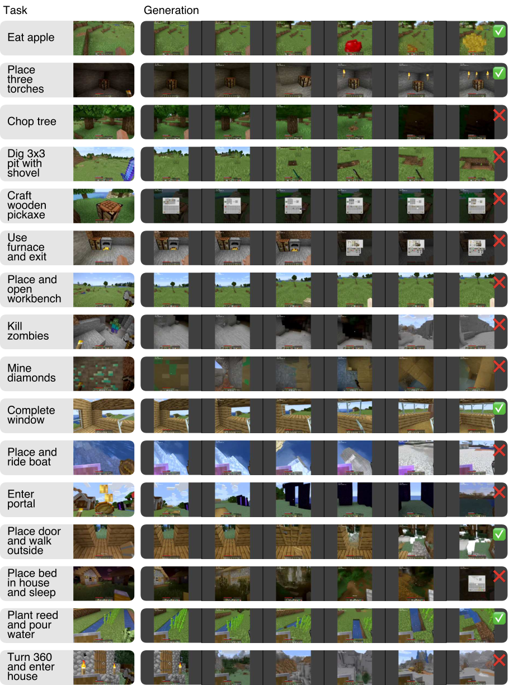 |
| 22 | `figures/wmtasks/dreamer` | `W3_srcfig_22_dreamer.pdf` | 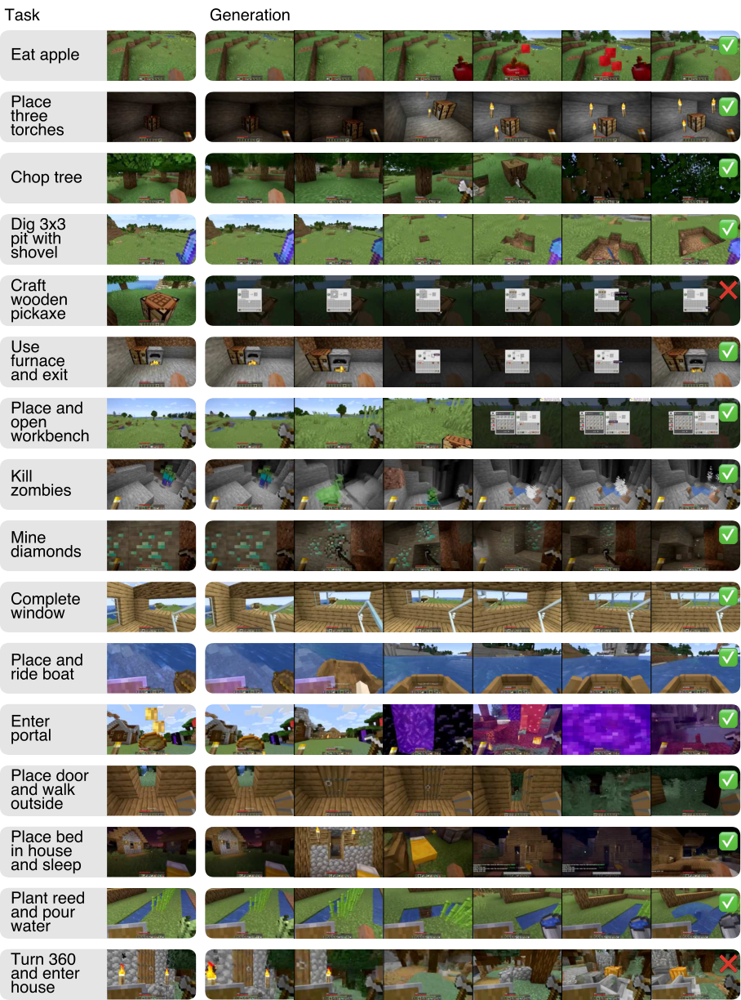 |
| 23 | `icons/#1.png` | `missing` |  |
