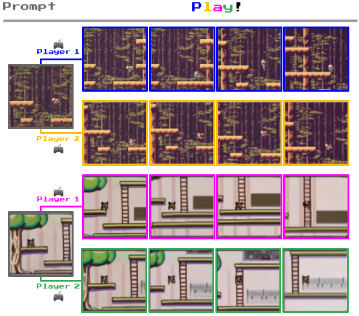
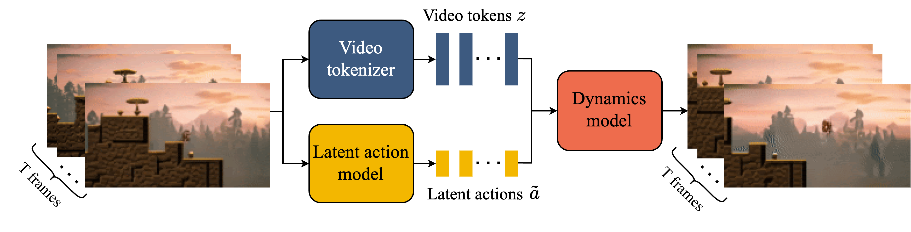
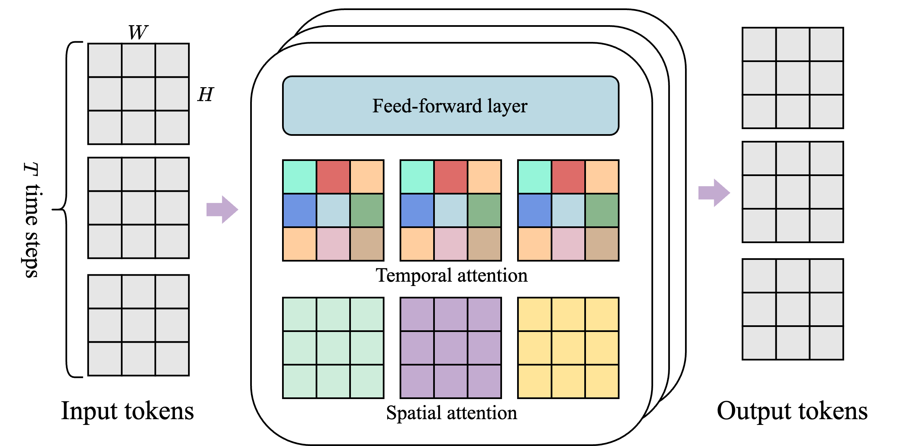
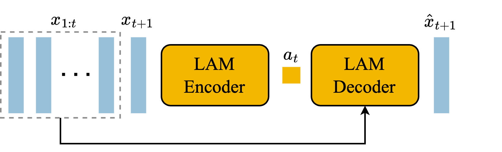
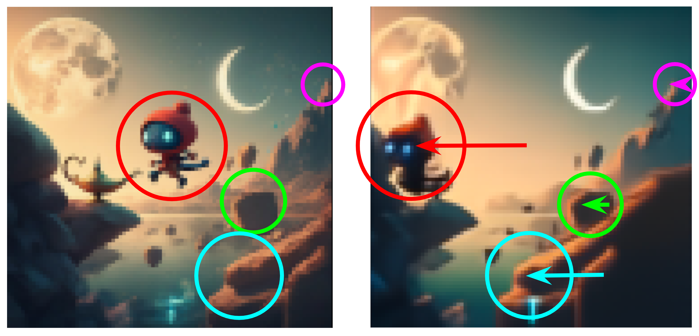
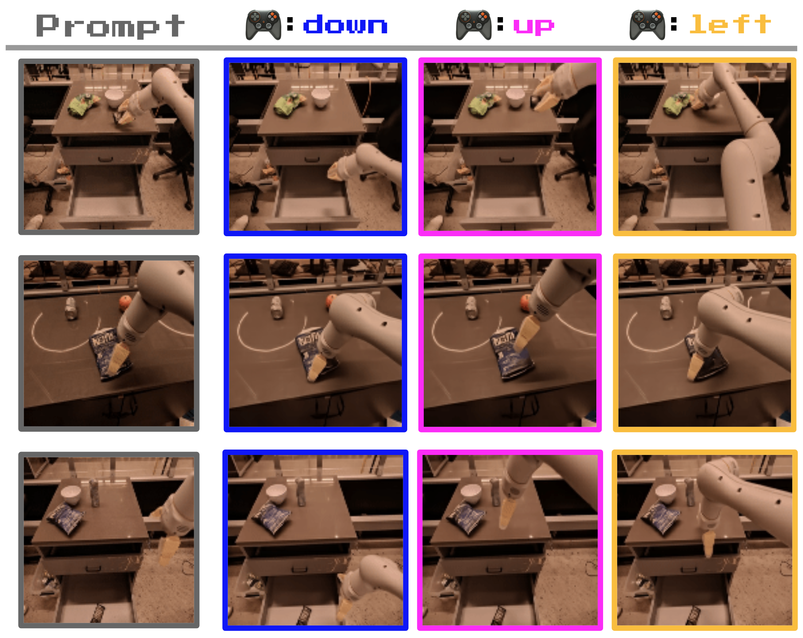
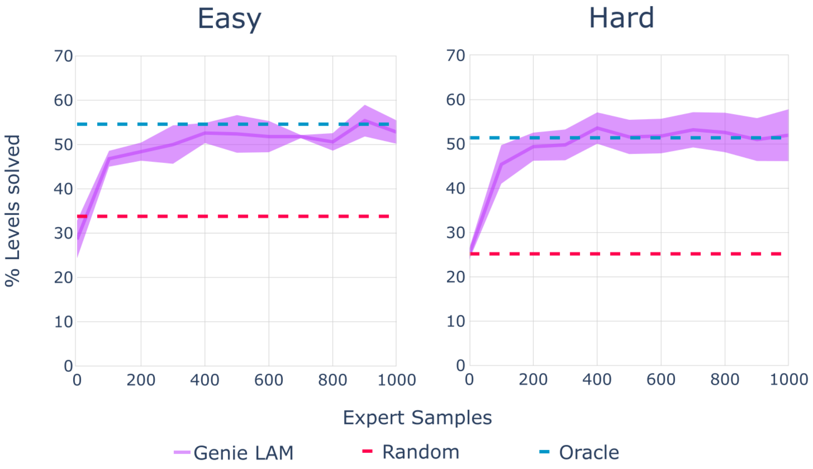
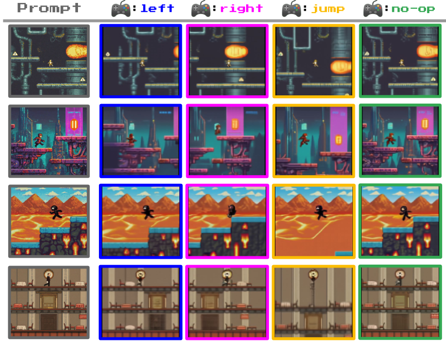

# W4 Source Figures Manifest

이 파일은 arXiv/LaTeX source에서 추출한 원본 figure asset 목록이다.
PDF figure는 첫 페이지를 PNG preview로 렌더링했다.

| Order | LaTeX reference | Source asset | Preview |
|---:|---|---|---|
| 1 | `figures/genie_emoji.pdf` | `W4_srcfig_01_genie_emoji.pdf` |  |
| 2 | `figures/platformer_trajectories.png` | `W4_srcfig_02_platformer_trajectories.png` |  |
| 3 | `figures/genie_architecture.png` | `W4_srcfig_03_genie_architecture.png` |  |
| 4 | `figures/sttransformer.png` | `W4_srcfig_04_sttransformer.png` |  |
| 5 | `figures/LAM_architecture.png` | `W4_srcfig_05_LAM_architecture.png` |  |
| 6 | `figures/tokenizer_architecture.png` | `W4_srcfig_06_tokenizer_architecture.png` |  |
| 7 | `figures/dynamics_architecture.png` | `W4_srcfig_07_dynamics_architecture.png` |  |
| 8 | `figures/genie_inference.png` | `W4_srcfig_08_genie_inference.png` |  |
| 9 | `figures/scaling_all.pdf` | `W4_srcfig_09_scaling_all.pdf` |  |
| 10 | `figures/actions_emergent.pdf` | `W4_srcfig_10_actions_emergent.pdf` |  |
| 11 | `figures/chips.png` | `W4_srcfig_11_chips.png` |  |
| 12 | `figures/parallax_new.png` | `W4_srcfig_12_parallax_new.png` |  |
| 13 | `figures/action_grid_robotics.png` | `W4_srcfig_13_action_grid_robotics.png` |  |
| 14 | `figures/coinrun_traj.pdf` | `W4_srcfig_14_coinrun_traj.pdf` |  |
| 15 | `figures/bc_border.pdf` | `W4_srcfig_15_bc_border.pdf` |  |
| 16 | `figures/examples.png` | `W4_srcfig_16_examples.png` |  |
| 17 | `figures/platformers_consistency.pdf` | `W4_srcfig_17_platformers_consistency.pdf` |  |