# W6 Source Figures Manifest

이 파일은 arXiv/LaTeX source에서 추출한 원본 figure asset 목록이다.
PDF figure는 첫 페이지를 PNG preview로 렌더링했다.

| Order | LaTeX reference | Source asset | Preview |
|---:|---|---|---|
| 1 | `figures/pandora.pdf` | `W6_srcfig_01_pandora.pdf` |  |
| 2 | `figures/icon.png` | `W6_srcfig_02_icon.png` |  |
| 3 | `figures/figure1_v8.pdf` | `W6_srcfig_03_figure1_v8.pdf` | 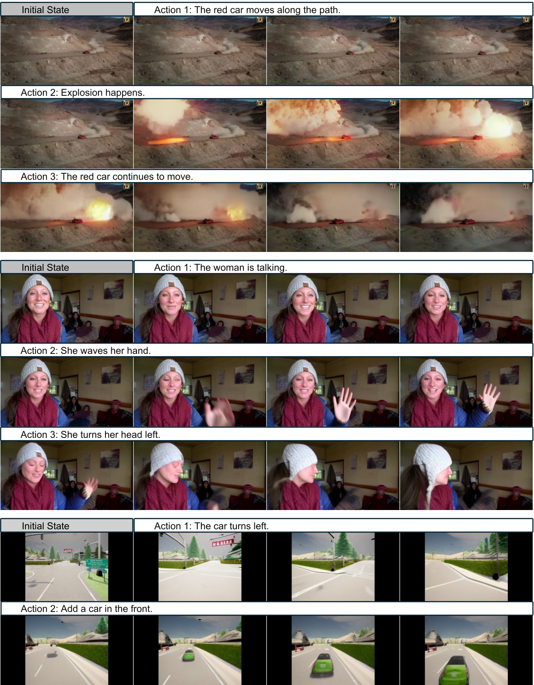 |
| 4 | `exp_figures/multi_lightcar.jpeg` | `W6_srcfig_04_multi_lightcar.jpeg` |  |
| 5 | `exp_figures/multi_street.jpeg` | `W6_srcfig_05_multi_street.jpeg` | 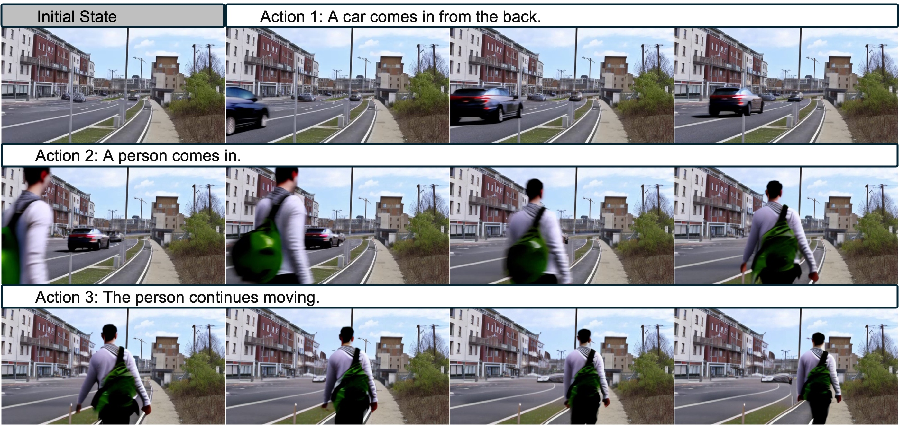 |
| 6 | `exp_figures/multi_room.jpeg` | `W6_srcfig_06_multi_room.jpeg` | 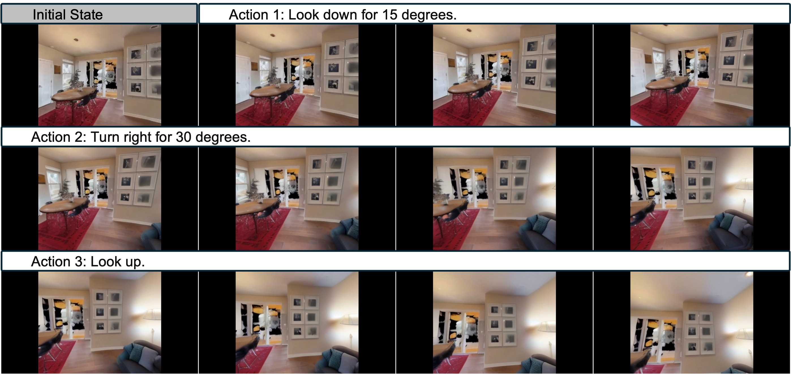 |
| 7 | `exp_figures/multi_arm.jpeg` | `W6_srcfig_07_multi_arm.jpeg` | 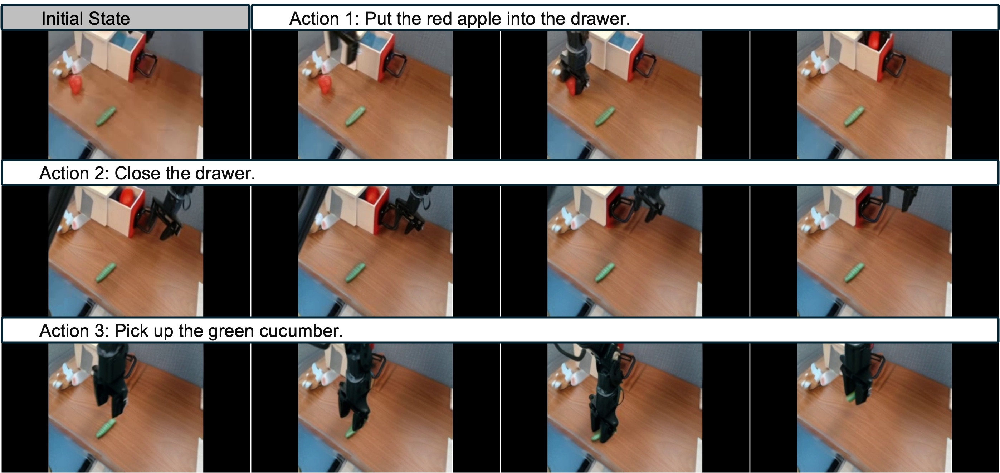 |
| 8 | `exp_figures/multi_man.jpeg` | `W6_srcfig_08_multi_man.jpeg` | 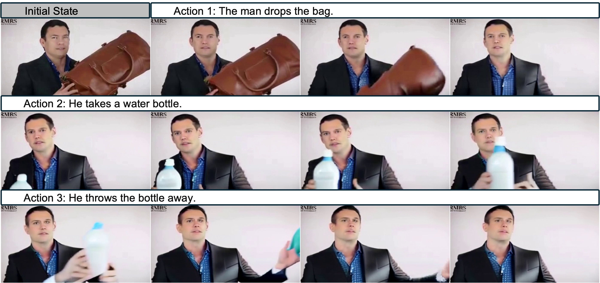 |
| 9 | `exp_figures/single_bottle.jpeg` | `W6_srcfig_09_single_bottle.jpeg` | 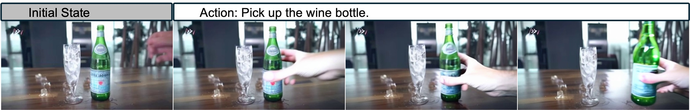 |
| 10 | `exp_figures/multi_game.jpeg` | `W6_srcfig_10_multi_game.jpeg` | 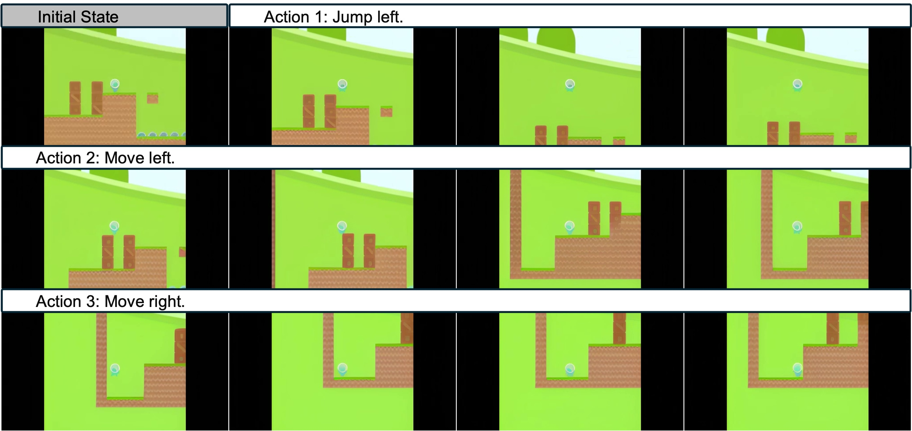 |
| 11 | `exp_figures/transfer_minecraft.jpeg` | `W6_srcfig_11_transfer_minecraft.jpeg` | 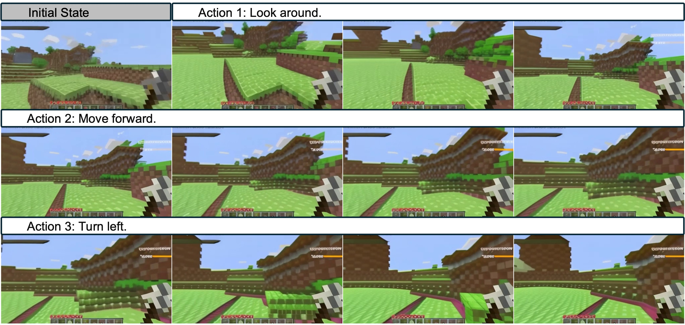 |
| 12 | `exp_figures/single_car.jpeg` | `W6_srcfig_12_single_car.jpeg` | 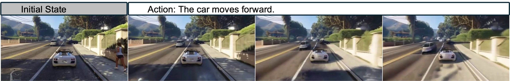 |
| 13 | `exp_figures/physics_flag.jpeg` | `W6_srcfig_13_physics_flag.jpeg` |  |
| 14 | `exp_figures/physics_bench.jpeg` | `W6_srcfig_14_physics_bench.jpeg` | 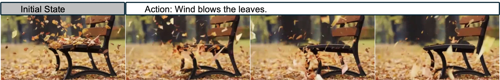 |
| 15 | `exp_figures/physics_milk.jpeg` | `W6_srcfig_15_physics_milk.jpeg` |  |
| 16 | `exp_figures/multi_cake.jpeg` | `W6_srcfig_16_multi_cake.jpeg` | 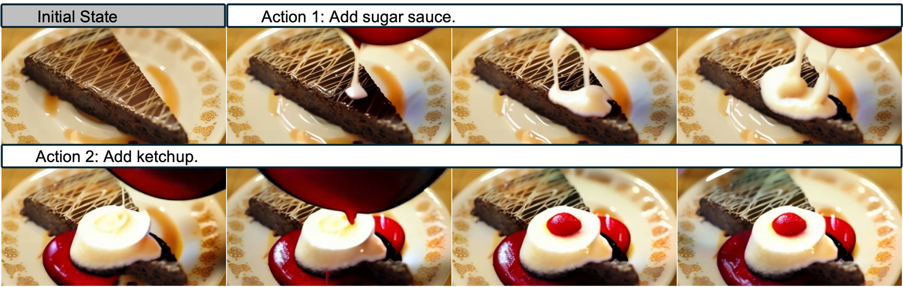 |
| 17 | `exp_figures/long_theatre.jpeg` | `W6_srcfig_17_long_theatre.jpeg` | 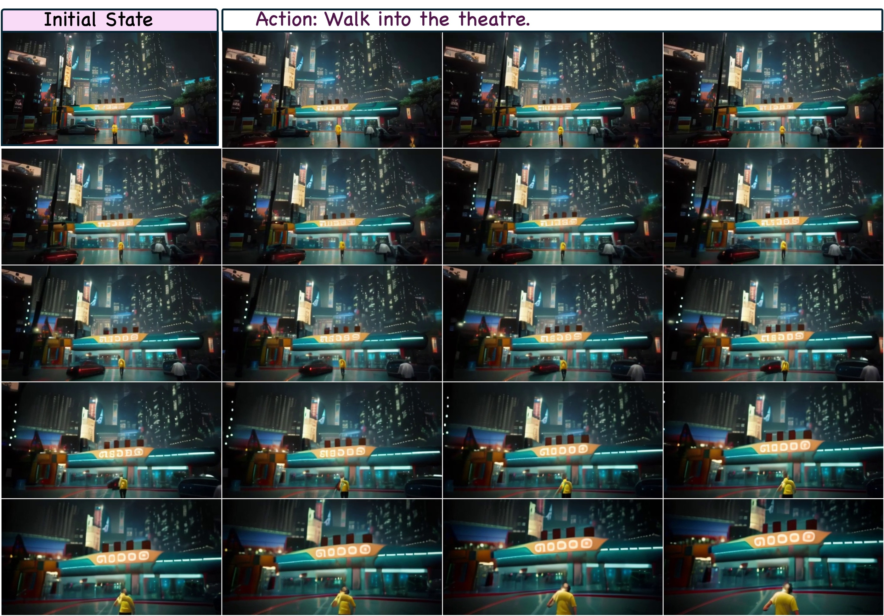 |
| 18 | `exp_figures/long_plane.jpeg` | `W6_srcfig_18_long_plane.jpeg` | 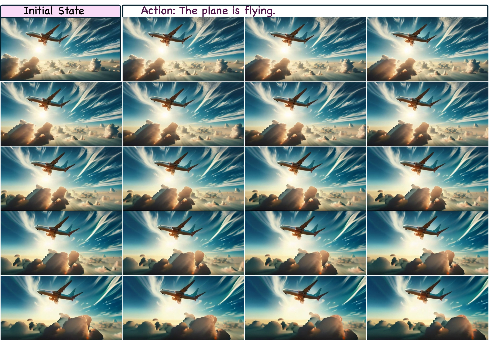 |
| 19 | `exp_figures/long_train.jpeg` | `W6_srcfig_19_long_train.jpeg` | 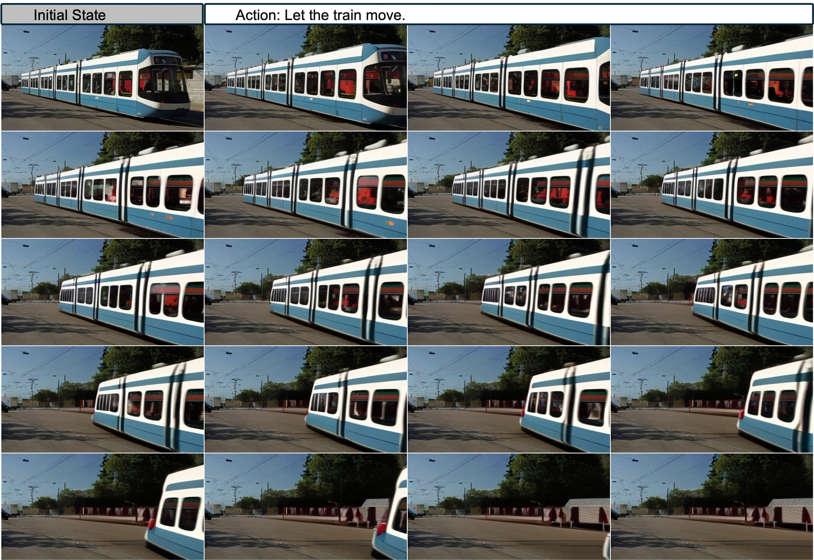 |
| 20 | `exp_figures/long_ironman.jpeg` | `W6_srcfig_20_long_ironman.jpeg` | 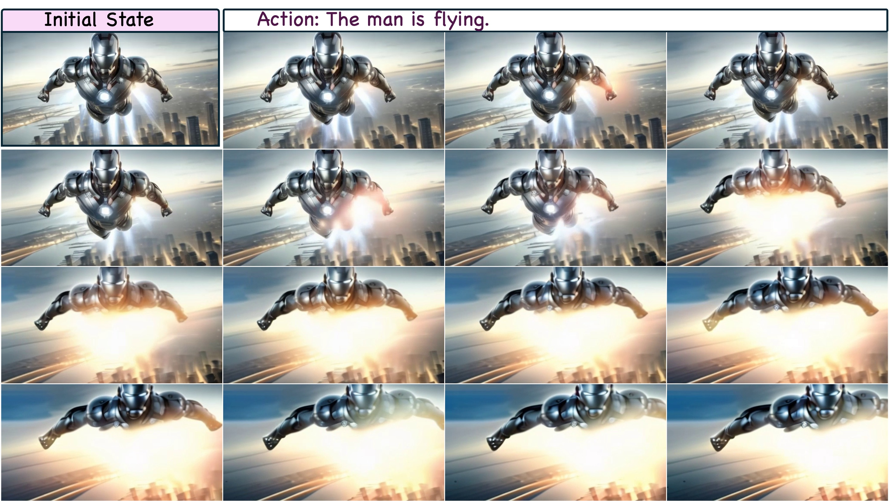 |
| 21 | `exp_figures/multi_green_game.jpeg` | `W6_srcfig_21_multi_green_game.jpeg` | 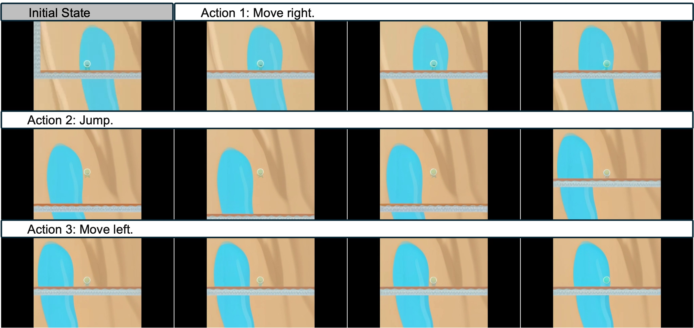 |
| 22 | `exp_figures/transfer_2d.jpeg` | `W6_srcfig_22_transfer_2d.jpeg` | 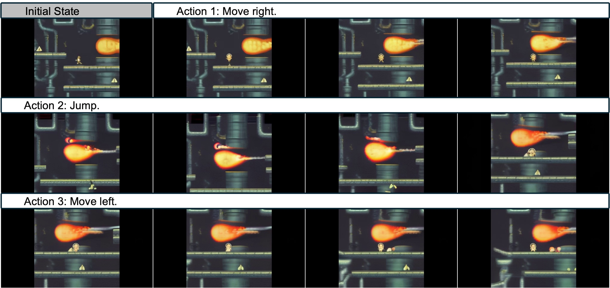 |
| 23 | `exp_figures/transfer_coinrun.jpeg` | `W6_srcfig_23_transfer_coinrun.jpeg` | 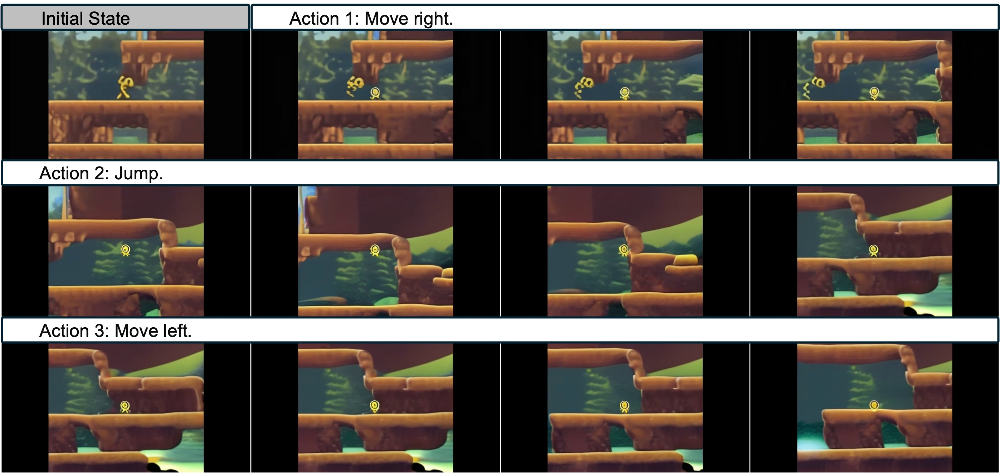 |
| 24 | `exp_figures/transfer_room.jpeg` | `W6_srcfig_24_transfer_room.jpeg` |  |
| 25 | `exp_figures/transfer_moon.jpeg` | `W6_srcfig_25_transfer_moon.jpeg` | 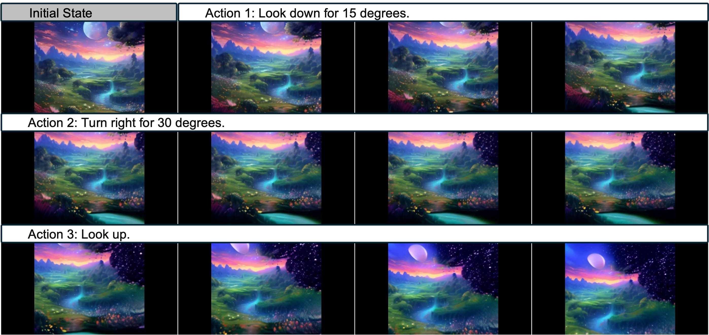 |
| 26 | `exp_figures/transfer_river.jpeg` | `W6_srcfig_26_transfer_river.jpeg` | 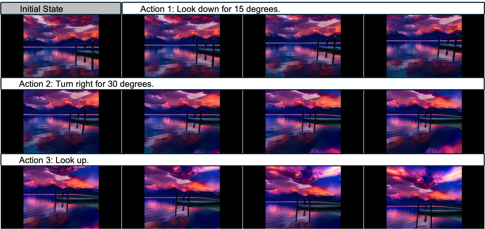 |
| 27 | `exp_figures/long_car.jpeg` | `W6_srcfig_27_long_car.jpeg` |  |
| 28 | `exp_figures/failure_train.jpeg` | `W6_srcfig_28_failure_train.jpeg` | 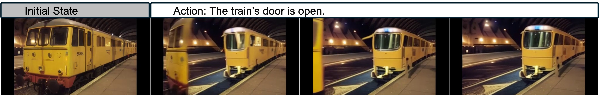 |
| 29 | `exp_figures/failure_dog.jpeg` | `W6_srcfig_29_failure_dog.jpeg` |  |
| 30 | `exp_figures/failure_dance.jpeg` | `W6_srcfig_30_failure_dance.jpeg` |  |
| 31 | `exp_figures/failure_gas.jpeg` | `W6_srcfig_31_failure_gas.jpeg` |  |
| 32 | `exp_figures/10k_turn_left.png` | `W6_srcfig_32_10k_turn_left.png` | 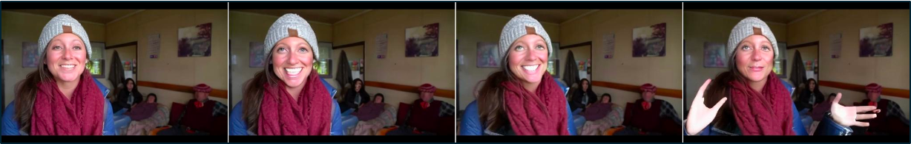 |
| 33 | `exp_figures/latest_turn_left.png` | `W6_srcfig_33_latest_turn_left.png` | 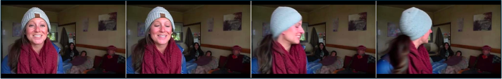 |
| 34 | `figures/architecture_v2.pdf` | `W6_srcfig_34_architecture_v2.pdf` |  |
