# W9 Source Figures Manifest

이 파일은 arXiv/LaTeX source에서 추출한 원본 figure asset 목록이다.
PDF figure는 첫 페이지를 PNG preview로 렌더링했다.

| Order | LaTeX reference | Source asset | Preview |
|---:|---|---|---|
| 1 | `Figures/Introduction/prediction_tasks.pdf` | `W9_srcfig_01_prediction_tasks.pdf` |  |
| 2 | `Figures/Introduction/gaia_schematic.pdf` | `W9_srcfig_02_gaia_schematic.pdf` |  |
| 3 | `Figures/Tokenizer/frame1_image.png` | `W9_srcfig_03_frame1_image.png` |  |
| 4 | `Figures/Tokenizer/frame1_vqgan.png` | `W9_srcfig_04_frame1_vqgan.png` |  |
| 5 | `Figures/Tokenizer/frame1_dino.png` | `W9_srcfig_05_frame1_dino.png` |  |
| 6 | `Figures/Video_Decoder/image_gen.pdf` | `W9_srcfig_06_image_gen.pdf` |  |
| 7 | `Figures/Video_Decoder/video_gen.pdf` | `W9_srcfig_07_video_gen.pdf` | 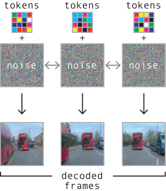 |
| 8 | `Figures/Video_Decoder/video_gen_ar.pdf` | `W9_srcfig_08_video_gen_ar.pdf` | 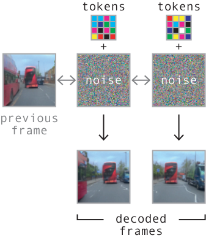 |
| 9 | `Figures/Video_Decoder/frame_interp.pdf` | `W9_srcfig_09_frame_interp.pdf` | 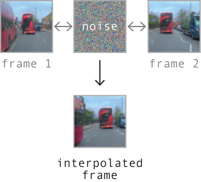 |
| 10 | `Figures/Data_Balancing/data_balancing_latitude.pdf` | `W9_srcfig_10_data_balancing_latitude.pdf` | 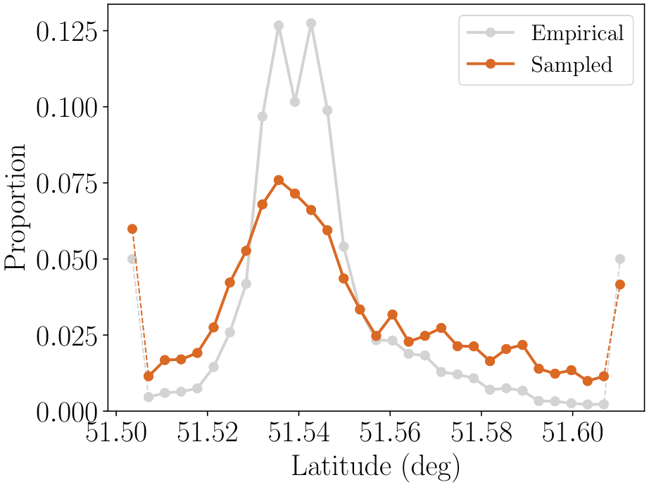 |
| 11 | `Figures/Data_Balancing/data_balancing_longitude.pdf` | `W9_srcfig_11_data_balancing_longitude.pdf` | 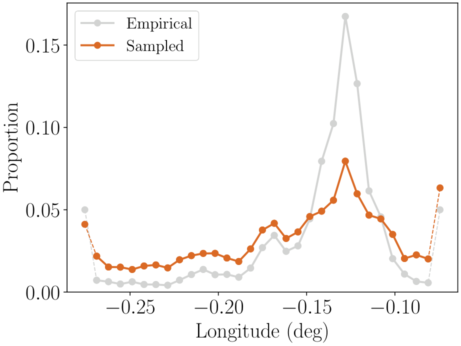 |
| 12 | `Figures/Data_Balancing/data_balancing_weather.pdf` | `W9_srcfig_12_data_balancing_weather.pdf` | 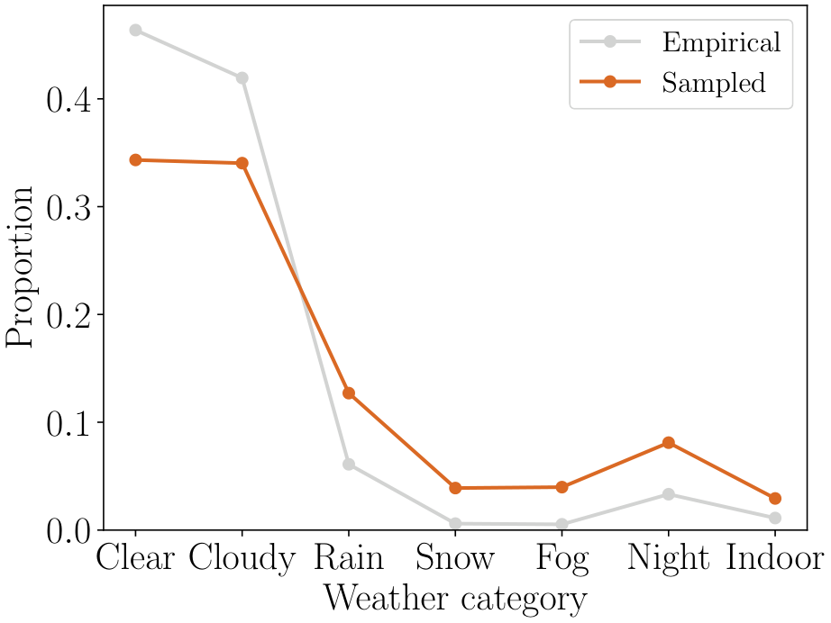 |
| 13 | `Figures/Data_Balancing/data_heatmap_empirical.pdf` | `W9_srcfig_13_data_heatmap_empirical.pdf` | 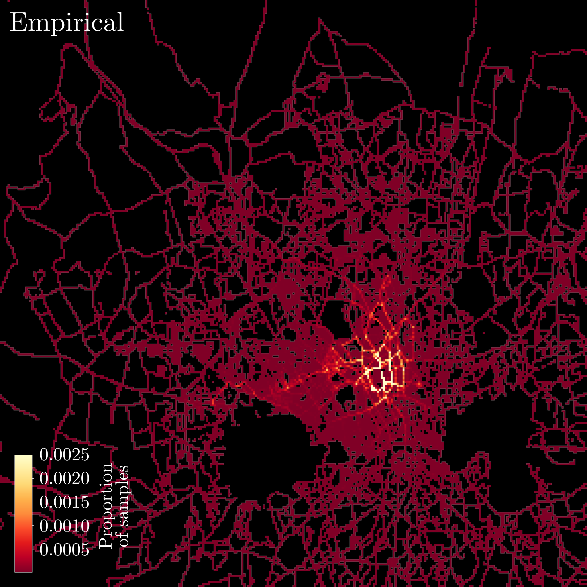 |
| 14 | `Figures/Data_Balancing/data_heatmap_balanced.pdf` | `W9_srcfig_14_data_heatmap_balanced.pdf` | 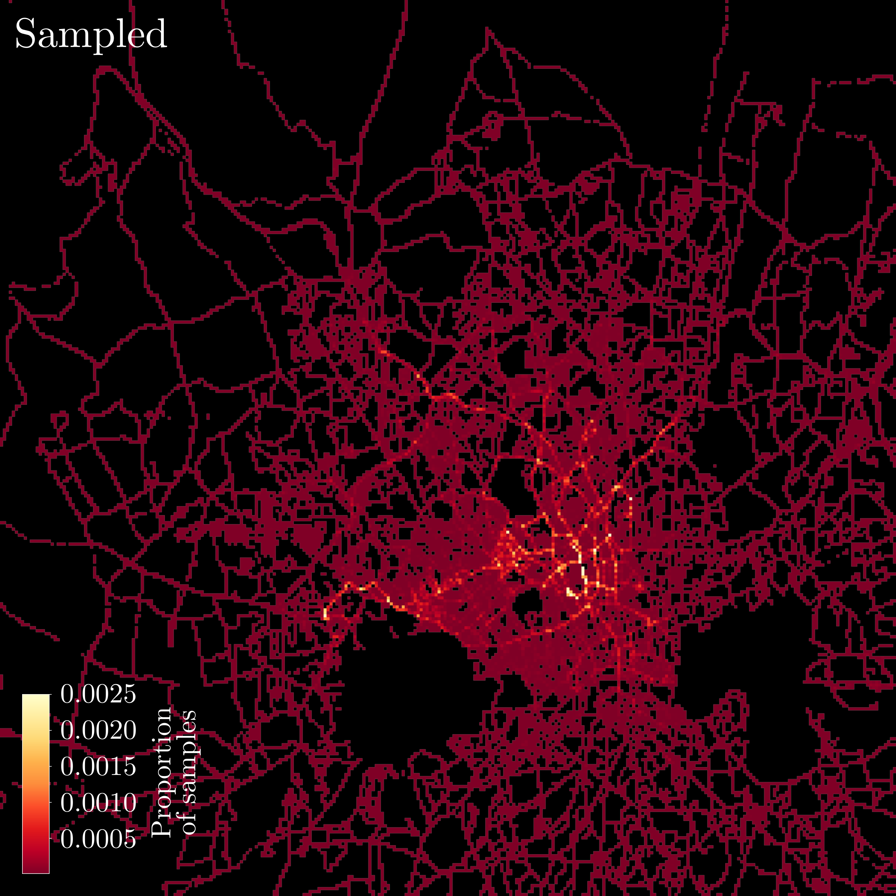 |
| 15 | `Figures/Data_Balancing/data_heatmap_validation.pdf` | `W9_srcfig_15_data_heatmap_validation.pdf` | 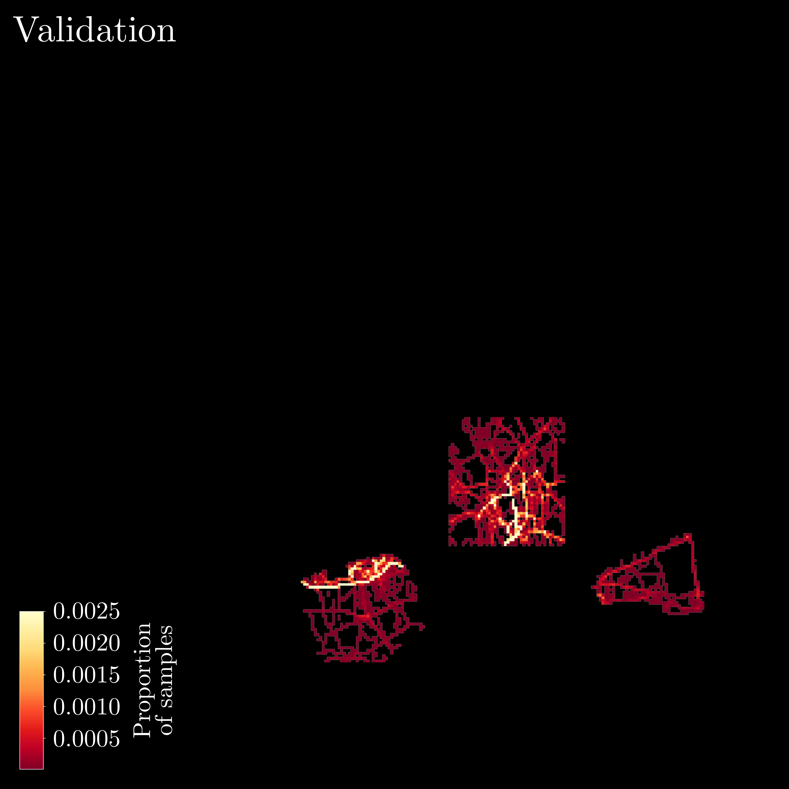 |
| 16 | `Figures/Inference/Perplexity/perplexity_argmax.pdf` | `W9_srcfig_16_perplexity_argmax.pdf` | 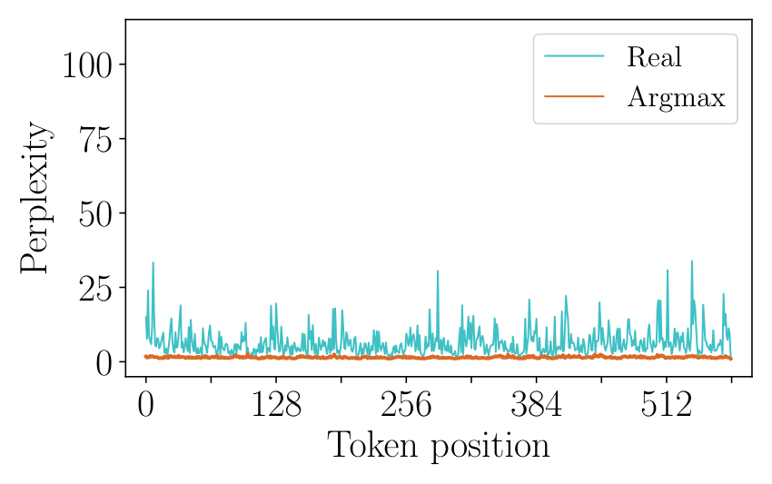 |
| 17 | `Figures/Inference/Perplexity/perplexity_sampling.pdf` | `W9_srcfig_17_perplexity_sampling.pdf` | 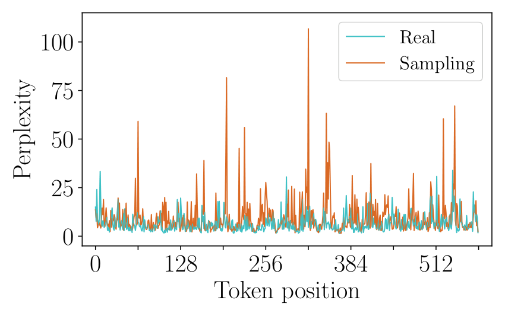 |
| 18 | `Figures/Inference/Perplexity/perplexity_topk.pdf` | `W9_srcfig_18_perplexity_topk.pdf` |  |
| 19 | `Figures/Inference/cfg_example.pdf` | `W9_srcfig_19_cfg_example.pdf` | 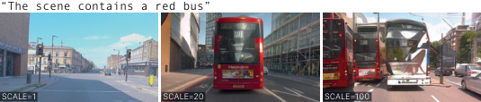 |
| 20 | `Figures/Inference/cfg_schedule.pdf` | `W9_srcfig_20_cfg_schedule.pdf` | 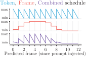 |
| 21 | `Figures/Scaling/predict_performance.pdf` | `W9_srcfig_21_predict_performance.pdf` | 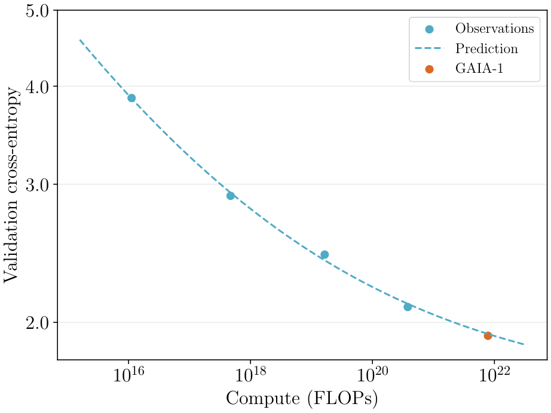 |
| 22 | `Figures/Scaling/compute.pdf` | `W9_srcfig_22_compute.pdf` | 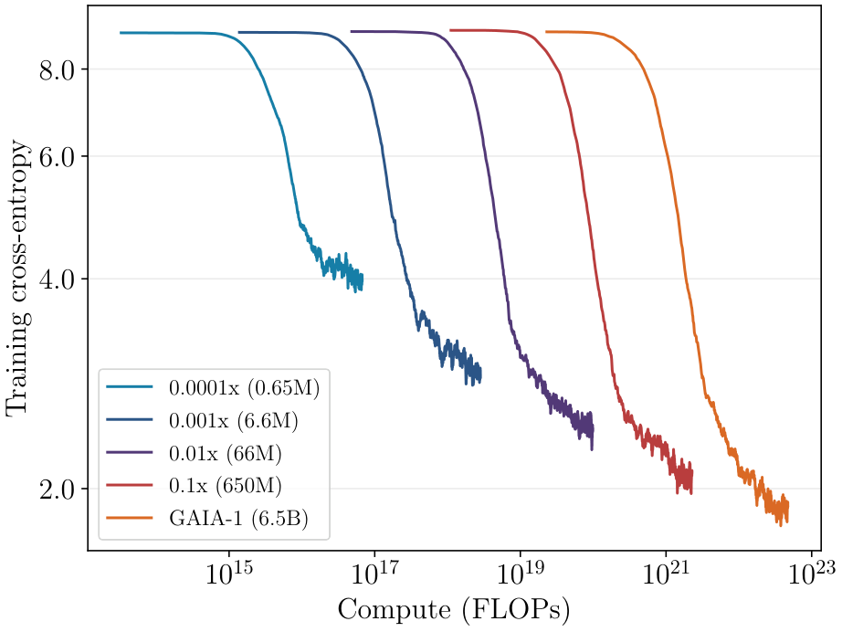 |
| 23 | `Figures/Examples/montage.png` | `W9_srcfig_23_montage.png` |  |
| 24 | `Figures/Emergent_Behaviours/long.pdf` | `W9_srcfig_24_long.pdf` | 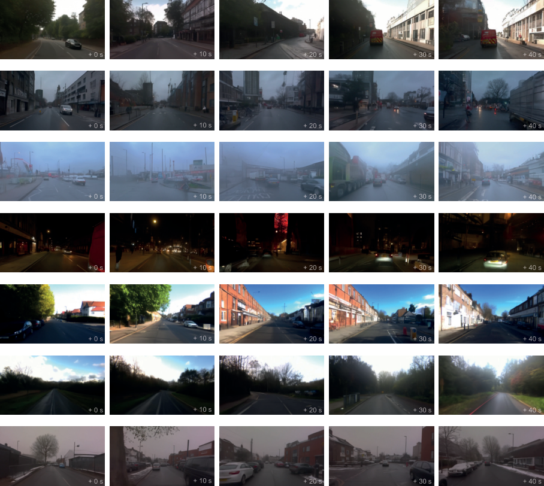 |
| 25 | `Figures/Emergent_Behaviours/multimodal.pdf` | `W9_srcfig_25_multimodal.pdf` | 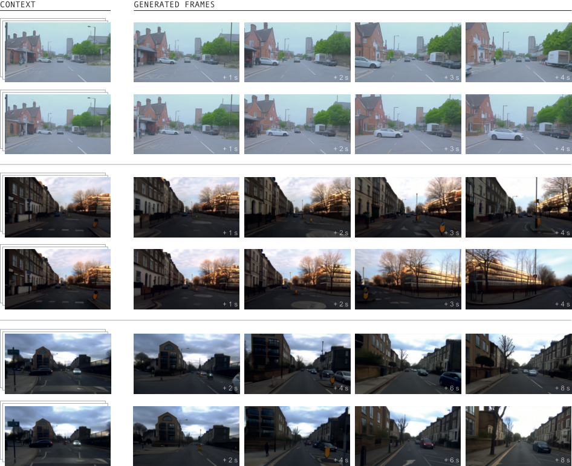 |
| 26 | `Figures/Emergent_Behaviours/weather.pdf` | `W9_srcfig_26_weather.pdf` | 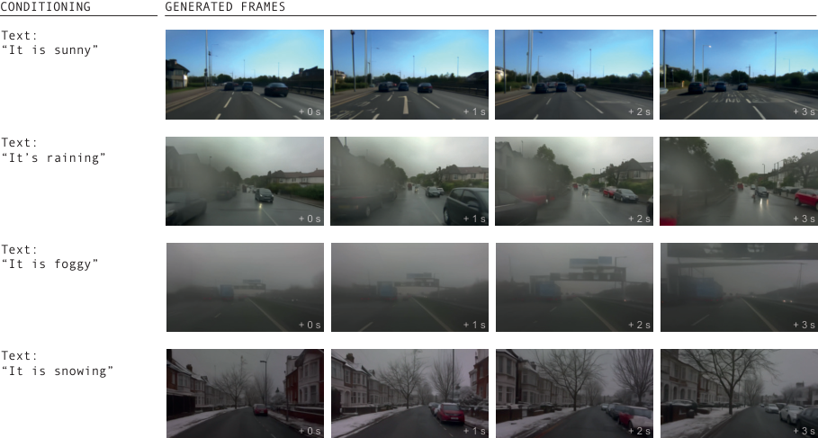 |
| 27 | `Figures/Emergent_Behaviours/illumination.pdf` | `W9_srcfig_27_illumination.pdf` | 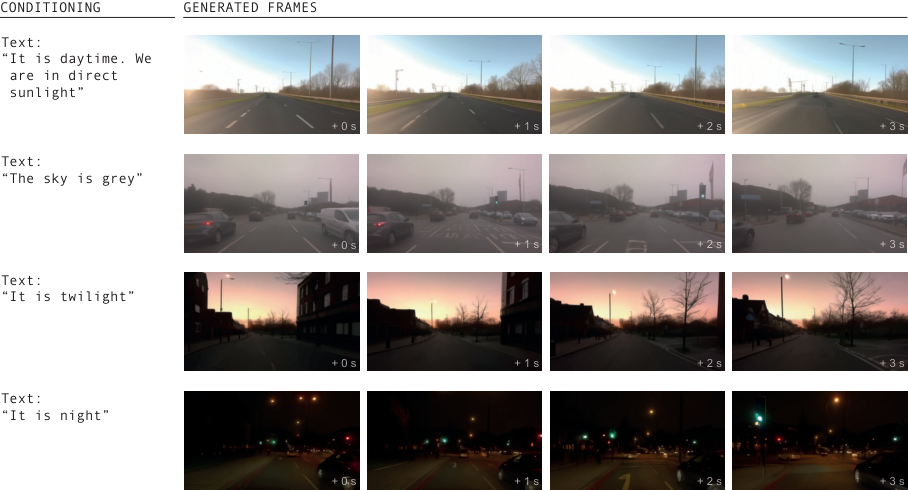 |
| 28 | `Figures/Emergent_Behaviours/actions.pdf` | `W9_srcfig_28_actions.pdf` | 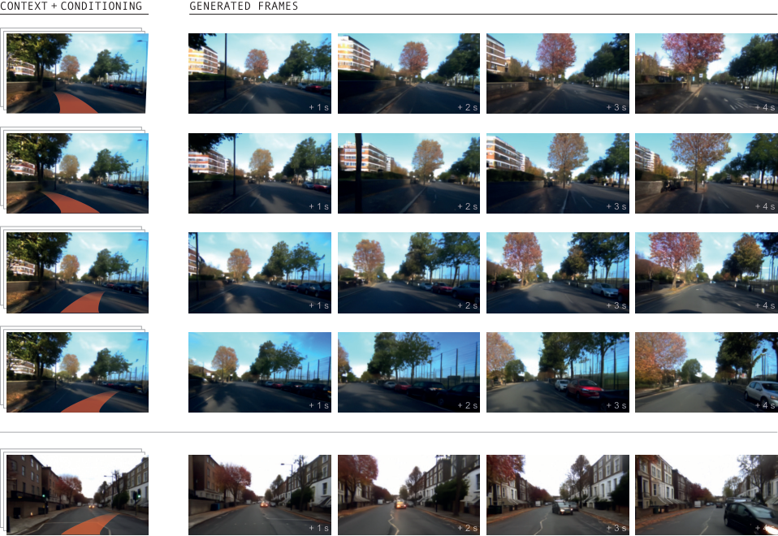 |
