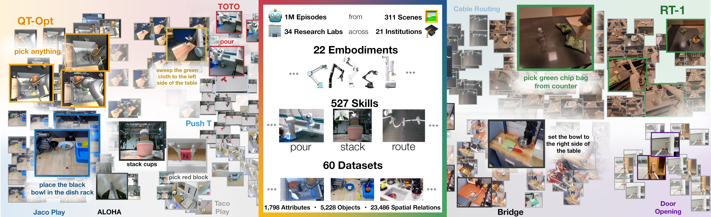
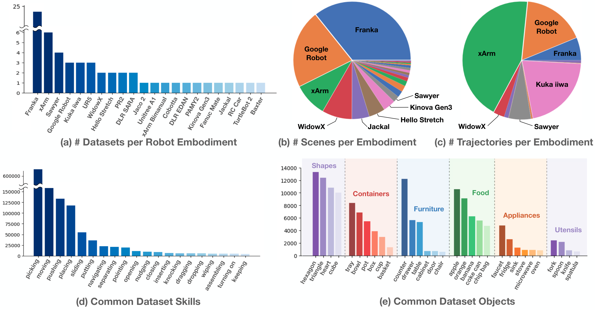
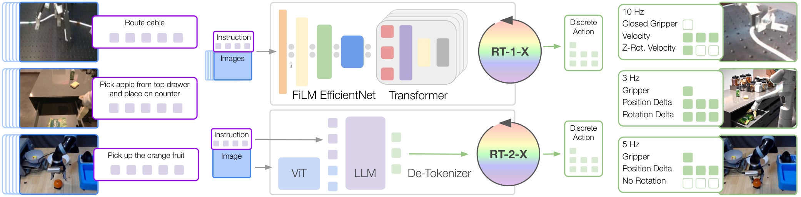

# D1. Open X-Embodiment: Robotic Learning Datasets and RT-X Models

## 0. 읽기 전 약어 및 핵심 용어

이 문서를 읽기 전에 아래 약어와 용어를 먼저 정리한다. 이후 본문에서는 괄호 안의 약어를 사용한다.

- Artificial Intelligence (AI): 사람의 지각, 추론, 학습, 의사결정 능력을 기계가 수행하도록 만드는 인공지능 분야를 뜻한다.
- Vision-Language Model (VLM): 이미지와 텍스트를 함께 입력받아 시각-언어 이해나 생성 작업을 수행하는 모델이다.
- Vision-Language-Action (VLA): 시각 관측과 언어 명령을 함께 받아 로봇 action까지 생성하는 모델 또는 학습 패러다임이다.
- Red-Green-Blue image (RGB): 색상을 red, green, blue 세 채널로 표현하는 일반 image format이다.
- Robotics Transformer (RT): robot observation을 입력받아 action을 예측하는 transformer 기반 robot policy 계열을 뜻한다.
- Robotics Transformer 1 (RT-1): Google의 실제 로봇 demonstration data로 학습한 transformer 기반 robot control policy이다.
- Robotics Transformer 2 (RT-2): web-scale vision-language knowledge와 robot trajectory를 함께 학습해 action token을 생성하는 VLA 모델이다.
- Robotics Transformer-X model family (RT-X): Open X-Embodiment 데이터 위에서 여러 robot embodiment로 확장한 RT 계열 policy family를 뜻한다.
- Robotics Transformer 1-X (RT-1-X): Open X-Embodiment 데이터로 확장 학습한 RT-1 계열 cross-embodiment policy이다.
- Robotics Transformer 2-X (RT-2-X): Open X-Embodiment 데이터로 확장 학습한 RT-2 계열 cross-embodiment VLA policy이다.
- Open X-Embodiment (OXE): 여러 기관, 로봇, task의 demonstration을 묶은 대규모 cross-embodiment robot dataset이다.
- Distributed Robot Interaction Dataset (DROID): 여러 장소에서 수집한 in-the-wild robot manipulation demonstration dataset이다.
- Reinforcement Learning Datasets (RLDS): episode, step, observation, action, reward를 표준화해 저장하는 reinforcement learning dataset format이다.
- Physical Intelligence pi-zero model (pi0): Physical Intelligence가 제안한 general robot control용 vision-language-action flow model이다.
- Physical Intelligence pi-zero-point-five model (pi0.5): pi0를 open-world household manipulation으로 확장한 VLA model이다.
- IEEE International Conference on Robotics and Automation (ICRA): robotics와 automation 분야의 대표 국제학회다.
- Physical Artificial Intelligence (Physical AI): 디지털 공간의 예측을 넘어 물리 세계에서 지각, 예측, 계획, 행동, 안전 검사를 수행하는 AI 시스템을 뜻한다.

## 1. Metadata

| Field | 내용 |
|---|---|
| ID | `D1` |
| Title | Open X-Embodiment: Robotic Learning Datasets and RT-X Models |
| Authors | Open X-Embodiment Collaboration, Abby O'Neill, Abdul Rehman, Abhinav Gupta et al. |
| Affiliation / Team | Open X-Embodiment Collaboration / Google DeepMind and 20+ institutions |
| Venue / Status | ICRA / arXiv |
| Date | 2023-10-13 |
| Link | https://arxiv.org/abs/2310.08864 |
| Local source | `paper_corpus/sources/D1` |
| Source figures | `paper_corpus/figures_source/D1/manifest.md` |

## 2. 핵심 요약

Open X-Embodiment는 여러 기관과 여러 로봇 embodiment에서 수집된 robot learning dataset을 하나의 표준화된 repository로 모으고, 이 데이터 mixture로 RT-1/RT-2 계열 모델을 학습했을 때 cross-embodiment positive transfer가 가능한지 실험한 논문이다.

핵심 메시지는 명확하다. 개별 robot dataset은 너무 좁지만, 여러 robot/기관/환경의 데이터를 합치면 generalist robot policy의 pretraining 기반이 될 수 있다. 이 논문은 그 가능성을 `Open X-Embodiment Dataset`과 `RT-1-X`, `RT-2-X` 모델로 보여준다.

## 3. 왜 중요한가?

이 논문은 Physical AI에서 “로봇 데이터도 web-scale data처럼 모으고 pretraining할 수 있는가?”라는 질문을 본격적으로 제기한 대표 논문이다.

- 22개 robot embodiment, 21개 기관, 60개 dataset, 1M+ real robot trajectories를 하나의 repository로 정리했다.
- 서로 다른 action/observation space를 coarse alignment하여 cross-embodiment training을 가능하게 했다.
- RT-1-X는 small-scale dataset domain에서 robot-specific baseline보다 평균 success rate가 50% 높았다.
- RT-2-X는 다른 robot의 dataset에서 배운 skill을 Google Robot에서 수행하는 emergent skill transfer를 보였다.
- Octo, OpenVLA, pi0, pi0.5처럼 Open X-Embodiment를 pretraining data로 사용하는 후속 generalist robot policy 흐름의 기반이 된다.

## 4. 전체 개념

Open X-Embodiment의 문제의식은 vision/NLP와 robotics의 data scaling 차이에서 출발한다. vision과 language는 web-scale data로 general pretrained backbone을 만들 수 있었지만, robotics는 개별 연구실, 개별 robot, 개별 environment에 데이터가 흩어져 있다.

  

<em>Figure 1. Open X-Embodiment는 전 세계 여러 기관에서 수집된 robot learning dataset을 통합해 다양한 behavior, embodiment, environment를 포함하는 large-scale robot dataset을 만든다. Source figure: <code>data_vis_v3.jpg</code>.</em>

발표에서는 이 그림으로 다음 질문을 던지면 좋다.

- robot learning에서도 foundation model식 pretraining이 가능하려면 무엇이 필요한가?
- 한 robot에서 모은 data만으로 generalist policy를 만들 수 있는가?
- 서로 다른 robot의 action/observation space를 완벽히 맞추지 않아도 positive transfer가 가능한가?

## 5. Open X-Embodiment Dataset

논문은 Open X-Embodiment Dataset을 22개 robot embodiment, 21개 institution, 60개 dataset으로 구성된 1M+ real robot trajectory repository로 소개한다. 각 dataset은 RLDS format으로 변환되어 공유된다.

  

<em>Figure 2. Open X-Embodiment Dataset 분석. 60개 dataset과 22개 embodiment, trajectory 수, scene diversity, language annotation에서 추출한 skill/object diversity를 보여준다. Source figure: <code>rtx_data_analysis.pdf</code>.</em>

논문에서 강조하는 dataset 특성은 다음과 같다.

| 항목 | 내용 |
|---|---|
| Robot embodiments | 22개 embodiment |
| Institutions | 21개 institution |
| Individual datasets | 60개 dataset |
| Trajectories | 1M+ real robot trajectories |
| Skills / tasks | 527 skills, 160,266 tasks |
| Data format | RLDS 기반 serialized TFRecord |
| Modalities | RGB camera, depth, point cloud 등 dataset별 다양한 observation |

이 dataset은 “완성된 universal robot dataset”이라기보다, cross-embodiment robot learning 연구를 시작할 수 있게 만드는 community infrastructure에 가깝다.

## 6. Cross-Embodiment Data Mixture

논문의 실험에서는 전체 22개 embodiment 중 당시 학습에 사용 가능한 9개 manipulator embodiment data를 robot mixture로 구성한다. 이를 수식으로 표현하면 다음과 같다.

$$
\mathcal{D}_{\mathrm{OXE}}
=
\bigcup_{e=1}^{E}
\mathcal{D}^{(e)}
$$

| Notation | 의미 |
|---|---|
| $\mathcal{D}_{\mathrm{OXE}}$ | Open X-Embodiment 또는 실험에 사용된 cross-embodiment robotics data mixture |
| $E$ | 포함된 robot embodiment 수. 논문 전체 repository는 22개, RT-X 실험 mixture는 9개 manipulator 사용 |
| $\mathcal{D}^{(e)}$ | embodiment $e$에서 수집된 robot trajectory dataset |
| $\bigcup$ | 여러 embodiment dataset을 하나의 mixture로 통합하는 연산 |

이 수식은 논문의 핵심 가정을 요약한다. 개별 dataset $\mathcal{D}^{(e)}$는 좁지만, 여러 embodiment의 union은 더 넓은 environment, object, skill coverage를 제공한다.

## 7. Observation / Action Space Consolidation

cross-embodiment training의 가장 큰 어려움은 robot마다 camera, action space, control convention이 다르다는 점이다. 논문은 이를 완벽히 정렬하지 않고 coarse alignment로 처리한다.

핵심 처리 방식은 다음과 같다.

| 항목 | 처리 방식 |
|---|---|
| Image observation | 각 dataset에서 canonical camera view 하나를 선택하고 common resolution으로 resize |
| Language instruction | task를 설명하는 text instruction 사용 |
| Action | 7-DoF end-effector action으로 변환 |
| Action normalization | dataset별 action normalization 후 discretization |
| Coordinate frame | dataset 간 coordinate frame을 완전히 align하지 않음 |
| Inference | embodiment별로 output action을 de-normalize해서 해석 |

논문이 사용하는 action vector는 다음처럼 이해할 수 있다.

$$
a_t =
[x_t, y_t, z_t, r_t, p_t, \psi_t, g_t]
$$

| Notation | 의미 |
|---|---|
| $a_t$ | timestep $t$에서 모델이 예측하는 7-dimensional end-effector action |
| $x_t,y_t,z_t$ | end-effector의 translational control component |
| $r_t,p_t,\psi_t$ | roll, pitch, yaw 방향의 rotational control component |
| $g_t$ | gripper opening 또는 gripper command |

논문은 이 7개 end-effector dimension에 terminate dimension을 더해 총 8개 dimension을 256개 bin으로 tokenization한다고 설명한다.

$$
\tilde{a}_{t,j}
=
\mathrm{bin}_{256}(a_{t,j}),
\quad
j \in \{1,\ldots,8\}
$$

| Notation | 의미 |
|---|---|
| $\tilde{a}_{t,j}$ | timestep $t$에서 $j$번째 action dimension의 discretized token |
| $a_{t,j}$ | discretization 전 continuous action component |
| $\mathrm{bin}_{256}$ | action 값을 256개 uniform bin 중 하나로 변환하는 discretization function |
| $j$ | action dimension index. 7개 end-effector component + terminate dimension |

이 부분은 매우 중요하다. Open X-Embodiment는 서로 다른 robot의 action semantics가 완전히 같다고 가정하지 않는다. 같은 action vector가 robot마다 다르게 해석될 수 있지만, dataset별 normalization/de-normalization과 large model capacity를 통해 positive transfer가 가능한지 실험한다.

## 8. RT-X Model Design

논문은 새로운 architecture를 제안하기보다, RT-1과 RT-2를 cross-embodiment data mixture에 적용해 RT-1-X, RT-2-X를 만든다.

  

<em>Figure 3. RT-1-X와 RT-2-X. 두 모델 모두 image와 text instruction을 입력으로 받고 discretized end-effector action을 출력한다. RT-1-X는 robotics-oriented EfficientNet+FiLM+Transformer 구조이고, RT-2-X는 VLM backbone을 action text token output으로 co-fine-tuning한다. Source figure: <code>rt12_teaser_model_vertical.pdf</code>.</em>

두 모델의 차이는 다음과 같다.

| Model | 구조 | 학습 데이터 | 특징 |
|---|---|---|---|
| RT-1-X | RT-1 architecture | robotics mixture only | 35M parameter, robotics-oriented Transformer policy |
| RT-2-X | RT-2 / PaLI-X VLA | robotics mixture + VLM data | 55B VLM backbone, action을 text token처럼 출력 |

RT-1-X는 robot data mixture만으로 학습되고, RT-2-X는 원래 VLM data와 robotics data mixture를 약 1:1 비율로 co-fine-tuning한다.

## 9. Training Objective

논문은 RT-1-X와 RT-2-X 모두 output space에 대해 categorical cross-entropy objective를 사용한다고 설명한다. RT-1은 discretized action bucket을 예측하고, RT-2는 language token vocabulary 안에서 action text token을 예측한다.

이를 일반화하면 다음과 같다.

$$
\mathcal{L}(\theta)
=
-
\sum_{(o_t, l, a_t) \in \mathcal{D}_{\mathrm{OXE}}}
\sum_{j=1}^{8}
\log p_{\theta}(\tilde{a}_{t,j} \mid o_{\leq t}, l)
$$

| Notation | 의미 |
|---|---|
| $\mathcal{L}(\theta)$ | RT-X policy training loss |
| $\theta$ | RT-X model parameter |
| $\mathcal{D}_{\mathrm{OXE}}$ | cross-embodiment robot data mixture |
| $o_{\leq t}$ | 현재까지의 image observation history |
| $l$ | natural language instruction |
| $a_t$ | continuous robot action |
| $\tilde{a}_{t,j}$ | discretized action token 또는 bucket |
| $j$ | 8개 action dimension index |
| $p_{\theta}$ | observation과 instruction을 조건으로 action token을 예측하는 policy distribution |

이 수식은 논문 설명을 발표용으로 정리한 것이다. 핵심은 RT-X가 imitation learning 방식으로 cross-entropy를 최소화하며, action을 discrete token/bucket 예측 문제로 바꾼다는 점이다.

## 10. In-Distribution Transfer 결과

small-scale dataset domain에서 RT-1-X는 original method 또는 해당 dataset만으로 학습한 RT-1보다 평균 success rate가 높다.

  

<em>Figure 4. RT-1-X mean success rate는 Original Method 또는 RT-1보다 50% 높다. RT-1과 RT-1-X는 같은 architecture이므로 성능 향상은 robotics data mixture co-training 효과로 해석된다. Source figure: <code>rtx_barplot_10.png</code>.</em>

해석은 다음과 같다.

- 작은 dataset을 가진 domain은 다른 robot/platform data에서 큰 도움을 받는다.
- RT-1-X와 RT-1은 architecture가 같으므로, 차이는 cross-embodiment data mixture에서 온다.
- 이는 robot learning에서도 “다른 곳에서 모은 data가 내 robot 성능을 올릴 수 있는가?”에 대한 긍정적 증거다.

다만 large-scale dataset domain에서는 RT-1-X가 항상 RT-1 baseline을 이기지 못한다. 논문은 이를 RT-1-X의 model capacity 부족, 즉 underfitting으로 해석한다.

## 11. RT-2-X와 Emergent Skill Transfer

RT-2-X는 큰 VLM backbone을 사용하기 때문에 더 큰 cross-embodiment data mixture를 흡수할 수 있다. 논문은 Bridge dataset에는 있지만 Google Robot dataset에는 없는 skill을 Google Robot에서 평가하는 emergent skill transfer를 수행한다.

  

<em>Figure 5. RT-2-X emergent skill evaluation. Bridge dataset에는 있지만 Google Robot dataset에는 없는 out-of-distribution skill을 Google Robot embodiment에서 평가한다. Source figure: <code>rt2x_eval_v9.png</code>.</em>

핵심 결과는 다음과 같다.

| Model / Ablation | Emergent Skills | RT-2 Generalization |
|---|---:|---:|
| RT-2 55B | 27.3% | 62% |
| RT-2-X 55B | 75.8% | 61% |
| RT-2-X 55B without Bridge | 42.8% | 54% |
| RT-2-X 5B with history | 44.4% | 52% |
| RT-2-X 5B no history | 14.5% | 30% |
| RT-2-X 5B from scratch, no web co-training | 0% | 1% |

가장 중요한 해석은 RT-2-X가 RT-2보다 emergent skill evaluation에서 약 3배 높은 성능을 보였다는 점이다. 또한 Bridge data를 제거하면 성능이 크게 떨어져, 다른 robot의 data가 실제 transfer source였음을 시사한다.

## 12. Design Decision 해석

논문의 ablation은 RT-X가 잘 되기 위한 조건을 보여준다.

| Design factor | 관찰 |
|---|---|
| Model capacity | 55B RT-2-X가 5B RT-2-X보다 emergent skill transfer에서 훨씬 강하다. |
| Web pretraining | from-scratch 5B model은 generalization이 거의 실패한다. |
| Observation history | 짧은 image history가 generalization을 크게 개선한다. |
| Data composition | Bridge를 제거하면 emergent skill 성능이 크게 떨어진다. |
| Architecture | RT-1-X는 small data domain에는 강하지만 large mixture를 완전히 흡수하기엔 capacity가 부족하다. |

즉, cross-embodiment data만 많다고 되는 것이 아니라, 이를 흡수할 model capacity와 web-pretrained VLM backbone이 중요하다.

## 13. World Model 관점에서의 위치

Open X-Embodiment는 world model 논문은 아니다. dynamics prediction이나 latent rollout을 학습하지 않는다. 그러나 World Model/Physical AI 스터디에서 중요하다. 이유는 “world model을 만들거나 generalist policy를 만들기 위해 필요한 physical interaction data infrastructure”를 제공하기 때문이다.

| 관점 | D1의 의미 |
|---|---|
| physical data scaling | robot interaction data를 cross-institution, cross-embodiment로 통합한다. |
| embodiment diversity | 다른 robot에서 배운 skill이 target robot에 transfer될 수 있음을 보인다. |
| action unification | 서로 다른 robot action을 coarse 7-DoF end-effector action으로 맞춘다. |
| generalist policy | RT-1-X/RT-2-X로 multi-robot policy pretraining 가능성을 보인다. |
| 한계 | explicit dynamics/world prediction 없이 imitation learning policy를 학습한다. |

따라서 D1은 world model 자체보다, world model 또는 VLA를 scale하기 위한 robot data foundation으로 읽는 것이 좋다.

## 14. 한계

| 한계 | 의미 |
|---|---|
| coarse action alignment | coordinate frame이나 action semantics를 완전히 align하지 않는다. |
| new robot generalization 미검증 | 논문은 완전히 새로운 robot embodiment로의 generalization을 직접 다루지 않는다. |
| positive transfer criterion 부재 | 언제 positive transfer가 일어나고 언제 negative transfer가 나는지 결정 기준은 아직 없다. |
| sensing/actuation 다양성 제한 | 매우 다른 sensing/action modality를 가진 robot까지 충분히 다루지는 않는다. |
| model capacity 의존성 | RT-1-X는 large dataset domain에서 underfitting을 보인다. |
| dataset imbalance | 일부 robot/dataset이 trajectory 수나 scene diversity를 크게 차지한다. |

논문은 RT-X가 cross-embodied robot generalist로 가는 한 걸음이지만, 아직 많은 open problem이 남아 있다고 명확히 말한다.

## 15. 후속 연구와 연결

| 후속 흐름 | 연결 |
|---|---|
| RT-1 (`G4`) | RT-1 architecture를 cross-embodiment mixture로 확장해 RT-1-X가 됨 |
| RT-2 (`G6`) | RT-2 VLA를 cross-embodiment robotics mixture로 확장해 RT-2-X가 됨 |
| Octo | Open X-Embodiment 800K episodes로 open-source generalist robot policy pretraining |
| OpenVLA (`D5`) | Open X-Embodiment 기반 open-source VLA policy 흐름 |
| pi0 / pi0.5 | large-scale multi-robot data와 generalist action model 흐름으로 확장 |
| DROID / real-world in-the-wild datasets | controlled lab dataset을 넘어 in-the-wild robot data scaling으로 확장 |

## 16. 발표 구성 추천

1. `문제의식`: vision/language는 web-scale pretraining이 되는데 robotics는 왜 어려운가?
2. `Dataset`: 22 embodiment, 21 institution, 60 dataset, 1M+ trajectory의 의미를 설명한다.
3. `Data unification`: observation/action space를 coarse하게 맞추는 방식을 설명한다.
4. `Model`: RT-1-X와 RT-2-X가 각각 무엇을 계승하고 어떻게 다르게 학습되는지 설명한다.
5. `수식`: dataset mixture, action discretization, cross-entropy objective를 발표용으로 정리한다.
6. `결과`: RT-1-X의 small dataset positive transfer와 RT-2-X의 emergent skill transfer를 중심으로 설명한다.
7. `한계`: capacity, negative transfer, new robot generalization, action alignment 문제를 짚는다.

## 17. 발표 질문

- 서로 다른 robot의 data를 섞으면 언제 도움이 되고 언제 방해가 될까?
- RT-1-X는 왜 small dataset domain에서는 강하지만 large dataset domain에서는 underfit될까?
- action coordinate frame을 완전히 맞추지 않아도 transfer가 가능한 이유는 무엇일까?
- RT-2-X의 emergent skill은 진짜 skill transfer인가, 아니면 VLM knowledge와 data mixture의 조합인가?
- Open X-Embodiment 같은 dataset infrastructure가 world model 연구에 어떤 역할을 할 수 있을까?

## 18. 요약 코멘트

Open X-Embodiment는 Physical AI에서 data scaling의 방향을 바꾼 논문이다. Gato, RT-1, RT-2가 generalist robot policy의 가능성을 보여줬다면, D1은 그 가능성을 여러 기관, 여러 robot, 여러 dataset으로 확장할 수 있는지 묻는다. 이 논문은 world model 자체는 아니지만, 이후 generalist VLA와 robot foundation model이 학습될 수 있는 physical data backbone을 제공한다는 점에서 매우 중요하다.