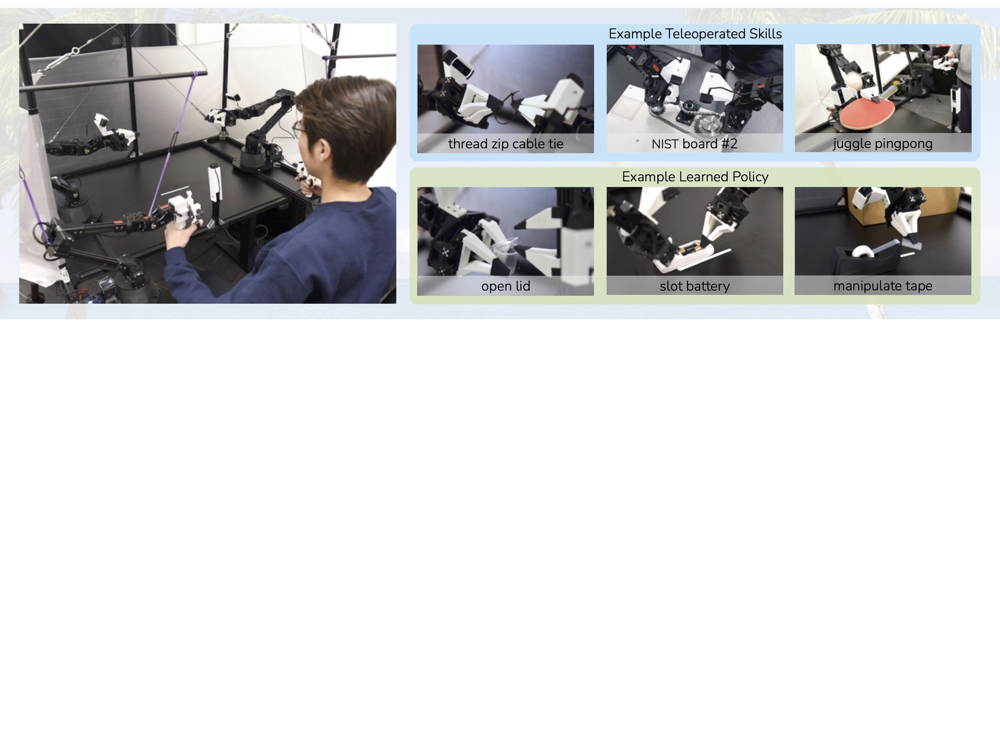
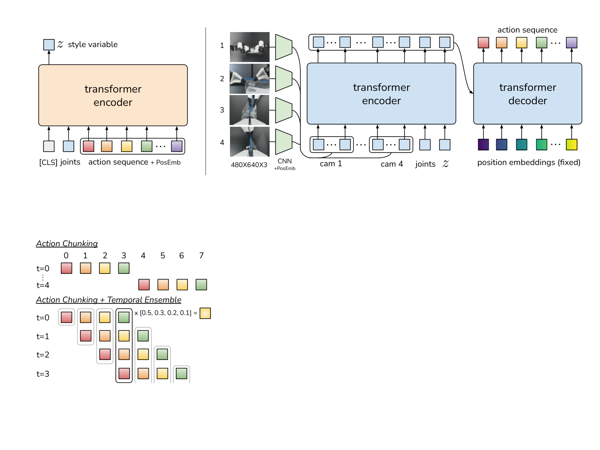
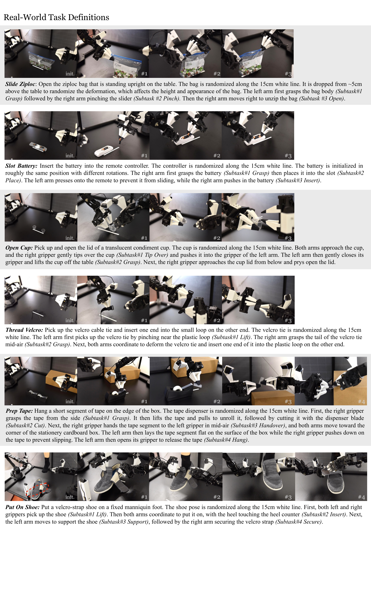
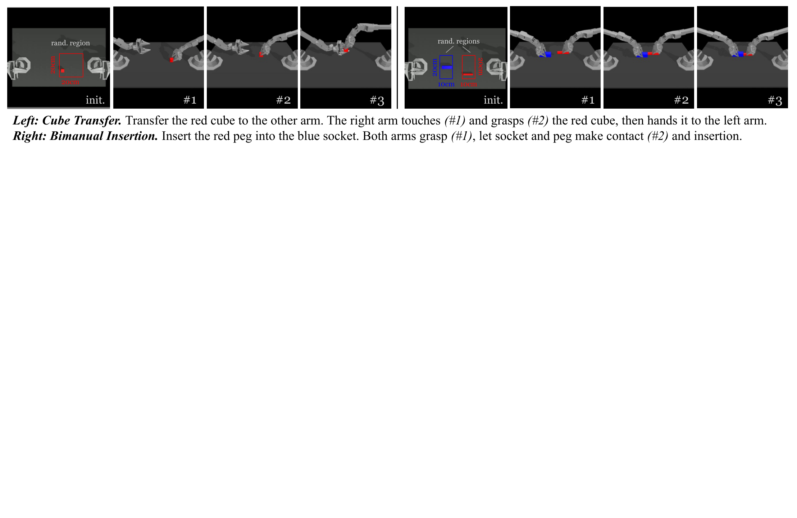

# D2. Learning Fine-Grained Bimanual Manipulation with Low-Cost Hardware

## 0. 읽기 전 약어 및 핵심 용어

이 문서를 읽기 전에 아래 약어와 용어를 먼저 정리한다. 이후 본문에서는 괄호 안의 약어를 사용한다.

- Artificial Intelligence (AI): 사람의 지각, 추론, 학습, 의사결정 능력을 기계가 수행하도록 만드는 인공지능 분야를 뜻한다.
- Vision-Language-Action (VLA): 시각 관측과 언어 명령을 함께 받아 로봇 action까지 생성하는 모델 또는 학습 패러다임이다.
- Red-Green-Blue image (RGB): 색상을 red, green, blue 세 채널로 표현하는 일반 image format이다.
- Behavior Cloning (BC): expert demonstration의 observation-action pair를 supervised learning으로 모방하는 imitation learning 방법이다.
- Conditional Variational Autoencoder (CVAE): 조건 변수에 따라 latent variable을 샘플링하고 output을 재구성하는 generative model이다.
- Kullback-Leibler divergence (KL): 두 확률분포 사이의 차이를 측정하는 information-theoretic divergence이다.
- Mean Squared Error (MSE): 예측값과 정답의 차이를 제곱해 평균한 regression loss이다.
- Robotics Transformer (RT): robot observation을 입력받아 action을 예측하는 transformer 기반 robot policy 계열을 뜻한다.
- Robotics Transformer 1 (RT-1): Google의 실제 로봇 demonstration data로 학습한 transformer 기반 robot control policy이다.
- Robotics Transformer-X model family (RT-X): Open X-Embodiment 데이터 위에서 여러 robot embodiment로 확장한 RT 계열 policy family를 뜻한다.
- RT-X shorthand (RTX): Open X-Embodiment 맥락에서 RT-X 계열 robot policy를 줄여 부르는 표기다.
- A Low-cost Open-source Hardware System for Bimanual Teleoperation (ALOHA): 저비용 양팔 teleoperation hardware와 imitation learning setup을 뜻한다.
- Action Chunking with Transformers (ACT): 여러 timestep의 action chunk를 한 번에 예측해 fine-grained robot manipulation을 학습하는 transformer policy이다.
- Visual Imitation through Nearest Neighbors (VINN): 현재 관측과 유사한 demonstration을 찾아 action을 결정하는 nearest-neighbor imitation baseline이다.
- Physical Intelligence pi-zero model (pi0): Physical Intelligence가 제안한 general robot control용 vision-language-action flow model이다.
- Physical Intelligence pi-zero-point-five model (pi0.5): pi0를 open-world household manipulation으로 확장한 VLA model이다.
- United States Dollar (USD): 미국 달러 통화 단위이며, hardware cost나 budget을 표현할 때 쓰인다.
- Physical Artificial Intelligence (Physical AI): 디지털 공간의 예측을 넘어 물리 세계에서 지각, 예측, 계획, 행동, 안전 검사를 수행하는 AI 시스템을 뜻한다.

## 1. Metadata

| Field | 내용 |
|---|---|
| ID | `D2` |
| Title | Learning Fine-Grained Bimanual Manipulation with Low-Cost Hardware |
| Authors | Tony Z. Zhao, Vikash Kumar, Sergey Levine, Chelsea Finn |
| Affiliation / Team | Stanford University / UC Berkeley / Meta |
| Venue / Status | RSS 2023 / arXiv |
| Date | 2023-04-23 |
| Link | https://arxiv.org/abs/2304.13705 |
| Local source | `paper_corpus/sources/D2` |
| Source figures | `paper_corpus/figures_source/D2/manifest.md` |

## 2. 핵심 요약

이 논문은 ALOHA라는 저비용 bimanual teleoperation hardware와 ACT(Action Chunking with Transformers)라는 imitation learning algorithm을 함께 제안한다. 목표는 비싼 dexterous hand나 고정밀 sensor 없이도, condiment cup 열기나 battery slotting 같은 fine-grained bimanual manipulation을 real robot에서 학습하는 것이다.

ACT의 핵심은 single-step action을 예측하지 않고 future action sequence를 chunk로 예측하는 것이다. 여기에 overlapping chunk를 평균내는 temporal ensembling과 human demonstration variability를 다루는 CVAE objective를 결합한다.

## 3. 왜 중요한가?

- ALOHA는 이후 Mobile ALOHA, ACT, pi0/pi0.5의 dexterous manipulation 실험 흐름에 직접적인 기반이 된다.
- action chunking은 Diffusion Policy, pi0, pi0.5의 action chunk formulation으로 이어진다.
- low-cost hardware와 high-quality teleoperation data가 robot learning scaling에서 얼마나 중요한지 보여준다.
- 10분 또는 50개 demonstration만으로 여러 fine manipulation task를 80-90% success 수준까지 학습했다.
- VLA foundation model 이전 단계에서 "좋은 로봇 데이터는 어떻게 만들고, action을 어떻게 출력해야 하는가"를 매우 잘 보여준다.

## 4. ALOHA System

ALOHA는 두 개의 leader robot과 두 개의 follower robot을 사용한다. 사용자가 작은 WidowX leader arm을 직접 backdrive하면, 큰 ViperX follower arm이 joint-space mapping으로 이를 따라간다.

  

<em>Figure 1. ALOHA system. 전체 시스템은 off-the-shelf robot과 3D printed component로 구성되며 20k USD 이하 비용을 목표로 한다. 왼쪽은 leader robot을 backdrive하는 teleoperation, 오른쪽은 precise/contact-rich/dynamic task 예시다. Source figure: <code>figures/setup.jpg</code>.</em>

논문은 ALOHA를 설계할 때 low-cost, versatile, user-friendly, repairable, easy-to-build라는 5개 기준을 둔다. 특히 fine manipulation에서 task-space mapping보다 joint-space mapping을 선택한 이유가 중요하다.

| 설계 선택 | 이유 |
|---|---|
| joint-space mapping | singularity 근처에서도 inverse kinematics 실패를 피하고 latency를 줄임 |
| low-cost ViperX follower | 연구실이 재현 가능한 budget 확보 |
| smaller WidowX leader | kinesthetic teleoperation을 쉽게 구현 |
| 3D printed handle/scissor | backdriving과 gripper control을 쉽게 만듦 |
| four camera views | top/front/two wrist view로 visual feedback 확보 |

## 5. Hardware Detail

  

<em>Figure 2. ALOHA detailed setup. front/top/two wrist camera와 bimanual workspace, handle and scissor mechanism, custom gripper, ViperX 6-DoF robot spec을 보여준다. Source figure: <code>figures/setup_close.pdf</code>.</em>

teleoperation과 data recording은 50Hz로 동작한다. 논문은 user study에서 5Hz로 낮추면 completion time이 62% 증가한다고 보고하며, fine manipulation에서는 high-frequency teleoperation이 중요하다고 주장한다.

## 6. ACT Overview

ACT는 current observation을 보고 다음 $k$ step의 action sequence를 예측한다.

  

<em>Figure 3. ACT architecture. CVAE encoder는 action sequence와 joint observation을 style variable $z$로 압축하고, test time에는 버려진다. decoder/policy는 multi-view image, joint position, $z$를 받아 transformer로 future action sequence를 예측한다. Source figure: <code>figures/algo.pdf</code>.</em>

ACT는 세 가지 아이디어의 결합이다.

| 구성 | 역할 |
|---|---|
| action chunking | single-step BC보다 effective horizon을 줄이고 temporally correlated confounder를 완화 |
| temporal ensembling | overlapping action chunk를 평균내어 motion을 smooth하게 만듦 |
| CVAE objective | human demonstration의 variability와 multimodality를 latent variable로 표현 |

## 7. Action Chunking

기존 behavioral cloning이 매 timestep마다 하나의 action만 예측한다면, ACT는 현재 observation에서 다음 $k$개의 action을 한 번에 예측한다.

$$
\hat{\mathbf{a}}_{t:t+k}
=
\pi_{\theta}(\mathbf{o}_t)
$$

| Notation | 의미 |
|---|---|
| $\hat{\mathbf{a}}_{t:t+k}$ | policy가 예측한 future action chunk |
| $\pi_{\theta}$ | ACT policy |
| $\theta$ | policy parameter |
| $\mathbf{o}_t$ | timestep $t$의 observation |
| $k$ | chunk size |

action chunking은 compounding error를 줄이는 데 중요하다. 전체 task horizon이 $T$일 때, single-step policy는 $T$번의 decision point를 갖지만, $k$ step chunk를 실행하면 effective horizon이 대략 $T/k$로 줄어든다.

$$
H_{\mathrm{effective}}
\approx
\frac{T}{k}
$$

| Notation | 의미 |
|---|---|
| $H_{\mathrm{effective}}$ | action chunking 이후의 effective decision horizon |
| $T$ | 전체 episode 길이 |
| $k$ | 한 번에 예측/실행하는 action chunk 길이 |

단, $k$가 너무 크면 open-loop에 가까워져 observation 변화에 반응하지 못한다. 논문 ablation에서도 chunk size가 너무 커지면 성능이 떨어지는 구간이 나타난다.

## 8. Temporal Ensembling

naive action chunking은 $k$ step마다 새 observation을 반영하므로 action이 갑자기 바뀌어 motion이 jerky해질 수 있다. ACT는 매 timestep policy를 query하고, 특정 timestep에 대해 여러 chunk가 예측한 action을 weighted average한다.

$$
w_i
=
\exp(-m i)
$$

| Notation | 의미 |
|---|---|
| $w_i$ | 현재 timestep action을 계산할 때 $i$번째 예측 chunk에 부여하는 weight |
| $i$ | action prediction의 상대적 age/index |
| $m$ | exponential weighting의 decay 정도를 조절하는 hyperparameter |

temporal ensemble은 overlap되는 여러 예측을 부드럽게 합쳐 precise manipulation에서 motion smoothness를 높인다. 논문은 BC-ConvMLP와 ACT 같은 parametric policy에서 temporal ensembling이 도움이 된다고 보고한다.

## 9. CVAE Objective

ACT는 human demonstration의 variability를 모델링하기 위해 CVAE로 학습된다. encoder는 observation과 action sequence를 latent style variable $z$로 압축하고, decoder는 observation과 $z$를 조건으로 action chunk를 생성한다.

학습 objective는 reconstruction loss와 KL regularization의 합이다.

$$
\mathcal{L}_{\mathrm{reconst}}
=
\mathrm{MSE}
\left(
\hat{\mathbf{a}}_{t:t+k},
\mathbf{a}_{t:t+k}
\right)
$$

| Notation | 의미 |
|---|---|
| $\mathcal{L}_{\mathrm{reconst}}$ | predicted action chunk와 demonstration action chunk 사이의 reconstruction loss |
| $\hat{\mathbf{a}}_{t:t+k}$ | ACT decoder가 예측한 action chunk |
| $\mathbf{a}_{t:t+k}$ | demonstration에서 나온 ground-truth action chunk |
| $\mathrm{MSE}$ | mean squared error |

$$
\mathcal{L}_{\mathrm{reg}}
=
D_{\mathrm{KL}}
\left(
q_{\phi}
(z \mid \mathbf{a}_{t:t+k}, \bar{\mathbf{o}}_t)
\parallel
\mathcal{N}(0,\mathbf{I})
\right)
$$

| Notation | 의미 |
|---|---|
| $\mathcal{L}_{\mathrm{reg}}$ | CVAE latent distribution을 standard Gaussian prior에 가깝게 만드는 KL regularization |
| $D_{\mathrm{KL}}$ | Kullback-Leibler divergence |
| $q_{\phi}$ | CVAE encoder distribution |
| $\phi$ | encoder parameter |
| $z$ | style latent variable |
| $\bar{\mathbf{o}}_t$ | encoder에 사용되는 observation representation |
| $\mathcal{N}(0,\mathbf{I})$ | standard Gaussian prior |

최종 loss는 다음과 같다.

$$
\mathcal{L}
=
\mathcal{L}_{\mathrm{reconst}}
+
\beta
\mathcal{L}_{\mathrm{reg}}
$$

| Notation | 의미 |
|---|---|
| $\mathcal{L}$ | ACT training loss |
| $\beta$ | KL regularization의 강도를 조절하는 weight |

논문은 scripted data처럼 deterministic한 demonstration에서는 CVAE 제거가 큰 차이를 만들지 않지만, human data에서는 CVAE objective가 중요하다고 보고한다. 이는 human demonstration이 noisy하고 multimodal하기 때문이다.

## 10. Training and Inference

training에서는 demonstration dataset $\mathcal{D}$에서 observation과 action chunk를 sample하고, CVAE encoder/decoder를 함께 학습한다.

$$
(\mathbf{o}_t, \mathbf{a}_{t:t+k}) \sim \mathcal{D}
$$

| Notation | 의미 |
|---|---|
| $\mathcal{D}$ | ALOHA teleoperation으로 수집한 demonstration dataset |
| $\mathbf{o}_t$ | current observation |
| $\mathbf{a}_{t:t+k}$ | current timestep 이후 $k$ step action sequence |

inference에서는 encoder를 버리고, $z$를 prior mean인 0으로 설정한다.

$$
z = \mathbf{0}
$$

| Notation | 의미 |
|---|---|
| $z$ | style variable |
| $\mathbf{0}$ | prior mean; test time에서 deterministic policy처럼 사용 |

논문 구현에서 ACT는 약 80M parameter이고, task별로 scratch training한다. RTX 2080 Ti 하나에서 약 5시간 학습, inference는 약 0.01초로 보고된다.

## 11. Real-World Tasks

  

<em>Figure 4. Real-world task definitions. ALOHA/ACT는 condiment cup open, slide ziploc, slot battery, thread velcro, prep tape, put on shoe 등 6개 real-world fine manipulation task를 평가한다. Source figure: <code>figures/real_tasks.pdf</code>.</em>

이 task들은 단순 pick-and-place가 아니다. 얇은 film을 잡아당기거나, 작은 battery를 slot에 넣거나, deformable한 물체를 다루는 등 contact-rich, high-precision, bimanual coordination을 요구한다.

## 12. Simulation Tasks and Data

  

<em>Figure 5. Simulated task definitions. sim transfer cube와 sim insertion task는 scripted data와 human data 조건에서 ACT와 baseline을 비교하는 데 사용된다. Source figure: <code>figures/sim_tasks.pdf</code>.</em>

  

<em>Figure 6. Data collection and evaluation examples. fine manipulation task는 visual observation과 bimanual coordination이 강하게 결합되어 있어 data quality와 action representation이 모두 중요하다. Source figure: <code>figures/fm_data.pdf</code>.</em>

## 13. Experimental Results

논문은 ACT를 BC-ConvMLP, BeT, VINN, RT-1 등과 비교한다.

| 결과 포인트 | 내용 |
|---|---|
| simulated tasks | scripted/human data 모두에서 ACT가 baseline보다 높은 success |
| Slide Ziploc | ACT가 88% final success |
| Slot Battery | ACT가 96% final success |
| Cup Open | ACT가 84% success |
| Put On Shoe | ACT가 92% success |
| Thread Velcro | ACT도 어려워 final 20% success |

저자들은 baseline들이 초반 stage 이후 거의 진전하지 못하는 반면, ACT는 action chunking과 temporal ensembling 덕분에 fine manipulation sequence를 더 안정적으로 이어간다고 해석한다.

## 14. Ablation 핵심

논문 ablation의 핵심 메시지는 명확하다.

| Ablation | 해석 |
|---|---|
| chunk size $k$ 변화 | $k=1$보다 action chunking이 좋지만, 너무 큰 $k$는 open-loop 성격이 강해져 성능 저하 |
| temporal ensemble 제거 | ACT와 BC-ConvMLP는 smoothness 이득을 잃음 |
| CVAE 제거 | scripted data에서는 영향이 작지만 human data에서는 성능 저하 |
| 5Hz teleoperation | 50Hz보다 completion time이 62% 느려짐 |

이 결과는 fine manipulation에서 data collection frequency, action horizon, human demonstration variability가 모두 중요한 설계 축이라는 점을 보여준다.

## 15. Physical AI / World Model 관점

ACT는 world model을 학습하지 않는다. 오히려 complex contact dynamics를 명시적으로 모델링하기 어렵기 때문에 pixel-to-action closed-loop policy를 학습한다는 입장에 가깝다.

| 관점 | ACT의 선택 |
|---|---|
| dynamics modeling | 명시적 contact/deformation model 대신 demonstration policy 학습 |
| observation | RGB multi-view camera와 joint position |
| action | continuous target joint position sequence |
| temporal structure | action chunking과 temporal ensemble |
| uncertainty/multimodality | CVAE latent variable |

world model 스터디에서는 이 논문을 "복잡한 물리 세계를 예측하지 않고도, 좋은 teleoperation data와 action sequence policy로 어디까지 갈 수 있는가"라는 반대축 사례로 읽으면 좋다.

## 16. 후속 연구와의 연결

| 연결 논문 | 연결 포인트 |
|---|---|
| Diffusion Policy (`P1`) | action sequence generation과 receding horizon control로 이어짐 |
| pi0 (`P4`) | action chunk $H=50$과 dexterous manipulation data의 기반 |
| pi0.5 (`P5`) | mobile manipulator와 dexterous long-horizon household task의 기반 |
| Mobile ALOHA | ALOHA hardware를 mobile platform으로 확장 |
| Open X-Embodiment (`D1`) | ALOHA-style data가 cross-embodiment dataset의 중요한 구성 요소가 됨 |

## 17. 한계와 주의점

- task별 scratch training이 필요하므로 foundation model은 아니다.
- low-cost hardware지만 여전히 bimanual setup과 teleoperation skill이 필요하다.
- buttoning a dress shirt, flat ziploc opening, candy unwrapping처럼 더 어려운 deformable/contact task에는 실패 사례가 있다.
- CVAE는 variability를 다루지만, explicit uncertainty-aware planning이나 recovery policy는 아니다.
- generalization 범위는 foundation VLA보다 좁고, task-specific imitation learning에 가깝다.

## 18. 발표 구성 제안

1. fine manipulation이 왜 어려운지 condiment cup/battery 예시로 시작한다.
2. ALOHA hardware가 어떻게 저비용으로 high-quality demonstration을 수집하는지 설명한다.
3. ACT architecture figure로 CVAE encoder/decoder와 action chunking을 설명한다.
4. action chunking, temporal ensembling, CVAE loss를 수식으로 정리한다.
5. real-world task와 result를 보여주며 baseline과 비교한다.
6. ablation을 통해 "chunking, temporal ensemble, CVAE가 각각 왜 필요한지"를 설명한다.
7. pi0/pi0.5와 연결해, robot foundation model의 action head가 왜 chunked continuous action을 선호하게 되었는지 정리한다.

## 19. 토론 질문

- fine manipulation에서 action chunking은 왜 single-step BC보다 강한가?
- chunk size $k$는 task horizon, feedback frequency, inference latency와 어떤 trade-off를 만들까?
- CVAE와 diffusion/flow action model은 human demonstration multimodality를 다루는 방식에서 어떻게 다른가?
- low-cost hardware가 robot learning 연구의 scaling bottleneck을 얼마나 줄일 수 있을까?
- 운영/현장 적용 관점에서 teleoperation workflow, operator fatigue, data quality control을 어떻게 최적화할 수 있을까?

## 20. 한 문장 정리

ALOHA/ACT는 저비용 bimanual teleoperation과 action chunking 기반 transformer imitation learning을 결합해, 후속 dexterous robot foundation model의 데이터 수집과 action representation에 큰 영향을 준 논문이다.