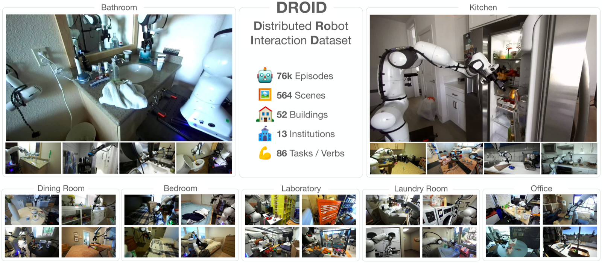
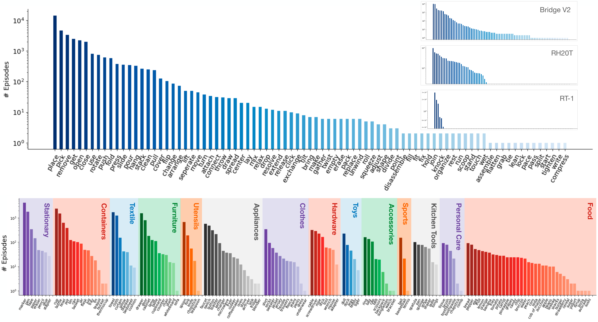
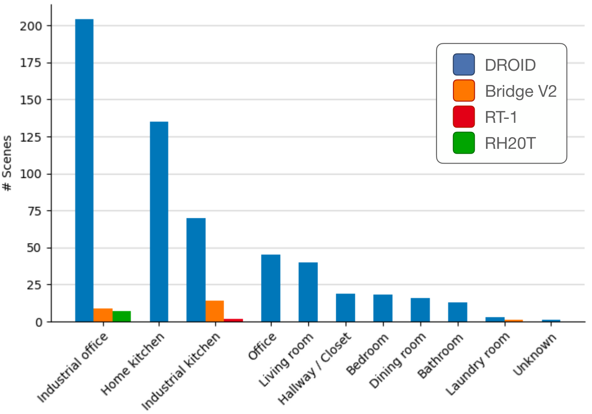
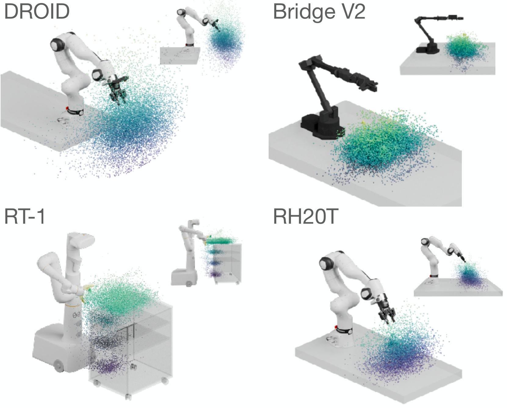
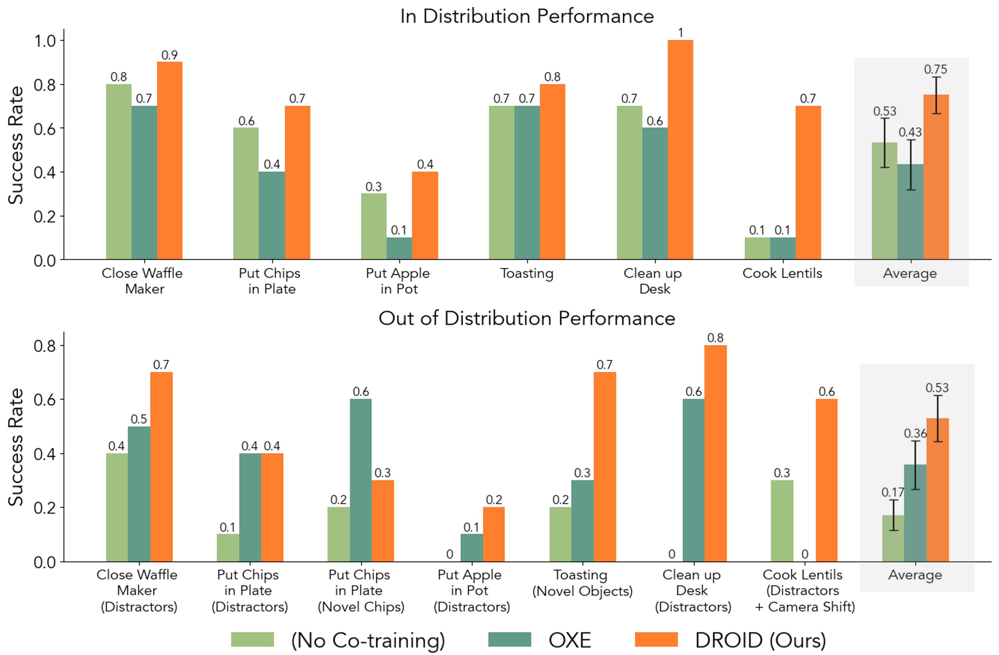
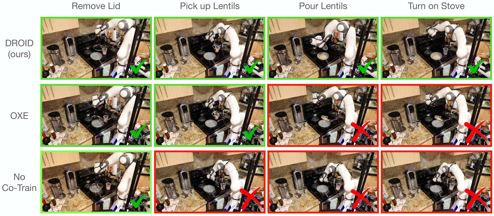

# D3. DROID: A Large-Scale In-The-Wild Robot Manipulation Dataset

## 0. 읽기 전 약어 및 핵심 용어

이 문서를 읽기 전에 아래 약어와 용어를 먼저 정리한다. 이후 본문에서는 괄호 안의 약어를 사용한다.

- Artificial Intelligence (AI): 사람의 지각, 추론, 학습, 의사결정 능력을 기계가 수행하도록 만드는 인공지능 분야를 뜻한다.
- Graphical User Interface (GUI): 사용자가 버튼, 창, 시각 요소를 통해 시스템과 상호작용하는 interface이다.
- Vision-Language-Action (VLA): 시각 관측과 언어 명령을 함께 받아 로봇 action까지 생성하는 모델 또는 학습 패러다임이다.
- Red-Green-Blue image (RGB): 색상을 red, green, blue 세 채널로 표현하는 일반 image format이다.
- Red-Green-Blue plus Depth image (RGB-D): RGB image에 각 pixel의 depth 정보를 함께 포함한 visual observation이다.
- Out-of-Distribution (OOD): 학습 데이터 분포와 다른 object, scene, task, embodiment, environment 조건을 뜻한다.
- Robotics Transformer (RT): robot observation을 입력받아 action을 예측하는 transformer 기반 robot policy 계열을 뜻한다.
- Robotics Transformer 1 (RT-1): Google의 실제 로봇 demonstration data로 학습한 transformer 기반 robot control policy이다.
- Robotics Transformer-X model family (RT-X): Open X-Embodiment 데이터 위에서 여러 robot embodiment로 확장한 RT 계열 policy family를 뜻한다.
- Open X-Embodiment (OXE): 여러 기관, 로봇, task의 demonstration을 묶은 대규모 cross-embodiment robot dataset이다.
- Distributed Robot Interaction Dataset (DROID): 여러 장소에서 수집한 in-the-wild robot manipulation demonstration dataset이다.
- A Low-cost Open-source Hardware System for Bimanual Teleoperation (ALOHA): 저비용 양팔 teleoperation hardware와 imitation learning setup을 뜻한다.
- Action Chunking with Transformers (ACT): 여러 timestep의 action chunk를 한 번에 예측해 fine-grained robot manipulation을 학습하는 transformer policy이다.
- Segment Anything Model (SAM): prompt를 받아 이미지 안의 object mask를 생성하는 general-purpose image segmentation model이다.
- Physical Intelligence pi-zero model (pi0): Physical Intelligence가 제안한 general robot control용 vision-language-action flow model이다.
- Physical Intelligence pi-zero-point-five model (pi0.5): pi0를 open-world household manipulation으로 확장한 VLA model이다.
- Physical Artificial Intelligence (Physical AI): 디지털 공간의 예측을 넘어 물리 세계에서 지각, 예측, 계획, 행동, 안전 검사를 수행하는 AI 시스템을 뜻한다.

## 1. Metadata

| Field | 내용 |
|---|---|
| ID | `D3` |
| Title | DROID: A Large-Scale In-The-Wild Robot Manipulation Dataset |
| Authors | Alexander Khazatsky, Karl Pertsch, Suraj Nair, Ashwin Balakrishna et al. |
| Affiliation / Team | UC Berkeley / Stanford / CMU / Google DeepMind and collaborators |
| Venue / Status | RSS 2024 / arXiv |
| Date | 2024-03-19 |
| Link | https://arxiv.org/abs/2403.12945 |
| Local source | `paper_corpus/sources/D3` |
| Source figures | `paper_corpus/figures_source/D3/manifest.md` |

## 2. 핵심 요약

DROID는 "in-the-wild" robot manipulation dataset이다. 18개 연구실, 50명 data collector, 12개월 동안 18대의 동일 Franka 기반 hardware stack으로 564개 scene, 86개 task, 76k successful demonstration trajectory, 350시간 interaction data를 수집했다.

핵심 메시지는 foundation robot policy 성능을 높이려면 단순히 trajectory 수만 늘리는 것이 아니라 scene, object, task, viewpoint, interaction location diversity가 필요하다는 것이다. 논문은 DROID로 diffusion policy를 co-training하면 in-domain과 OOD evaluation에서 Open X-Embodiment co-training보다도 높은 성능과 robustness를 얻는다고 보고한다.

## 3. 왜 중요한가?

- Open X-Embodiment가 여러 dataset의 aggregation이라면, DROID는 동일 hardware stack으로 distributed in-the-wild data를 체계적으로 수집했다.
- 각 episode에 3개 synchronized RGB camera stream, depth, camera calibration, language annotation을 포함한다.
- dataset diversity를 task/object/scene/viewpoint/interaction location 축으로 분석한다.
- policy evaluation에서 DROID co-training이 no co-training과 OXE co-training보다 평균적으로 더 좋은 성능을 보인다.
- pi0.5처럼 open-world household generalization을 다루는 연구에서 environment diversity의 중요성을 뒷받침한다.

## 4. Dataset Overview

  

<em>Figure 1. DROID overview. DROID는 76k trajectories, 350 hours, 564 scenes, 86 tasks, 52 buildings, 12 months에 걸친 in-the-wild robot manipulation dataset이다. episode마다 3개 RGB camera stream, calibration, depth, language instruction을 포함한다. Source figure: <code>figures/droid_teaser.pdf</code>.</em>

| 항목 | 값 |
|---|---:|
| successful trajectories | 76k |
| interaction hours | 350 |
| scenes | 564 |
| buildings | 52 |
| tasks | 86 |
| months | 12 |
| data collectors | 50 |
| robots | 18 |
| institutions | 13 |
| labs | 18 |
| failed trajectories released separately | 16k |
| license | CC-BY 4.0 |

이 수치에서 중요한 것은 trajectory scale보다 scene scale이다. 논문은 기존 대규모 manipulation dataset들이 대부분 적은 scene에서 반복 수집된 반면, DROID는 실제 lab/office/home 환경을 넓게 커버한다는 점을 강조한다.

## 5. Standardized Hardware Stack

DROID는 distributed data collection을 위해 모든 기관이 같은 robot platform을 사용한다.

  

<em>Figure 2. DROID robot platform. Franka Panda 7DoF arm, Robotiq 2F-85 gripper, 두 개의 adjustable Zed 2 stereo camera, wrist-mounted Zed Mini camera, Quest 2 teleoperation controller, portable height-adjustable desk로 구성된다. Source figure: <code>figures/droid_setup.pdf</code>.</em>

hardware를 통일한 이유는 distributed collection에서도 action/state/camera format을 일관되게 유지하기 위해서다. OXE처럼 heterogeneous embodiment를 모으는 방식과 달리, DROID는 scene/task diversity를 극대화하면서 robot embodiment variance는 줄이는 전략을 택한다.

## 6. Data Collection Protocol

DROID 수집 protocol은 diversity와 quality control을 동시에 목표로 한다.

| 단계 | 내용 |
|---|---|
| scene 이동 | robot을 새로운 lab, office, kitchen, household scene으로 이동 |
| camera setup | third-person camera가 다양한 behavior를 담도록 배치 |
| calibration | checkerboard와 OpenCV로 extrinsic calibration 수행 |
| task list 입력 | GUI에 scene에서 가능한 task instruction 입력 |
| random task prompt | episode마다 task를 random sample하여 쉬운 task 편향을 줄임 |
| scene augmentation | base nudge, camera 이동/재보정, lighting 변화, object 추가/제거 |
| metadata logging | camera stream, state, action, collector ID, task metadata, success label 기록 |

이 protocol은 운영 관점에서도 흥미롭다. data collection을 operator의 자율성에만 맡기지 않고, GUI와 randomization으로 task coverage와 scene variation을 설계한다.

## 7. Diversity Axes

DROID는 robot dataset diversity를 여러 축으로 나눠 분석한다.

  

<em>Figure 3. Verb and object distribution. DROID는 long-tail verb distribution과 다양한 everyday object category를 포함한다. Source figure: <code>figures/droid_verb_objects_highres.pdf</code>.</em>

| Diversity axis | 의미 |
|---|---|
| task diversity | 어떤 verb/skill을 수행하는가 |
| object diversity | 어떤 물체와 상호작용하는가 |
| scene diversity | 얼마나 다양한 physical workspace에서 수집되었는가 |
| viewpoint diversity | camera angle과 pose가 얼마나 다양한가 |
| interaction location diversity | robot base 기준 3D interaction point가 얼마나 넓게 분포하는가 |

## 8. Scene, Viewpoint, Interaction Diversity

  

<em>Figure 4. Scene distribution. DROID는 기존 large manipulation dataset보다 scene diversity가 크며, lab-like setup을 넘어 office/home 등 다양한 workspace를 포함한다. Source figure: <code>figures/scene_distribution.pdf</code>.</em>

  

<em>Figure 5. Viewpoint distribution. third-person camera viewpoint가 다양해, camera angle 변화에 대한 robustness를 학습할 수 있다. Source figure: <code>figures/droid_viewpoint_distribution.pdf</code>.</em>

  

<em>Figure 6. Interaction location distribution. robot base 기준 interaction point가 넓게 분포하며, table height나 workspace location 변화에 대한 일반화와 연결된다. Source figure: <code>figures/droid_interaction_points.pdf</code>.</em>

이 세 figure는 "데이터가 많다"보다 "데이터가 물리적으로 다양하다"는 주장을 뒷받침한다. 특히 interaction point diversity는 Physical AI에서 단순 visual diversity를 넘어 robot kinematics와 workspace geometry까지 포함하는 diversity metric으로 볼 수 있다.

## 9. Policy Training Setup

DROID 논문의 목표는 새로운 policy architecture 제안이 아니라 dataset의 효과 검증이다. 그래서 evaluation에서는 채택된 표준적인 Diffusion Policy pipeline을 사용한다.

정책은 language instruction, 두 개 external RGB camera stream, robot proprioception을 입력으로 받고, absolute end-effector translation, rotation, gripper action을 출력한다.

$$
\pi_{\theta}
(\mathbf{a}_{t:t+H}
\mid
\mathbf{o}_t, \ell)
$$

| Notation | 의미 |
|---|---|
| $\pi_{\theta}$ | language-conditioned diffusion policy |
| $\theta$ | policy parameter |
| $\mathbf{a}_{t:t+H}$ | policy가 생성하는 action trajectory 또는 action chunk |
| $\mathbf{o}_t$ | camera observation과 proprioception을 포함한 current observation |
| $\ell$ | natural language instruction |
| $H$ | action horizon |

논문 구현에서는 diffusion policy가 16-step action sequence를 생성하고, rollout 중에는 8 step을 open-loop로 실행한 뒤 다시 policy inference를 수행한다.

co-training은 간단한 50/50 batch mixing으로 수행된다.

$$
\mathcal{B}
=
0.5 \mathcal{B}_{\mathrm{in}}
+
0.5 \mathcal{B}_{\mathrm{DROID}}
$$

| Notation | 의미 |
|---|---|
| $\mathcal{B}$ | training mini-batch |
| $\mathcal{B}_{\mathrm{in}}$ | 특정 evaluation task의 in-domain demonstration batch |
| $\mathcal{B}_{\mathrm{DROID}}$ | DROID에서 sample한 successful demonstration batch |
| $0.5$ | 두 data source를 동일 비율로 섞는 mixing ratio |

이 단순한 mixture만으로 성능이 올라간다는 점이 논문의 강한 메시지다. 즉, dataset diversity 자체가 policy robustness의 중요한 driver다.

## 10. Co-Training Results

  

<em>Figure 7. Co-training results. DROID co-training은 no co-training과 OXE co-training보다 in-distribution과 OOD success rate 모두에서 높다. 논문은 next best method 대비 in-distribution 22%, OOD 17% absolute success rate 개선을 보고한다. Source figure: <code>figures/cotrain.png</code>.</em>

evaluation은 6개 task와 4개 location에서 수행된다.

| Task | 특징 |
|---|---|
| Closing Waffle Maker | lab setting short-horizon |
| Place Chips on Plate | distractor가 있는 pick-place |
| Put Apple in Pot | pot lid까지 포함한 medium-horizon |
| Toasting | novel object OOD variant 포함 |
| Clean up Desk | drawer open/place/close long-horizon |
| Cook Lentils | kitchen setting long-horizon cooking task |

논문은 DROID로 co-training한 policy가 OOD distractor, novel object, camera shift에서 더 robust하다고 보고한다.

  

<em>Figure 8. Qualitative rollout on Cook Lentils. DROID co-training policy는 long-horizon task에서 더 smooth하고 precise한 motion을 보이며, no co-training이나 OXE co-training보다 안정적으로 task를 이어간다. Source figure: <code>figures/droid_qualitative_rollout.pdf</code>.</em>

## 11. Scene Diversity Ablation

논문은 DROID의 장점이 단순 size인지 scene diversity인지 확인하기 위해, 같은 7,362 trajectory 크기에서 두 subset을 비교한다.

| Subset | 구성 |
|---|---|
| DROID 7k, 20 Scenes | 가장 demonstration이 많은 20개 scene에서 선택 |
| DROID 7k, Diverse Scenes | 전체 dataset에서 uniform random sample하여 scene diversity 유지 |

  

<em>Figure 9. Scene diversity ablation. 동일한 dataset size에서도 diverse scene subset이 20-scene subset보다 OOD performance가 높다. Source figure: <code>figures/filteredcotrain.png</code>.</em>

이 실험은 "많은 demonstration"보다 "다양한 scene coverage"가 OOD robustness에 중요하다는 것을 보여준다.

## 12. Camera Calibration과 Geometric Utility

DROID는 camera calibration도 중요한 dataset feature로 제공한다. appendix에서는 camera-to-base calibration quality를 평가하기 위해 3D keypoint를 image plane으로 project하고, rendered robot mask와 SAM mask의 IoU를 계산한다.

projection은 다음과 같이 표현된다.

$$
\mathbf{x}
=
\pi
\left(
\mathbf{K}
\mathbf{T}_{\mathrm{cam}\rightarrow\mathrm{base}}
\mathbf{X}
\right)
$$

| Notation | 의미 |
|---|---|
| $\mathbf{x}\in\mathbb{R}^{N\times 2}$ | projected 2D keypoints |
| $\pi(\cdot)$ | perspective projection과 normalization |
| $\mathbf{K}$ | camera intrinsic matrix |
| $\mathbf{T}_{\mathrm{cam}\rightarrow\mathrm{base}}$ | camera frame에서 robot base frame으로의 extrinsic transformation |
| $\mathbf{X}\in\mathbb{R}^{N\times 3}$ | robot kinematics로 얻은 3D keypoints |

calibration quality는 mask IoU로 평가된다.

$$
\mathrm{IoU}
=
\frac{
|\mathcal{M}_{\mathrm{SAM}}
\cap
\mathcal{M}_{\mathrm{GT}}|
}{
|\mathcal{M}_{\mathrm{SAM}}
\cup
\mathcal{M}_{\mathrm{GT}}|
}
$$

| Notation | 의미 |
|---|---|
| $\mathrm{IoU}$ | predicted mask와 rendered ground-truth mask의 overlap quality |
| $\mathcal{M}_{\mathrm{SAM}}$ | SAM으로 얻은 robot segmentation mask |
| $\mathcal{M}_{\mathrm{GT}}$ | robot mesh/URDF와 camera calibration으로 rendering한 synthetic mask |
| $\cap$ | intersection |
| $\cup$ | union |

논문은 약 36k unique scene에 대해 camera-to-base calibration을 제공하고, camera-to-camera calibration도 함께 제공한다. 이는 3D-aware robot representation, viewpoint-invariant policy, visual grounding 연구에 유용하다.

## 13. Physical AI / World Model 관점

DROID는 world model 논문은 아니지만, world model과 physical AI 연구에 매우 중요한 데이터 기반을 제공한다.

| 연구 질문 | DROID의 기여 |
|---|---|
| physical world의 다양성을 어떻게 데이터화할 것인가? | scene/task/object/viewpoint/interaction location diversity로 분해 |
| policy robustness는 어디서 오는가? | in-domain data + diverse in-the-wild co-training |
| geometric world understanding을 어떻게 지원할 것인가? | depth, multi-view camera, calibration 제공 |
| embodiment heterogeneity를 어떻게 다룰 것인가? | robot은 통일하고 environment/task diversity를 우선 확대 |
| dataset quality를 어떻게 관리할 것인가? | standardized hardware, GUI protocol, success metadata, calibration release |

world model 학습 관점에서는 DROID의 multi-view RGB-D, language, action, calibration이 future latent dynamics나 3D scene representation 학습에 좋은 기반이 될 수 있다.

## 14. 기존 논문들과의 연결

| 연결 논문 | 연결 포인트 |
|---|---|
| Open X-Embodiment (`D1`) | OXE는 heterogeneous embodiment aggregation, DROID는 standardized hardware의 in-the-wild scene diversity |
| Diffusion Policy (`P1`) | DROID evaluation policy backbone으로 diffusion policy 사용 |
| ALOHA/ACT (`D2`) | teleoperation-based high-quality demonstration collection 흐름 |
| pi0.5 (`P5`) | environment diversity와 household generalization의 중요성을 뒷받침 |
| RT-1 / RT-X | large-scale robot data가 policy generalization을 만든다는 계보 |

## 15. 한계와 주의점

- DROID는 동일 Franka-based hardware stack을 사용하므로 embodiment diversity는 OXE보다 제한적이다.
- dataset 자체가 large-scale policy를 보장하는 것은 아니며, 어떤 subset과 mixture를 쓸지 여전히 연구 문제다.
- camera calibration은 post-hoc automatic pipeline을 포함하지만 false positive와 clutter/low-overlap failure 가능성이 있다.
- task language와 data collection protocol은 human collector의 입력과 선택에 영향을 받는다.
- in-the-wild diversity는 높지만, long-horizon household task 전체를 end-to-end로 다루는 pi0.5 수준의 task complexity와는 차이가 있다.

## 16. 발표 구성 제안

1. "robot data는 web처럼 scrape할 수 없다"는 문제로 시작한다.
2. DROID의 scale 수치를 보여주되, trajectory 수보다 scene diversity를 강조한다.
3. standardized hardware stack과 distributed data collection protocol을 설명한다.
4. task/object/scene/viewpoint/interaction location diversity figure를 순서대로 보여준다.
5. diffusion policy co-training setup과 50/50 mixture를 설명한다.
6. DROID vs no co-training vs OXE 결과를 통해 diversity의 효과를 설명한다.
7. scene diversity ablation으로 "무작정 많이"가 아니라 "다양하게"가 중요하다는 메시지를 정리한다.
8. pi0.5의 open-world generalization과 연결해 data recipe 관점으로 마무리한다.

## 17. 토론 질문

- OXE처럼 embodiment를 다양화하는 것과 DROID처럼 scene을 다양화하는 것 중 어떤 축이 더 먼저 필요한가?
- robot data collection에서 "scene diversity"를 정량화하고 최적화하려면 어떤 metric이 필요할까?
- 50/50 co-training보다 더 좋은 data mixture ratio를 자동으로 찾을 수 있을까?
- DROID의 calibrated multi-view RGB-D data는 explicit world model 학습에 어떻게 활용될 수 있을까?
- 운영/현장 적용 관점에서 distributed robot data collection protocol을 작업 배정, 품질 관리, 샘플링 최적화 문제로 모델링할 수 있을까?

## 18. 한 문장 정리

DROID는 standardized Franka-based robot fleet로 수집한 대규모 in-the-wild manipulation dataset이며, scene/task/object/viewpoint diversity가 robot policy의 robustness와 OOD generalization을 실제로 높인다는 것을 보여준다.