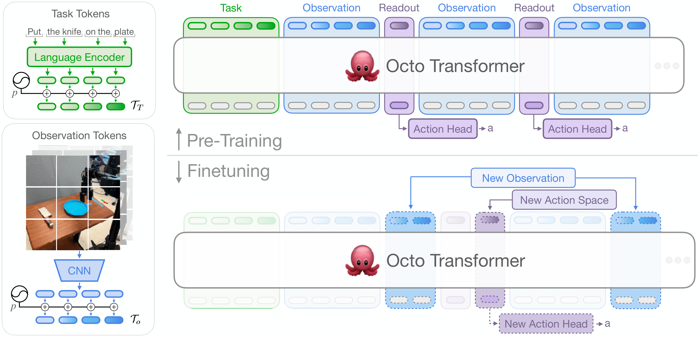
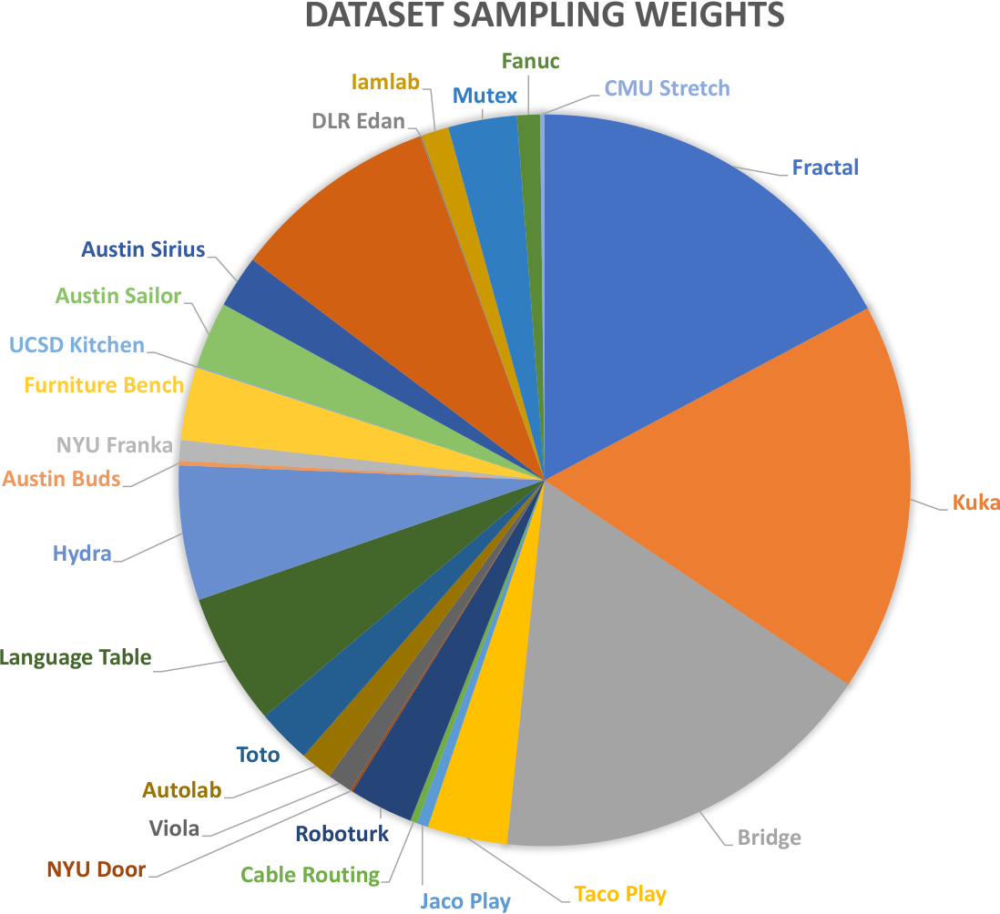
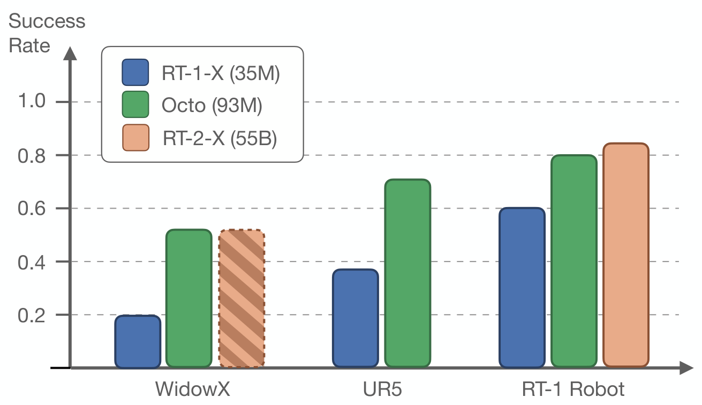

# D4. Octo: An Open-Source Generalist Robot Policy

## 0. 읽기 전 약어 및 핵심 용어

이 문서를 읽기 전에 아래 약어와 용어를 먼저 정리한다. 이후 본문에서는 괄호 안의 약어를 사용한다.

- Artificial Intelligence (AI): 사람의 지각, 추론, 학습, 의사결정 능력을 기계가 수행하도록 만드는 인공지능 분야를 뜻한다.
- Data Science and Business Analytics (DSBA): 데이터 과학, 비즈니스 분석, AI 기반 의사결정을 다루는 연구실/전공 맥락을 뜻한다.
- Vision-Language Model (VLM): 이미지와 텍스트를 함께 입력받아 시각-언어 이해나 생성 작업을 수행하는 모델이다.
- Vision-Language-Action (VLA): 시각 관측과 언어 명령을 함께 받아 로봇 action까지 생성하는 모델 또는 학습 패러다임이다.
- Denoising Diffusion Probabilistic Model (DDPM): noise를 점진적으로 제거하는 reverse process를 학습하는 diffusion generative model이다.
- Mean Squared Error (MSE): 예측값과 정답의 차이를 제곱해 평균한 regression loss이다.
- Robotics Transformer (RT): robot observation을 입력받아 action을 예측하는 transformer 기반 robot policy 계열을 뜻한다.
- Robotics Transformer 1 (RT-1): Google의 실제 로봇 demonstration data로 학습한 transformer 기반 robot control policy이다.
- Robotics Transformer 2 (RT-2): web-scale vision-language knowledge와 robot trajectory를 함께 학습해 action token을 생성하는 VLA 모델이다.
- Robotics Transformer-X model family (RT-X): Open X-Embodiment 데이터 위에서 여러 robot embodiment로 확장한 RT 계열 policy family를 뜻한다.
- Robotics Transformer 1-X (RT-1-X): Open X-Embodiment 데이터로 확장 학습한 RT-1 계열 cross-embodiment policy이다.
- Robotics Transformer 2-X (RT-2-X): Open X-Embodiment 데이터로 확장 학습한 RT-2 계열 cross-embodiment VLA policy이다.
- Open X-Embodiment (OXE): 여러 기관, 로봇, task의 demonstration을 묶은 대규모 cross-embodiment robot dataset이다.
- Distributed Robot Interaction Dataset (DROID): 여러 장소에서 수집한 in-the-wild robot manipulation demonstration dataset이다.
- Physical Intelligence pi-zero model (pi0): Physical Intelligence가 제안한 general robot control용 vision-language-action flow model이다.
- Graphics Processing Unit (GPU): 대규모 neural network 학습과 병렬 연산을 빠르게 수행하는 processor이다.
- Physical Artificial Intelligence (Physical AI): 디지털 공간의 예측을 넘어 물리 세계에서 지각, 예측, 계획, 행동, 안전 검사를 수행하는 AI 시스템을 뜻한다.

## 1. Metadata

| Field | 내용 |
|---|---|
| ID | `D4` |
| Title | Octo: An Open-Source Generalist Robot Policy |
| Authors | Octo Model Team, Dibya Ghosh, Homer Walke, Karl Pertsch et al. |
| Affiliation / Team | UC Berkeley / Stanford / Google DeepMind and collaborators |
| Venue / Status | RSS 2024 / arXiv |
| Date | 2024-05-20 |
| Link | https://arxiv.org/abs/2405.12213 |
| Local source | `paper_corpus/sources/D4` |
| Source figures | `paper_corpus/figures_source/D4/manifest.md` |

## 2. 핵심 요약

Octo는 Open X-Embodiment dataset의 25개 dataset, 800k trajectories로 학습한 open-source generalist robot policy다. language command 또는 goal image로 task를 지정할 수 있고, diffusion action head를 통해 continuous, multimodal, chunked action을 생성한다.

핵심은 "pretrained robot policy를 새 로봇/새 task/새 observation/action space에 빠르게 fine-tuning할 수 있는가"이다. Octo는 modular tokenizer, transformer backbone, readout token, diffusion head 구조를 통해 observation input이나 action output이 바뀌어도 대부분의 pretrained weight를 유지하고 새 component만 추가할 수 있게 설계했다.

## 3. 왜 중요한가?

- RT-X 이후 open-source generalist robot policy를 본격적으로 제공한 논문이다.
- 25개 OXE dataset, 800k trajectory를 사용해 cross-embodiment pretraining을 수행했다.
- language instruction과 goal image conditioning을 모두 지원한다.
- diffusion decoding head가 MSE action head나 discretized action prediction보다 좋다는 ablation을 제시한다.
- 약 100개 target demonstration과 5시간 미만의 consumer GPU fine-tuning으로 새 domain에 적응 가능함을 보인다.

## 4. Overall Concept

  

<em>Figure 1. Octo overview. Octo는 diverse robot dataset에서 pretraining된 transformer-based generalist policy이며, language 또는 goal image로 task를 지정하고 새 robot setup에 fine-tuning할 수 있다. Source figure: <code>figures/octo_teaser_figure.pdf</code>.</em>

Octo를 이해할 때 중요한 대비는 다음이다.

| 계열 | 특징 |
|---|---|
| RT-1/RT-X | large-scale robot transformer, discrete action token 중심 |
| OpenVLA | VLM backbone 기반 autoregressive action token VLA |
| Octo | robot policy transformer + diffusion action head + open-source finetuning recipe |
| pi0 | VLM backbone + flow matching action expert |

Octo는 VLM 기반 reasoning보다는 "robot policy initialization과 flexible finetuning"에 초점을 둔다.

## 5. Architecture

Octo는 input tokenizer, transformer backbone, readout head로 구성된다.

  

<em>Figure 2. Octo architecture. language, goal image, observation sequence가 modality-specific tokenizer를 통해 common token sequence로 변환되고, transformer backbone이 이를 처리한다. readout token은 action head에 전달되어 diffusion process로 action chunk를 생성한다. Source figure: <code>figures/architecture.pdf</code>.</em>

논문은 Octo policy를 다음처럼 설명한다.

$$
e_{\ell}, e_g, e_o
=
T
\left(
\mathcal{T}_{\ell},
\mathcal{T}_{g},
\mathcal{T}_{o}
\right)
$$

| Notation | 의미 |
|---|---|
| $T$ | transformer backbone |
| $\mathcal{T}_{\ell}$ | language instruction tokenizer가 만든 language tokens |
| $\mathcal{T}_{g}$ | goal image tokenizer가 만든 goal tokens |
| $\mathcal{T}_{o}$ | observation tokenizer가 만든 observation tokens |
| $e_{\ell}, e_g, e_o$ | transformer가 출력한 language/goal/observation embedding |

이 구조의 강점은 tokenized input만 잘 맞추면 다양한 camera, goal, language, proprioception 구성에 대응할 수 있다는 점이다.

## 6. Readout Token과 Diffusion Action Head

Octo는 observation/task token 사이에 learned readout token을 넣는다. readout token은 과거 observation과 task token을 attend하지만, observation/task token은 readout token을 attend하지 않는다. 즉, readout token은 BERT의 `[CLS]`처럼 compact embedding을 읽어오는 역할을 한다.

action head는 readout embedding $e$를 조건으로 diffusion denoising을 수행한다.

$$
x^{k-1}
=
\alpha
\left(
x^k
-
\gamma
\epsilon_{\theta}(x^k, e, k)
+
\mathcal{N}(0,\sigma^2 I)
\right)
$$

| Notation | 의미 |
|---|---|
| $x^k$ | diffusion step $k$에서의 noisy action sample |
| $x^{k-1}$ | 한 단계 denoising된 action sample |
| $e$ | transformer readout embedding |
| $\epsilon_{\theta}(x^k,e,k)$ | noisy action, readout embedding, diffusion step을 조건으로 noise를 예측하는 denoising network |
| $\theta$ | diffusion head parameter |
| $\alpha,\gamma,\sigma$ | DDPM noise schedule 관련 coefficient |
| $\mathcal{N}(0,\sigma^2 I)$ | sampling 과정에서 추가되는 Gaussian noise |

이 수식은 Diffusion Policy와 같은 계열이다. 다만 Octo는 diffusion head 앞에 large cross-embodiment pretrained transformer backbone을 둔다는 점이 다르다.

## 7. Training Data Mixture

Octo는 Open X-Embodiment dataset 중 image observation과 end-effector action이 있고, 다양한 behavior를 포함하는 25개 dataset을 선별해 학습한다.

  

<em>Figure 3. Training dataset composition. Octo는 OXE의 25개 dataset을 curating하고, dataset size와 diversity를 고려해 sampling weight를 조정한다. Source figure: <code>figures/sampling_weights.pdf</code>.</em>

curation의 핵심은 다음과 같다.

| 처리 | 이유 |
|---|---|
| image stream이 없는 dataset 제거 | visual policy pretraining에 맞지 않음 |
| delta end-effector control이 아닌 dataset 제거 | action space를 어느 정도 정렬하기 위함 |
| repetitive/low-resolution/niche dataset 제거 | data mixture 품질 유지 |
| diverse dataset weight 증가 | task/environment diversity 확보 |
| repetitive dataset down-weight | batch mixture domination 방지 |
| missing camera zero-padding | heterogeneous sensor configuration 처리 |
| gripper action alignment | +1 open, 0 closed로 통일 |

## 8. Language and Goal Conditioning

Octo는 language instruction과 goal image conditioning을 모두 지원한다. training에서는 language instruction 또는 goal image를 random zero-out하여, 둘 중 하나만 있어도 policy가 동작하도록 한다. language annotation이 없는 dataset은 goal image conditioning을 사용한다.

이는 중요하다. 모든 robot dataset이 language label을 갖고 있지 않기 때문에, goal image를 self-supervised task specification으로 쓰면 더 많은 dataset을 pretraining에 활용할 수 있다.

## 9. Evaluation Setups

  

<em>Figure 4. Evaluation tasks. Octo는 4개 기관의 9개 real robot setup에서 평가된다. zero-shot control, new observation, new action space, new embodiment, long-horizon, precise manipulation을 포함한다. Source figure: <code>figures/eval_setups.pdf</code>.</em>

evaluation은 크게 두 가지다.

| 평가 | 내용 |
|---|---|
| zero-shot | pretraining data와 matching되는 robot setup에서 language/goal task를 바로 수행 |
| fine-tuning | 새 observation, action space, embodiment, environment에 약 100개 demonstration으로 적응 |

## 10. Zero-Shot Evaluation

  

<em>Figure 5. Zero-shot evaluation. Octo는 pretraining environment의 여러 robot embodiment에서 RT-1-X보다 평균적으로 높은 success rate를 보이며, 일부 RT-2-X 결과와 유사한 성능을 보인다. Source figure: <code>figures/zero_shot.pdf</code>.</em>

논문은 Octo가 RT-1-X보다 평균 29% 높은 success rate를 보였다고 설명한다. 또한 goal image conditioning은 WidowX task에서 language conditioning보다 25% 높은 success rate를 보였다고 보고한다. 이는 goal image가 task completion state에 대한 더 구체적인 정보를 제공하기 때문으로 해석된다.

## 11. Data-Efficient Fine-Tuning

Octo는 새 domain fine-tuning에서 scratch policy와 VC-1 visual representation baseline보다 높은 성능을 보인다. 각 domain은 약 100개 target demonstration을 사용하고, 동일 hyperparameter로 fine-tuning한다.

| Method | Average success |
|---|---:|
| ResNet+Transformer Scratch | 20% |
| VC-1 | 15% |
| Octo | 72% |

논문 table에 따르면 Octo는 Berkeley Insertion, Stanford Coffee, CMU Baking, Berkeley Pick-Up, Berkeley Coke, Berkeley Bimanual 등 6개 fine-tuning setup에서 평균 72%를 달성한다. 특히 force-torque input 같은 new observation, joint position control 같은 new action space, bimanual setup 같은 new embodiment에도 적용된다.

## 12. Design Ablations

Octo의 ablation은 generalist robot policy를 만들 때 어떤 선택이 중요한지 보여준다.

| Ablation category | 비교 | 결과 해석 |
|---|---|---|
| data | 25 dataset mix vs RT-X mix vs single robot dataset | 더 넓은 data mix가 좋음 |
| policy objective | diffusion vs MSE vs discretized action | diffusion action head가 multimodal continuous action에 유리 |
| architecture | transformer-first vs ResNet-heavy | large diverse data에서는 transformer-first가 좋음 |
| scale | Tiny/Small/Base | model size가 커질수록 zero-shot performance 개선 |

  

<em>Figure 6. Model scaling. UR5와 WidowX task에서 model size가 커질수록 Octo의 zero-shot performance가 개선된다. Source figure: <code>figures/orca_scaling.pdf</code>.</em>

## 13. Fine-Tuning 관점의 핵심

Octo가 강조하는 "generalist"는 zero-shot 만능 모델이 아니라, 새 downstream robot setup에 적은 data로 빠르게 적응 가능한 policy initialization이다.

| 기존 policy pretraining 문제 | Octo의 대응 |
|---|---|
| camera 수/순서가 바뀌면 architecture가 깨짐 | modular tokenizer와 masking으로 input 추가/삭제 가능 |
| action space가 바뀌면 output head 재학습 필요 | lightweight head를 추가하고 backbone은 유지 |
| language label이 없는 dataset 활용 어려움 | goal image conditioning과 hindsight relabeling 사용 |
| MSE action head가 multimodality를 평균냄 | diffusion action head 사용 |

## 14. Physical AI / World Model 관점

Octo는 explicit world model이 아니라 generalist policy다. 그러나 world model 연구와 연결되는 지점이 있다.

| 관점 | Octo의 위치 |
|---|---|
| dynamics prediction | future state를 예측하지 않고 action distribution을 생성 |
| representation | multi-dataset observation/task representation을 transformer backbone에 학습 |
| task specification | language와 goal image 모두 지원 |
| embodiment adaptation | fine-tuning을 통해 new sensor/action/embodiment에 적응 |
| action uncertainty | diffusion head로 multimodal continuous action distribution 모델링 |

world model 스터디에서는 Octo를 "explicit dynamics 없이도 large-scale policy pretraining과 diffusion action decoding으로 얼마나 generalist해질 수 있는가"의 사례로 읽으면 좋다.

## 15. 기존 논문들과의 연결

| 연결 논문 | 연결 포인트 |
|---|---|
| Open X-Embodiment (`D1`) | Octo pretraining dataset의 기반 |
| DROID (`D3`) | generalist policy 성능에서 data diversity가 중요하다는 흐름 |
| Diffusion Policy (`P1`) | diffusion action head와 action chunk generation |
| RT-1 / RT-X (`G4`, `D1`) | multi-robot generalist policy의 선행 흐름 |
| OpenVLA (`D5`) | open-source VLA와 비교되는 open-source generalist robot policy |
| pi0 (`P4`) | Octo의 diffusion policy head가 pi0의 flow matching action expert와 비교됨 |

## 16. 한계와 주의점

- Octo는 VLM backbone 중심 모델이 아니므로 web-scale semantic reasoning은 RT-2/OpenVLA/pi0 계열보다 약할 수 있다.
- zero-shot은 주로 pretraining distribution과 matching되는 setup에서 강하며, novel behavior나 precise insertion에서는 degrade된다.
- OXE data mixture curation은 수동 요소가 많고, optimal mixture recipe는 여전히 open question이다.
- fine-tuning은 강하지만 완전한 out-of-the-box universal robot policy는 아니다.
- diffusion head는 inference cost가 있고, real-time system 통합에서 latency를 고려해야 한다.

## 17. 발표 구성 제안

1. RT-X 이후 open-source generalist robot policy가 왜 필요한지로 시작한다.
2. Octo의 목표를 zero-shot 만능보다 "강한 policy initialization"으로 정리한다.
3. architecture figure로 tokenizer, transformer backbone, readout token, diffusion head를 설명한다.
4. DDPM denoising 수식으로 action head를 Diffusion Policy와 연결한다.
5. data mixture와 sampling weight를 통해 OXE curation 문제를 설명한다.
6. zero-shot과 fine-tuning 결과를 나눠 보여준다.
7. ablation으로 architecture/data/objective/scale의 중요성을 정리한다.
8. pi0/OpenVLA와 비교하며 discrete VLA, diffusion policy, flow matching VLA의 차이로 마무리한다.

## 18. 토론 질문

- generalist robot policy에서 zero-shot 성능과 fine-tuning 성능 중 무엇이 더 중요한 benchmark일까?
- Octo처럼 robot-policy-first architecture와 OpenVLA/pi0처럼 VLM-first architecture는 어떤 task에서 갈라질까?
- goal image conditioning은 language conditioning보다 어떤 경우에 더 강할까?
- OXE 같은 heterogeneous data mixture에서 sampling weight를 자동 최적화하려면 어떤 objective가 필요할까?
- DSBA 관점에서 "dataset curation + model scaling + fine-tuning cost"를 함께 최적화하는 문제를 어떻게 정의할 수 있을까?

## 19. 한 문장 정리

Octo는 OXE 기반 대규모 pretraining, modular transformer architecture, diffusion action head를 결합해 다양한 robot setup에 빠르게 fine-tuning할 수 있는 open-source generalist robot policy를 제시한 논문이다.
