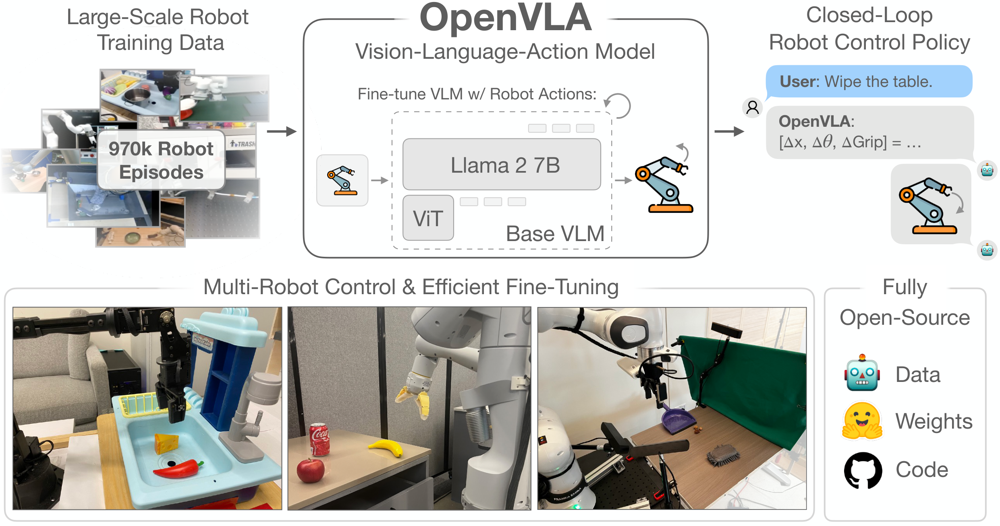
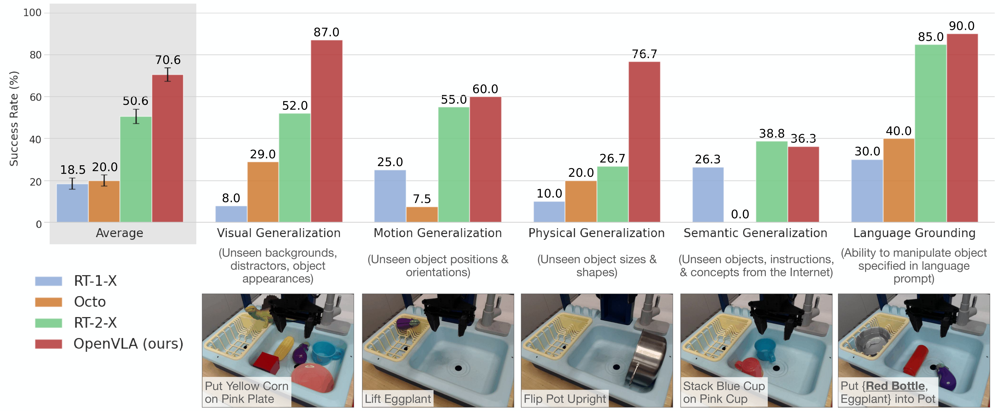
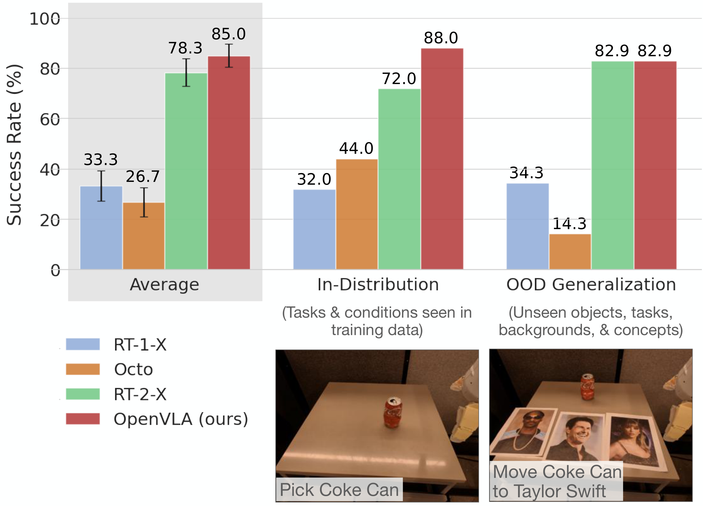
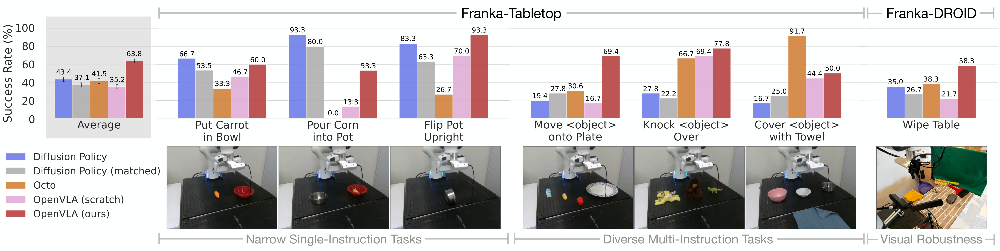
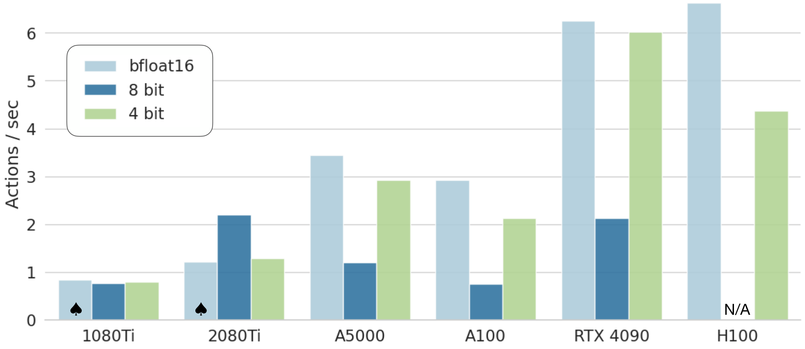

# D5. OpenVLA: An Open-Source Vision-Language-Action Model

## 0. 읽기 전 약어 및 핵심 용어

이 문서를 읽기 전에 아래 약어와 용어를 먼저 정리한다. 이후 본문에서는 괄호 안의 약어를 사용한다.

- Artificial Intelligence (AI): 사람의 지각, 추론, 학습, 의사결정 능력을 기계가 수행하도록 만드는 인공지능 분야를 뜻한다.
- Application Programming Interface (API): 소프트웨어 모듈이나 robot primitive를 외부에서 호출하기 위한 함수/규약 interface이다.
- Large Language Model (LLM): 대규모 텍스트 데이터로 학습되어 언어 이해, 생성, 추론, 계획에 쓰이는 foundation model이다.
- Vision-Language Model (VLM): 이미지와 텍스트를 함께 입력받아 시각-언어 이해나 생성 작업을 수행하는 모델이다.
- Vision-Language-Action (VLA): 시각 관측과 언어 명령을 함께 받아 로봇 action까지 생성하는 모델 또는 학습 패러다임이다.
- Multi-Layer Perceptron (MLP): fully connected layer를 여러 층 쌓은 feed-forward neural network이다.
- Robotics Transformer (RT): robot observation을 입력받아 action을 예측하는 transformer 기반 robot policy 계열을 뜻한다.
- Robotics Transformer 1 (RT-1): Google의 실제 로봇 demonstration data로 학습한 transformer 기반 robot control policy이다.
- Robotics Transformer 2 (RT-2): web-scale vision-language knowledge와 robot trajectory를 함께 학습해 action token을 생성하는 VLA 모델이다.
- Robotics Transformer-X model family (RT-X): Open X-Embodiment 데이터 위에서 여러 robot embodiment로 확장한 RT 계열 policy family를 뜻한다.
- Robotics Transformer 1-X (RT-1-X): Open X-Embodiment 데이터로 확장 학습한 RT-1 계열 cross-embodiment policy이다.
- Robotics Transformer 2-X (RT-2-X): Open X-Embodiment 데이터로 확장 학습한 RT-2 계열 cross-embodiment VLA policy이다.
- Distributed Robot Interaction Dataset (DROID): 여러 장소에서 수집한 in-the-wild robot manipulation demonstration dataset이다.
- A Low-cost Open-source Hardware System for Bimanual Teleoperation (ALOHA): 저비용 양팔 teleoperation hardware와 imitation learning setup을 뜻한다.
- Physical Intelligence pi-zero model (pi0): Physical Intelligence가 제안한 general robot control용 vision-language-action flow model이다.
- Physical Intelligence pi-zero-point-five model (pi0.5): pi0를 open-world household manipulation으로 확장한 VLA model이다.
- Graphics Processing Unit (GPU): 대규모 neural network 학습과 병렬 연산을 빠르게 수행하는 processor이다.
- Video Random Access Memory (VRAM): GPU가 tensor, model parameter, activation을 저장하는 전용 memory이다.
- Toyota Research Institute (TRI): Toyota의 AI, robotics, mobility 연구기관이다.
- Physical Artificial Intelligence (Physical AI): 디지털 공간의 예측을 넘어 물리 세계에서 지각, 예측, 계획, 행동, 안전 검사를 수행하는 AI 시스템을 뜻한다.

## 1. Metadata

| Field | 내용 |
|---|---|
| ID | `D5` |
| Title | OpenVLA: An Open-Source Vision-Language-Action Model |
| Authors | Moo Jin Kim, Karl Pertsch, Siddharth Karamcheti, Ted Xiao et al. |
| Affiliation / Team | Stanford / UC Berkeley / TRI / Google DeepMind / Physical Intelligence / MIT |
| Venue / Status | CoRL / arXiv |
| Date | 2024-06-13 |
| Link | https://arxiv.org/abs/2406.09246 |
| Local source | `paper_corpus/sources/D5` |
| Source figures | `paper_corpus/figures_source/D5/manifest.md` |

## 2. 핵심 요약

OpenVLA는 7B parameter open-source Vision-Language-Action model이다. Open X-Embodiment에서 curated한 970K real-world robot episodes로 Prismatic-7B VLM을 robot action prediction에 fine-tuning하여, image observation과 language instruction을 입력받고 7-dimensional robot control action을 token sequence로 출력한다.

RT-2/RT-2-X가 VLA 패러다임을 강하게 보여줬지만 closed model이었다면, OpenVLA는 VLA를 공개 checkpoint, PyTorch training code, fine-tuning notebook, HuggingFace workflow까지 포함한 open ecosystem으로 만든 것이 핵심 기여다.

## 3. 왜 중요한가?

OpenVLA는 Physical AI에서 연구자들이 직접 실험 가능한 open-source VLA의 대표 출발점이다.

- 7B parameter open-source VLA로, closed RT-2-X 55B보다 훨씬 작다.
- Open X-Embodiment 기반 970K robot episodes로 학습했다.
- DINOv2 + SigLIP fused vision encoder와 Llama 2 backbone을 사용한다.
- WidowX와 Google Robot 평가에서 RT-2-X, RT-1-X, Octo와 비교해 강한 generalist manipulation 성능을 보였다.
- LoRA fine-tuning과 4-bit quantization을 통해 VLA를 더 접근 가능한 형태로 배포하는 방법을 제시했다.
- 이후 SpatialVLA, CogACT, pi0 계열 등 open VLA 연구의 중요한 baseline이 된다.

## 4. 전체 개념

OpenVLA는 “VLM을 robot action generator로 fine-tuning한다”는 RT-2의 아이디어를 open-source로 구현한다. image와 instruction을 넣으면, LLM vocabulary 안의 action token을 autoregressive하게 생성하고, 이를 continuous robot control command로 변환한다.

  

<em>Figure 1. OpenVLA는 Open X-Embodiment의 970K robot episodes로 학습된 7B open-source VLA다. 여러 robot을 out-of-the-box로 제어하고, 새로운 robot domain에 parameter-efficient fine-tuning으로 빠르게 적응할 수 있다. Source figure: <code>openvla_teaser.pdf</code>.</em>

발표에서는 이 그림을 통해 다음을 강조하면 좋다.

- OpenVLA는 단순 논문 모델이 아니라 공개 checkpoint/code/fine-tuning workflow를 포함한 연구 platform이다.
- RT-2-X보다 작지만, curated data와 architecture choice로 strong generalist policy 성능을 보인다.
- 중요한 사용 시나리오는 `out-of-the-box control`과 `new robot/task fine-tuning` 두 가지다.

## 5. Model Architecture

OpenVLA는 Prismatic-7B VLM을 기반으로 한다. 구조는 세 부분으로 나뉜다.

  

<em>Figure 2. OpenVLA architecture. image observation과 language instruction을 입력받아 7-dimensional robot control action을 예측한다. vision encoder는 DINOv2와 SigLIP feature를 결합하고, projector가 visual feature를 Llama 2 embedding space로 보낸다. Source figure: <code>openvla_model.pdf</code>.</em>

| 구성 | 설명 |
|---|---|
| Vision encoder | DINOv2 + SigLIP pretrained feature를 channel-wise concatenation |
| Projector | visual feature를 LLM input embedding space로 mapping하는 2-layer MLP |
| LLM backbone | Llama 2 7B |
| Input | image observation + natural language instruction |
| Output | discretized robot action token sequence |
| Training data | Open X-Embodiment 기반 970K robot episodes |

OpenVLA가 DINOv2와 SigLIP을 함께 쓰는 이유는 semantic feature와 spatial feature를 모두 활용하기 위해서다. 논문은 DINOv2 feature가 robot control에 필요한 fine-grained spatial reasoning에 도움이 될 수 있다고 설명한다.

## 6. Action Tokenization

OpenVLA는 continuous robot action을 LLM이 생성할 수 있는 discrete action token으로 바꾼다. 각 action dimension을 256개 bin으로 discretize하고, Llama tokenizer vocabulary의 least-used 256 token을 action token으로 덮어쓴다.

$$
\tilde{a}_{t,j}
=
\mathrm{bin}_{256}(a_{t,j}; q_{1,j}, q_{99,j})
$$

| Notation | 의미 |
|---|---|
| $a_{t,j}$ | timestep $t$에서 $j$번째 continuous robot action dimension |
| $\tilde{a}_{t,j}$ | discretization 후 생성되는 action token index |
| $\mathrm{bin}_{256}$ | 값을 256개 discrete bin 중 하나로 변환하는 함수 |
| $q_{1,j}$ | training data에서 $j$번째 action dimension의 1st percentile quantile |
| $q_{99,j}$ | training data에서 $j$번째 action dimension의 99th percentile quantile |

RT-2는 min-max bounds를 사용했지만, OpenVLA는 1st/99th quantile을 사용한다. 이는 outlier action 때문에 discretization interval이 과도하게 넓어져 action resolution이 낮아지는 문제를 줄이기 위한 선택이다.

## 7. Next-Token Action Prediction Objective

OpenVLA는 action prediction을 vision-language task처럼 다룬다. image observation과 instruction을 조건으로 action token sequence를 예측하고, action token에 대해서만 cross-entropy loss를 계산한다.

$$
\mathcal{L}(\theta)
=
-
\sum_{(o,l,a) \in \mathcal{D}}
\sum_{j=1}^{N}
\log p_{\theta}(\tilde{a}_{j} \mid o, l, \tilde{a}_{<j})
$$

| Notation | 의미 |
|---|---|
| $\mathcal{L}(\theta)$ | OpenVLA fine-tuning loss |
| $\theta$ | OpenVLA model parameter |
| $\mathcal{D}$ | curated OpenX robot demonstration dataset |
| $o$ | image observation |
| $l$ | natural language task instruction |
| $a$ | continuous robot action |
| $\tilde{a}_{j}$ | $j$번째 discretized action token |
| $N$ | action dimension 수 |
| $\tilde{a}_{<j}$ | 이전 action token context |
| $p_{\theta}$ | observation과 instruction을 조건으로 action token을 생성하는 model distribution |

이 수식은 OpenVLA가 “robot policy를 language model의 token generation 문제로 바꾼다”는 점을 보여준다. RT-2와 같은 VLA 패러다임이지만, OpenVLA는 open backbone과 open training pipeline으로 이를 재현 가능하게 만든다.

## 8. Training Data와 Design Decisions

OpenVLA는 Open X-Embodiment를 그대로 모두 쓰지 않고, training에 적합하도록 curated mixture를 만든다.

| Design decision | 내용 |
|---|---|
| Dataset source | Open X-Embodiment |
| Final data size | 970K robot episodes |
| Filtering | manipulation dataset, 3rd-person camera, single-arm end-effector control 중심 |
| Mixture weighting | Octo의 data mixture weight를 기반으로 dataset balance 조정 |
| DROID | 초기에는 일부 포함했지만 action token accuracy 문제로 final third training에서 제거 |
| Image resolution | 224x224 사용. 384x384는 3배 느리지만 성능 차이가 없었다고 보고 |
| Vision encoder | frozen이 아니라 fine-tuning하는 것이 VLA 성능에 중요 |
| Training epochs | final run은 27 epochs |
| Training compute | 64 A100, 14일, batch size 2048 |

이 논문에서 실무적으로 중요한 포인트는 VLA training이 일반 VLM fine-tuning과 다르다는 점이다. vision encoder를 freeze하는 VLM 관행과 달리, OpenVLA는 robot control을 위해 vision encoder fine-tuning이 중요하다고 보고한다.

## 9. Direct Evaluation: Generalist Robot Control

OpenVLA는 WidowX BridgeData V2 환경과 Google Robot 환경에서 RT-1-X, RT-2-X, Octo와 비교된다.

  

<em>Figure 3. BridgeData V2 WidowX evaluation. OpenVLA는 visual, motion, physical, language grounding 등 여러 generalization category에서 강한 성능을 보이며, semantic generalization을 제외하면 RT-2-X보다 높은 성능을 보인다. Source figure: <code>bridge_results.pdf</code>.</em>

  

<em>Figure 4. Google Robot evaluation. OpenVLA와 RT-2-X는 comparable performance를 보이며, RT-1-X와 Octo보다 전반적으로 높은 성능을 보인다. Source figure: <code>rt1_results.pdf</code>.</em>

핵심 결과는 다음과 같다.

| 비교 | 해석 |
|---|---|
| OpenVLA vs RT-2-X | OpenVLA는 7B로 RT-2-X 55B보다 작지만 BridgeData V2에서는 더 강하고 Google Robot에서는 comparable |
| OpenVLA vs RT-1-X / Octo | Internet-pretrained VLM 기반 VLA가 scratch-trained transformer policy보다 generalization에 강함 |
| Semantic generalization | RT-2-X가 더 강한데, 이는 더 큰 Internet pretraining과 co-fine-tuning 때문으로 해석 |
| Language grounding | distractor가 있는 multi-object scene에서 correct object manipulation이 중요 |

논문은 OpenVLA가 RT-2-X보다 7배 적은 parameter로, 29개 task와 multiple embodiments에서 RT-2-X보다 16.5% absolute success rate가 높다고 보고한다.

## 10. Fine-Tuning to New Robot Setups

OpenVLA의 또 다른 핵심 기여는 VLA fine-tuning을 본격적으로 평가한 것이다. 새 Franka robot setup에서 10-150 demonstrations만으로 fine-tuning하고, Diffusion Policy, Octo와 비교한다.

  

<em>Figure 5. New robot setup adaptation. OpenVLA는 7개 Franka task에서 fine-tuning되며, narrow single-instruction task에서는 Diffusion Policy가 강하지만, multi-instruction 및 distractor가 있는 diverse task에서는 generalist pretrained policy인 OpenVLA가 강하다. Source figure: <code>finetune_results.pdf</code>.</em>

fine-tuning 실험의 핵심 해석은 다음과 같다.

- Diffusion Policy는 좁고 단일 instruction인 dexterous task에서 여전히 강하다.
- OpenVLA와 Octo는 multiple objects와 language grounding이 필요한 diverse task에서 더 강하다.
- OpenVLA는 전체 평균에서 가장 높은 성능을 보이며, 모든 tested task에서 최소 50% success rate를 넘긴 유일한 방법이라고 보고된다.
- OpenVLA scratch, 즉 OpenX pretraining 없이 base Prismatic VLM만 fine-tuning한 경우 성능이 낮아 OpenX robot pretraining의 효과가 드러난다.

## 11. Parameter-Efficient Fine-Tuning과 Quantization

OpenVLA는 full fine-tuning뿐 아니라 LoRA와 quantized inference도 평가한다. 이는 “VLA가 연구실/현장에서 실제로 쓰일 수 있는가?”와 직접 연결된다.

LoRA는 linear layer에 low-rank update를 추가하는 방식으로 이해할 수 있다.

$$
W^{\prime}
=
W + \Delta W,
\quad
\Delta W = BA
$$

| Notation | 의미 |
|---|---|
| $W$ | pretrained model의 기존 weight matrix |
| $W^{\prime}$ | fine-tuning 후 effective weight |
| $\Delta W$ | LoRA가 추가하는 low-rank update |
| $A,B$ | 학습되는 low-rank matrix |
| $r$ | LoRA rank. 논문은 default $r=32$를 추천 |

논문에서 LoRA rank 32는 full fine-tuning과 유사한 성공률을 보이면서 전체 parameter의 1.4%만 학습한다. 이를 통해 single A100에서 10-15시간 안에 new task fine-tuning이 가능하다고 보고한다.

  

<em>Figure 6. OpenVLA inference speed. bfloat16과 int4 quantization은 높은 throughput을 보이며, int4는 GPU memory footprint를 크게 줄이면서 Bridge task success를 유지한다. Source figure: <code>inference_speed.pdf</code>.</em>

quantization 결과도 중요하다.

| Precision | Bridge Success | VRAM |
|---|---:|---:|
| bfloat16 | 71.3 ± 4.8% | 16.8 GB |
| int8 | 58.1 ± 5.1% | 10.2 GB |
| int4 | 71.9 ± 4.7% | 7.0 GB |

int8은 inference speed가 느려져 control dynamics가 바뀌며 성능이 떨어졌고, int4는 memory transfer 감소 덕분에 더 실용적인 trade-off를 보였다.

## 12. D1 Open X-Embodiment와의 연결

OpenVLA는 D1의 문제의식을 실제 open-source model로 이어받는다.

| D1 Open X-Embodiment | D5 OpenVLA |
|---|---|
| cross-embodiment data repository 구축 | curated OpenX mixture 970K episodes로 VLA 학습 |
| RT-1-X / RT-2-X로 positive transfer 입증 | 공개 VLA checkpoint/code/fine-tuning workflow 제공 |
| RT-2-X는 closed model | OpenVLA는 open-source 7B model |
| data scaling의 가능성 제시 | model adaptation과 accessibility까지 실험 |
| cross-embodiment learning infrastructure | downstream robot setup fine-tuning recipe |

즉, D1은 데이터와 RT-X 실험으로 field를 열었고, D5는 연구자들이 실제로 사용할 수 있는 open VLA baseline을 제공한다.

## 13. World Model 관점에서의 위치

OpenVLA는 명시적인 world model을 학습하지 않는다. future observation prediction, latent dynamics, planning rollout은 없다. 그러나 Physical AI와 World Model 스터디에서 중요한 이유는 다음과 같다.

| 관점 | OpenVLA의 의미 |
|---|---|
| action-as-language | robot action을 LLM token generation으로 다룬다. |
| pretrained visual-language prior | Internet-scale VLM의 semantic/spatial prior를 robot control로 transfer한다. |
| physical data scaling | OpenX robot demonstrations를 VLA fine-tuning data로 사용한다. |
| open-source baseline | VLA 연구를 closed API가 아니라 reproducible research 대상으로 만든다. |
| 한계 | environment dynamics를 내부 model로 예측하지 않고 reactive policy처럼 action을 생성한다. |

따라서 OpenVLA는 world model이라기보다, open-source VLA policy foundation이다. 하지만 이후 world-model-based VLA나 action planning model을 만들 때 비교 기준이 되는 중요한 baseline이다.

## 14. 한계

| 한계 | 의미 |
|---|---|
| single-image observation | multi-camera, wrist camera, proprioception, observation history를 기본적으로 지원하지 않는다. |
| inference throughput | high-frequency control setup, 예: ALOHA 50Hz에는 아직 느리다. |
| reliability | prior model보다 강하지만 tested task에서 항상 90% 이상 success를 보장하지는 않는다. |
| dexterous control | Diffusion Policy가 narrow dexterous task에서는 더 smooth/precise할 수 있다. |
| design questions 미해결 | base VLM size, co-training with web data, best visual features 등은 더 연구가 필요하다. |
| robot dynamics modeling 부재 | action chunking, temporal smoothing, dynamics-aware planning은 기본 구조에 포함되지 않는다. |

논문은 특히 action chunking이나 speculative decoding 등 inference-time optimization이 향후 중요하다고 논의한다.

## 15. 후속 연구와 연결

| 후속 흐름 | 연결 |
|---|---|
| SpatialVLA | OpenVLA의 spatial representation 한계를 보완하려는 흐름 |
| CogACT | VLA의 cognition/action module 분리와 action modeling 개선 |
| CoT-VLA | VLA에 visual reasoning과 chain-of-thought를 추가 |
| pi0 / pi0.5 | action token generation을 넘어 flow/diffusion-style continuous action generation으로 확장 |
| Octo | open-source generalist policy baseline, OpenVLA fine-tuning 비교 대상 |
| DROID / in-the-wild data | OpenVLA가 일부 시도했지만 충분히 흡수하지 못한 richer real-world data scaling 방향 |

## 16. 발표 구성 추천

1. `문제의식`: RT-2-X는 강하지만 closed이고, VLA fine-tuning practice가 부족했다.
2. `핵심 모델`: DINOv2+SigLIP vision encoder, projector, Llama 2 7B backbone 구조를 설명한다.
3. `수식`: action discretization과 next-token action prediction objective를 설명한다.
4. `데이터`: OpenX curated 970K episodes와 design choices를 D1과 연결한다.
5. `평가`: WidowX/Google Robot direct evaluation에서 RT-2-X, RT-1-X, Octo와 비교한다.
6. `fine-tuning`: Franka setup에서 Diffusion Policy/Octo와 비교하고 어떤 task에서 강한지 설명한다.
7. `실용성`: LoRA, quantization, inference speed를 통해 open VLA의 실제 사용 가능성을 논의한다.

## 17. 발표 질문

- OpenVLA가 RT-2-X보다 작으면서 강한 이유는 data curation, architecture, evaluation setup 중 무엇이 가장 클까?
- action을 LLM token으로 생성하는 방식은 continuous control에서 어떤 한계를 갖는가?
- OpenVLA는 Diffusion Policy보다 항상 나은가, 아니면 language grounding이 필요한 task에서 특히 강한가?
- VLA fine-tuning에서 vision encoder를 freeze하지 않는 것이 왜 중요한가?
- open-source VLA가 physical AI 연구 생태계에 주는 가장 큰 변화는 무엇인가?

## 18. 요약 코멘트

OpenVLA는 RT-2류 VLA를 공개 연구 생태계로 가져온 논문이다. D1 Open X-Embodiment가 cross-embodiment robot data foundation을 만들었다면, OpenVLA는 그 데이터를 사용해 실제로 배포/수정/ fine-tuning 가능한 7B VLA baseline을 제공한다. World model은 아니지만, 이후 Physical AI 연구에서 “open generalist VLA policy”의 기준점으로 읽어야 한다.