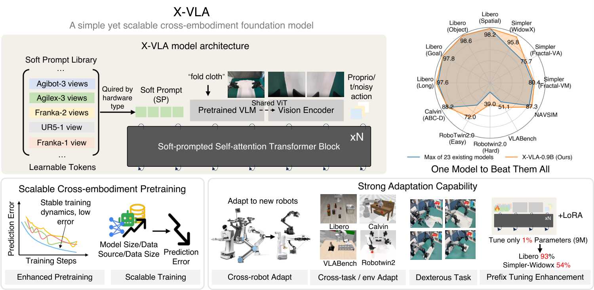
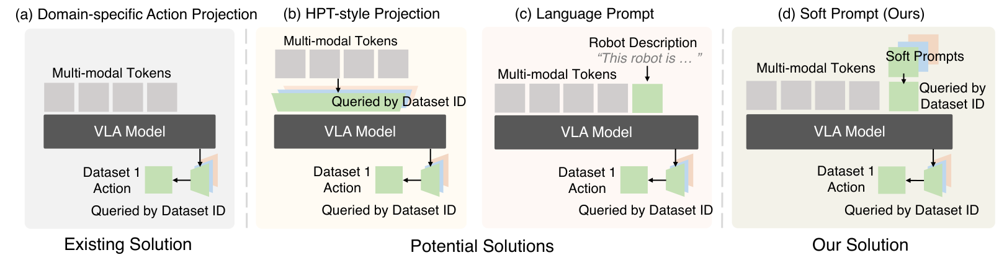
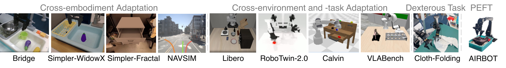
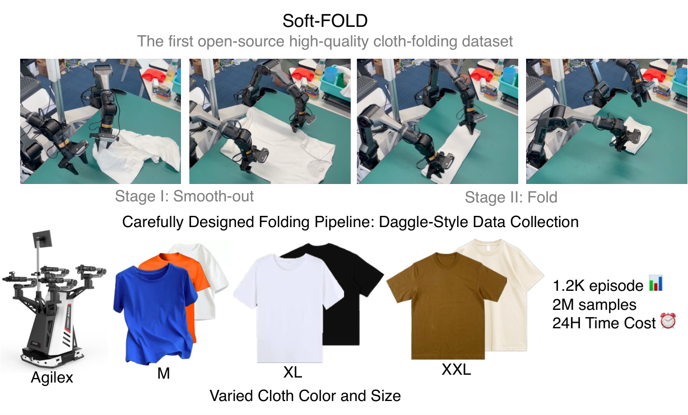
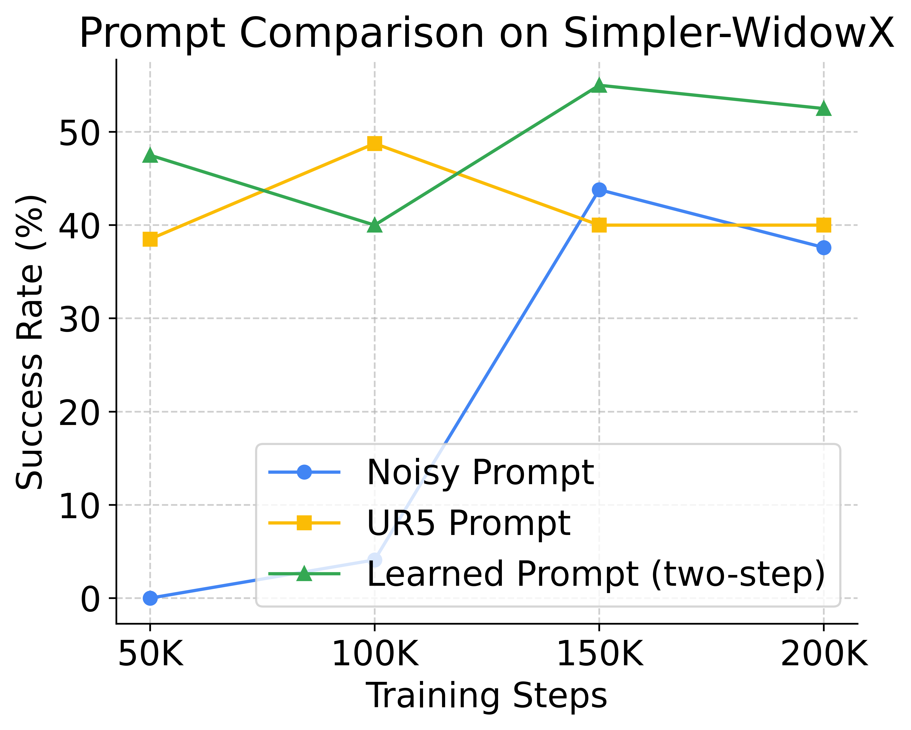

# D6. X-VLA: Soft-Prompted Transformer as Scalable Cross-Embodiment Vision-Language-Action Model

## 0. 읽기 전 약어 및 핵심 용어

이 문서를 읽기 전에 아래 약어와 용어를 먼저 정리한다. 이후 본문에서는 괄호 안의 약어를 사용한다.

- Artificial Intelligence (AI): 사람의 지각, 추론, 학습, 의사결정 능력을 기계가 수행하도록 만드는 인공지능 분야를 뜻한다.
- Large Language Model (LLM): 대규모 텍스트 데이터로 학습되어 언어 이해, 생성, 추론, 계획에 쓰이는 foundation model이다.
- Vision-Language Model (VLM): 이미지와 텍스트를 함께 입력받아 시각-언어 이해나 생성 작업을 수행하는 모델이다.
- Vision-Language-Action (VLA): 시각 관측과 언어 명령을 함께 받아 로봇 action까지 생성하는 모델 또는 학습 패러다임이다.
- Foundation Model (FM): 대규모 데이터로 사전학습되어 다양한 downstream task로 전이되는 범용 기반 모델이다.
- End-Effector (EEF): 로봇 팔 끝에서 실제로 물체와 상호작용하는 gripper, hand, tool의 pose나 상태를 뜻한다.
- State of the Art (SOTA): 특정 benchmark나 task에서 현재 가장 높은 수준의 성능을 보이는 방법을 뜻한다.
- Behavior Cloning (BC): expert demonstration의 observation-action pair를 supervised learning으로 모방하는 imitation learning 방법이다.
- Parameter-Efficient Fine-Tuning (PEFT): 전체 모델을 업데이트하지 않고 adapter, prompt, LoRA 등 일부 parameter만 조정하는 fine-tuning 방법이다.
- Hybrid Prompt Tuning (HPT): prompt나 adapter 계열 parameter를 이용해 pretrained model을 효율적으로 적응시키는 tuning 방식이다.
- Distributed Robot Interaction Dataset (DROID): 여러 장소에서 수집한 in-the-wild robot manipulation demonstration dataset이다.
- A Low-cost Open-source Hardware System for Bimanual Teleoperation (ALOHA): 저비용 양팔 teleoperation hardware와 imitation learning setup을 뜻한다.
- Action Chunking with Transformers (ACT): 여러 timestep의 action chunk를 한 번에 예측해 fine-grained robot manipulation을 학습하는 transformer policy이다.
- Lifelong Robot Learning Benchmark (LIBERO): 로봇이 여러 task를 순차적으로 배우며 knowledge transfer와 forgetting을 평가하는 benchmark이다.
- Navigation Simulation (NAVSIM): navigation policy나 autonomous agent를 평가하기 위한 simulation benchmark 계열을 뜻한다.
- Cross-Embodiment Vision-Language-Action model (X-VLA): 서로 다른 robot embodiment의 camera, action space, hardware 차이를 하나의 VLA 안에서 다루려는 cross-embodiment model이다.
- Physical Intelligence pi-zero model (pi0): Physical Intelligence가 제안한 general robot control용 vision-language-action flow model이다.
- Physical Intelligence pi-zero-point-five model (pi0.5): pi0를 open-world household manipulation으로 확장한 VLA model이다.
- Physical Artificial Intelligence (Physical AI): 디지털 공간의 예측을 넘어 물리 세계에서 지각, 예측, 계획, 행동, 안전 검사를 수행하는 AI 시스템을 뜻한다.
- Policy/Dynamics Model (PDM): 문맥에 따라 policy model 또는 dynamics model을 뜻하며, agent의 action 선택이나 상태 전이를 모델링한다.
- Prompt Strategy / Prompt Set (PS): prompt 기반 adaptation에서 사용하는 prompt 구성이나 prompt 집합을 뜻한다.

## 1. Metadata

| Field | 내용 |
|---|---|
| ID | `D6` |
| Title | X-VLA: Soft-Prompted Transformer as Scalable Cross-Embodiment Vision-Language-Action Model |
| Authors | Jinliang Zheng, Jianxiong Li, Zhihao Wang, Dongxiu Liu et al. |
| Affiliation / Team | AIR Tsinghua / Shanghai AI Laboratory / Peking University |
| Venue / Status | ICLR 2026 |
| Date | 2026-04-23 |
| Link | https://iclr.cc/virtual/2026/poster/10007740 |
| arXiv | https://arxiv.org/abs/2510.10274 |
| Local source | `paper_corpus/sources/D6` |
| Source figures | `paper_corpus/figures_source/D6/manifest.md` |

## 2. 핵심 요약

X-VLA는 cross-embodiment VLA training에서 발생하는 hardware/action/camera/task heterogeneity를 soft prompt로 다루는 flow-matching 기반 VLA architecture다. 각 data source 또는 hardware configuration마다 learnable embedding prompt를 두고, 이 prompt가 model 내부 representation을 embodiment-aware하게 안내한다.

기존 VLA들이 주로 embodiment별 action decoder head로 action space 차이를 처리했다면, X-VLA는 heterogeneity가 action output뿐 아니라 camera setup, proprioception, visual domain, task distribution 전반에 존재한다고 본다. 따라서 soft prompt를 early fusion/action generation 단계에 넣어 shared Transformer가 embodiment-agnostic policy를 학습하도록 유도한다.

## 3. 왜 중요한가?

- 2026년 VLA trend인 cross-embodiment scaling과 parameter-efficient adaptation을 잘 보여준다.
- soft prompt를 robotics heterogeneity 처리에 적용해, domain-specific head/handwritten language prompt/MoE보다 단순한 대안을 제안한다.
- 0.9B model을 290K episode, 7 data source, 5 robot arm type, 7 hardware setup에 pretraining한다.
- simulation 6개 benchmark와 real robot 3개 platform에서 평가한다.
- 9M parameter, 즉 약 1% parameter만 tuning하는 PEFT로도 pi0급 adaptation 성능에 근접한다고 보고한다.

## 4. Overall Concept

  

<em>Figure 1. X-VLA overview. soft prompt가 cross-embodiment dataset의 heterogeneity를 흡수하고, standard self-attention transformer block stacking으로 scalable VLA training과 domain-specific finetuning을 가능하게 한다. Source figure: <code>Figures/intro_small.pdf</code>.</em>

핵심 intuition은 다음이다.

| 문제 | 기존 접근 | X-VLA 접근 |
|---|---|---|
| action space 차이 | domain-specific action head | soft prompt + 정렬된 action representation |
| camera setup 차이 | 직접 concatenation 또는 handcrafted description | learned source-specific prompt |
| embodiment 차이 | architecture/head 분기 | prompt가 hardware-specific prior를 encode |
| adaptation cost | full fine-tuning | prompt warm-up + PEFT/LoRA |

## 5. Heterogeneous Cross-Embodiment Training

논문은 heterogeneous dataset mixture를 다음처럼 정의한다.

$$
\mathcal{D}^{H}
=
\{\mathcal{D}_i\}_{i=1}^{H}
$$

$$
h_i \in \mathcal{H}
$$

| Notation | 의미 |
|---|---|
| $\mathcal{D}^{H}$ | $H$개 heterogeneous dataset으로 구성된 mixed robot dataset |
| $\mathcal{D}_i$ | $i$번째 data source 또는 robot dataset |
| $H$ | heterogeneous data source 개수 |
| $h_i$ | $\mathcal{D}_i$가 수집된 hardware configuration |
| $\mathcal{H}$ | 가능한 hardware setup의 공간 |

여기서 $h_i$는 arm kinematics, control interface, camera configuration, deployment scenario를 포함한다. 즉, X-VLA에서 embodiment는 단순히 action dimension이 아니라 data-generating system 전체다.

## 6. Soft Prompt Formulation

X-VLA는 각 data source에 learnable prompt를 할당한다.

$$
P^{H}
=
\{p_i\}_{i=1}^{H}
$$

$$
p_i
\approx
\Phi(h_i),
\quad
\Phi:\mathcal{H}\rightarrow\mathbb{R}^{k}
$$

| Notation | 의미 |
|---|---|
| $P^{H}$ | heterogeneous dataset 전체에 대한 soft prompt library |
| $p_i$ | $i$번째 data source/hardware setup의 learnable prompt embedding |
| $\Phi$ | hardware configuration을 prompt space로 보내는 latent mapping |
| $h_i$ | 실제 hardware/camera/control/task setup |
| $\mathbb{R}^{k}$ | prompt embedding space |

$\Phi$는 사람이 정의한 template이 아니다. prompt $p_i$는 random initialization에서 시작해 end-to-end training으로 hardware-specific configuration을 암묵적으로 학습한다. 이 점이 language prompt와의 차이다.

## 7. Methods for Handling Heterogeneity

  

<em>Figure 2. Four methods for handling cross-embodiment heterogeneity. domain-specific action projection, HPT-style projection, language prompt, soft prompt를 비교한다. Source figure: <code>Figures/compare_with_others.pdf</code>.</em>

| 방법 | 장점 | 한계 |
|---|---|---|
| domain-specific action projection | action dimension 차이를 직접 처리 | final output에서만 heterogeneity 처리 |
| HPT-style projection | observation을 shared representation으로 align | pretrained VLM representation을 흔들어 training instability 가능 |
| language prompt | hardware 정보를 text로 설명 가능 | handcrafted template 의존, scalability 낮음 |
| soft prompt | learnable, lightweight, early guidance | prompt가 무엇을 학습하는지 해석/관리 필요 |

논문은 soft prompt가 가장 안정적인 training curve와 좋은 asymptotic performance를 보인다고 주장한다.

## 8. Architecture

  

<em>Figure 3. X-VLA architecture. soft prompt library, vision encoder, language/main view/other view encoding, proprioception, noisy action chunk, flow timestep이 token으로 결합되고 standard self-attention transformer block을 거쳐 action chunk를 출력한다. Source figure: <code>Figures/archi.pdf</code>.</em>

X-VLA의 입력 stream은 크게 두 가지로 나뉜다.

| Stream | 구성 | 처리 |
|---|---|---|
| high-dimensional observation | multi-view images, language instruction | Florence-Large VLM encoder와 shared vision backbone |
| low-dimensional proprioceptive-action | proprioceptive state, noisy action, flow timestep | linear projection으로 high-dimensional feature space에 정렬 |

main camera와 language는 VLM encoder가 처리하고, wrist/auxiliary view는 별도 shared vision backbone으로 처리한다. 이는 wrist camera가 빠르게 변하고 manipulation detail에 중요하지만, language reasoning과 직접 섞으면 semantic gap이 커질 수 있기 때문이다.

## 9. Flow-Matching Behavior Cloning Objective

X-VLA는 flow matching으로 action chunk를 생성한다.

$$
\mathcal{L}^{\mathrm{FM}}_{\mathrm{BC}}
=
\mathbb{E}_{t\sim\mathcal{U}(0,1),(\mathbf{o},\mathbf{A})\sim\mathcal{D}}
\left[
\left\|
\mathbf{v}_{\theta}
(\mathbf{A}^{t},\mathbf{o},t)
-
(\mathbf{A}-\mathbf{A}^{0})
\right\|^{2}
\right]
$$

$$
\mathbf{A}^{t}
=
(1-t)\mathbf{A}^{0}
+
t\mathbf{A}
$$

| Notation | 의미 |
|---|---|
| $\mathcal{L}^{\mathrm{FM}}_{\mathrm{BC}}$ | flow-matching behavior cloning loss |
| $t$ | flow timestep |
| $\mathcal{U}(0,1)$ | 0과 1 사이 uniform distribution |
| $(\mathbf{o},\mathbf{A})$ | observation과 expert action chunk pair |
| $\mathcal{D}$ | robot demonstration dataset |
| $\mathbf{A}^{0}$ | 초기 random noise action sample |
| $\mathbf{A}$ | expert action chunk |
| $\mathbf{A}^{t}$ | noise와 expert action 사이의 interpolation sample |
| $\mathbf{v}_{\theta}$ | X-VLA가 예측하는 vector field |
| $\theta$ | model parameter |

이 objective는 random noise에서 expert action chunk로 이동하는 vector field를 학습한다. pi0의 flow matching과 같은 큰 계열이지만, X-VLA는 soft prompt로 heterogeneous dataset source를 조건화한다는 점이 다르다.

## 10. Data Mixture and Training Recipe

  

<em>Figure 4. Mixed data recipe. AGIBOT-beta, RoboMind, DROID 등에서 온 290K episodes가 7 hardware setup, 5 robot arm type을 구성한다. Source figure: <code>Figures/data_mixture.pdf</code>.</em>

pretraining recipe의 주요 요소는 다음이다.

| 요소 | 설명 |
|---|---|
| 정렬된 action representation | EEF xyz, Rotate6D absolute rotation, binary gripper state로 action을 통일 |
| intention abstraction | 4초 future trajectory를 30개 anchor point로 downsample하여 high-level intention을 추상화 |
| balanced data sampling | domain과 trajectory 양쪽을 shuffle하여 dominant domain overfitting 완화 |
| custom learning rate | soft prompt와 VLM module에 낮은 LR을 적용해 pretrained representation drift 방지 |
| two-step adaptation | prompt warm-up 후 joint policy adaptation |

## 11. Two-Phase Training and Adaptation

X-VLA 학습은 두 단계다.

| 단계 | 내용 |
|---|---|
| Phase I: Pretraining | backbone $\pi_{\theta}$와 soft prompt $P^H$를 heterogeneous dataset에서 공동 학습 |
| Phase II: Domain adaptation | 새로운 hardware $h_{\mathrm{new}}$에 대해 새 prompt $p_{\mathrm{new}}$를 만들고 warm-up 후 policy를 adaptation |

새 domain prompt는 다음처럼 표현된다.

$$
p_{\mathrm{new}}\in\mathbb{R}^{k}
$$

| Notation | 의미 |
|---|---|
| $p_{\mathrm{new}}$ | novel hardware/domain에 대해 새로 도입되는 learnable soft prompt |
| $\mathbb{R}^{k}$ | prompt embedding space |

prompt warm-up에서는 backbone을 freeze하고 prompt를 먼저 학습한다. 이후 joint adaptation에서 backbone과 prompt를 함께 조정한다.

## 12. Scaling Experiments

  

<em>Figure 5. Scaling experiments. model capacity, data diversity, data volume이 증가할수록 validation prediction error가 감소하며, 논문은 가장 큰 설정에서도 saturation이 보이지 않는다고 보고한다. Source figure: <code>Figures/scaling.pdf</code>.</em>

논문은 pretraining validation error가 downstream adaptation 성능과 강하게 상관된다고 보고한다. 따라서 scaling 실험에서는 denoising 이후 predicted action과 ground-truth action 사이의 $\ell_1$ error를 주요 proxy metric으로 사용한다.

## 13. Simulation Benchmark Results

  

<em>Figure 6. Adaptation evaluation setups. LIBERO, Simpler, VLABench, RoboTwin-2.0, Calvin, NAVSIM 등 6개 simulation benchmark를 포함한다. Source figure: <code>Figures/all_bench.pdf</code>.</em>

X-VLA-0.9B는 Simpler-WidowX 95.8%, LIBERO average 98.1%, RoboTwin-2.0 easy 70.0/hard 39.0, VLABench average PS 51.1, NAVSIM PDM score 87.3 등 여러 benchmark에서 기존 SOTA 대비 높은 결과를 보고한다.

## 14. Real-World Experiments

  

<em>Figure 7. Real-world evaluation. WidowX, AIRBOT, AgileX-fold 등 3개 real-world embodiment에서 simple manipulation, dexterous manipulation, PEFT fast adaptation을 평가한다. Source figure: <code>Figures/real_exp.pdf</code>.</em>

real-world 평가에서 중요한 결과는 cloth-folding이다. X-VLA는 1,200개의 Soft-Fold trajectory로 AgileX bimanual cloth folding에 adaptation하고, 시간당 33개 fold throughput을 보고한다. 논문은 이것이 closed-source pi0-folding 모델과 비교 가능한 수준이라고 설명한다.

## 15. Soft-Fold Dataset

  

<em>Figure 8. Soft-Fold dataset. disordered cloth를 smooth out한 뒤 fold하는 두 단계로 demonstration을 설계하고, 1,200 episode를 수집한다. Source figure: <code>Figures/softfold.pdf</code>.</em>

cloth folding은 deformable object dynamics와 long-horizon bimanual manipulation이 결합된 task다. 저자들은 random human strategy가 많으면 policy가 inconsistent behavior에 갇힐 수 있어, smoothing stage와 folding stage를 나누고 DAgger-style iterative data collection을 사용했다고 설명한다.

## 16. Soft Prompt 해석

X-VLA는 learned soft prompt를 T-SNE로 시각화해 hardware configuration별 cluster가 형성된다고 보고한다. 또한 두 Franka setup처럼 유사한 setup은 가까이 섞이는 경향을 보여, prompt가 단순 dataset ID memorization만 하는 것이 아니라 cross-embodiment similarity를 반영할 수 있음을 시사한다.

  

<em>Figure 9. Prompt comparison. learned/adapted prompt는 random prompt보다 빠르게 수렴하고 높은 성능에 도달하며, 유사 embodiment의 pretrained prompt도 early transfer benefit을 줄 수 있다. Source figure: <code>Figures/prompt_comparison.png</code>.</em>

## 17. Physical AI / World Model 관점

X-VLA는 explicit world model은 아니지만, embodiment-conditioned physical policy representation 측면에서 중요하다.

| 질문 | X-VLA의 답 |
|---|---|
| embodiment heterogeneity를 어떻게 표현하는가? | data source별 soft prompt embedding |
| physical action supervision을 어떻게 정렬하는가? | 정렬된 EEF pose, Rotate6D rotation, binary gripper |
| dexterous/deformable task는 어떻게 다루는가? | Soft-Fold dataset과 flow-matching action generation |
| 새 robot에는 어떻게 적응하는가? | new prompt warm-up + PEFT/joint adaptation |
| world dynamics를 예측하는가? | future state prediction이 아니라 action vector field를 학습 |

world model 관점에서는 X-VLA가 dynamics rollout 대신 embodiment-aware action manifold를 학습하는 policy-centric 접근이라고 볼 수 있다.

## 18. 기존 논문들과의 연결

| 연결 논문 | 연결 포인트 |
|---|---|
| Open X-Embodiment (`D1`) | cross-embodiment dataset scaling 문제 |
| DROID (`D3`) | pretraining data source 중 하나이며 scene diversity 축 제공 |
| Octo (`D4`) | open-source generalist policy와 cross-dataset policy pretraining |
| OpenVLA (`D5`) | VLA architecture와 open-source VLA benchmark |
| pi0 (`P4`) | flow matching action generation과 비교되는 VLM+action expert 계열 |
| pi0.5 (`P5`) | heterogeneous data mixture와 adaptation recipe의 최근 흐름 |
| ALOHA/ACT (`D2`) | dexterous action chunking과 cloth-folding baseline |

## 19. 한계와 주의점

- 0.9B는 LLM/VLM foundation scale에 비하면 아직 작고, 더 큰 scaling law는 미해결이다.
- robotics corpus의 scale과 quality가 language/vision data보다 제한적이다.
- low-dimensional action label은 task intent나 high-level reasoning supervision을 충분히 담지 못한다.
- deployment는 여전히 embodiment-specific adaptation과 demonstration collection을 요구한다.
- soft prompt가 hardware abstraction을 학습한다는 해석은 설득력 있지만, universal kinematic descriptor 같은 명시적 representation과의 결합은 future work다.

## 20. 발표 구성 제안

1. cross-embodiment VLA에서 heterogeneity가 왜 action dimension만의 문제가 아닌지로 시작한다.
2. Figure 1과 Figure 2로 soft prompt의 motivation을 설명한다.
3. dataset mixture와 hardware setup을 수식으로 정의한다.
4. soft prompt formulation을 설명하고 language prompt/HPT/MoE와 비교한다.
5. architecture와 flow matching objective를 연결해 X-VLA가 action chunk를 어떻게 생성하는지 설명한다.
6. scaling, simulation benchmark, real-world cloth folding 순서로 결과를 정리한다.
7. 마지막에 "embodiment-aware prompt가 world model의 대안인가, 보완인가"라는 질문으로 토론을 열면 좋다.

## 21. 토론 질문

- soft prompt는 hardware ID를 memorize하는 것일까, 실제 embodiment similarity를 학습하는 것일까?
- language prompt로 hardware를 설명하는 방식이 왜 충분하지 않을까?
- action alignment를 EEF pose로 통일하는 방식은 humanoid나 legged robot까지 확장될 수 있을까?
- PEFT로 prompt/LoRA만 조정하는 방식이 full fine-tuning보다 언제 유리할까?
- 운영/현장 적용 관점에서 heterogeneous robot dataset의 sampling weight, prompt assignment, adaptation budget을 함께 최적화할 수 있을까?

## 22. 한 문장 정리

X-VLA는 cross-embodiment VLA training의 heterogeneity를 learnable soft prompt로 흡수하고, flow matching action generation과 parameter-efficient adaptation을 결합해 scalable robot foundation model의 한 방향을 제시한 2026년 ICLR 논문이다.