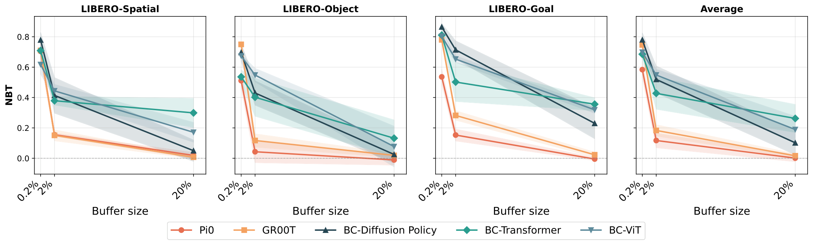
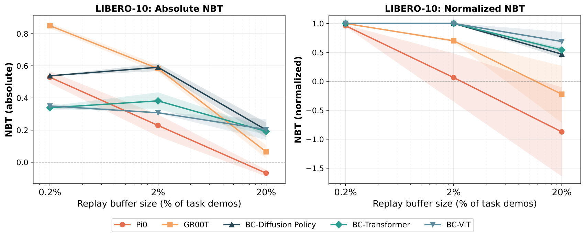
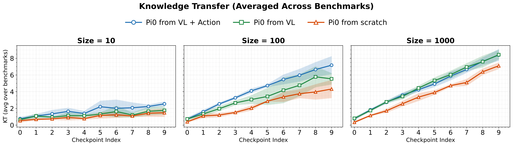

# D7. Pretrained Vision-Language-Action Models are Surprisingly Resistant to Forgetting in Continual Learning

## 0. 읽기 전 약어 및 핵심 용어

이 문서를 읽기 전에 아래 약어와 용어를 먼저 정리한다. 이후 본문에서는 괄호 안의 약어를 사용한다.

- Artificial Intelligence (AI): 사람의 지각, 추론, 학습, 의사결정 능력을 기계가 수행하도록 만드는 인공지능 분야를 뜻한다.
- Vision-Language-Action (VLA): 시각 관측과 언어 명령을 함께 받아 로봇 action까지 생성하는 모델 또는 학습 패러다임이다.
- Vision-Language (VL): 시각 정보와 언어 정보를 함께 다루는 multimodal setting을 뜻한다.
- Behavior Cloning (BC): expert demonstration의 observation-action pair를 supervised learning으로 모방하는 imitation learning 방법이다.
- Markov Decision Process (MDP): state, action, transition, reward, discount factor로 sequential decision problem을 표현하는 수학적 framework이다.
- Experience Replay (ER): 이전 task나 episode의 데이터를 buffer에 저장했다가 다시 학습해 forgetting을 줄이는 방법이다.
- Lifelong Robot Learning Benchmark (LIBERO): 로봇이 여러 task를 순차적으로 배우며 knowledge transfer와 forgetting을 평가하는 benchmark이다.
- Cross-Embodiment Vision-Language-Action model (X-VLA): 서로 다른 robot embodiment의 camera, action space, hardware 차이를 하나의 VLA 안에서 다루려는 cross-embodiment model이다.
- Physical Intelligence pi-zero model (pi0): Physical Intelligence가 제안한 general robot control용 vision-language-action flow model이다.
- Generalist Robot 00 Technology (GR00T): NVIDIA가 humanoid/generalist robot을 위해 공개한 robot foundation model family 이름이다.
- Korea Advanced Institute of Science and Technology (KAIST): 대한민국의 과학기술 특성화 대학이다.
- Physical Artificial Intelligence (Physical AI): 디지털 공간의 예측을 넘어 물리 세계에서 지각, 예측, 계획, 행동, 안전 검사를 수행하는 AI 시스템을 뜻한다.
- Naive Baseline Tuning (NBT): continual learning 비교를 위한 단순 fine-tuning baseline을 뜻한다.

## 1. Metadata

| Field | 내용 |
|---|---|
| ID | `D7` |
| Title | Pretrained Vision-Language-Action Models are Surprisingly Resistant to Forgetting in Continual Learning |
| Authors | Huihan Liu, Changyeon Kim, Bo Liu, Minghuan Liu, Yuke Zhu |
| Affiliation / Team | UT Austin / KAIST / Microsoft Superintelligence |
| Venue / Status | arXiv |
| Date | 2026-03-04 |
| Link | https://arxiv.org/abs/2603.03818 |
| Local source | `paper_corpus/sources/D7` |
| Source figures | `paper_corpus/figures_source/D7/manifest.md` |

## 2. 핵심 요약

이 논문은 pretrained VLA가 continual learning에서 기존 작은 BC policy보다 catastrophic forgetting에 훨씬 강하다는 것을 보인다. 특히 단순한 Experience Replay(ER)만으로도 pi0, GR00T N1.5 같은 pretrained VLA가 LIBERO benchmark에서 near-zero forgetting 또는 positive backward transfer를 보일 수 있다고 보고한다.

핵심 메시지는 "continual robot learning에서 복잡한 continual learning 알고리즘보다 strong pretraining과 작은 replay buffer가 더 중요할 수 있다"는 것이다. 또한 성능이 잠시 떨어져도 VLA 내부 representation에는 task-relevant knowledge가 남아 있어, 짧은 finetuning으로 빠르게 회복될 수 있다고 분석한다.

## 3. 왜 중요한가?

- robot foundation model이 실제 deployment에서 계속 새 skill을 배울 때 발생하는 lifelong learning 문제를 다룬다.
- pretrained VLA와 scratch-trained small policy의 forgetting dynamics가 다르다는 실험적 근거를 제공한다.
- Experience Replay가 VLA regime에서는 매우 강한 baseline임을 보인다.
- pretraining이 forgetting 감소와 forward learning을 동시에 돕는다는 점을 분석한다.
- "성능 저하 = 지식 소실"이 아닐 수 있다는 representation-level 관점을 제시한다.

## 4. Teaser: VLA vs Small BC Policy

  

<em>Figure 1. Continual learning comparison between pretrained VLA and non-pretrained BC-Transformer. matrix entry $(i,j)$는 Task $i$까지 학습한 checkpoint를 Task $j$에서 평가한 success rate를 나타낸다. pretrained VLA는 이전 task 성능을 더 잘 유지한다. Source figure: <code>main/figures/er/groot_vs_bctransformer_2x4.pdf</code>.</em>

이 그림은 발표 시작점으로 좋다. small BC model에서는 아래로 갈수록 이전 task column이 어두워지며 forgetting이 커지지만, pretrained VLA는 replay와 pretraining 덕분에 훨씬 안정적이다.

## 5. Continual Learning Formulation

논문은 각 robot task를 finite-horizon MDP로 표현한다.

$$
\mathcal{M}
=
(\mathcal{S},\mathcal{A},\mathcal{T},H,\mu_0)
$$

| Notation | 의미 |
|---|---|
| $\mathcal{M}$ | robot task를 나타내는 finite-horizon MDP |
| $\mathcal{S}$ | state space |
| $\mathcal{A}$ | action space |
| $\mathcal{T}:\mathcal{S}\times\mathcal{A}\rightarrow\mathcal{S}$ | transition function |
| $H$ | episode horizon |
| $\mu_0$ | initial state distribution |

task success는 goal predicate로 평가한다.

$$
g:\mathcal{S}\rightarrow\{0,1\}
$$

| Notation | 의미 |
|---|---|
| $g$ | task 성공 여부를 판단하는 goal predicate |
| $\{0,1\}$ | failure/success binary output |

continual learning에서는 $K$개 task를 순차적으로 학습한다.

$$
\{T^k\}_{k=1}^{K}
$$

$$
T^k \equiv (\mu_0^k,g^k)
$$

| Notation | 의미 |
|---|---|
| $T^k$ | $k$번째 task |
| $K$ | 전체 task 수 |
| $\mu_0^k$ | $k$번째 task의 initial state distribution |
| $g^k$ | $k$번째 task의 goal predicate |

## 6. Continual Behavior Cloning Objective

각 task의 demonstration dataset은 다음과 같이 정의된다.

$$
D^k
=
\{\tau_i^k\}_{i=1}^{N}
$$

$$
\tau_i^k
=
\{(o_0,a_0),\ldots,(o_{l_k},a_{l_k})\}
$$

| Notation | 의미 |
|---|---|
| $D^k$ | $k$번째 task의 expert demonstration dataset |
| $\tau_i^k$ | $k$번째 task의 $i$번째 trajectory |
| $N$ | task별 trajectory 수 |
| $o_t$ | timestep $t$의 observation |
| $a_t$ | timestep $t$의 action |
| $l_k$ | $k$번째 task trajectory 길이 |

task $T^k$까지 학습한 후의 BC objective는 다음과 같다.

$$
\min_{\pi}J_{\mathrm{BC}}(\pi)
=
\frac{1}{k}
\sum_{p=1}^{k}
\mathbb{E}_{(o_t,a_t)\sim D^p}
\left[
\sum_{t=0}^{l_p}
\mathcal{L}
\left(
\pi(o_{\le t};T^p),a_t
\right)
\right]
$$

| Notation | 의미 |
|---|---|
| $\pi$ | single task-conditioned policy |
| $J_{\mathrm{BC}}$ | behavior cloning objective |
| $p$ | 지금까지 본 task index |
| $\mathcal{L}$ | behavior cloning loss |
| $o_{\le t}$ | timestep $t$까지의 observation history |
| $T^p$ | task condition |
| $a_t$ | expert action |

실제 continual learning에서는 이전 task의 전체 dataset $\{D^p:p<k\}$를 모두 쓸 수 없기 때문에 replay buffer가 중요해진다.

## 7. Negative Backward Transfer Metric

논문은 forgetting을 Negative Backward Transfer(NBT)로 측정한다.

$$
\mathrm{NBT}
=
\frac{1}{K}
\sum_{k=1}^{K}
\mathrm{NBT}_k
$$

$$
\mathrm{NBT}_k
=
\frac{1}{K-k}
\sum_{\tau=k+1}^{K}
\left(
c_{k,k}-c_{k,\tau}
\right)
$$

| Notation | 의미 |
|---|---|
| $\mathrm{NBT}$ | 전체 평균 negative backward transfer |
| $\mathrm{NBT}_k$ | task $k$의 forgetting 정도 |
| $c_{k,k}$ | task $k$를 막 학습한 직후 task $k$에서의 success rate |
| $c_{k,\tau}$ | task $\tau$까지 학습한 뒤 task $k$에서의 success rate |
| $K$ | 전체 task 수 |

NBT가 양수이면 이전 task 성능이 떨어졌다는 뜻이고, 0에 가까울수록 forgetting이 적다. 음수이면 나중 task를 배우면서 이전 task 성능이 오르는 positive backward transfer다.

## 8. Experience Replay

Experience Replay는 각 task 학습 후 일부 sample을 replay buffer에 저장하고, 다음 task 학습 시 current task data와 buffer data를 함께 사용한다. 논문은 ER이 pretrained VLA에서 의외로 강력하다고 보고한다.

  

<em>Figure 2. Replay/current task data mixing. ER은 current task dataset과 past-task replay buffer를 섞어 학습 distribution을 지금까지 본 task들의 empirical distribution에 가깝게 만든다. Source figure: <code>main/figures/mixing_bars.pdf</code>.</em>

논문 기본 setting은 task당 $M=1000$ replay transitions이며, 이는 task dataset의 약 15-20% 수준이다. 추가 실험에서는 10, 100, 1000 sample 등 buffer size를 바꿔 pretraining 효과를 분석한다.

## 9. Main Result: VLA는 Forgetting에 강하다

  

<em>Figure 3. Continual learning comparison. pretrained VLA는 multiple LIBERO suites에서 small BC baseline보다 success rate와 NBT 측면에서 더 안정적이다. Source figure: <code>main/figures/comparison_plot.pdf</code>.</em>

핵심 결과는 세 가지다.

| 관찰 | 의미 |
|---|---|
| ER + pretrained VLA는 near-zero 또는 positive backward transfer 가능 | 이전 task 성능이 거의 안 떨어지거나 오히려 개선될 수 있음 |
| pi0와 GR00T에서 공통적으로 관찰 | 특정 architecture만의 우연이 아닐 가능성 |
| non-pretrained BC model은 같은 replay 조건에서 더 큰 forgetting | large-scale pretraining이 continual dynamics를 바꿈 |

## 10. Replay Buffer Size와 Pretraining

  

<em>Figure 4. Forgetting vs replay sample size. replay buffer가 작아질수록 pretrained VLA와 non-pretrained baseline의 차이가 커진다. Source figure: <code>main/figures/bwt_vs_sample_size_linear_3bench_short.pdf</code>.</em>

논문은 buffer size가 2% 수준인 100 samples/task에서도 pretrained VLA의 NBT가 약 0.1-0.2 수준으로 낮고, non-pretrained baseline은 약 0.4-0.5 수준까지 악화된다고 설명한다. 작은 replay regime에서 pretraining의 가치가 더 커진다.

## 11. Normalized NBT Issue

LIBERO-10처럼 task가 다양하고 초기 success rate 차이가 큰 경우, standard NBT는 높은 초기 성능의 policy를 더 크게 penalize할 수 있다. appendix는 normalized NBT를 제안한다.

  

<em>Figure 5. Absolute vs normalized NBT. absolute NBT는 초기 success rate가 높은 model을 더 크게 벌할 수 있고, normalized NBT는 complete forgetting을 초기 성능과 무관하게 1.0으로 맞춘다. Source figure: <code>main/figures/nbt_libero10_abs_vs_norm.pdf</code>.</em>

normalized NBT는 다음 형태다.

$$
\mathrm{NBT}^{\mathrm{norm}}_k
=
\frac{1}{K-k}
\sum_{\tau=k+1}^{K}
\frac{c_{k,k}-c_{k,\tau}}{c_{k,k}}
$$

| Notation | 의미 |
|---|---|
| $\mathrm{NBT}^{\mathrm{norm}}_k$ | 초기 성능으로 정규화한 task $k$의 forgetting |
| $c_{k,k}$ | task $k$ 직후 success rate |
| $c_{k,\tau}$ | 이후 task $\tau$까지 학습한 뒤 task $k$ success rate |

이 metric discussion은 중요하다. continual learning metric은 모델의 실제 지식 보존뿐 아니라 초기 학습 성공률의 영향을 함께 받기 때문이다.

## 12. Knowledge Transfer와 Stability-Plasticity

논문은 low forgetting이 항상 좋은 것은 아니라고 지적한다. 어떤 policy가 새 task를 거의 배우지 못하면 이전 task도 덜 잊어 보일 수 있다. 그래서 전체 task success accumulation을 보는 knowledge transfer(KT)를 함께 분석한다.

  

<em>Figure 6. Knowledge transfer curves. pretrained pi0 variants는 continual training 동안 aggregate success를 꾸준히 높이며, scratch model보다 새 task 학습과 이전 task 보존을 동시에 잘 수행한다. Source figure: <code>main/figures/kt_curves_avg_across_benchmarks.pdf</code>.</em>

핵심은 pretraining이 stability와 plasticity trade-off를 완화한다는 점이다. 즉, 단순히 덜 잊는 것이 아니라 새 task도 계속 잘 배운다.

## 13. Knowledge Loss Analysis

논문은 performance degradation이 실제 task knowledge 소실인지 확인하기 위해 component swapping과 recovery 실험을 한다.

  

<em>Figure 7. Methodology for knowledge loss analysis. sequential task learning, VL backbone/action head component swapping, prior-task finetuning recovery를 통해 어떤 지식이 손상되었는지 분석한다. Source figure: <code>main/figures/methodology.pdf</code>.</em>

분석 결과의 요지는 다음이다.

| 분석 | 결론 |
|---|---|
| component swapping | forgetting은 action head보다 VL backbone representation 변화에서 더 크게 나타남 |
| task diversity | visual/background variation이 큰 LIBERO-10에서 VL backbone degradation이 더 큼 |
| recovery finetuning | pi0는 이전 task peak performance를 원래 training step의 10% 미만으로 회복 |

즉, VLA는 성능상 잊은 것처럼 보여도 internal representation에는 회복 가능한 knowledge가 남아 있을 수 있다.

## 14. Physical AI / World Model 관점

이 논문은 world model 자체를 제안하지 않지만, lifelong physical AI의 운영 문제를 다룬다.

| 질문 | 논문의 답 |
|---|---|
| robot foundation model은 계속 학습할 수 있는가? | pretrained VLA + small replay로 가능성이 큼 |
| 새 skill 학습과 이전 skill 보존은 trade-off인가? | pretraining이 trade-off를 완화할 수 있음 |
| 잊었다는 것은 knowledge가 사라졌다는 뜻인가? | 성능 저하와 representation-level knowledge loss는 다를 수 있음 |
| 중요한 bottleneck은 무엇인가? | VL backbone representation shift가 action head보다 큰 원인일 수 있음 |
| 현장 적용에서 필요한 것은? | replay buffer design, task ordering, fast recovery protocol |

## 15. 기존 논문들과의 연결

| 연결 논문 | 연결 포인트 |
|---|---|
| pi0 (`P4`) | 주요 pretrained VLA 분석 대상 |
| GR00T N1.5 | 또 다른 pretrained VLA 분석 대상 |
| OpenVLA (`D5`) | LIBERO filtered dataset과 VLA continual learning benchmark 흐름 |
| Octo (`D4`) | pretrained generalist policy가 downstream learning에 주는 이점 |
| LIBERO | lifelong robot learning benchmark |
| X-VLA (`D6`) | parameter-efficient adaptation과 continual/transfer learning 문제 |

## 16. 한계와 주의점

- 실험은 주로 LIBERO benchmark 기반이므로 real-world continual learning으로 바로 일반화하기는 조심스럽다.
- ER은 효과적이지만 replay buffer 저장/선택 정책은 여전히 open question이다.
- task order, replay sample quality, distribution shift가 결과에 미치는 영향은 더 체계적으로 볼 필요가 있다.
- VLA가 왜 representation-level knowledge를 유지하는지에 대한 mechanistic explanation은 아직 제한적이다.
- normalized NBT처럼 metric 선택에 따라 해석이 달라질 수 있다.

## 17. 발표 구성 제안

1. robot foundation model이 현장에서 계속 새 skill을 배워야 한다는 문제로 시작한다.
2. Figure 1로 pretrained VLA와 small BC policy의 forgetting matrix를 비교한다.
3. continual learning formulation과 NBT metric을 설명한다.
4. Experience Replay가 pretrained VLA에서 왜 강력한 baseline인지 결과로 보여준다.
5. replay buffer size와 pretraining level 실험으로 pretraining의 역할을 설명한다.
6. normalized NBT와 KT curve로 metric 해석상의 함정을 짚는다.
7. component swapping/recovery 실험으로 "성능 저하와 knowledge loss는 다르다"는 메시지를 정리한다.
8. 마지막에 lifelong Physical AI system에서 replay memory와 recovery protocol을 어떻게 설계할지 토론한다.

## 18. 토론 질문

- pretrained VLA가 작은 replay buffer만으로 덜 잊는 이유는 representation reuse 때문일까, model capacity 때문일까?
- 현장 robot에서 replay buffer를 저장한다면 어떤 trajectory를 보존해야 할까?
- task success가 떨어져도 knowledge가 남아 있다면, continual learning metric은 무엇을 측정해야 할까?
- VL backbone이 forgetting의 주요 source라면, backbone을 freeze하거나 LoRA만 학습하는 것이 더 나을까?
- 운영/현장 적용 관점에서 lifelong robot skill portfolio를 운영할 때 task ordering, replay sampling, recovery scheduling을 어떻게 최적화할 수 있을까?

## 19. 한 문장 정리

이 논문은 large-scale pretrained VLA가 continual learning에서 작은 replay buffer만으로도 이전 skill을 놀랍게 잘 보존하며, pretraining이 robot lifelong learning의 stability-plasticity dynamics를 근본적으로 바꿀 수 있음을 보여준다.