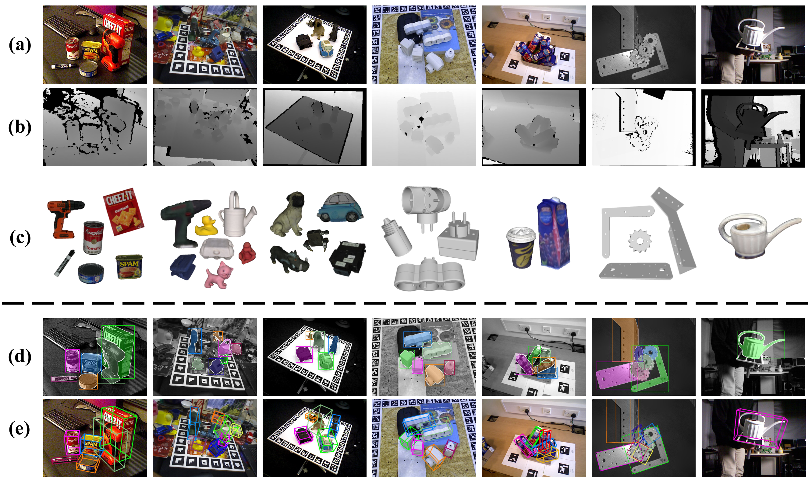
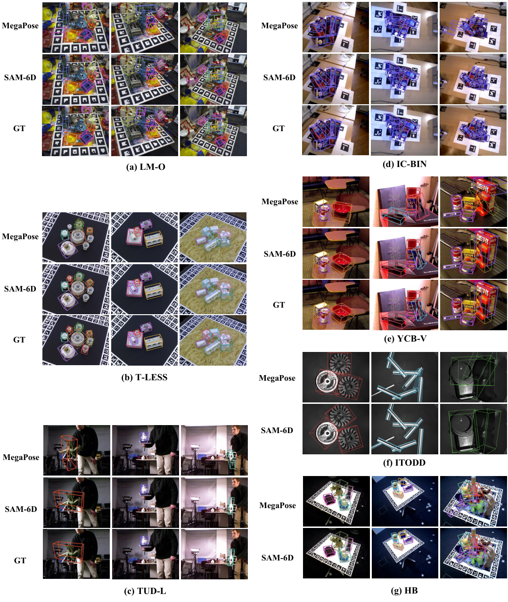

# E1. SAM-6D: Segment Anything Model Meets Zero-Shot 6D Object Pose Estimation

## 0. 읽기 전 약어 및 핵심 용어

이 문서를 읽기 전에 아래 약어와 용어를 먼저 정리한다. 이후 본문에서는 괄호 안의 약어를 사용한다.

- Artificial Intelligence (AI): 사람의 지각, 추론, 학습, 의사결정 능력을 기계가 수행하도록 만드는 인공지능 분야를 뜻한다.
- Language Model (LM): token sequence의 확률을 모델링해 다음 token 또는 문장을 예측하는 모델이다.
- Vision-Language-Action (VLA): 시각 관측과 언어 명령을 함께 받아 로봇 action까지 생성하는 모델 또는 학습 패러다임이다.
- Red-Green-Blue image (RGB): 색상을 red, green, blue 세 채널로 표현하는 일반 image format이다.
- Red-Green-Blue plus Depth image (RGB-D): RGB image에 각 pixel의 depth 정보를 함께 포함한 visual observation이다.
- State of the Art (SOTA): 특정 benchmark나 task에서 현재 가장 높은 수준의 성능을 보이는 방법을 뜻한다.
- Robotics Transformer (RT): robot observation을 입력받아 action을 예측하는 transformer 기반 robot policy 계열을 뜻한다.
- Robotics Transformer 1 (RT-1): Google의 실제 로봇 demonstration data로 학습한 transformer 기반 robot control policy이다.
- Segment Anything Model (SAM): prompt를 받아 이미지 안의 object mask를 생성하는 general-purpose image segmentation model이다.
- Segment Anything Model for 6D Pose Estimation (SAM-6D): SAM 기반 segmentation과 matching을 활용해 object의 6D pose를 추정하는 방법이다.
- Physical Intelligence pi-zero model (pi0): Physical Intelligence가 제안한 general robot control용 vision-language-action flow model이다.
- World Action Model (WAM): video/world model이 action과 future observation을 함께 모델링해 policy처럼 쓰일 수 있게 만든 모델이다.
- Benchmark for 6D Object Pose Estimation (BOP): object의 6D pose estimation 방법을 비교하기 위한 표준 benchmark suite이다.
- Computer-Aided Design (CAD): 물체의 3D geometry나 설계 정보를 컴퓨터로 표현한 model이다.
- Yale-CMU-Berkeley Object Set (YCB): robot manipulation과 pose estimation에서 자주 쓰이는 household object dataset이다.
- Texture-Less object dataset (T-LESS): texture가 거의 없는 산업형 object의 6D pose estimation을 평가하는 dataset이다.
- LINEMOD-Occluded (LM-O): 가림이 있는 object pose estimation을 평가하기 위한 LINEMOD 기반 benchmark이다.
- HomebrewedDB (HB): 6D object pose estimation benchmark에서 쓰이는 object pose dataset이다.
- Industrial Texture-less Object Detection Dataset (ITODD): 산업형 texture-less object detection과 pose estimation 평가 dataset이다.
- IC-BIN object pose dataset (IC-BIN): bin-picking style object pose estimation 평가에 쓰이는 dataset이다.
- TUD Light object dataset (TUD-L): lighting variation이 있는 object pose estimation benchmark dataset이다.
- Chinese University of Hong Kong (CUHK): 홍콩중문대학교를 뜻한다.
- Physical Artificial Intelligence (Physical AI): 디지털 공간의 예측을 넘어 물리 세계에서 지각, 예측, 계획, 행동, 안전 검사를 수행하는 AI 시스템을 뜻한다.

## 1. Metadata

| 항목 | 내용 |
|---|---|
| 논문 | SAM-6D: Segment Anything Model Meets Zero-Shot 6D Object Pose Estimation |
| 저자 | Jiehong Lin, Lihua Liu, Dekun Lu, Kui Jia |
| 소속 | CUHK-Shenzhen / South China University of Technology |
| venue | CVPR |
| 공개일 | 2023-11-27 |
| 링크 | https://arxiv.org/abs/2311.15707 |
| 코드 | https://github.com/JiehongLin/SAM-6D |

## 2. 핵심 요약

SAM-6D는 RGB-D cluttered scene에서 novel object의 instance segmentation과 6D pose estimation을 zero-shot으로 수행하는 framework다. Physical AI 스터디에서 이 논문이 중요한 이유는 VLA/WAM이 action을 생성하려면 물체의 segmentation, pose, geometry 같은 low-level perception이 여전히 중요하기 때문이다.

  

Figure 1. SAM-6D qualitative results. RGB image와 depth map에서 novel object를 segment하고 pose를 추정한다.

## 3. Method

SAM-6D는 두 단계로 구성된다. Instance Segmentation Model은 SAM 또는 FastSAM을 활용해 가능한 object proposal을 생성하고, semantic/appearance/geometric score로 target object proposal을 고른다. Pose Estimation Model은 선택된 proposal과 object model 사이의 partial-to-partial point matching 문제로 pose를 추정한다.

  

Figure 2. SAM-6D overview. ISM은 proposal을 만들고, PEM은 3D-3D correspondence를 통해 object pose를 계산한다.

  

Figure 3. Pose Estimation Model. sparse-to-dense point transformer로 coarse pose와 refined pose를 순차적으로 추정한다.

## 4. 핵심 수식

pose estimation의 목표는 object model point를 scene point에 정렬하는 rigid transformation을 찾는 것으로 볼 수 있다.

$$
p_{scene}
\approx
R p_{object}
+
t
$$

| 기호 | 의미 |
|---|---|
| $p_{object}$ | object CAD/model 좌표계의 3D point |
| $p_{scene}$ | RGB-D scene에서 관측된 3D point |
| $R$ | 3D rotation matrix |
| $t$ | 3D translation vector |
| $\approx$ | correspondence와 sensor noise 때문에 근사 정렬로 해석 |

SAM-6D의 PEM은 sparse correspondence로 initial pose를 만들고, coarse alignment 이후 dense correspondence로 최종 pose를 refinement한다.

## 5. Results

논문은 BOP benchmark의 7개 core dataset, 즉 LM-O, T-LESS, TUD-L, IC-BIN, ITODD, HB, YCB-V에서 평가한다. instance segmentation과 pose estimation 모두 기존 zero-shot/object pose 방법을 앞서며, pose refinement 없이도 강한 평균 recall을 보인다.

  

Figure 4. Pose SOTA comparison. SAM-6D는 RGB-D 기반 zero-shot pose estimation에서 강한 성능을 보인다.

## 6. 스터디 연결

VLA/WAM 논문은 종종 perception을 end-to-end representation 안에 넣지만, 실제 현장 로봇에서는 pose estimation, object segmentation, geometry estimation이 실패하면 action도 실패한다. SAM-6D는 foundation model 기반 perception module이 Physical AI stack의 앞단을 어떻게 강화할 수 있는지 보여주는 사례다.

| 연결 | 논문 | 관계 |
|---|---|---|
| VLA perception | V4 SpatialVLA, V8 PhysVLM | spatial/physical understanding |
| robot control | G4 RT-1, P4 pi0 | pose/segmentation이 action grounding에 필요 |
| monitoring | E2 Code-as-Monitor | perception 결과를 constraint monitoring에 활용 가능 |
