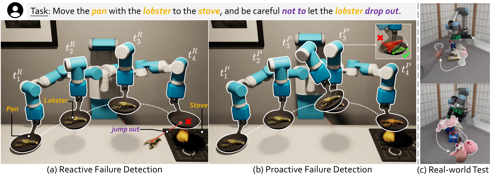
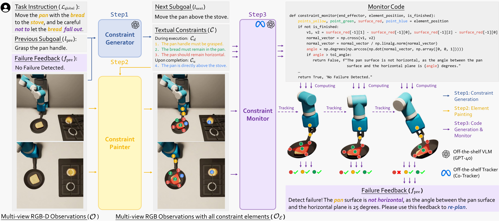
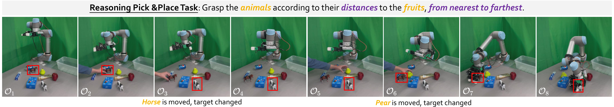

# E2. Code-as-Monitor: Constraint-aware Visual Programming for Reactive and Proactive Robotic Failure Detection

## 0. 읽기 전 약어 및 핵심 용어

이 문서를 읽기 전에 아래 약어와 용어를 먼저 정리한다. 이후 본문에서는 괄호 안의 약어를 사용한다.

- Artificial Intelligence (AI): 사람의 지각, 추론, 학습, 의사결정 능력을 기계가 수행하도록 만드는 인공지능 분야를 뜻한다.
- Vision-Language Model (VLM): 이미지와 텍스트를 함께 입력받아 시각-언어 이해나 생성 작업을 수행하는 모델이다.
- Visual Question Answering (VQA): 이미지나 비디오를 보고 자연어 질문에 답하는 vision-language task이다.
- Segment Anything Model (SAM): prompt를 받아 이미지 안의 object mask를 생성하는 general-purpose image segmentation model이다.
- Segment Anything Model for 6D Pose Estimation (SAM-6D): SAM 기반 segmentation과 matching을 활용해 object의 6D pose를 추정하는 방법이다.
- Physical Intelligence pi-zero model (pi0): Physical Intelligence가 제안한 general robot control용 vision-language-action flow model이다.
- Beijing Academy of Artificial Intelligence (BAAI): 중국 베이징의 인공지능 연구기관이다.
- Physical Artificial Intelligence (Physical AI): 디지털 공간의 예측을 넘어 물리 세계에서 지각, 예측, 계획, 행동, 안전 검사를 수행하는 AI 시스템을 뜻한다.

## 1. Metadata

| 항목 | 내용 |
|---|---|
| 논문 | Code-as-Monitor: Constraint-aware Visual Programming for Reactive and Proactive Robotic Failure Detection |
| 저자 | Enshen Zhou, Qi Su, Cheng Chi, Zhizheng Zhang et al. |
| 소속 | Beihang University / Peking University / BAAI / GalBot |
| venue | CVPR |
| 공개일 | 2024-12-05 |
| 링크 | https://arxiv.org/abs/2412.04455 |

## 2. 핵심 요약

Code-as-Monitor는 로봇 실행 중 failure를 사후에 감지하는 reactive detection과, 실패가 발생하기 전에 위험을 예측하는 proactive detection을 하나의 constraint-aware visual programming framework로 묶는다. VLM이 생성한 code가 constraint elements를 실시간으로 평가하며, 실패 이유를 설명하고 re-planning trigger를 제공한다.

  

Figure 1. Motivation. 단순 VQA 기반 failure detector는 물리 constraint를 정밀하게 추적하기 어렵고, CaM은 geometry-aware constraint monitoring으로 이를 보완한다.

## 3. Method

CaM은 세 모듈로 구성된다. Constraint Generator는 task instruction을 subgoal, object-part association, spatio-temporal constraint로 분해한다. Constraint Element Generator는 entity나 part를 point, line, surface 같은 compact 3D geometric element로 바꾼다. Constraint Monitor는 VLM-generated code를 실행해 현재 constraint 만족 여부를 실시간 평가한다.

  

Figure 2. Code-as-Monitor pipeline. instruction decomposition, constraint element generation, code-based monitoring이 연결된다.

  

Figure 3. Constraint elements. raw object mask/pose 대신 point, line, surface 같은 추상 geometric element를 추적한다.

## 4. 핵심 수식

CaM의 monitoring은 특정 constraint function이 시간에 따라 관측되는 geometric elements를 평가하는 문제로 볼 수 있다.

$$
y_t, r_t
=
f_{\mathrm{monitor}}(e_{1:t}, l, g)
$$

| 기호 | 의미 |
|---|---|
| $e_{1:t}$ | 시간 $1$부터 $t$까지 추적된 constraint elements |
| $l$ | 현재 subgoal 또는 language instruction |
| $g$ | constraint generator가 만든 geometric/spatio-temporal constraint |
| $f_{\mathrm{monitor}}$ | VLM-generated code로 구현된 monitor |
| $y_t$ | failure 여부 또는 success/failure flag |
| $r_t$ | failure reason string |

이 formulation의 장점은 neural detector가 모든 실패 패턴을 직접 외우지 않아도, task-specific constraint를 code로 실행하면서 open-set 상황에 대응할 수 있다는 점이다.

## 5. Experiments

논문은 CLIPort, OmniGibson, RLBench, real-world long-horizon tasks에서 CaM을 평가한다. 결과는 CaM이 reactive/proactive failure detection을 동시에 수행하고, constraint elements가 없는 code-only 또는 VQA-only 접근보다 real-time, precision, recovery 측면에서 유리하다는 방향으로 제시된다.

  

Figure 4. Real-world experiments. 실제 환경에서 disturbance와 failure를 감지하고 recovery/re-planning을 유도한다.

## 6. 스터디 연결

이 논문은 Physical AI deployment에서 꼭 필요한 monitoring layer를 다룬다. W12 DreamZero처럼 world/action model이 미래를 생성하고 action을 실행할 때, 생성된 plan이 실제 constraint를 위반하지 않는지 감시하는 별도 layer가 필요하다. CaM은 그 layer를 VLM/code/geometric abstraction으로 구현한 사례다.

| 연결 | 논문 | 관계 |
|---|---|---|
| perception | E1 SAM-6D | object/part/geometric element 추출 |
| policy | P4 pi0, W12 DreamZero | action 실행 중 failure monitoring 필요 |
| evaluation | E3 RoboArena | 실세계 policy evaluation에서 failure explanation 가능 |

