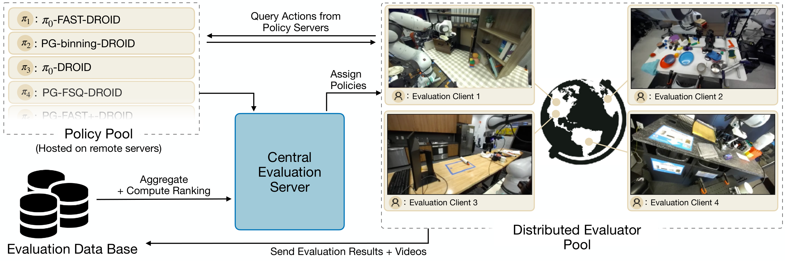
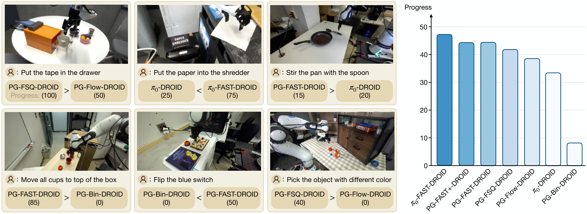

# E3. RoboArena: Distributed Real-World Evaluation of Generalist Robot Policies

## 0. 읽기 전 약어 및 핵심 용어

이 문서를 읽기 전에 아래 약어와 용어를 먼저 정리한다. 이후 본문에서는 괄호 안의 약어를 사용한다.

- Artificial Intelligence (AI): 사람의 지각, 추론, 학습, 의사결정 능력을 기계가 수행하도록 만드는 인공지능 분야를 뜻한다.
- Vision-Language-Action (VLA): 시각 관측과 언어 명령을 함께 받아 로봇 action까지 생성하는 모델 또는 학습 패러다임이다.
- Distributed Robot Interaction Dataset (DROID): 여러 장소에서 수집한 in-the-wild robot manipulation demonstration dataset이다.
- Physical Intelligence pi-zero model (pi0): Physical Intelligence가 제안한 general robot control용 vision-language-action flow model이다.
- Physical Intelligence pi-zero-point-five model (pi0.5): pi0를 open-world household manipulation으로 확장한 VLA model이다.
- Generalist Robot 00 Technology (GR00T): NVIDIA가 humanoid/generalist robot을 위해 공개한 robot foundation model family 이름이다.
- World Action Model (WAM): video/world model이 action과 future observation을 함께 모델링해 policy처럼 쓰일 수 있게 만든 모델이다.
- Physical Artificial Intelligence (Physical AI): 디지털 공간의 예측을 넘어 물리 세계에서 지각, 예측, 계획, 행동, 안전 검사를 수행하는 AI 시스템을 뜻한다.

## 1. Metadata

| 항목 | 내용 |
|---|---|
| 논문 | RoboArena: Distributed Real-World Evaluation of Generalist Robot Policies |
| 저자 | Pranav Atreya, Karl Pertsch, Tony Lee, Moo Jin Kim et al. |
| 소속 | Multi-institution collaborators |
| venue | arXiv / CoRL 2025 |
| 공개일 | 2025-06-22, arXiv v2 2025-11-29 |
| 링크 | https://arxiv.org/abs/2506.18123 |

## 2. 핵심 요약

RoboArena는 generalist robot policy를 고정된 소수 task/environment에서 평가하는 대신, 여러 기관의 evaluator가 다양한 real-world scene/task에서 pairwise A/B comparison을 수행하고 이를 집계해 global policy ranking을 만드는 distributed evaluation framework다.

  

Figure 1. RoboArena. 여러 evaluator가 각자 scene/task를 선택해 policy pair를 비교하고, pairwise preference를 모아 ranking을 만든다.

## 3. 왜 필요한가

generalist policy는 다양한 환경에서 out-of-the-box로 동작해야 한다. 그런데 기존 benchmark는 reproducibility를 위해 task와 scene을 좁게 고정한다. 이 방식은 표준화에는 좋지만, open-world generalization을 측정하기 어렵다. RoboArena는 반대로 non-stationary physical world를 받아들이고, decentralization과 pairwise comparison으로 확장성을 얻는다.

  

Figure 2. RoboArena system. policy pool, evaluator network, double-blind comparison, aggregation, qualitative analysis가 연결된다.

## 4. 핵심 수식

RoboArena의 ranking은 pairwise preference를 global score로 바꾸는 문제로 볼 수 있다. 두 policy $i$, $j$의 비교에서 $i$가 이길 확률을 score 차이의 함수로 둘 수 있다.

$$
P(i > j)
=
\frac{1}{1 + \exp(-(s_i - s_j))}
$$

| 기호 | 의미 |
|---|---|
| $i, j$ | 비교되는 두 robot policy |
| $i > j$ | evaluator가 policy $i$를 $j$보다 선호한다는 사건 |
| $s_i, s_j$ | global ranking을 위한 latent policy score |
| $P(i \succ j)$ | pairwise comparison에서 $i$가 더 낫다고 평가될 확률 |

논문이 중요한 이유는 success rate 하나를 넘어, broad task distribution에서 상대 비교를 누적해 policy quality를 추정하려 한다는 점이다.

## 5. Results

논문은 DROID platform 위에서 7개 generalist policies, 7개 대학, 612 pairwise comparisons, 4,284 evaluation episodes를 사용해 RoboArena를 검증한다. decentralized pairwise evaluation이 conventional centralized evaluation보다 oracle ranking에 더 가까운 ranking을 만들고, 같은 episode budget에서도 더 나은 ranking quality를 보인다고 보고한다.

  

Figure 3. Main results. distributed pairwise evaluation이 generalist policy ranking을 더 안정적으로 추정한다.

  

Figure 4. Strengths and weaknesses. quantitative ranking뿐 아니라 free-form evaluation explanation으로 policy 특성을 분석한다.

## 6. 스터디 연결

RoboArena는 D/P/V/W 그룹 모델들을 비교할 때 "성능을 어떻게 믿을 것인가"라는 문제를 다룬다. 특히 W12 DreamZero, P5 pi0.5, P6 GR00T처럼 open-world generalization을 주장하는 모델은 고정된 benchmark success rate만으로 충분하지 않다. Physical AI의 evaluation은 점점 distributed, preference-based, qualitative-failure-aware 방식으로 이동할 가능성이 크다.

| 연결 | 논문 | 관계 |
|---|---|---|
| data/platform | D3 DROID | RoboArena instantiation platform |
| policies | D5 OpenVLA, P5 pi0.5, P6 GR00T | 평가 대상이 되는 generalist policy |
| safety/failure | E2 Code-as-Monitor | qualitative failure explanation과 연결 |
| WAM 평가 | W12 DreamZero | open-world real-robot evaluation 필요 |