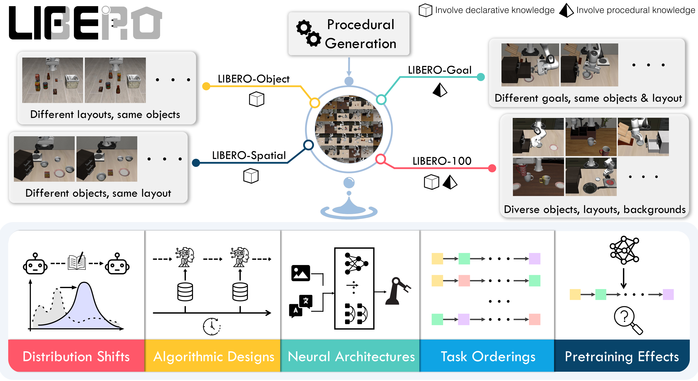
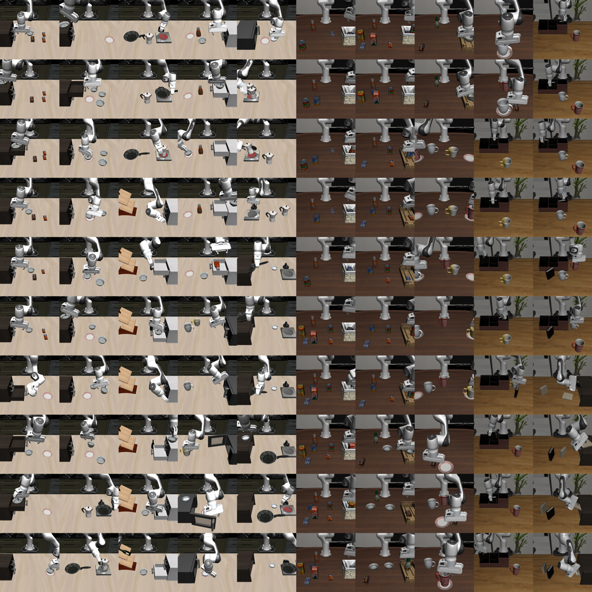
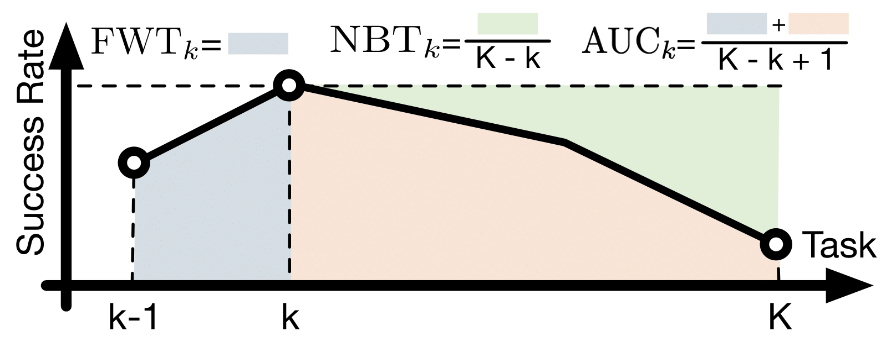

# E4. LIBERO: Benchmarking Knowledge Transfer for Lifelong Robot Learning

## 0. 읽기 전 약어 및 핵심 용어

이 문서를 읽기 전에 아래 약어와 용어를 먼저 정리한다. 이후 본문에서는 괄호 안의 약어를 사용한다.

- Artificial Intelligence (AI): 사람의 지각, 추론, 학습, 의사결정 능력을 기계가 수행하도록 만드는 인공지능 분야를 뜻한다.
- Vision-Language-Action (VLA): 시각 관측과 언어 명령을 함께 받아 로봇 action까지 생성하는 모델 또는 학습 패러다임이다.
- Behavior Cloning (BC): expert demonstration의 observation-action pair를 supervised learning으로 모방하는 imitation learning 방법이다.
- Markov Decision Process (MDP): state, action, transition, reward, discount factor로 sequential decision problem을 표현하는 수학적 framework이다.
- Convolutional Neural Network (CNN): convolution 연산으로 image나 spatial feature를 처리하는 neural network이다.
- Lifelong Robot Learning Benchmark (LIBERO): 로봇이 여러 task를 순차적으로 배우며 knowledge transfer와 forgetting을 평가하는 benchmark이다.
- Physical Intelligence pi-zero model (pi0): Physical Intelligence가 제안한 general robot control용 vision-language-action flow model이다.
- Physical Intelligence pi-zero-point-five model (pi0.5): pi0를 open-world household manipulation으로 확장한 VLA model이다.
- Physical Artificial Intelligence (Physical AI): 디지털 공간의 예측을 넘어 물리 세계에서 지각, 예측, 계획, 행동, 안전 검사를 수행하는 AI 시스템을 뜻한다.

## 1. Metadata

| 항목 | 내용 |
|---|---|
| 논문 | LIBERO: Benchmarking Knowledge Transfer for Lifelong Robot Learning |
| 저자 | Bo Liu, Yifeng Zhu, Chongkai Gao, Yihao Feng, Qiang Liu, Yuke Zhu, Peter Stone |
| 소속 | UT Austin / Sony AI / Tsinghua University |
| venue | NeurIPS Datasets and Benchmarks |
| 공개일 | 2023-06-05, arXiv v2 2023-10-14 |
| 링크 | https://arxiv.org/abs/2306.03310 |
| 프로젝트 | https://libero-project.github.io |

## 2. 핵심 요약

LIBERO는 lifelong learning for robot manipulation을 체계적으로 평가하기 위한 benchmark다. declarative knowledge, procedural knowledge, 두 지식의 혼합 transfer를 분리해서 볼 수 있도록 130개 language-conditioned manipulation tasks를 네 suite로 구성한다.

  

Figure 1. LIBERO overview. LIBERO-Spatial, LIBERO-Object, LIBERO-Goal, LIBERO-100으로 지식 transfer 유형을 나눠 평가한다.

## 3. Benchmark Design

LIBERO-Spatial은 같은 object에 대해 spatial relationship이 바뀌는 setting이고, LIBERO-Object는 layout은 같지만 object가 달라지는 setting이다. LIBERO-Goal은 object와 layout은 같지만 goal이 달라지는 setting이며, LIBERO-100은 object, layout, background, goal이 얽힌 더 복잡한 transfer setting이다.

  

Figure 2. LIBERO-Spatial. spatial relationship transfer를 분리해서 평가한다.

  

Figure 3. LIBERO-100. 다양한 objects, layouts, backgrounds가 얽힌 lifelong manipulation benchmark다.

## 4. 핵심 수식

논문은 robot learning을 finite-horizon MDP로 두고, sparse reward 대신 goal predicate를 사용한다.

$$
\mathcal{M}
=
(\mathcal{S}, \mathcal{A}, T, H, \mu_0, R)
$$

| 기호 | 의미 |
|---|---|
| $\mathcal{S}$ | state space |
| $\mathcal{A}$ | action space |
| $T$ | transition function |
| $H$ | horizon |
| $\mu_0$ | initial state distribution |
| $R$ | reward function |

lifelong setting에서는 task sequence를 순차적으로 학습하며, 현재까지 배운 task들의 평균 성능을 최적화한다.

$$
J_{\mathrm{LRL}}(\pi)
=
\frac{1}{k}
\sum_{p=1}^{k}
\mathbb{E}
\left[
\sum_{t=1}^{H}
g^{p}(s_t^{p})
\right]
$$

| 기호 | 의미 |
|---|---|
| $\pi$ | task-conditioned policy |
| $k$ | 현재까지 학습한 task 수 |
| $p$ | task index |
| $g^{p}$ | task $p$의 goal predicate |
| $s_t^{p}$ | task $p$에서 시간 $t$의 state |

imitation learning setting에서는 demonstration dataset에 대해 behavior cloning loss를 사용한다.

$$
J_{\mathrm{BC}}(\pi)
=
\frac{1}{k}
\sum_{p=1}^{k}
\mathbb{E}_{o_t,a_t \sim D^{p}}
\left[
\sum_{t=0}^{l_p}
\mathcal{L}(\pi(o_{\leq t}; T^{p}), a_t^{p})
\right]
$$

| 기호 | 의미 |
|---|---|
| $D^{p}$ | task $p$의 demonstration dataset |
| $o_{\leq t}$ | 시간 $t$까지의 observation history |
| $T^{p}$ | task identifier 또는 task condition |
| $a_t^{p}$ | demonstration action |
| $\mathcal{L}$ | supervised imitation loss |

## 5. Findings

논문은 lifelong learning algorithm보다 policy architecture가 중요할 수 있고, transformer가 temporal abstraction에 유리하며, ViT와 CNN이 transfer 유형에 따라 다르게 작동한다고 보고한다. 또한 기존 lifelong learning method가 forgetting을 줄이는 데는 도움이 되지만 forward transfer에서는 sequential fine-tuning보다 못할 수 있고, naive supervised pretraining이 오히려 downstream LLDM 성능을 해칠 수 있다는 관찰도 제시한다.

  

Figure 4. Metrics. lifelong robot learning에서는 average performance, forward transfer, backward transfer, forgetting을 함께 봐야 한다.

## 6. 스터디 연결

LIBERO는 VLA 논문에서 매우 자주 쓰이는 benchmark다. OpenVLA, CoT-VLA, Diffusion-VLA, continual VLA 논문을 읽을 때 LIBERO suite가 어떤 transfer를 측정하는지 이해해야 결과 해석이 가능하다. Physical AI 관점에서는 "새 task를 배울 때 이전 skill을 잊지 않는가"와 "declarative/procedural knowledge가 어떻게 전이되는가"를 분리해 볼 수 있게 해준다.

| 연결 | 논문 | 관계 |
|---|---|---|
| VLA benchmark | D5 OpenVLA, V2 Diffusion-VLA, V3 CoT-VLA | LIBERO 평가 사용 |
| continual learning | D7 resistant to forgetting | lifelong robot learning과 직접 연결 |
| generalist policy | P4 pi0, P5 pi0.5 | skill transfer/forgetting 평가 관점 |
