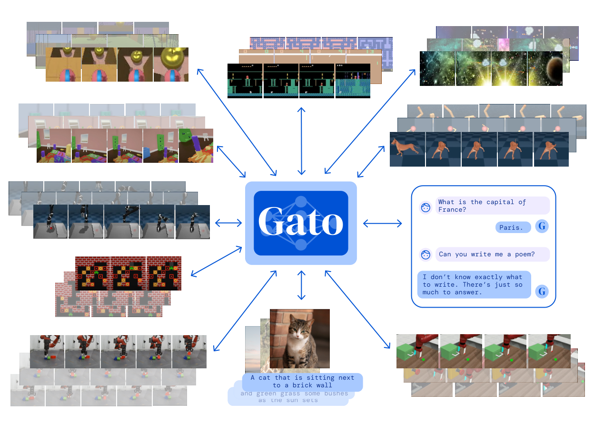
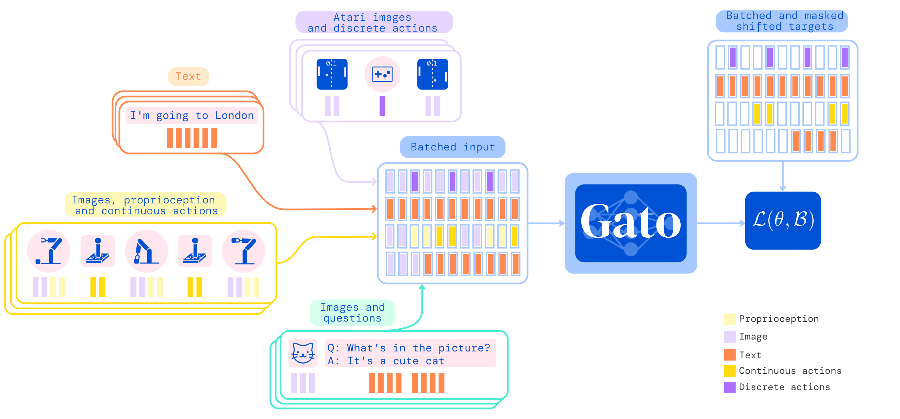
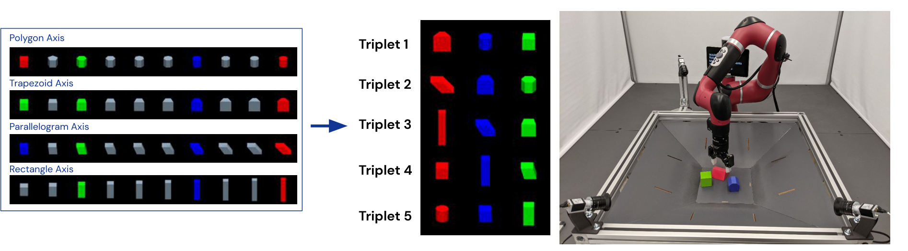
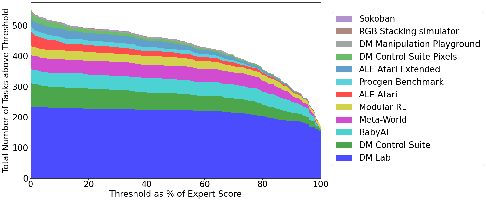
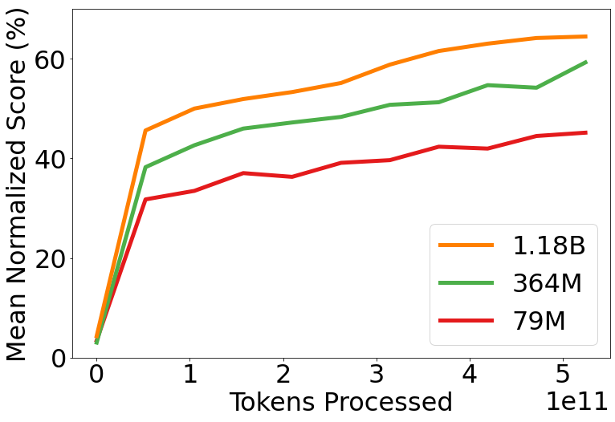

# G1. A Generalist Agent

## 0. 읽기 전 약어 및 핵심 용어

이 문서를 읽기 전에 아래 약어와 용어를 먼저 정리한다. 이후 본문에서는 괄호 안의 약어를 사용한다.

- Artificial Intelligence (AI): 사람의 지각, 추론, 학습, 의사결정 능력을 기계가 수행하도록 만드는 인공지능 분야를 뜻한다.
- Large Language Model (LLM): 대규모 텍스트 데이터로 학습되어 언어 이해, 생성, 추론, 계획에 쓰이는 foundation model이다.
- Language Model (LM): token sequence의 확률을 모델링해 다음 token 또는 문장을 예측하는 모델이다.
- Vision-Language Model (VLM): 이미지와 텍스트를 함께 입력받아 시각-언어 이해나 생성 작업을 수행하는 모델이다.
- Vision-Language-Action (VLA): 시각 관측과 언어 명령을 함께 받아 로봇 action까지 생성하는 모델 또는 학습 패러다임이다.
- Red-Green-Blue image (RGB): 색상을 red, green, blue 세 채널로 표현하는 일반 image format이다.
- Robotics Transformer (RT): robot observation을 입력받아 action을 예측하는 transformer 기반 robot policy 계열을 뜻한다.
- Robotics Transformer 1 (RT-1): Google의 실제 로봇 demonstration data로 학습한 transformer 기반 robot control policy이다.
- Robotics Transformer 2 (RT-2): web-scale vision-language knowledge와 robot trajectory를 함께 학습해 action token을 생성하는 VLA 모델이다.
- Physical Artificial Intelligence (Physical AI): 디지털 공간의 예측을 넘어 물리 세계에서 지각, 예측, 계획, 행동, 안전 검사를 수행하는 AI 시스템을 뜻한다.

## 1. Metadata

| Field | 내용 |
|---|---|
| ID | `G1` |
| Title | A Generalist Agent |
| Authors | Scott Reed, Konrad Zolna, Emilio Parisotto, Sergio Gomez Colmenarejo et al. |
| Affiliation / Team | DeepMind |
| Venue / Status | TMLR |
| Date | 2022-05-12 |
| Link | https://arxiv.org/abs/2205.06175 |
| Local source | `paper_corpus/sources/G1` |
| Source figures | `paper_corpus/figures_source/G1/manifest.md` |

## 2. 핵심 요약

Gato는 하나의 decoder-only Transformer를 사용해 Atari, image captioning, dialogue, simulated control, real robot stacking 등 서로 다른 modality와 embodiment를 모두 token sequence로 바꾸고, 동일한 next-token prediction 방식으로 학습한 generalist agent다.

이 논문의 핵심은 “로봇 policy도 language model처럼 token sequence model로 만들 수 있는가?”라는 질문이다. Gato는 world model을 명시적으로 학습하지는 않지만, 이후 RT-1, RT-2, PaLM-E, OpenVLA로 이어지는 `tokenized action`, `multi-task robot data`, `generalist policy` 흐름의 매우 중요한 출발점이다.

## 3. 왜 중요한가?

Gato는 Physical AI와 World Model 스터디에서 초반에 반드시 짚어야 하는 논문이다. 이유는 다음과 같다.

- 서로 다른 task, modality, embodiment를 하나의 sequence modeling 문제로 통합했다.
- action, proprioception, image patch, text를 모두 token으로 다루는 관점을 제시했다.
- robot control을 별도 policy architecture가 아니라 Transformer의 autoregressive generation 문제로 재해석했다.
- 604개 task를 하나의 모델에 학습시켜 generalist policy scaling의 가능성과 한계를 함께 보여줬다.
- RT-1의 robot-only scaling, RT-2의 VLA, OpenVLA의 open-source VLA와 직접 연결되는 기반 아이디어를 제공한다.

## 4. 전체 개념

Gato는 “하나의 neural network, 하나의 weight set, 여러 embodiment”라는 아이디어를 실험적으로 보여준다. 논문은 동일한 모델이 환경 맥락에 따라 text, button press, joint torque, robot action 등을 출력할 수 있다고 설명한다.

  

<em>Figure 1. Gato는 하나의 동일한 weight set으로 여러 embodiment와 task를 처리하는 generalist agent다. 논문에서는 604개 task, 다양한 modality, 서로 다른 observation/action specification을 하나의 모델로 학습한다. Source figure: <code>data_sequences.pdf</code>.</em>

발표에서는 이 그림을 통해 다음 메시지를 먼저 잡는 것이 좋다.

- Gato는 language-only model이 아니라 multi-modal, multi-task, multi-embodiment policy다.
- task마다 별도 network를 설계하지 않고, 모든 데이터를 flat token sequence로 바꾼다.
- 모델은 context를 보고 지금 text를 생성해야 하는지, action을 생성해야 하는지 결정한다.
- Physical AI 관점에서는 “모든 행동 데이터를 sequence modeling으로 통합할 수 있는가?”라는 질문의 초기 답변이다.

## 5. Tokenization과 Data Serialization

Gato의 가장 중요한 설계는 모든 data를 token sequence로 직렬화하는 것이다. text는 SentencePiece token, image는 16x16 patch, discrete value는 integer token, continuous value는 mu-law encoding과 discretization을 거친 token으로 변환된다.

  

<em>Figure 2. Gato의 training phase. 서로 다른 task와 modality의 데이터를 flat token sequence로 serialize한 뒤 Transformer에 넣고, text와 action token에 대해서만 loss를 적용한다. Source figure: <code>diagram_train.pdf</code>.</em>

핵심 tokenization은 다음과 같다.

| Modality / Value | Tokenization |
|---|---|
| Text | SentencePiece 32,000 subword token, integer range `[0, 32000)` |
| Image | non-overlapping 16x16 patch, raster order, pixel normalization |
| Discrete value | row-major flattening 후 integer token, range `[0, 1024)` |
| Continuous value | mu-law encoding, 1024 uniform bins, shifted range `[32000, 33024)` |
| Agent timestep | observation tokens, separator token, action tokens 순서 |

이 구조는 후속 VLA 논문에서 action을 text-like token으로 바꾸는 접근의 선행 사례로 볼 수 있다. 다만 Gato는 RT-2처럼 web VLM knowledge를 action으로 transfer하는 구조라기보다, 다양한 logged behavior를 하나의 supervised sequence model로 학습하는 generalist policy에 가깝다.

## 6. Autoregressive Modeling

Gato는 token sequence $s_{1:L}$의 log-likelihood를 autoregressive factorization으로 모델링한다.

$$
\log p_{\theta}(s_1,\ldots,s_L)
= \sum_{l=1}^{L} \log p_{\theta}(s_l \mid s_1,\ldots,s_{l-1})
$$

| Notation | 의미 |
|---|---|
| $s_{1:L}$ | 길이 $L$의 token sequence |
| $s_l$ | sequence의 $l$번째 token |
| $\theta$ | Gato Transformer의 model parameter |
| $p_{\theta}(s_l \mid s_1,\ldots,s_{l-1})$ | 이전 token들을 조건으로 다음 token $s_l$을 예측하는 확률 |
| $L$ | context 안의 전체 token 수 |

이 수식은 Gato가 본질적으로 language model과 같은 next-token prediction objective를 쓴다는 것을 보여준다. 차이는 token의 의미가 text에만 국한되지 않고, image patch, robot state, action, Atari button press까지 포함한다는 점이다.

## 7. Masked Training Loss

Gato는 모든 입력 token을 예측 대상으로 삼지 않는다. 논문에서는 text token과 logged action token에 대해서만 loss를 적용하고, image token이나 agent의 non-text observation token은 loss에서 masking한다.

$$
\mathcal{L}(\theta, \mathcal{B})
= - \sum_{b=1}^{|\mathcal{B}|} \sum_{l=1}^{L}
m(b,l)
\log p_{\theta}\left(s_l^{(b)} \mid s_1^{(b)},\ldots,s_{l-1}^{(b)}\right)
$$

| Notation | 의미 |
|---|---|
| $\mathcal{L}(\theta, \mathcal{B})$ | batch $\mathcal{B}$에 대한 training loss |
| $\mathcal{B}$ | token sequence들로 구성된 training batch |
| $b$ | batch 안의 sequence index |
| $|\mathcal{B}|$ | batch 크기 |
| $l$ | sequence 내 token 위치 |
| $m(b,l)$ | masking function. text 또는 logged action token이면 1, 그렇지 않으면 0 |
| $s_l^{(b)}$ | batch의 $b$번째 sequence에서 $l$번째 token |
| $p_{\theta}$ | 이전 context를 조건으로 다음 token을 예측하는 Gato model |

이 loss의 의미는 중요하다. Gato는 image나 proprioceptive observation을 “보고” action이나 text를 예측하지만, 모든 observation 자체를 reconstruct하도록 학습하지는 않는다. 따라서 Dreamer류 world model처럼 미래 observation을 명시적으로 예측하는 모델은 아니며, behavior cloning 기반의 generalist policy에 더 가깝다.

## 8. Agent Sequence 정의

appendix에서는 agent data가 timestep 단위로 어떻게 sequence화되는지 더 명확히 정의한다.

$$
s_{1:L}
= [[y^1_{1:k}, x^1_{1:m}, z^1_{1:n}, '|', a^1_{1:A}], \dots,
[y^T_{1:k}, x^T_{1:m}, z^T_{1:n}, '|', a^T_{1:A}]]
$$

$$
L = T(k + m + n + 1 + A)
$$

| Notation | 의미 |
|---|---|
| $T$ | episode 또는 sampled context 안의 timestep 수 |
| $y^t_{1:k}$ | timestep $t$의 text token sequence |
| $x^t_{1:m}$ | timestep $t$의 image patch token sequence |
| $z^t_{1:n}$ | timestep $t$의 tensor observation token sequence, 예: proprioception |
| $'|'$ | observation과 action을 구분하는 separator token |
| $a^t_{1:A}$ | timestep $t$의 action token sequence |
| $L$ | 전체 flattened token sequence length |
| $k,m,n,A$ | 각각 text, image, tensor observation, action token 개수 |

이 정의는 Gato가 trajectory를 “시간 순서로 펼친 multimodal sentence”처럼 취급한다는 점을 보여준다. 발표에서는 이 부분을 RT-1/RT-2의 action tokenization과 연결하면 좋다.

## 9. Deployment: Policy로 실행하기

학습된 Gato는 deployment 시점에 autoregressive policy처럼 동작한다. 관측과 이전 action을 context로 넣고 다음 action token을 sample한 뒤, 이 action을 환경에 적용하고, 새 관측을 다시 context에 추가한다.

  

<em>Figure 3. Gato를 control policy로 실행하는 방식. interleaved observation, separator, previous action token을 context로 넣고 다음 action을 autoregressive하게 생성한다. Source figure: <code>eval4x.png</code>.</em>

이 구조는 일반적인 policy network와 달리, action을 “다음 token”으로 취급한다. 따라서 policy execution은 language generation과 유사하지만, 생성된 token이 환경의 motor command, Atari button, 또는 text response로 해석된다는 점이 다르다.

## 10. Robotics: RGB Stacking

Gato는 real robot RGB Stacking benchmark에도 적용된다. 환경은 Sawyer robot arm을 사용하며, 관측에는 두 개의 128x128 camera image, robot arm/gripper joint angle, end-effector pose가 포함된다. 중요한 점은 block의 ground-truth object state를 직접 관측하지 않는다는 것이다.

  

<em>Figure 4. RGB Stacking environment. Sawyer robot arm이 red block을 blue block 위에 쌓는 task이며, 일부 object triplet은 held-out test set으로 남겨 Skill Generalization을 평가한다. Source figure: <code>skill_generalization_challenge.pdf</code>.</em>

이 실험은 Gato가 단순한 language/image model이 아니라 실제 robot action을 생성할 수 있는 generalist policy라는 점을 보여준다. 다만 robot data는 web-scale language/vision data보다 훨씬 제한적이고, 실제 제어는 1024-token context length와 real-time inference 제약을 받는다.

## 11. Simulated Control 성능

Gato는 604개 task에 대해 학습되며, simulated control task에서 expert score 대비 일정 threshold 이상의 성능을 낸 task 수를 보고한다.

  

<em>Figure 5. Gato의 simulated control task 성능. pretrained model이 expert score 대비 특정 비율 이상을 달성한 task 수를 domain별로 보여준다. 논문은 604개 task 중 450개 이상에서 expert score의 50% 이상을 달성한다고 보고한다. Source figure: <code>barplot_domains.png</code>.</em>

해석할 때는 두 가지를 같이 봐야 한다.

- 긍정적 측면: 하나의 model이 매우 다양한 control task에서 의미 있는 수준의 성능을 낸다.
- 제한적 측면: 모든 task에서 specialist를 이기는 것은 아니며, out-of-distribution task에서는 일반화가 제한된다.

## 12. Scaling Law 관찰

논문은 model parameter 수를 늘릴수록 aggregate in-distribution performance가 개선되는 경향을 보고한다.

  

<em>Figure 6. Gato의 scaling law 분석. model capacity가 증가할수록 aggregate in-distribution performance가 개선되는 경향을 보여준다. Source figure: <code>paper_scaling_law.png</code>.</em>

이 결과는 이후 Physical AI 연구의 중요한 직관을 만든다. 로봇 정책도 충분히 많은 task, data, parameter, compute가 있으면 language model처럼 scaling benefit을 얻을 수 있다는 것이다. 다만 Gato의 scale은 real-time robot control이 가능한 지점인 약 1.2B parameter에 맞춰져 있으며, 이는 당시 hardware와 inference latency 제약을 반영한다.

## 13. World Model 관점에서의 위치

Gato는 엄밀히 말해 world model 논문은 아니다. 모델이 미래 observation이나 latent dynamics를 명시적으로 예측하는 구조가 아니기 때문이다. 하지만 World Model 스터디에서 중요한 이유는 다음과 같다.

| 관점 | Gato의 의미 |
|---|---|
| sequence modeling | trajectory를 token sequence로 바꾸면 policy learning도 LM objective와 연결된다. |
| embodied data | image, proprioception, action, text가 하나의 context 안에서 결합된다. |
| action generation | action을 continuous control head가 아니라 token generation으로 다룰 수 있다. |
| generalist policy | 여러 task와 embodiment를 하나의 model로 학습하는 scaling path를 보여준다. |
| 한계 | dynamics prediction이나 planning-in-latent-space는 없으므로 Dreamer류 world model과는 다르다. |

따라서 Gato는 “world model 자체”라기보다, Physical AI에서 world/context/action을 하나의 sequence로 모델링하는 generalist agent 계열의 출발점으로 읽는 것이 적절하다.

## 14. 한계

| 한계 | 의미 |
|---|---|
| 명시적 world model 부재 | 미래 observation이나 latent dynamics를 직접 학습하지 않는다. |
| context length 제한 | 1024-token context로 인해 long-horizon trajectory 전체를 충분히 담기 어렵다. |
| robot data 규모 제한 | 실제 robot data는 여전히 sparse하며 web-scale data와 비교해 작다. |
| specialist 대비 성능 | 특정 domain에서는 specialist agent가 generalist Gato보다 더 강할 수 있다. |
| factuality와 language quality | dialogue는 가능하지만 얕거나 사실 오류가 있을 수 있다고 논문이 언급한다. |
| real-time constraint | robot control을 위해 model size가 inference latency와 hardware 제약을 받는다. |

## 15. 후속 연구와 연결

| 후속 흐름 | 연결 |
|---|---|
| RT-1 (`G4`) | Gato의 generalist sequence policy 관점을 real-world robotics data에 집중해 확장 |
| PaLM-E (`G5`) | action 직접 생성보다 embodied observation을 LLM에 넣어 high-level reasoning/planning 수행 |
| RT-2 (`G6`) | web-scale VLM knowledge를 action token generation으로 transfer |
| Open X-Embodiment (`D1`) | multi-robot, multi-institution robot dataset scaling으로 확장 |
| OpenVLA (`D5`) | VLA action policy를 open-source 형태로 재현/확장 |
| Dreamer 계열 (`W`) | action generation보다 latent dynamics/world model을 직접 학습하는 별도 축 |

## 16. 발표 구성 추천

1. `문제의식`: 로봇, 게임, 언어, 이미지 task를 하나의 agent로 학습할 수 있는가?
2. `핵심 아이디어`: 모든 modality와 action을 token sequence로 serialize한다.
3. `수식`: autoregressive next-token objective와 masked loss를 설명한다.
4. `deployment`: action을 다음 token으로 생성해 환경에 적용하는 control loop를 설명한다.
5. `robotics`: RGB Stacking에서 real robot control 가능성을 보여준다.
6. `scaling`: model capacity 증가가 generalist policy 성능 개선으로 이어진다는 관찰을 소개한다.
7. `비교`: Gato는 world model이 아니라 tokenized generalist policy이며, RT-1/RT-2/VLA 흐름의 기반이다.

## 17. 발표 질문

- Gato가 “policy”라면 language model과 무엇이 같고 무엇이 다른가?
- action을 token으로 만들면 robot control에서 어떤 장점과 손실이 생기는가?
- Gato가 world model이 아닌 이유는 무엇인가?
- multi-task generalist policy는 specialist policy를 언제 이길 수 있고, 언제 어려운가?
- RT-1과 RT-2는 Gato의 어떤 아이디어를 계승하고 어떤 한계를 바꾸었는가?

## 18. 요약 코멘트

Gato는 Physical AI에서 “모든 것을 token sequence로 바꾸고 하나의 Transformer로 학습한다”는 관점을 강하게 제시한 초기 generalist agent 논문이다. World Model의 명시적 dynamics modeling과는 다르지만, action, observation, language, vision을 하나의 context 안에서 다루는 방식은 이후 VLA와 generalist robot policy 연구의 출발점으로 읽는 것이 가장 좋다.