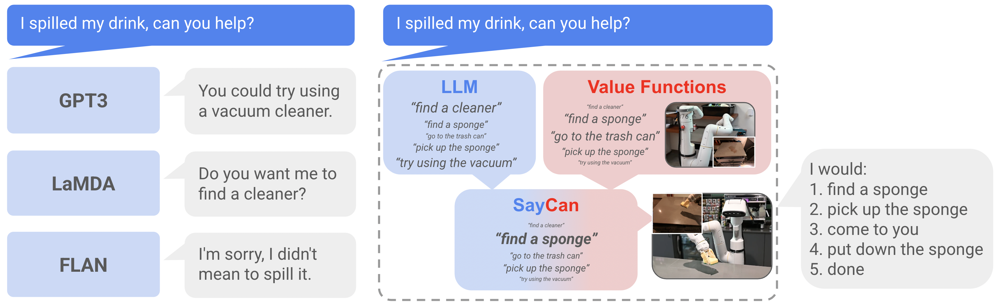
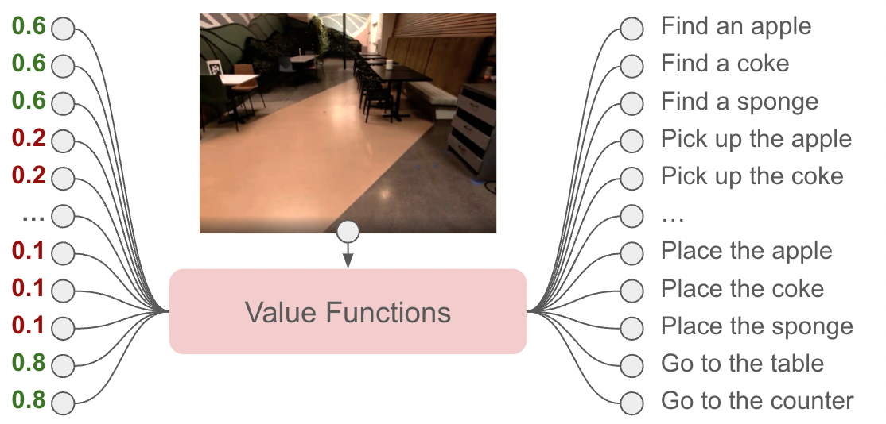
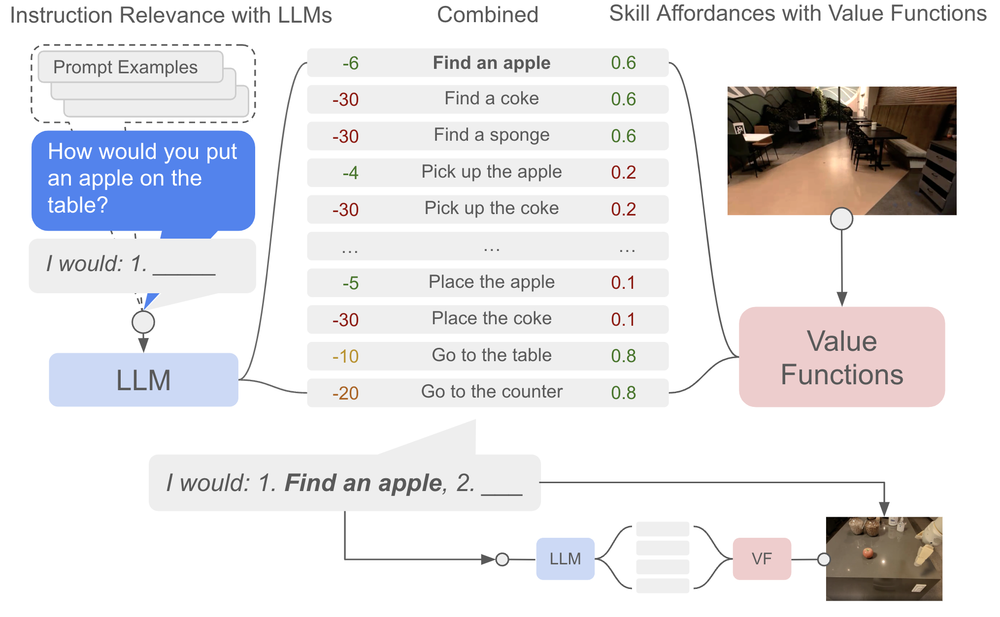
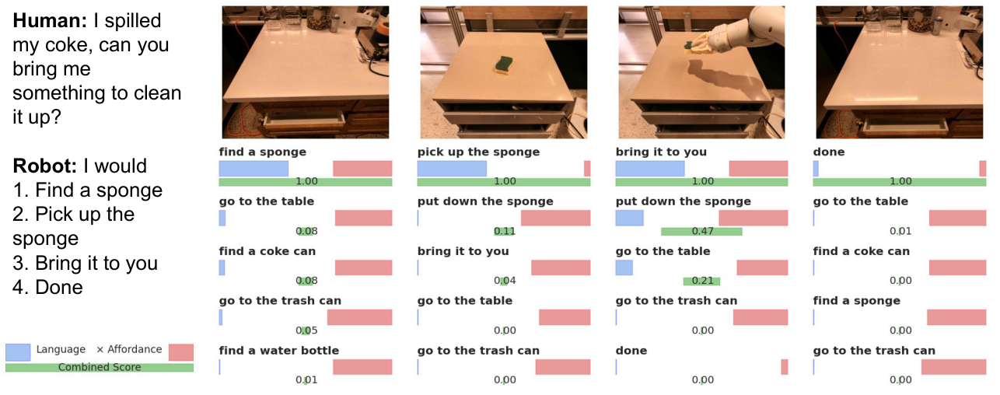

# G2. Do As I Can, Not As I Say: Grounding Language in Robotic Affordances

## 0. 읽기 전 약어 및 핵심 용어

이 문서를 읽기 전에 아래 약어와 용어를 먼저 정리한다. 이후 본문에서는 괄호 안의 약어를 사용한다.

- Artificial Intelligence (AI): 사람의 지각, 추론, 학습, 의사결정 능력을 기계가 수행하도록 만드는 인공지능 분야를 뜻한다.
- Large Language Model (LLM): 대규모 텍스트 데이터로 학습되어 언어 이해, 생성, 추론, 계획에 쓰이는 foundation model이다.
- Vision-Language Model (VLM): 이미지와 텍스트를 함께 입력받아 시각-언어 이해나 생성 작업을 수행하는 모델이다.
- Vision-Language-Action (VLA): 시각 관측과 언어 명령을 함께 받아 로봇 action까지 생성하는 모델 또는 학습 패러다임이다.
- Behavior Cloning (BC): expert demonstration의 observation-action pair를 supervised learning으로 모방하는 imitation learning 방법이다.
- Behavior Cloning from Zero-shot task specification (BC-Z): language나 goal image 같은 task specification을 조건으로 zero-shot generalization을 노리는 behavior cloning 계열 방법이다.
- Reinforcement Learning (RL): agent가 reward를 최대화하도록 environment와 상호작용하며 policy를 학습하는 방법이다.
- Robotics Transformer (RT): robot observation을 입력받아 action을 예측하는 transformer 기반 robot policy 계열을 뜻한다.
- Robotics Transformer 2 (RT-2): web-scale vision-language knowledge와 robot trajectory를 함께 학습해 action token을 생성하는 VLA 모델이다.
- Physical Artificial Intelligence (Physical AI): 디지털 공간의 예측을 넘어 물리 세계에서 지각, 예측, 계획, 행동, 안전 검사를 수행하는 AI 시스템을 뜻한다.

## 1. Metadata

| Field | 내용 |
|---|---|
| ID | `G2` |
| Title | Do As I Can, Not As I Say: Grounding Language in Robotic Affordances |
| Authors | Michael Ahn, Anthony Brohan, Noah Brown, Yevgen Chebotar et al. |
| Affiliation / Team | Robotics at Google / Everyday Robots |
| Venue / Status | CoRL 2022 / arXiv |
| Date | 2022-04-04 |
| Link | https://arxiv.org/abs/2204.01691 |
| Local source | `paper_corpus/sources/G2` |
| Source figures | `paper_corpus/figures_source/G2/manifest.md` |

## 2. 핵심 요약

SayCan은 LLM의 semantic planning 능력을 로봇의 실제 affordance와 결합해 long-horizon instruction following을 수행하는 방법이다. LLM은 주어진 high-level instruction에서 어떤 skill이 유용한지 점수화하고, value function은 현재 상태에서 그 skill이 실제로 성공 가능한지 점수화한다. 최종 선택은 두 점수의 곱으로 결정된다.

한 줄로 말하면, SayCan은 `Say`: 언어모델이 말하는 그럴듯한 다음 행동과 `Can`: 로봇이 현재 물리 세계에서 실제로 할 수 있는 행동을 결합한 grounded planning 시스템이다.

## 3. 왜 중요한가?

SayCan은 Physical AI에서 LLM을 로봇에 붙이는 초기 대표 논문이다. Gato가 action을 token으로 직접 생성하는 generalist policy의 출발점이라면, SayCan은 LLM을 low-level policy 위의 high-level planner로 사용하고, value function을 통해 물리적 grounding을 부여하는 흐름이다.

이 논문이 중요한 이유는 다음과 같다.

- LLM의 world knowledge가 로봇 planning에 유용하지만, 그대로 쓰면 embodiment와 scene grounding이 부족하다는 문제를 명확히 제기했다.
- LLM score와 affordance score를 곱해 “useful and possible”한 skill을 선택하는 단순하지만 강력한 구조를 제시했다.
- long-horizon natural language instruction을 primitive skill sequence로 분해하고, 실제 mobile manipulator로 실행했다.
- PaLM, FLAN 등 LLM 성능 향상이 로봇 plan/execution 성능 향상으로 이어질 수 있음을 실험적으로 보였다.
- PaLM-E, Inner Monologue, RT-2 이전의 LLM-for-robotics grounding 흐름을 이해하는 데 핵심적인 연결고리다.

## 4. 전체 개념

LLM은 “spill을 치우려면 sponge를 가져오면 된다” 같은 상식적 지식을 갖고 있지만, 현재 로봇이 sponge를 볼 수 있는지, 잡을 수 있는지, 해당 skill을 실행할 수 있는지는 모른다. SayCan은 이 차이를 value function으로 보완한다.

  

<em>Figure 1. SayCan은 LLM을 pretrained skill의 value function으로 grounding하여 real-world, abstract, long-horizon command를 로봇이 실행할 수 있게 한다. Source figure: <code>intro.png</code>.</em>

발표에서는 이 그림을 통해 다음 대비를 잡으면 좋다.

- LLM alone: task 의미는 알지만 현재 환경과 robot capability를 모른다.
- Robot skill alone: primitive action은 수행할 수 있지만 high-level instruction의 의미를 이해하기 어렵다.
- SayCan: LLM의 semantic knowledge와 value function의 physical affordance를 결합한다.

## 5. Language Model Scoring

SayCan은 LLM을 free-form text generator로만 쓰지 않는다. 후보 skill description 집합 $\ell_{\Pi}$가 있을 때, 각 skill description이 현재 instruction을 수행하는 다음 step으로 얼마나 적절한지를 scoring한다.

$$
p(W) = \prod_{j=0}^{n} p(w_j \mid w_{<j})
$$

| Notation | 의미 |
|---|---|
| $W$ | text sequence |
| $w_j$ | sequence의 $j$번째 string 또는 token |
| $w_{<j}$ | $j$번째 이전까지의 text context |
| $p(w_j \mid w_{<j})$ | language model의 next-token probability |

이 기본 language modeling 구조를 이용해, SayCan은 candidate skill text $\ell_\pi$가 instruction $i$에 대해 얼마나 적절한 completion인지 점수화한다.

$$
\ell_\pi
= \arg\max_{\ell_\pi \in \ell_\Pi} p(\ell_\pi \mid i)
$$

| Notation | 의미 |
|---|---|
| $\ell_\pi$ | skill $\pi$의 natural language description, 예: “pick up the sponge” |
| $\ell_\Pi$ | 전체 skill description 후보 집합 |
| $i$ | 사용자 high-level instruction |
| $p(\ell_\pi \mid i)$ | instruction $i$를 조건으로 skill description $\ell_\pi$가 다음 step으로 적절할 LLM 확률 |

하지만 이 language score만으로는 충분하지 않다. 예를 들어 “bring me an apple”이라는 instruction에서 apple이 현재 scene에 없거나 이미 robot hand에 있다면, LLM이 선택한 skill이 물리적으로 부적절할 수 있다.

## 6. Affordance Grounding

SayCan의 핵심은 skill별 value function을 affordance function으로 사용하는 것이다. 각 skill $\pi$는 policy, language description $\ell_\pi$, 그리고 현재 state에서 성공 가능성을 나타내는 affordance $p(c_\pi \mid s,\ell_\pi)$를 갖는다.

$$
p(c_i \mid i, s, \ell_\pi)
\propto
p(c_\pi \mid s, \ell_\pi) p(\ell_\pi \mid i)
$$

| Notation | 의미 |
|---|---|
| $c_i$ | high-level instruction $i$를 성공적으로 진전시키는 사건 |
| $i$ | 사용자 instruction |
| $s$ | 현재 robot/environment state |
| $\pi$ | low-level skill 또는 primitive policy |
| $\ell_\pi$ | skill $\pi$의 language description |
| $c_\pi$ | skill $\pi$가 성공적으로 완료되는 사건 |
| $p(c_\pi \mid s,\ell_\pi)$ | 현재 상태 $s$에서 skill $\ell_\pi$가 성공할 affordance probability |
| $p(\ell_\pi \mid i)$ | LLM이 보기에 skill $\ell_\pi$가 instruction $i$에 유용할 확률 |

이 수식은 SayCan의 이름을 그대로 설명한다. LLM이 “해야 할 것”을 말하고, affordance가 “할 수 있는 것”을 말한다. 두 값이 모두 높을 때만 skill이 선택된다.

## 7. Skill Selection Rule

실제 계획 단계에서는 각 candidate skill에 대해 LLM probability와 affordance probability를 곱하고, 가장 큰 값을 갖는 skill을 선택한다.

$$
\pi_n
= \arg\max_{\pi \in \Pi}
p(c_\pi \mid s_n, \ell_\pi)
p(\ell_\pi \mid i, \ell_{\pi_{n-1}}, \ldots, \ell_{\pi_0})
$$

| Notation | 의미 |
|---|---|
| $\pi_n$ | $n$번째 planning step에서 선택되는 skill |
| $\Pi$ | robot이 실행 가능한 전체 skill 집합 |
| $s_n$ | $n$번째 step의 현재 state |
| $\ell_{\pi_0},\ldots,\ell_{\pi_{n-1}}$ | 이전에 이미 선택된 skill description sequence |
| $p(c_\pi \mid s_n,\ell_\pi)$ | 현재 state에서 해당 skill이 실행 가능할 affordance score |
| $p(\ell_\pi \mid i,\ell_{\pi_{n-1}},\ldots,\ell_{\pi_0})$ | instruction과 이전 계획을 조건으로 다음 skill이 적절할 LLM score |

이 과정을 반복하면서 선택된 skill을 prompt에 추가하고, LLM과 value function을 다시 query한다. 종료 token 또는 “done”이 선택되면 planning이 끝난다.

## 8. Value Function Space

논문은 value function을 통해 현재 관측에서 가능한 primitive action의 affordance space를 만든다.

  

<em>Figure 2. Value function module은 현재 observation을 보고 action primitive별 affordance를 계산한다. Source figure: <code>vfs.png</code>.</em>

  

<em>Figure 3. “pick up the red bull can”과 “pick up the apple”은 물체가 scene에 있기 때문에 높은 affordance 값을 갖는다. Source figure: <code>vf_values_two.png</code>.</em>

이 figure들은 SayCan의 grounding이 단순한 symbolic rule이 아니라, 현재 visual observation과 learned value function에 기반한다는 점을 보여준다.

## 9. SayCan Algorithm

SayCan의 전체 pipeline은 다음과 같다.

  

<em>Figure 4. SayCan은 LLM score와 value function score를 곱해 가능한 동시에 유용한 skill을 선택하고, 선택된 skill을 response에 추가한 뒤 반복한다. Source figure: <code>vfs_llm_all.png</code>.</em>

알고리즘 흐름은 다음과 같이 요약할 수 있다.

| Step | 설명 |
|---|---|
| 1 | high-level instruction $i$, current state $s_n$, skill set $\Pi$를 받는다. |
| 2 | 각 skill $\pi$에 대해 LLM score $p_{\pi}^{\mathrm{LLM}}$를 계산한다. |
| 3 | 같은 skill에 대해 affordance score $p_{\pi}^{\mathrm{affordance}}$를 계산한다. |
| 4 | 두 점수를 곱해 $p_{\pi}^{\mathrm{combined}}$를 만든다. |
| 5 | combined score가 가장 큰 skill을 실행한다. |
| 6 | state를 업데이트하고, 이전 skill을 prompt context에 추가한 뒤 반복한다. |

이 구조의 장점은 해석 가능성이다. 사용자는 어떤 skill이 LLM 관점에서 유용하다고 평가됐는지, 어떤 skill이 로봇 관점에서 가능하다고 평가됐는지, 최종 선택이 왜 이루어졌는지 score로 확인할 수 있다.

## 10. Low-Level Skill과 Robot System

SayCan은 하나의 end-to-end action policy가 아니다. high-level planning은 LLM이 담당하고, 실제 execution은 pretrained low-level skills가 수행한다.

논문에서 사용한 robot system은 다음과 같다.

| 구성 | 내용 |
|---|---|
| Robot | Everyday Robots mobile manipulator |
| Arm | 7-DoF arm, two-finger gripper |
| Environment | office kitchen 및 mock kitchen |
| Objects / locations | 15 objects, 5 semantic locations |
| Skills | 551 skills, 7 skill families, 17 objects |
| Low-level policy | BC-Z 기반 behavioral cloning, MT-Opt 기반 RL |
| Affordance | TD backup으로 학습한 value function 또는 skill-specific heuristic |
| Planning LLM | 주로 PaLM 540B |

  

<em>Figure 5. SayCan 실험에 사용된 mobile manipulator robot. Source figure: <code>robot_setup.png</code>.</em>

중요한 점은 SayCan이 low-level motor control을 LLM에게 직접 맡기지 않는다는 것이다. LLM은 skill sequence를 고르고, 각 skill은 이미 학습된 policy가 실행한다.

## 11. Experimental Results

논문은 101개 instruction, 7개 instruction family에서 SayCan을 평가한다. metric은 plan success와 execution success 두 가지다.

| Setting | Plan Success | Execution Success |
|---|---:|---:|
| Mock Kitchen, PaLM-SayCan | 84% | 74% |
| Real Kitchen, PaLM-SayCan | 81% | 60% |
| No VF | 67% | - |
| Generative LLM + USE projection | 74% | - |
| BC NL | - | 0% |
| BC USE | - | 9% |
| FLAN-SayCan | 70% | 61% |

핵심 결과는 affordance grounding이 없는 경우보다 PaLM-SayCan의 planning success가 높고, 단순 BC 또는 embedding matching 방식은 long-horizon natural language instruction에서 거의 작동하지 않는다는 점이다.

  

<em>Figure 6. “I spilled something, can you help?” 같은 abstract instruction에서 SayCan은 combined score를 통해 sponge를 찾아 가져오는 skill sequence를 선택한다. Source figure: <code>spill_coke_rc5.pdf</code>.</em>

이 figure는 SayCan의 interpretability를 잘 보여준다. LLM이 어떤 후보를 선호하는지, affordance가 어떤 후보를 억제하거나 강화하는지, combined score가 최종 선택을 어떻게 만드는지 단계별로 관찰할 수 있다.

## 12. LLM Scaling과 Robot Performance

SayCan의 흥미로운 관찰 중 하나는 더 강한 LLM이 더 나은 robot planning으로 이어질 수 있다는 점이다. 논문은 PaLM 540B와 FLAN을 비교하며, PaLM-SayCan이 FLAN-SayCan보다 plan/execution 모두에서 높은 성능을 보인다고 보고한다.

이 결과는 Physical AI 관점에서 중요하다. robot policy 자체를 새로 학습하지 않아도, high-level planner인 LLM이 좋아지면 전체 robot system 성능이 함께 좋아질 수 있기 때문이다. 이후 PaLM-E와 RT-2는 이 연결을 더 강하게 밀고 나가, LLM/VLM의 knowledge를 embodied action과 더 직접적으로 결합한다.

## 13. World Model 관점에서의 위치

SayCan은 명시적 world model을 학습하는 논문은 아니다. dynamics prediction이나 latent rollout은 없다. 하지만 world model 스터디에서 중요한 이유는 value function이 현재 state에서 가능한 action을 나타내는 일종의 grounded world interface 역할을 하기 때문이다.

| 관점 | SayCan의 의미 |
|---|---|
| semantic world knowledge | LLM이 text pretraining에서 얻은 상식과 task knowledge를 제공한다. |
| physical grounding | value function이 현재 state와 robot capability를 반영한다. |
| planning | high-level instruction을 primitive skill sequence로 분해한다. |
| embodiment | 같은 instruction이라도 robot의 skill set과 현재 scene에 따라 선택이 달라진다. |
| 한계 | 미래 dynamics를 internal simulation하지 않고, 현재 step의 affordance score에 의존한다. |

따라서 SayCan은 world model이라기보다, LLM의 semantic world knowledge와 robot affordance model을 결합한 grounded planner로 읽는 것이 적절하다.

## 14. 한계

| 한계 | 의미 |
|---|---|
| closed-loop feedback 제한 | 기본 SayCan은 현재 decision step의 value function feedback에 의존하며, skill 실패 후 풍부한 language feedback을 활용하지 않는다. |
| low-level skill 의존성 | 가능한 행동은 pretrained skill set $\Pi$에 제한된다. |
| affordance error | value function이 물체를 잘못 인식하거나 skill 가능성을 잘못 평가하면 plan이 실패한다. |
| LLM error | long-horizon task에서 early termination, negation, ambiguous reference 문제가 발생한다. |
| end-to-end learning 아님 | LLM planning과 low-level policy/value function이 분리되어 있다. |
| planning horizon | primitive skill sequence가 길어질수록 누적 error가 커진다. |

논문은 전체 error 중 65%가 LLM error, 35%가 affordance error라고 보고한다. 이는 grounding을 추가해도 language reasoning과 perception/control 양쪽 모두의 실패가 남는다는 점을 보여준다.

## 15. 후속 연구와 연결

| 후속 흐름 | 연결 |
|---|---|
| Inner Monologue | SayCan의 closed-loop feedback 한계를 language feedback과 scene description으로 보완 |
| PaLM-E (`G5`) | LLM planner에 embodied observation을 직접 주입하는 방향으로 확장 |
| RT-2 (`G6`) | high-level skill selection을 넘어서 VLM이 action token을 직접 출력하도록 확장 |
| Code as Policies | LLM을 natural language plan이 아니라 executable code policy generator로 활용 |
| OpenVLA (`D5`) | 별도 skill library가 아니라 VLA policy가 observation에서 action을 직접 생성 |
| Dreamer 계열 (`W`) | value/affordance가 아니라 latent dynamics를 학습해 planning/control에 활용 |

## 16. 발표 구성 추천

1. `문제의식`: LLM은 상식이 있지만 물리 세계와 로봇 embodiment를 모른다.
2. `핵심 아이디어`: LLM score와 affordance score를 곱해 skill을 선택한다.
3. `수식`: $p(c_\pi \mid s,\ell_\pi)p(\ell_\pi \mid i)$가 왜 “useful and possible”을 의미하는지 설명한다.
4. `시스템`: high-level LLM planner와 low-level pretrained skills/value functions의 분리 구조를 설명한다.
5. `실험`: 101개 instruction, mock/real kitchen 결과와 No VF ablation을 비교한다.
6. `한계`: skill set 의존성, closed-loop feedback 부족, LLM/affordance error를 정리한다.
7. `연결`: PaLM-E, RT-2, OpenVLA가 SayCan의 어떤 한계를 다른 방식으로 다루는지 연결한다.

## 17. 발표 질문

- SayCan은 로봇에게 “이해”를 준 것인가, 아니면 LLM과 skill library를 잘 연결한 것인가?
- LLM score와 affordance score를 단순히 곱하는 방식은 언제 잘 작동하고 언제 깨질까?
- value function을 affordance probability로 해석하는 데 어떤 가정이 필요한가?
- SayCan의 구조는 end-to-end VLA보다 안전하고 해석 가능한가, 아니면 확장성이 떨어지는가?
- Physical AI에서 high-level planner와 low-level policy를 분리하는 전략은 언제 유리한가?

## 18. 요약 코멘트

SayCan은 LLM을 로봇에 바로 붙이면 생기는 grounding 문제를 아주 명확하게 보여주고, 이를 pretrained skill의 value function으로 해결하려는 대표적인 초기 Physical AI 논문이다. World Model 논문은 아니지만, LLM의 semantic knowledge와 현재 physical affordance를 결합해 real-world instruction following을 가능하게 했다는 점에서 PaLM-E, RT-2, VLA 계열을 이해하기 위한 중요한 징검다리다.