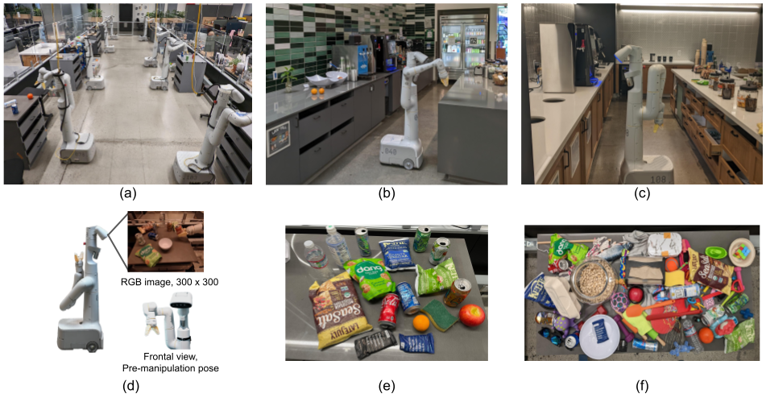
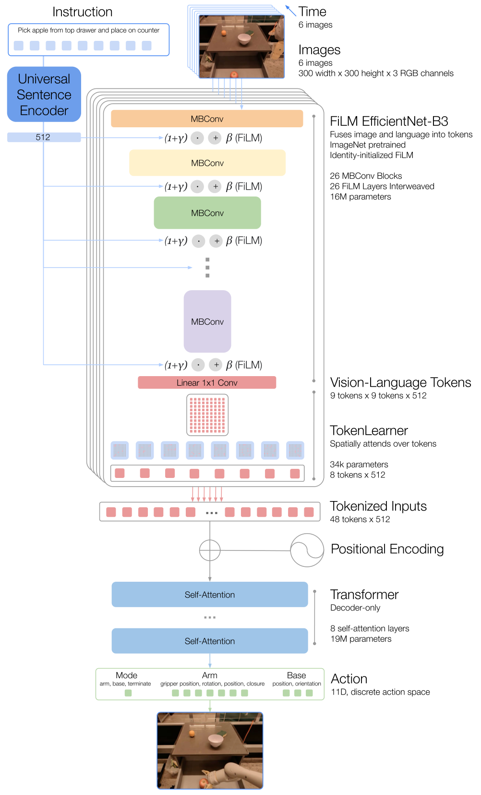
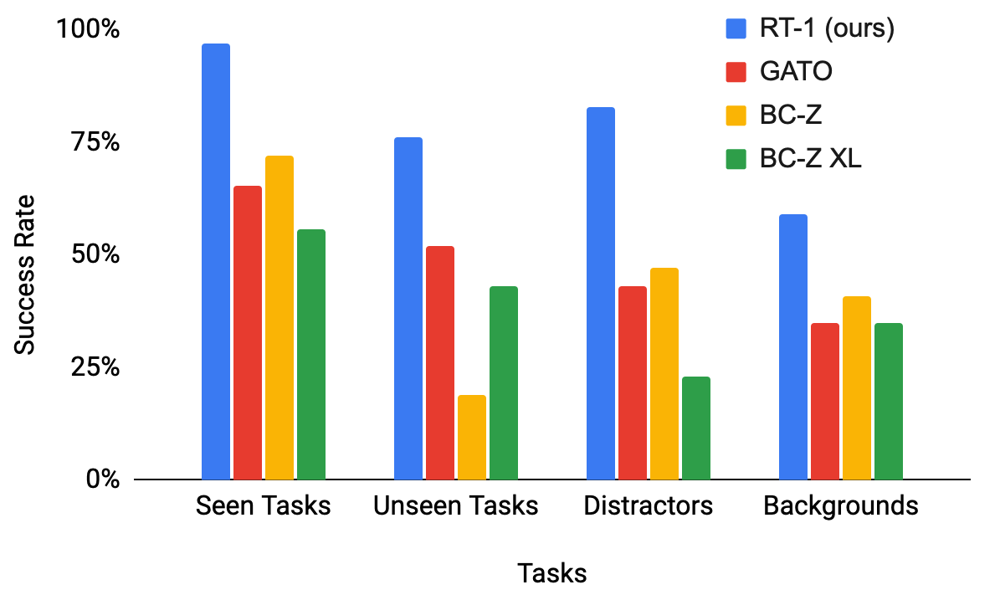

# G4. RT-1: Robotics Transformer for Real-World Control at Scale

## 0. 읽기 전 약어 및 핵심 용어

이 문서를 읽기 전에 아래 약어와 용어를 먼저 정리한다. 이후 본문에서는 괄호 안의 약어를 사용한다.

- Artificial Intelligence (AI): 사람의 지각, 추론, 학습, 의사결정 능력을 기계가 수행하도록 만드는 인공지능 분야를 뜻한다.
- Vision-Language Model (VLM): 이미지와 텍스트를 함께 입력받아 시각-언어 이해나 생성 작업을 수행하는 모델이다.
- Vision-Language-Action (VLA): 시각 관측과 언어 명령을 함께 받아 로봇 action까지 생성하는 모델 또는 학습 패러다임이다.
- Behavior Cloning (BC): expert demonstration의 observation-action pair를 supervised learning으로 모방하는 imitation learning 방법이다.
- Behavior Cloning from Zero-shot task specification (BC-Z): language나 goal image 같은 task specification을 조건으로 zero-shot generalization을 노리는 behavior cloning 계열 방법이다.
- Robotics Transformer (RT): robot observation을 입력받아 action을 예측하는 transformer 기반 robot policy 계열을 뜻한다.
- Robotics Transformer 1 (RT-1): Google의 실제 로봇 demonstration data로 학습한 transformer 기반 robot control policy이다.
- Robotics Transformer 2 (RT-2): web-scale vision-language knowledge와 robot trajectory를 함께 학습해 action token을 생성하는 VLA 모델이다.
- Robotics Transformer-X model family (RT-X): Open X-Embodiment 데이터 위에서 여러 robot embodiment로 확장한 RT 계열 policy family를 뜻한다.
- Distributed Robot Interaction Dataset (DROID): 여러 장소에서 수집한 in-the-wild robot manipulation demonstration dataset이다.
- Robotics Diffusion Transformer (RDT): diffusion model과 transformer를 결합해 robot action trajectory를 생성하는 robot foundation policy 계열이다.
- Physical Intelligence pi-zero model (pi0): Physical Intelligence가 제안한 general robot control용 vision-language-action flow model이다.
- Physical Intelligence pi-zero-point-five model (pi0.5): pi0를 open-world household manipulation으로 확장한 VLA model이다.
- Physical Artificial Intelligence (Physical AI): 디지털 공간의 예측을 넘어 물리 세계에서 지각, 예측, 계획, 행동, 안전 검사를 수행하는 AI 시스템을 뜻한다.

## 1. Metadata

| Field | 내용 |
|---|---|
| ID | `G4` |
| Title | RT-1: Robotics Transformer for Real-World Control at Scale |
| Authors | Anthony Brohan, Noah Brown, Justice Carbajal, Yevgen Chebotar et al. |
| Affiliation / Team | Google DeepMind / Robotics at Google |
| Venue / Status | arXiv |
| Date | 2022-12-13 |
| Link | https://arxiv.org/abs/2212.06817 |
| Local PDF | `paper_corpus/pdfs/G4.pdf` |
| Source figures | `paper_corpus/figures_source/G4/manifest.md` |

## 2. 핵심 요약

RT-1은 자연어 지시와 이미지 history를 입력으로 받아 discrete action token을 출력하는 Transformer 기반 robot policy이다. 논문은 13대의 Everyday Robots mobile manipulator로 17개월 동안 수집한 130K+ real-world demonstrations와 700개 이상의 instruction을 사용해, 로봇 학습에서도 데이터 규모와 다양성이 generalization에 중요하다는 점을 보여준다.

이 논문의 핵심은 세 가지다.

- 로봇 행동을 `language-conditioned sequence modeling` 문제로 재정의했다.
- continuous action regression 대신 action dimension을 discretize해 action token으로 예측했다.
- 대규모 real-world robot data, simulation data, 다른 morphology의 robot data를 Transformer policy가 흡수할 수 있는지 실험했다.

## 3. 왜 중요한가?

RT-1은 현재의 VLA나 robot foundation model과 완전히 같은 형태는 아니지만, 이후 연구의 기본 문법을 만든 논문이다. Gato가 generalist agent의 가능성을 제시했다면, RT-1은 그 방향을 실제 로봇 조작 데이터와 closed-loop control 환경에서 크게 밀어붙였다.

스터디에서는 이 논문을 `RT-2`, `Open X-Embodiment`, `Octo`, `OpenVLA`, `pi0`, `pi0.5`로 이어지는 출발점으로 읽으면 좋다. 특히 이후 논문들이 반복해서 묻는 질문인 `로봇 데이터도 scale할 수 있는가?`, `행동을 token으로 다룰 수 있는가?`, `다른 로봇의 데이터를 섞어도 성능이 유지되는가?`가 이미 RT-1에서 등장한다.

## 4. 문제 설정과 수식

RT-1은 language-conditioned sequential decision-making 문제를 다룬다. 시간 $t=0$에서 policy $\pi$는 language instruction $i$와 image observation $x_0$를 받고, action distribution에서 action $a_0$를 샘플링한다. 이후 policy는 image history를 조건으로 매 step action을 생성한다.

핵심 policy는 다음처럼 정리할 수 있다.

$$
a_t \sim \pi(\cdot \mid i, \{x_j\}_{j=0}^{t})
$$

| Notation | 의미 |
|---|---|
| $t$ | 현재 time step |
| $i$ | 자연어 instruction |
| $x_j$ | time step $j$에서 관측한 image observation |
| $\{x_j\}_{j=0}^{t}$ | 현재 시점까지의 image observation history |
| $a_t$ | time step $t$에서 로봇이 실행할 action |
| $\pi$ | RT-1 policy |
| $\pi(\cdot \mid i, \{x_j\}_{j=0}^{t})$ | instruction과 image history를 조건으로 한 action distribution |

즉, RT-1은 현재 한 장의 이미지뿐 아니라 최근 visual history와 instruction을 함께 보고 다음 action을 샘플링한다.

하나의 episode는 instruction과 observation-action trajectory로 구성된다.

$$
\tau = \left(i, \{(x_j, a_j)\}_{j=0}^{T}\right)
$$

| Notation | 의미 |
|---|---|
| $\tau$ | 하나의 episode 또는 trajectory |
| $T$ | episode가 종료되는 final time step |
| $(x_j, a_j)$ | time step $j$에서의 observation-action pair |
| $\{(x_j, a_j)\}_{j=0}^{T}$ | episode 전체의 observation-action sequence |

이 표현은 하나의 demonstration이 `instruction + 관측/행동 sequence`로 저장된다는 뜻이다.

behavioral cloning 학습은 demonstration dataset `D`에서 정답 action의 negative log-likelihood를 줄이는 방식으로 이해하면 된다.

$$
\mathcal{L}_{BC}
= - \sum_{\tau \in \mathcal{D}} \sum_{t=0}^{T}
\log \pi(a_t \mid i, \{x_j\}_{j=0}^{t})
$$

| Notation | 의미 |
|---|---|
| $\mathcal{L}_{BC}$ | behavioral cloning loss |
| $\mathcal{D}$ | expert demonstration dataset |
| $\tau \in \mathcal{D}$ | dataset 안의 하나의 demonstration trajectory |
| $\log \pi(a_t \mid i, \{x_j\}_{j=0}^{t})$ | policy가 expert action $a_t$에 부여한 log probability |

이 loss는 expert가 실제로 수행한 action의 확률을 높이도록 policy를 학습한다. 따라서 RT-1은 reinforcement learning으로 reward를 직접 최적화하는 것이 아니라, 대규모 successful demonstration을 모방하는 imitation learning 방식에 가깝다.

발표에서는 수식을 길게 설명하기보다, RT-1이 `instruction + visual history -> action distribution`을 반복적으로 계산하는 closed-loop policy라는 점을 강조하면 된다.

## 5. 전체 시스템 개요

RT-1은 instruction과 최근 image sequence를 입력으로 받아 arm/base action token을 출력한다. 논문은 35M parameter 규모의 모델이 3Hz로 동작할 수 있도록 FiLM-conditioned EfficientNet, TokenLearner, Transformer를 조합한다.

  

<em>Figure 1a. RT-1은 자연어 instruction과 image history를 입력으로 받아 discretized arm/base action을 출력한다. Source figure: <code>rt1_teaser_model.pdf</code>.</em>

이 그림에서 발표자가 짚어야 할 포인트는 다음과 같다.

- 입력은 instruction과 여러 장의 image history다.
- EfficientNet은 instruction embedding으로 FiLM conditioning된다.
- TokenLearner는 image token을 압축해 Transformer 입력을 줄인다.
- Transformer는 최종적으로 action token을 출력한다.
- 전체 시스템은 3Hz로 closed-loop control을 수행한다.

## 6. 데이터 규모와 task 다양성

RT-1은 130K demonstrations, 700+ tasks/instructions, 3,000 real-world evaluation trials를 사용한다. 이 규모는 당시 real-world robot manipulation 연구에서는 매우 큰 편이며, 논문의 메시지도 단순히 모델 구조가 아니라 `scale + breadth`가 generalization을 만든다는 데 있다.

  

<em>Figure 1b. 대규모 real-world training과 evaluation을 통해 task generalization, robustness, diverse data absorption을 보여준다. Source figure: <code>rt1_teaser_tasks.png</code>.</em>

데이터 구성은 다음처럼 요약할 수 있다.

| 항목 | 내용 |
|---|---|
| 수집 기간 | 17개월 |
| 로봇 수 | 13대 |
| demonstration 수 | 130K+ episodes |
| instruction/task 수 | 700+ |
| evaluation 규모 | 3,000 real-world trials |
| 환경 | robot classroom, office kitchens, distractor/background/generalization settings |

## 7. 로봇 환경과 evaluation setup

RT-1은 Everyday Robots mobile manipulator를 사용한다. 실험은 학습용 robot classroom과 평가용 office kitchen 환경에서 진행된다. 이 구성이 중요한 이유는 RT-1이 단순히 simulation benchmark에서만 평가된 것이 아니라, 실제 로봇과 실제 주방 환경에서 반복 평가되었기 때문이다.

  

<em>Figure 2. 데이터 수집용 robot classroom, 평가용 office kitchen, mobile manipulator, object set을 보여준다. Source figure: <code>RT-1_Robot_Setup.png</code>.</em>

이 figure는 발표 초반에 “이 논문이 다루는 physical setup이 무엇인가?”를 설명할 때 유용하다. 특히 object diversity와 environment shift가 이후 robustness 평가와 직접 연결된다.

## 8. 모델 구조 상세

RT-1 architecture는 아래 네 단계로 읽으면 된다.

| 단계 | 역할 |
|---|---|
| Universal Sentence Encoder | instruction을 512-dimensional language embedding으로 변환 |
| FiLM EfficientNet-B3 | image feature를 추출하면서 language 정보를 early fusion |
| TokenLearner | image feature token 중 중요한 token만 선택/압축 |
| Decoder-only Transformer | tokenized visual-language history를 받아 action token 출력 |

  

<em>Figure 3. instruction은 USE embedding으로 변환되고, FiLM layer를 통해 EfficientNet을 condition한다. 이후 TokenLearner가 vision-language token을 줄이고, decoder-only Transformer가 tokenized action을 출력한다. Source figure: <code>rt1_full_model.pdf</code>.</em>

이 그림은 세로가 길기 때문에 발표 자료에서는 두 부분으로 나눠 쓰는 것이 좋다. 위쪽은 `instruction-conditioned visual encoding`, 아래쪽은 `Transformer and action token output`으로 나누면 설명이 훨씬 편하다.

## 9. Action Representation

RT-1은 action을 continuous vector로 직접 회귀하지 않는다. 각 action dimension을 256개 bin으로 discretize하고, 이를 token prediction 문제로 바꾼다.

action 구성은 다음과 같다.

| Action group | Dimension / role |
|---|---|
| Arm | `x`, `y`, `z`, `roll`, `pitch`, `yaw`, gripper opening |
| Base | `x`, `y`, `yaw` |
| Mode | arm control, base control, terminate |

이 선택은 RT-1의 핵심이다. 로봇 action을 token처럼 다루면 Transformer sequence modeling과 잘 맞고, multi-modal action distribution을 더 잘 표현할 수 있다. 반대로 continuous action regression은 평균 행동을 출력하기 쉬워 복잡한 manipulation에서 불리할 수 있다.

논문 후반 ablation에서도 continuous action으로 바꾸면 성능이 크게 떨어진다. 따라서 RT-1을 읽을 때는 “Transformer를 썼다”보다 “robot action을 token화해서 sequence model로 예측했다”는 점을 더 중요하게 봐야 한다.

## 10. 주요 실험 결과

RT-1은 같은 데이터로 학습한 Gato-style baseline, BC-Z, BC-Z XL보다 seen task, unseen task, distractor robustness, background robustness에서 모두 높은 성능을 보인다.

| Model | Seen Tasks | Unseen Tasks | Distractors | Backgrounds |
|---|---:|---:|---:|---:|
| Gato | 65 | 52 | 43 | 35 |
| BC-Z | 72 | 19 | 47 | 41 |
| BC-Z XL | 56 | 43 | 23 | 35 |
| RT-1 | 97 | 76 | 83 | 59 |

핵심 해석은 다음과 같다.

- seen task 성능 97%는 대규모 instruction set을 안정적으로 학습했음을 보여준다.
- unseen task 76%는 완전히 새로운 motion이라기보다 seen concepts의 새로운 조합에 대한 일반화로 보는 것이 정확하다.
- distractor robustness 83%는 cluttered scene에서 비교적 강한 성능을 보인다는 의미다.
- background robustness 59%는 여전히 environment shift가 어렵다는 점을 보여준다.

  

<em>Figure 4. RT-1과 baseline의 seen task, unseen task, distractor, background setting 성능 비교. Source figure: <code>main_baselines_flip.png</code>.</em>

## 11. Robustness 평가 구성

논문은 robustness를 distractor, background, realistic scenario로 나눠 평가한다. 이 구분은 이후 로봇 평가 논문을 읽을 때도 유용하다.

  

<em>Figure 5. 첫 번째 행은 distractor 난이도, 두 번째 행은 background 변화, 세 번째 행은 real kitchen에서의 realistic generalization level을 보여준다. Source figure: <code>robustness2.png</code>.</em>

발표에서는 이 figure를 보면서 다음을 구분하면 좋다.

- distractor shift: object clutter와 occlusion이 늘어나는 경우
- background shift: table texture, kitchen layout, lighting이 달라지는 경우
- realistic shift: 새로운 counter layout, unseen distractor, unseen object/location이 결합되는 경우

RT-1은 distractor에는 비교적 강하지만 background/general environment shift에는 아직 제한적이다. 이 한계는 이후 DROID, Open X-Embodiment, OpenVLA, pi0.5가 다루는 in-the-wild generalization 문제와 연결된다.

## 12. Heterogeneous Data Absorption

RT-1의 또 다른 중요한 실험은 heterogeneous data를 섞었을 때 원래 task 성능이 무너지지 않는지 보는 것이다. 논문은 simulation data와 Kuka bin-picking data를 추가하는 실험을 수행한다.

| 실험 | 핵심 메시지 |
|---|---|
| Real + simulation data | simulation object에 대한 real-world generalization을 개선하면서 기존 real task 성능을 크게 해치지 않음 |
| RT-1 + Kuka data | 다른 morphology와 action distribution을 가진 robot data를 섞어도 original task 성능을 유지하고 bin-picking generalization을 개선 |

이 부분은 Open X-Embodiment와 RT-X의 직접적인 전조로 읽을 수 있다. RT-1은 “한 조직 내부에서 다른 데이터 소스를 섞을 수 있는가?”를 보여주고, Open X-Embodiment는 이를 “여러 기관과 여러 embodiment로 확장할 수 있는가?”로 키운다.

## 13. 한계

RT-1의 한계는 이후 연구가 왜 필요했는지를 잘 보여준다.

| 한계 | 의미 |
|---|---|
| Imitation learning 기반 | demonstrator 성능을 넘기 어렵고, compounding error 문제가 남는다. |
| 제한된 generalization | 새로운 instruction 일반화는 주로 seen concept의 recombination에 가깝다. |
| Dexterity 부족 | fine-grained dexterous manipulation이나 contact-rich manipulation에는 제한적이다. |
| Background robustness 부족 | distractor보다 environment/background shift가 더 어렵다. |
| Context/reaction trade-off | real-time 3Hz control을 위해 긴 context와 복잡한 attention을 마음껏 쓰기 어렵다. |
| Discrete action 한계 | tokenization은 sequence modeling에 유리하지만 정밀 continuous control에서는 추가 검증이 필요하다. |

## 14. 후속 연구와 연결

| 후속 흐름 | 연결 |
|---|---|
| RT-2 (`G6`) | RT-1의 action tokenization을 web-scale VLM 지식과 결합 |
| Open X-Embodiment / RT-X (`D1`) | RT-1의 data absorption 문제를 cross-institution, cross-embodiment scale로 확장 |
| Octo / OpenVLA (`D4`, `D5`) | 공개 generalist robot policy와 open VLA로 확장 |
| Diffusion Policy / RDT / pi0 (`P1`, `P3`, `P4`, `P5`) | discrete action token 대신 diffusion/flow 기반 continuous action generation을 탐색 |
| DROID (`D3`) | lab-scale classroom data에서 in-the-wild real-world manipulation data로 확장 |
| DreamGen / Cosmos (`W10`, `W11`) | real robot data 부족을 video world model과 synthetic data로 보완하려는 방향 |

## 15. 발표 구성 추천

발표는 다음 순서가 가장 자연스럽다.

1. `왜 RT-1이 나왔나?`: robot learning에서도 scale이 필요한 이유
2. `문제 설정`: instruction + image history에서 action distribution을 예측하는 closed-loop policy
3. `모델 구조`: FiLM EfficientNet, TokenLearner, Transformer, action token
4. `데이터`: 130K demonstrations, 700+ instructions, 13 robots
5. `결과`: seen/unseen/distractor/background 성능 비교
6. `한계`: seen concept recombination, background robustness, dexterity, imitation learning
7. `연결`: RT-2, Open X-Embodiment, OpenVLA, pi0로 이어지는 흐름

## 16. 발표 질문

- RT-1의 generalization은 진짜 새로운 skill generalization인가, 아니면 seen concept recombination인가?
- action을 256-bin token으로 discretize한 선택은 왜 효과적이었을까?
- TokenLearner는 단순 효율화 장치인가, 아니면 real-time robotics에서 필수적인 architecture component인가?
- RT-1의 data absorption 결과는 Open X-Embodiment의 가능성을 얼마나 미리 보여주는가?
- RT-1 이후 VLA 연구는 무엇을 해결했고, 무엇을 아직 해결하지 못했는가?

## 17. 요약 코멘트

RT-1은 Physical AI 관점에서 `robot data scaling의 첫 기준점`으로 읽는 것이 가장 좋다. 현재 기준으로는 VLA라기보다 language-conditioned robot Transformer policy에 가깝지만, 대규모 real-world data, action tokenization, efficient real-time architecture, heterogeneous data absorption이라는 이후 연구의 핵심 문제를 매우 선명하게 제시했다.