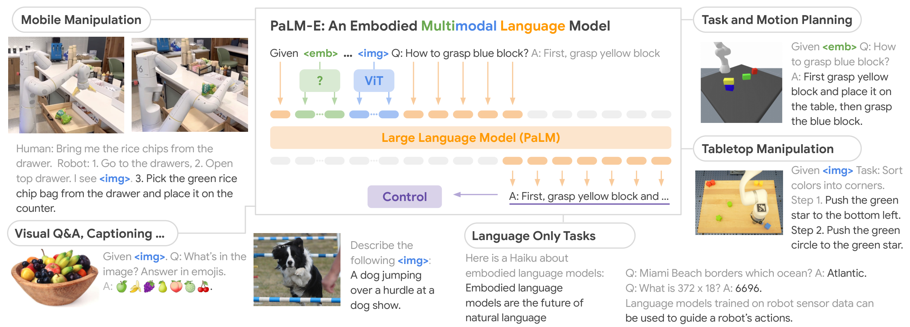
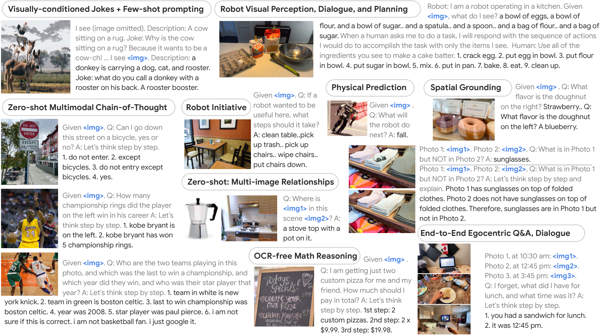
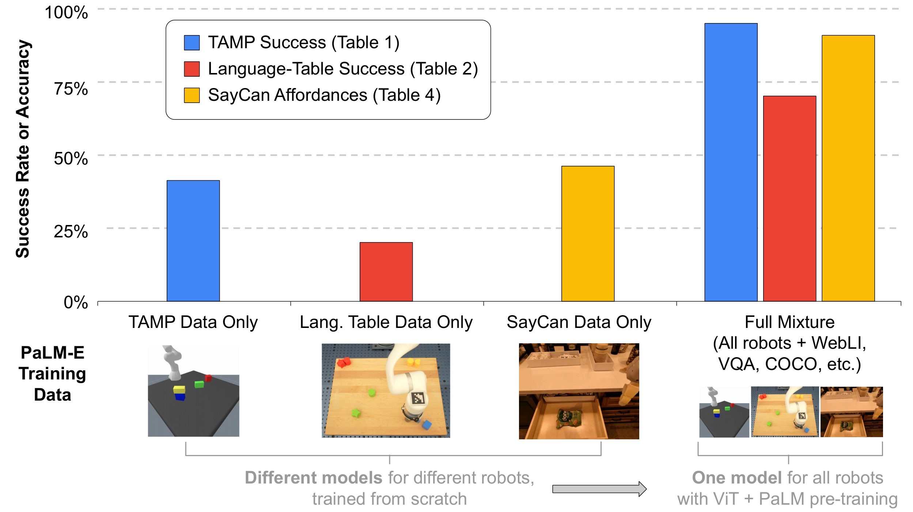
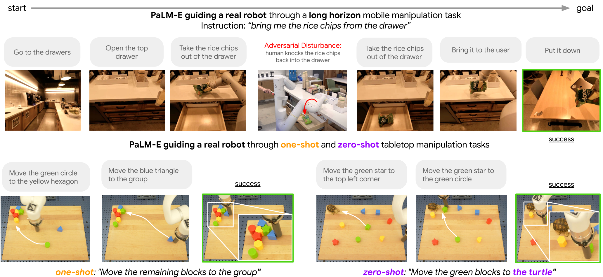

# G5. PaLM-E: An Embodied Multimodal Language Model

## 0. 읽기 전 약어 및 핵심 용어

이 문서를 읽기 전에 아래 약어와 용어를 먼저 정리한다. 이후 본문에서는 괄호 안의 약어를 사용한다.

- Artificial Intelligence (AI): 사람의 지각, 추론, 학습, 의사결정 능력을 기계가 수행하도록 만드는 인공지능 분야를 뜻한다.
- Large Language Model (LLM): 대규모 텍스트 데이터로 학습되어 언어 이해, 생성, 추론, 계획에 쓰이는 foundation model이다.
- Language Model (LM): token sequence의 확률을 모델링해 다음 token 또는 문장을 예측하는 모델이다.
- Vision-Language Model (VLM): 이미지와 텍스트를 함께 입력받아 시각-언어 이해나 생성 작업을 수행하는 모델이다.
- Vision-Language-Action (VLA): 시각 관측과 언어 명령을 함께 받아 로봇 action까지 생성하는 모델 또는 학습 패러다임이다.
- Vision-Language (VL): 시각 정보와 언어 정보를 함께 다루는 multimodal setting을 뜻한다.
- Visual Question Answering (VQA): 이미지나 비디오를 보고 자연어 질문에 답하는 vision-language task이다.
- Question Answering (QA): 질문에 대해 정답이나 설명을 생성하는 자연어 처리 task이다.
- Optical Character Recognition (OCR): 이미지 안의 문자나 문서 텍스트를 인식해 machine-readable text로 바꾸는 기술이다.
- Robotics Transformer (RT): robot observation을 입력받아 action을 예측하는 transformer 기반 robot policy 계열을 뜻한다.
- Robotics Transformer 1 (RT-1): Google의 실제 로봇 demonstration data로 학습한 transformer 기반 robot control policy이다.
- Robotics Transformer 2 (RT-2): web-scale vision-language knowledge와 robot trajectory를 함께 학습해 action token을 생성하는 VLA 모델이다.
- Outside Knowledge Visual Question Answering (OK-VQA): 이미지 이해뿐 아니라 외부 지식이 필요한 visual question answering benchmark이다.
- Physical Artificial Intelligence (Physical AI): 디지털 공간의 예측을 넘어 물리 세계에서 지각, 예측, 계획, 행동, 안전 검사를 수행하는 AI 시스템을 뜻한다.

## 1. Metadata

| Field | 내용 |
|---|---|
| ID | `G5` |
| Title | PaLM-E: An Embodied Multimodal Language Model |
| Authors | Danny Driess, Fei Xia, Mehdi S. M. Sajjadi, Corey Lynch et al. |
| Affiliation / Team | Robotics at Google / TU Berlin / Google Research |
| Venue / Status | ICML |
| Date | 2023-03-06 |
| Link | https://arxiv.org/abs/2303.03378 |
| Local source | `paper_corpus/sources/G5` |
| Source figures | `paper_corpus/figures_source/G5/manifest.md` |

## 2. 핵심 요약

PaLM-E는 이미지, state estimate, neural scene representation 같은 continuous embodied observation을 LLM의 embedding space에 직접 주입해, 로봇 planning과 visual question answering, captioning, language task를 하나의 multimodal language model로 처리하려는 논문이다.

RT-1이 action token을 직접 출력하는 robot policy에 가깝고, RT-2가 VLM을 action token 출력 모델로 fine-tuning한 VLA라면, PaLM-E는 low-level action을 직접 출력하기보다는 high-level decision이나 plan을 text로 생성하고, 이를 low-level policy/planner가 실행하는 구조에 가깝다.

## 3. 왜 중요한가?

PaLM-E는 `embodied multimodal language model`이라는 관점에서 RT-2와 OpenVLA 사이의 중요한 연결고리다. 이 논문은 “로봇이 관측한 물리 세계 정보를 LLM 안으로 어떻게 넣을 것인가?”를 다룬다.

이 논문이 중요한 이유는 다음과 같다.

- continuous observation을 language token embedding space에 직접 넣는 `multimodal sentence` 개념을 제시했다.
- 여러 robot embodiment와 vision-language task를 함께 학습해 transfer를 관찰했다.
- PaLM-E-562B가 robotics task뿐 아니라 OK-VQA 등 일반 vision-language task에서도 강한 generalist 성능을 보였다.
- 이후 RT-2가 PaLM-E를 VLA action-output 모델로 활용하는 기반이 된다.

## 4. 전체 개념

PaLM-E는 텍스트 token 사이에 이미지, state, neural 3D representation 같은 non-text observation embedding을 끼워 넣는다. 이렇게 만들어진 입력을 논문은 `multimodal sentence`라고 부른다.

  

<em>Figure 1. PaLM-E는 embodied reasoning, visual-language task, language task를 하나의 multimodal language model로 다룬다. Source figure: <code>palm-e-teaser-v4-4.pdf</code>.</em>

발표에서는 이 그림을 통해 다음을 설명하면 좋다.

- PaLM-E의 입력은 text만이 아니라 image, state, 3D representation을 포함한다.
- 모든 non-text modality는 LLM embedding space로 변환되어 text token과 함께 들어간다.
- 출력은 자연어 answer, robot plan, embodied question answering 등 text sequence다.
- robot control에서는 PaLM-E가 high-level decision을 만들고, low-level policy가 실제 action을 실행한다.

## 5. LLM 기본 수식

PaLM-E는 decoder-only LLM을 기반으로 한다. 일반적인 language model은 token sequence의 확률을 autoregressive factorization으로 표현한다.

$$
p(w_{1:L}) = \prod_{l=1}^{L} p_{\mathrm{LM}}(w_l \mid w_{1:l-1})
$$

| Notation | 의미 |
|---|---|
| $w_{1:L}$ | 길이 $L$의 text token sequence |
| $w_l$ | $l$번째 token |
| $p_{\mathrm{LM}}$ | decoder-only language model이 정의하는 next-token distribution |
| $w_{1:l-1}$ | 현재 token 이전까지의 context |

이 수식은 PaLM-E가 본질적으로 “다음 token을 예측하는 LLM”이라는 점을 보여준다. PaLM-E의 차별점은 이 token context 안에 text뿐 아니라 embodied observation embedding도 들어간다는 것이다.

## 6. Multimodal Sentence와 Observation Injection

PaLM-E의 핵심 수식은 continuous observation을 LLM embedding space로 직접 매핑하는 부분이다. text token은 기존 embedding function $\gamma$로, observation은 modality-specific encoder $\phi$로 embedding된다.

$$
x_i = \gamma(w_i)
\quad
\mathrm{for\ text\ tokens}
$$

$$
x_i = \phi_j(O_j)_i
\quad
\mathrm{for\ observation\ tokens}
$$

| Notation | 의미 |
|---|---|
| $x_i$ | LLM에 입력되는 $i$번째 embedding vector |
| $w_i$ | $i$번째 text token |
| $\gamma$ | text token을 embedding space로 보내는 word embedding function |
| $O_j$ | 이미지, state estimate, neural scene representation 등 $j$번째 continuous observation |
| $\phi_j$ | observation $O_j$를 LLM embedding space로 변환하는 encoder |
| $\phi_j(O_j)_i$ | observation encoder가 만든 embedding sequence 중 $i$번째 vector |

이 수식의 의미는 매우 중요하다. PaLM-E는 image나 state를 별도 module에서 처리한 뒤 결과만 LLM에 넘기는 것이 아니라, continuous observation 자체를 LLM의 prefix token처럼 넣는다. 따라서 LLM은 text와 observation embedding이 섞인 prefix를 보고 다음 text token을 생성한다.

## 7. Robot Control에서의 역할

PaLM-E는 RT-2처럼 low-level robot action token을 직접 출력하는 모델이 아니다. robot planning/control task에서는 PaLM-E가 high-level plan이나 subgoal을 text로 생성하고, low-level policy 또는 planner가 이를 실제 action으로 실행한다.

즉, PaLM-E는 다음과 같은 역할에 가깝다.

| 역할 | 설명 |
|---|---|
| embodied reasoner | 관측 이미지/state를 보고 다음에 무엇을 해야 할지 판단 |
| high-level planner | long-horizon task를 여러 subgoal이나 skill sequence로 분해 |
| multimodal QA model | 물리 세계 관측에 대한 질문에 답변 |
| generalist VLM | VQA, captioning, language task도 함께 수행 |

이 점에서 PaLM-E는 RT-2의 직접적인 action-output VLA와 다르다. RT-2는 PaLM-E 같은 VLM/embodied model을 action token output까지 확장한 후속 흐름으로 볼 수 있다.

## 8. Multimodal Capability

PaLM-E-562B는 zero-shot multimodal chain-of-thought, multi-image reasoning, OCR-free math reasoning 등 다양한 multimodal capability를 보인다고 보고된다.

  

<em>Figure 2. PaLM-E-562B의 multimodal reasoning 예시. zero-shot multimodal CoT, visually grounded dialogue, planning, multi-image reasoning 등을 보여준다. Source figure: <code>Figure2-v4-5.pdf</code>.</em>

이 figure는 PaLM-E가 단순히 robot planning model이 아니라, embodied observation을 포함한 generalist multimodal language model이라는 점을 보여준다.

## 9. Transfer Learning 결과

PaLM-E의 중요한 실험 메시지는 여러 robot domain과 general vision-language data를 함께 학습하면 robotics task 성능이 좋아진다는 것이다. 논문은 이를 `transfer`로 설명한다.

  

<em>Figure 3. PaLM-E는 robotics domains와 general visual-language data를 함께 학습할 때, 각 domain만 따로 학습한 경우보다 성능이 좋아지는 transfer를 보인다. Source figure: <code>4_Transfer_figure_for_PaLM-E.pdf</code>.</em>

핵심 해석은 다음과 같다.

- robotics data는 web-scale language/vision data에 비해 매우 적다.
- PaLM-E는 general VL data와 robot data를 섞어 학습함으로써 적은 robot data에서도 embodied reasoning 성능을 높인다.
- 여러 embodiment와 task를 함께 학습하면 single-domain 학습보다 더 나은 transfer가 가능하다.

## 10. Real Robot Demonstration

PaLM-E는 real robot setting에서도 long-horizon planning과 one-shot/zero-shot generalization을 보여준다. 다만 실제 low-level action은 별도 low-level policy가 실행한다는 점을 잊지 않아야 한다.

  

<em>Figure 4. PaLM-E가 두 real robot의 low-level policy를 지시하는 long-horizon mobile/tabletop manipulation 예시. Source figure: <code>palm-e-real-robot-fractal-languagetable-v1.pdf</code>.</em>

발표에서는 PaLM-E의 robot 역할을 `high-level embodied planner`로 설명하는 것이 좋다. 즉, PaLM-E는 “로봇 팔의 모터 명령을 직접 출력하는 모델”이라기보다, 관측을 보고 어떤 skill/subgoal을 실행할지 생성하는 모델이다.

## 11. 한계

| 한계 | 의미 |
|---|---|
| low-level action 직접 출력 아님 | PaLM-E는 계획/결정 text를 생성하고, 실제 action은 별도 low-level policy가 수행한다. |
| grounding failure 가능성 | LLM이 생성한 plan이 실제 물리 환경에서 실행 가능한지 항상 보장되지 않는다. |
| scale 의존성 | PaLM-E-562B처럼 큰 모델일수록 generalist capability와 forgetting 완화가 좋아지지만 배포 비용이 크다. |
| robot data 비중 낮음 | full mixture에서 embodied data 비중이 작기 때문에 robot-specific skill 학습에는 한계가 있다. |
| 평가 domain 제한 | 여러 embodiment를 다루지만 여전히 특정 manipulation/planning setup 중심이다. |

## 12. 후속 연구와 연결

| 후속 흐름 | 연결 |
|---|---|
| RT-2 (`G6`) | PaLM-E 같은 VLM/embodied model을 action token output까지 확장 |
| SayCan (`G2`) | LLM high-level planning과 low-level affordance grounding의 이전 접근 |
| OpenVLA (`D5`) | VLA를 open-source action policy로 확장 |
| CoT-VLA (`V3`) | PaLM-E의 multimodal reasoning/CoT 흐름이 action-generating VLA reasoning으로 확장 |
| Gemini Robotics (`V7`) | large multimodal model을 실제 physical world control로 확장하는 산업적 후속 흐름 |

## 13. 발표 구성 추천

1. `문제의식`: LLM/VLM은 똑똑하지만 물리 세계 관측과 어떻게 연결되는가?
2. `핵심 방법`: continuous observation을 LLM embedding space에 주입
3. `수식`: text token embedding과 observation encoder embedding이 같은 prefix 안에 들어감
4. `robot role`: PaLM-E는 high-level planner/reasoner, low-level policy가 action 실행
5. `transfer`: robot data + general VL data mixture가 embodied reasoning을 개선
6. `RT-2와 비교`: PaLM-E는 plan/text output, RT-2는 action token output
7. `한계`: grounding, scale, low-level control 분리

## 14. 발표 질문

- PaLM-E는 VLA인가, embodied VLM인가, high-level planner인가?
- continuous observation을 token embedding space에 직접 넣는 방식은 왜 강력한가?
- PaLM-E의 transfer는 robot skill transfer인가, visual-language reasoning transfer인가?
- low-level policy가 별도로 필요한 구조는 장점인가 한계인가?
- RT-2는 PaLM-E의 어떤 한계를 action-token 방식으로 해결하려고 했는가?

## 15. 요약 코멘트

PaLM-E는 Physical AI 흐름에서 `LLM/VLM을 물리 세계 관측과 연결하는 방법`을 보여주는 핵심 논문이다. RT-1이 robot policy scaling, RT-2가 action-token VLA라면, PaLM-E는 continuous embodied observation을 language model 안으로 넣어 high-level reasoning과 planning을 가능하게 하는 중간 다리로 읽는 것이 가장 좋다.
