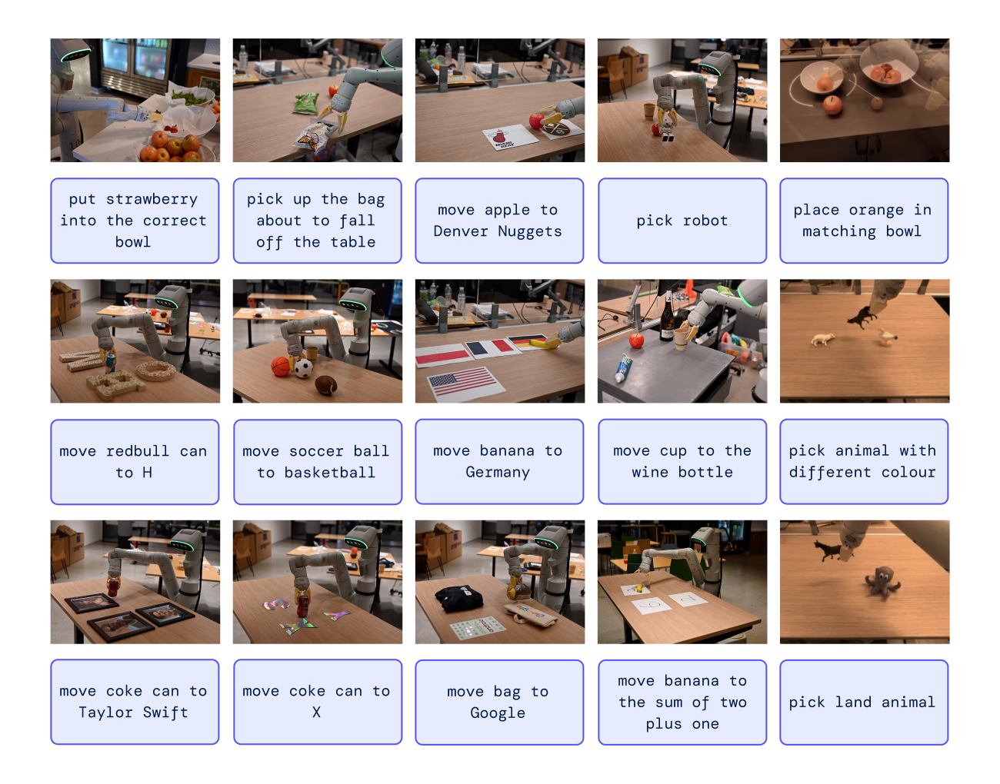
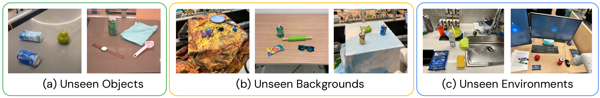
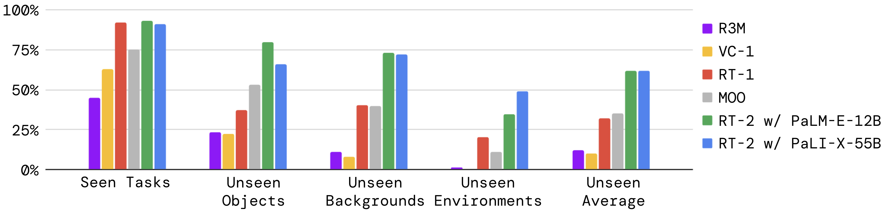
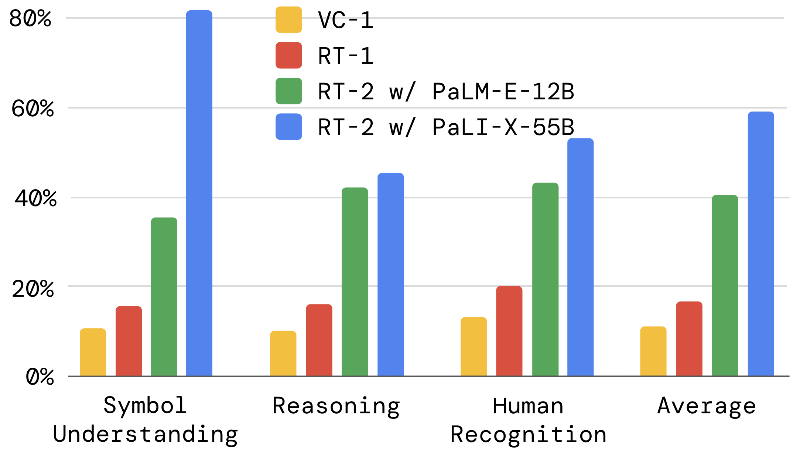

# G6. RT-2: Vision-Language-Action Models Transfer Web Knowledge to Robotic Control

## 0. 읽기 전 약어 및 핵심 용어

이 문서를 읽기 전에 아래 약어와 용어를 먼저 정리한다. 이후 본문에서는 괄호 안의 약어를 사용한다.

- Vision-Language Model (VLM): 이미지와 텍스트를 함께 입력받아 시각-언어 이해나 생성 작업을 수행하는 모델이다.
- Vision-Language-Action (VLA): 시각 관측과 언어 명령을 함께 받아 로봇 action까지 생성하는 모델 또는 학습 패러다임이다.
- Visual Question Answering (VQA): 이미지나 비디오를 보고 자연어 질문에 답하는 vision-language task이다.
- Robotics Transformer (RT): robot observation을 입력받아 action을 예측하는 transformer 기반 robot policy 계열을 뜻한다.
- Robotics Transformer 1 (RT-1): Google의 실제 로봇 demonstration data로 학습한 transformer 기반 robot control policy이다.
- Robotics Transformer 2 (RT-2): web-scale vision-language knowledge와 robot trajectory를 함께 학습해 action token을 생성하는 VLA 모델이다.
- Physical Intelligence pi-zero model (pi0): Physical Intelligence가 제안한 general robot control용 vision-language-action flow model이다.
- Physical Intelligence pi-zero-point-five model (pi0.5): pi0를 open-world household manipulation으로 확장한 VLA model이다.
- Proceedings of Machine Learning Research (PMLR): machine learning conference proceedings를 출판하는 proceedings series이다.
- Move Object Onto target (MOO): robot manipulation benchmark에서 물체를 목표 위치나 대상 위로 옮기는 task 유형을 뜻한다.

## 1. Metadata

| Field | 내용 |
|---|---|
| ID | `G6` |
| Title | RT-2: Vision-Language-Action Models Transfer Web Knowledge to Robotic Control |
| Authors | Brianna Zitkovich, Tianhe Yu, Sichun Xu, Peng Xu, Ted Xiao et al. |
| Affiliation / Team | Google DeepMind / Robotics at Google |
| Venue / Status | CoRL / PMLR |
| Date | 2023 |
| Link | https://proceedings.mlr.press/v229/zitkovich23a.html |
| Local source | `paper_corpus/sources/G6` |
| Source figures | `paper_corpus/figures_source/G6/manifest.md` |

## 2. 핵심 요약

RT-2는 web-scale vision-language model의 지식을 robot control로 직접 전이하려는 VLA 논문이다. 핵심 아이디어는 로봇 action을 text token처럼 표현해, vision-language task와 robot trajectory data를 하나의 token prediction 문제로 co-fine-tuning하는 것이다.

RT-1이 `robot data scaling + action tokenization`의 출발점이었다면, RT-2는 여기에 `Internet-scale VLM pretraining`을 결합한다. 따라서 RT-2는 “로봇이 웹에서 배운 시각/언어 지식을 실제 행동에 쓸 수 있는가?”라는 질문에 답하려는 논문이다.

## 3. 왜 중요한가?

RT-2는 Vision-Language-Action model이라는 표현을 본격적으로 로봇 제어 논문 안에서 정착시킨 대표 사례다. 기존 VLM은 이미지와 텍스트를 입력받아 자연어를 출력하지만, RT-2는 자연어 대신 robot action token도 출력할 수 있도록 학습된다.

이 논문이 중요한 이유는 다음과 같다.

- VLM의 web-scale semantic knowledge를 low-level robot control에 직접 연결했다.
- action token을 language token과 같은 output space 안에 넣었다.
- robot data만 fine-tuning하는 것보다 web data와 robot data를 함께 co-fine-tuning하는 것이 generalization에 유리하다고 보였다.
- robot data에 없던 symbol, object relation, semantic reasoning 일부가 action으로 전이될 수 있음을 보였다.

## 4. RT-1에서 RT-2로 넘어가는 핵심 변화

| 구분 | RT-1 | RT-2 |
|---|---|---|
| 모델 출발점 | robot policy Transformer | pretrained VLM, PaLI-X / PaLM-E |
| 학습 데이터 | robot demonstrations 중심 | robot trajectories + Internet-scale VLM data |
| action 표현 | discretized action tokens | text-tokenized robot actions |
| 주요 목표 | real-world robot data scaling | web knowledge transfer to robot control |
| 핵심 질문 | robot data를 키우면 일반화되는가? | VLM 지식이 로봇 행동으로 전이되는가? |

RT-2는 RT-1의 action discretization을 그대로 계승하지만, action token을 VLM의 text output vocabulary 안에 넣는다는 점에서 한 단계 더 나아간다.

## 5. 전체 시스템 개요

RT-2는 로봇 action을 또 하나의 language처럼 표현한다. 학습 시에는 web-scale vision-language data와 robot trajectory data를 함께 사용하고, 추론 시에는 모델이 출력한 text token을 다시 robot action으로 de-tokenize한다.

  

<em>Figure 1. RT-2는 robot action을 text token으로 표현해 Internet-scale vision-language data와 함께 학습하고, inference 시 text token을 robot action으로 변환해 closed-loop control을 수행한다. Source figure: <code>rt2_teaser.pdf</code>.</em>

이 그림에서 중요한 포인트는 다음이다.

- action을 별도 continuous head가 아니라 token output으로 다룬다.
- VLM backbone과 pretraining을 그대로 활용한다.
- robot action task와 VQA/captioning 같은 web vision-language task가 같은 token prediction framework 안에 들어간다.
- 추론 시에는 출력 token이 valid action token으로 제한된다.

## 6. Action Tokenization과 수식

RT-2는 RT-1의 discretization 방식을 기반으로 한다. end-effector의 6-DoF displacement, gripper extension, terminate command를 action으로 사용하고, continuous dimension은 256개 bin으로 discretize한다.

원문에서 action target은 다음과 같은 token string으로 표현된다.

$$
y_{\mathrm{action}}
= [z_{\mathrm{term}}, z_{\Delta x}, z_{\Delta y}, z_{\Delta z},
z_{\Delta r_x}, z_{\Delta r_y}, z_{\Delta r_z}, z_{\mathrm{grip}}]
$$

| Notation | 의미 |
|---|---|
| $y_{\mathrm{action}}$ | VLM이 출력해야 하는 robot action token sequence |
| $z_{\mathrm{term}}$ | episode termination 여부를 나타내는 token |
| $z_{\Delta x}, z_{\Delta y}, z_{\Delta z}$ | end-effector position displacement를 discretize한 token |
| $z_{\Delta r_x}, z_{\Delta r_y}, z_{\Delta r_z}$ | end-effector rotation displacement를 discretize한 token |
| $z_{\mathrm{grip}}$ | gripper extension을 discretize한 token |

원문에서는 이를 `"terminate Δpos_x Δpos_y Δpos_z Δrot_x Δrot_y Δrot_z gripper_extension"` 형식의 text token sequence로 설명한다. 예를 들어 `"1 128 91 241 5 101 127"` 같은 숫자 token string이 하나의 robot action을 나타낼 수 있다.

이 수식의 의미는 단순하다. RT-2는 action을 neural network의 별도 continuous output으로 예측하지 않고, language model이 다음 단어를 예측하듯 다음 action token sequence를 예측한다.

## 7. Co-Fine-Tuning

RT-2의 핵심 학습 전략은 robot data만 fine-tuning하는 것이 아니라, 원래 VLM이 학습하던 web-scale vision-language task와 robot action prediction을 함께 학습하는 것이다.

개념적으로 학습 데이터는 다음처럼 볼 수 있다.

$$
\mathcal{D}_{\mathrm{train}}
= \mathcal{D}_{\mathrm{robot}} \cup \mathcal{D}_{\mathrm{web}}
$$

| Notation | 의미 |
|---|---|
| $\mathcal{D}_{\mathrm{train}}$ | RT-2 co-fine-tuning에 사용되는 전체 학습 데이터 |
| $\mathcal{D}_{\mathrm{robot}}$ | robot camera image, task instruction, action token으로 구성된 robot trajectory data |
| $\mathcal{D}_{\mathrm{web}}$ | VQA, captioning, image-text 등 Internet-scale vision-language data |

이 방식의 목적은 두 가지다. 첫째, 모델이 low-level robot action을 학습한다. 둘째, web-scale pretraining에서 얻은 semantic knowledge와 visual reasoning 능력을 잃지 않도록 유지한다. 논문은 co-fine-tuning이 robot data만 fine-tuning하는 것보다 generalization에 유리하다고 보고한다.

## 8. Generalization과 Emergent Capability

RT-2가 강조하는 가장 큰 결과는 web-scale VLM pretraining에서 온 semantic knowledge가 robot action으로 전이된다는 점이다. 특히 robot training data에 직접 없던 symbol, relation, semantic instruction을 어느 정도 수행할 수 있음을 보인다.

  

<em>Figure 2. RT-2는 symbol understanding, human recognition, semantic reasoning이 필요한 real-world situations에 일반화할 수 있음을 보여준다. Source figure: <code>RT2-capabilities-dm.png</code>.</em>

발표에서는 이 figure를 볼 때 “새로운 motion을 배웠는가?”와 “새로운 semantic concept을 행동에 연결했는가?”를 구분해야 한다. RT-2가 강해진 부분은 주로 후자다. 즉, VLM이 이미 알고 있던 시각/언어 개념을 robot action selection에 활용하는 것이다.

## 9. Evaluation Setup

논문은 seen task뿐 아니라 unseen object, unseen background, unseen environment로 generalization을 나눠 평가한다. 이는 RT-1의 robustness/generalization 평가를 계승하면서, VLM pretraining이 어떤 shift에서 도움이 되는지 보려는 구성이다.

  

<em>Figure 3. unseen object, unseen background, unseen environment 평가 scenario 예시. Source figure: <code>generalization_evals_dm.pdf</code>.</em>

평가 category는 다음처럼 이해할 수 있다.

| Category | 의미 |
|---|---|
| Seen tasks | RT-1과 유사한 학습 분포 내 instruction |
| Unseen objects | robot data에 없거나 적게 등장한 object에 대한 일반화 |
| Unseen backgrounds | table texture, object clutter, visual background 변화 |
| Unseen environments | kitchen sink, office desk 등 더 큰 scene/layout 변화 |

## 10. 주요 결과

RT-2의 seen task 성능은 RT-1과 유사한 수준이지만, generalization setting에서 차이가 크게 난다. 논문은 RT-2 계열 모델이 generalization 실험에서 RT-1과 MOO 대비 평균적으로 약 2배 개선되고, 다른 baseline 대비 더 큰 차이를 보인다고 설명한다.

  

<em>Figure 4. RT-2-PaLI-X, RT-2-PaLM-E와 baselines의 seen/unseen generalization 성능 비교. Source figure: <code>rt2_overall_wide_dm.png</code>.</em>

핵심 해석은 다음과 같다.

- seen task에서는 RT-1도 이미 강하기 때문에 RT-2의 차이가 크게 두드러지지 않는다.
- unseen object/background/environment에서는 VLM pretraining의 semantic/visual knowledge가 더 크게 작동한다.
- RT-2-PaLI-X와 RT-2-PaLM-E는 난이도별로 차이가 있지만 평균적으로 유사한 generalization benefit을 보인다.

## 11. Emergent Skills와 Ablation

RT-2는 emergent skill evaluation을 통해 robot data에 직접 없던 semantic capability가 행동으로 나타날 수 있음을 보인다. 예를 들어 특정 숫자나 icon 위에 물체를 놓는 instruction, 가장 작은/큰 물체를 선택하는 instruction 등이 여기에 해당한다.

  

<em>Figure 5. RT-2와 baselines의 emergent skill 성능 비교. Source figure: <code>rt2_emergent_dm.png</code>.</em>

여기서 중요한 해석은 RT-2가 완전히 새로운 motor primitive를 만든다는 뜻은 아니라는 점이다. 논문도 semantic/visual concept의 transfer를 강조한다. 즉, 이미 가능한 pick/place motion 위에 “무엇을 고를지”, “어디에 놓을지”를 정하는 semantic grounding이 좋아진 것으로 읽는 것이 적절하다.

## 12. Chain-of-Thought Variant

RT-2는 PaLM-E 기반 variant에서 `Plan` step을 추가하는 chain-of-thought style fine-tuning도 실험한다. 이 경우 모델은 바로 action token을 출력하지 않고, 먼저 자연어 plan을 생성한 뒤 action token을 출력한다.

형식은 다음처럼 이해할 수 있다.

$$
y = [y_{\mathrm{plan}}, y_{\mathrm{action}}]
$$

| Notation | 의미 |
|---|---|
| $y$ | 모델의 전체 output sequence |
| $y_{\mathrm{plan}}$ | action 이전에 생성하는 자연어 plan |
| $y_{\mathrm{action}}$ | 실제 robot action token sequence |

  

<em>Figure 6. Chain-of-thought reasoning을 적용한 RT-2 rollout. 모델은 plan과 action을 함께 생성한다. Source figure: <code>RT2CoT_Narrow.pdf</code>.</em>

이 부분은 이후 CoT-VLA나 reasoning-augmented VLA를 읽을 때 중요한 연결점이다. 다만 RT-2의 CoT 실험은 초기적이고 qualitative 성격이 강하므로, 일반적인 reasoning 능력이 완전히 해결됐다고 보기는 어렵다.

## 13. 한계

| 한계 | 의미 |
|---|---|
| 새로운 motion 학습은 제한적 | web knowledge는 semantic concept을 전이하지만, robot data에 없는 완전히 새로운 motor skill을 만들지는 못한다. |
| valid action constraint 필요 | 일반 VLM처럼 자유롭게 token을 생성하면 robot execution에 쓸 수 없으므로 action vocabulary를 제한해야 한다. |
| real-time inference 부담 | PaLI-X, PaLM-E 같은 큰 VLM을 robot control에 쓰려면 inference speed와 deployment cost가 중요하다. |
| semantic grounding failure 가능성 | VLM이 알고 있는 개념이 실제 scene과 action feasibility에 항상 맞지는 않는다. |
| evaluation 범위 제한 | 주로 manipulation setting에서 검증되며, dexterous/contact-rich task나 long-horizon autonomy는 제한적이다. |

## 14. 후속 연구와 연결

| 후속 흐름 | 연결 |
|---|---|
| OpenVLA (`D5`) | RT-2류 VLA를 open-source generalist VLA로 확장 |
| PaLM-E (`G5`) | RT-2가 활용하는 embodied multimodal language model 흐름의 핵심 기반 |
| CoT-VLA (`V3`) | RT-2의 plan/action 출력 아이디어가 visual chain-of-thought VLA로 이어짐 |
| pi0/pi0.5 (`P4`, `P5`) | VLA를 더 일반적인 robot control과 open-world generalization으로 확장 |
| SpatialVLA/PhysVLM (`V4`, `V8`) | RT-2의 semantic grounding을 spatial/physical grounding 문제로 확장 |

## 15. 발표 구성 추천

1. `RT-1 복습`: action tokenization과 robot data scaling
2. `RT-2의 질문`: web-scale VLM knowledge를 robot action으로 전이할 수 있는가?
3. `핵심 방법`: action-as-text-token, co-fine-tuning, output constraint
4. `결과`: seen task보다 unseen generalization에서 강점이 드러남
5. `emergent capability`: symbol, relation, semantic reasoning이 action으로 연결됨
6. `CoT variant`: plan을 먼저 생성하고 action token을 출력하는 초기 reasoning 방향
7. `한계와 연결`: OpenVLA, CoT-VLA, SpatialVLA, pi0로 이어지는 문제의식

## 16. 발표 질문

- RT-2의 generalization은 motor skill generalization인가, semantic concept transfer인가?
- action을 text token으로 넣는 방식은 VLM의 장점을 잘 활용하는가, 아니면 action precision을 희생하는가?
- co-fine-tuning에서 web data와 robot data의 비율은 어떤 trade-off를 만들까?
- output constraint가 필요한 모델을 end-to-end VLA라고 볼 수 있는가?
- RT-2 이후 VLA가 spatial reasoning과 physical grounding을 따로 강화해야 했던 이유는 무엇인가?

## 17. 요약 코멘트

RT-2는 RT-1의 robot action tokenization을 web-scale VLM과 결합해 VLA 패러다임을 만든 논문이다. 이 논문의 진짜 기여는 “로봇이 웹에서 새로운 행동을 배운다”가 아니라, VLM이 이미 가진 semantic/visual concept을 action selection에 연결할 수 있음을 보였다는 점이다. 따라서 RT-2는 이후 OpenVLA, CoT-VLA, SpatialVLA, pi0 계열을 읽기 위한 핵심 기준점이다.
