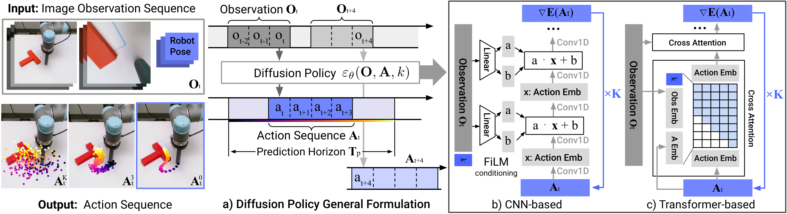
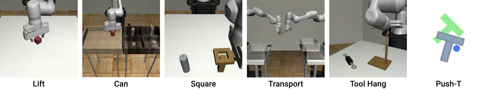
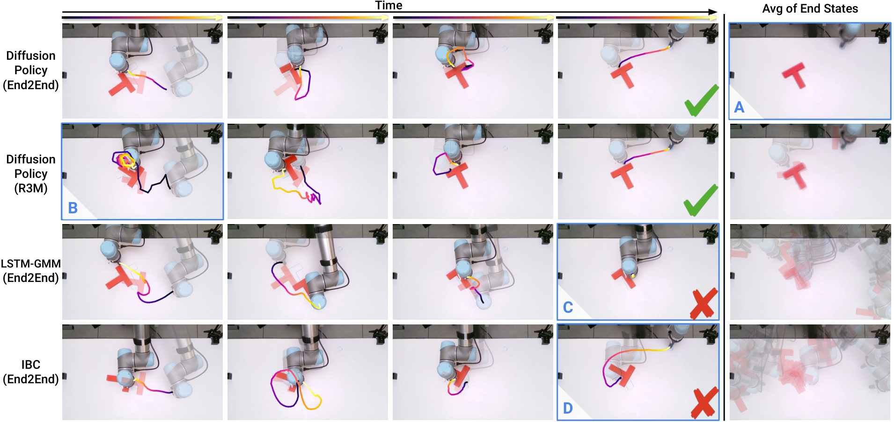
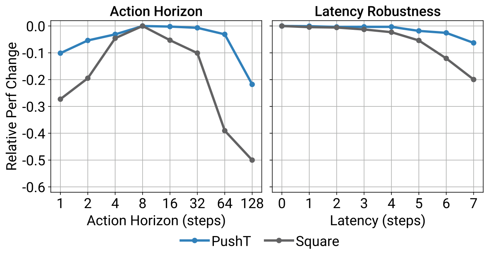

# P1. Diffusion Policy: Visuomotor Policy Learning via Action Diffusion

## 0. 읽기 전 약어 및 핵심 용어

이 문서를 읽기 전에 아래 약어와 용어를 먼저 정리한다. 이후 본문에서는 괄호 안의 약어를 사용한다.

- Vision-Language-Action (VLA): 시각 관측과 언어 명령을 함께 받아 로봇 action까지 생성하는 모델 또는 학습 패러다임이다.
- Behavior Cloning (BC): expert demonstration의 observation-action pair를 supervised learning으로 모방하는 imitation learning 방법이다.
- Multi-Layer Perceptron (MLP): fully connected layer를 여러 층 쌓은 feed-forward neural network이다.
- Convolutional Neural Network (CNN): convolution 연산으로 image나 spatial feature를 처리하는 neural network이다.
- Long Short-Term Memory (LSTM): sequence의 장기 의존성을 다루기 위해 gate 구조를 사용하는 recurrent neural network이다.
- Long Short-Term Memory Gaussian Mixture Model (LSTM-GMM): LSTM sequence model이 Gaussian mixture distribution의 parameter를 예측하는 policy 표현이다.
- Denoising Diffusion Probabilistic Model (DDPM): noise를 점진적으로 제거하는 reverse process를 학습하는 diffusion generative model이다.
- Denoising Diffusion Implicit Model (DDIM): DDPM보다 빠른 deterministic 또는 semi-deterministic sampling을 가능하게 하는 diffusion sampler이다.
- Mean Squared Error (MSE): 예측값과 정답의 차이를 제곱해 평균한 regression loss이다.
- Robotics Transformer (RT): robot observation을 입력받아 action을 예측하는 transformer 기반 robot policy 계열을 뜻한다.
- Robotics Transformer 2 (RT-2): web-scale vision-language knowledge와 robot trajectory를 함께 학습해 action token을 생성하는 VLA 모델이다.
- Robotics Diffusion Transformer (RDT): diffusion model과 transformer를 결합해 robot action trajectory를 생성하는 robot foundation policy 계열이다.
- Robotics Diffusion Transformer 1B (RDT-1B): 약 1B parameter 규모의 bimanual manipulation diffusion foundation model이다.
- Physical Intelligence pi-zero model (pi0): Physical Intelligence가 제안한 general robot control용 vision-language-action flow model이다.
- International Journal of Robotics Research (IJRR): robotics 분야의 대표 학술지다.

## 1. Metadata

| Field | 내용 |
|---|---|
| ID | `P1` |
| Title | Diffusion Policy: Visuomotor Policy Learning via Action Diffusion |
| Authors | Cheng Chi, Zhenjia Xu, Siyuan Feng, Eric Cousineau et al. |
| Affiliation / Team | Columbia University / Toyota Research Institute / MIT |
| Venue / Status | RSS 2023; IJRR 2025 |
| Date | 2023-03-07 |
| Link | https://arxiv.org/abs/2303.04137 |
| Local source | `paper_corpus/sources/P1` |
| Source figures | `paper_corpus/figures_source/P1/manifest.md` |

## 2. 핵심 요약

Diffusion Policy는 robot visuomotor policy를 conditional denoising diffusion process로 표현하는 논문이다. observation을 조건으로 action sequence를 Gaussian noise에서 점진적으로 denoise하여 생성하고, receding horizon control로 일부 action만 실행한 뒤 다시 replanning한다.

VLA 계열이 action을 discrete token으로 생성한다면, Diffusion Policy는 continuous action distribution 자체를 expressive generative model로 다룬다. 특히 multimodal action distribution, high-dimensional action sequence, stable training이라는 세 가지 장점을 robot behavior cloning에 가져온 것이 핵심이다.

## 3. 왜 중요한가?

Diffusion Policy는 이후 robot foundation model과 VLA 연구에서 action head/action generator를 설계할 때 거의 반드시 비교되는 기준점이다.

- action을 single-step regression이 아니라 action sequence generation 문제로 바꿨다.
- multimodal action distribution을 자연스럽게 표현할 수 있다.
- receding horizon control을 결합해 temporal consistency와 responsiveness를 동시에 노렸다.
- 15개 task, 4개 benchmark에서 평균 46.9% improvement를 보고했다.
- OpenVLA 같은 autoregressive action-token VLA와 pi0 같은 flow/diffusion action model 사이의 중요한 연결고리다.

## 4. Policy Representation 관점

논문은 policy representation을 explicit policy, implicit policy, diffusion policy로 비교한다.

  

<em>Figure 1. Policy representations. explicit policy는 action을 직접 예측하고, implicit policy는 energy landscape에서 낮은 energy action을 찾는다. Diffusion Policy는 learned gradient field를 따라 noise를 action으로 refine한다. Source figure: <code>DP_teaser.pdf</code>.</em>

발표에서는 이 그림을 통해 다음을 설명하면 좋다.

- BC에서 action regression은 multimodal expert behavior를 평균내는 문제가 생긴다.
- implicit policy는 multimodality를 다룰 수 있지만 negative sampling 등으로 학습이 불안정할 수 있다.
- diffusion policy는 score/gradient field를 학습해 안정적으로 multimodal action을 sampling한다.

## 5. DDPM Denoising Process

Diffusion Policy는 DDPM을 robot action space에 적용한다. Gaussian noise에서 시작해 $K$번 denoising하여 clean action을 만든다.

$$
\mathbf{x}^{k-1}
=
\alpha
\left(
\mathbf{x}^{k}
-
\gamma \epsilon_{\theta}(\mathbf{x}^{k}, k)
+
\mathcal{N}(0,\sigma^2 I)
\right)
$$

| Notation | 의미 |
|---|---|
| $\mathbf{x}^{k}$ | diffusion step $k$에서의 noisy sample |
| $\mathbf{x}^{k-1}$ | 한 단계 denoising 후 sample |
| $\mathbf{x}^{0}$ | 최종 noise-free output |
| $K$ | 전체 denoising iteration 수 |
| $\epsilon_{\theta}$ | noise prediction network |
| $\theta$ | noise prediction network parameter |
| $\alpha,\gamma,\sigma$ | denoising/noise schedule 관련 계수 |
| $\mathcal{N}(0,\sigma^2 I)$ | 각 step에서 추가되는 Gaussian noise |

이 수식은 diffusion sampling을 noisy gradient descent처럼 볼 수 있음을 보여준다. 논문은 $\epsilon_{\theta}$가 action score/energy landscape의 gradient field를 예측한다고 해석한다.

## 6. Gradient Descent 해석

논문은 denoising step을 noisy gradient descent와 연결한다.

$$
\mathbf{x}^{\prime}
=
\mathbf{x}
-
\gamma \nabla E(\mathbf{x})
$$

| Notation | 의미 |
|---|---|
| $\mathbf{x}$ | 현재 sample 또는 action candidate |
| $\mathbf{x}^{\prime}$ | gradient step 이후 sample |
| $E(\mathbf{x})$ | energy function |
| $\nabla E(\mathbf{x})$ | energy landscape의 gradient |
| $\gamma$ | step size 또는 learning rate |

Diffusion Policy에서는 $\epsilon_{\theta}(\mathbf{x}, k)$가 $\nabla E(\mathbf{x})$에 해당하는 방향을 학습한다고 볼 수 있다. 즉, policy는 action을 직접 회귀하는 것이 아니라 “좋은 action 쪽으로 어떻게 denoise할 것인가”를 학습한다.

## 7. DDPM Training Loss

DDPM training은 clean sample에 noise를 더한 뒤, 그 noise를 맞히도록 학습한다.

$$
\mathcal{L}
=
\mathrm{MSE}
\left(
\boldsymbol{\epsilon}^{k},
\epsilon_{\theta}(\mathbf{x}^{0}+\boldsymbol{\epsilon}^{k}, k)
\right)
$$

| Notation | 의미 |
|---|---|
| $\mathcal{L}$ | diffusion noise prediction loss |
| $\mathbf{x}^{0}$ | dataset에서 나온 clean sample |
| $\boldsymbol{\epsilon}^{k}$ | diffusion step $k$에 해당하는 sampled noise |
| $\epsilon_{\theta}$ | noise prediction network |
| $k$ | denoising iteration index |
| $\mathrm{MSE}$ | predicted noise와 true noise 사이의 mean squared error |

이 loss의 장점은 implicit policy처럼 negative sampling으로 normalization constant를 다루지 않아도 된다는 점이다. 따라서 multimodal distribution을 표현하면서도 학습 안정성이 좋다.

## 8. Diffusion Policy Formulation

robot control에서는 output sample $\mathbf{x}$가 image가 아니라 future action sequence $\mathbf{A}_t$가 된다. 또한 denoising은 observation $\mathbf{O}_t$에 조건화된다.

  

<em>Figure 2. Diffusion Policy overview. policy는 최근 $T_o$ step observation을 입력으로 받고, $T_a$ step action을 실행한다. CNN version은 FiLM conditioning을 사용하고, Transformer version은 observation embedding에 cross-attention한다. Source figure: <code>policy_input_output.pdf</code>.</em>

conditional denoising process는 다음과 같다.

$$
\mathbf{A}^{k-1}_{t}
=
\alpha
\left(
\mathbf{A}^{k}_{t}
-
\gamma
\epsilon_{\theta}(\mathbf{O}_{t}, \mathbf{A}^{k}_{t}, k)
+
\mathcal{N}(0,\sigma^2 I)
\right)
$$

| Notation | 의미 |
|---|---|
| $\mathbf{A}^{k}_{t}$ | timestep $t$에서 diffusion step $k$의 noisy future action sequence |
| $\mathbf{A}^{k-1}_{t}$ | 한 단계 denoising된 action sequence |
| $\mathbf{O}_{t}$ | 최근 observation history |
| $\epsilon_{\theta}(\mathbf{O}_{t},\mathbf{A}^{k}_{t},k)$ | observation과 noisy action sequence를 조건으로 noise/gradient를 예측하는 network |
| $\alpha,\gamma,\sigma$ | diffusion noise schedule 계수 |
| $\mathcal{N}(0,\sigma^2 I)$ | sampling 과정에서 추가되는 Gaussian noise |

training loss도 observation-conditioned 형태로 바뀐다.

$$
\mathcal{L}
=
\mathrm{MSE}
\left(
\boldsymbol{\epsilon}^{k},
\epsilon_{\theta}
(\mathbf{O}_{t}, \mathbf{A}^{0}_{t}+\boldsymbol{\epsilon}^{k}, k)
\right)
$$

| Notation | 의미 |
|---|---|
| $\mathbf{A}^{0}_{t}$ | demonstration에서 나온 clean future action sequence |
| $\boldsymbol{\epsilon}^{k}$ | diffusion step $k$에서 더한 noise |
| $\mathbf{O}_{t}$ | observation condition |
| $\epsilon_{\theta}$ | noise prediction network |
| $\mathcal{L}$ | conditional action diffusion training loss |

이 수식은 Diffusion Policy가 미래 state를 생성하지 않고, observation을 condition으로 action sequence만 생성한다는 점을 보여준다. 이 선택은 real-time visuomotor control에서 inference cost를 줄이는 데 중요하다.

## 9. Receding Horizon Control

Diffusion Policy는 한 번에 $T_p$ step action을 예측하지만, 그중 $T_a$ step만 실행하고 다시 observation을 받아 replanning한다.

$$
\mathbf{A}_t =
[a_t, a_{t+1}, \ldots, a_{t+T_p-1}],
\quad
\mathrm{execute}
([a_t,\ldots,a_{t+T_a-1}])
$$

| Notation | 의미 |
|---|---|
| $\mathbf{A}_t$ | timestep $t$에서 예측한 future action sequence |
| $T_p$ | action prediction horizon |
| $T_a$ | action execution horizon |
| $a_t$ | timestep $t$의 action |
| $\mathrm{execute}$ | 예측된 action sequence 중 일부를 실제 robot에 실행하는 과정 |

이 구조는 중요한 trade-off를 만든다.

| $T_a$가 작을 때 | $T_a$가 클 때 |
|---|---|
| observation 변화에 빠르게 반응 | temporal consistency가 좋아짐 |
| action이 jittery해질 수 있음 | unexpected change에 늦게 반응 |
| 매 step diffusion inference 필요 | inference latency를 줄일 수 있음 |

논문은 action horizon이 1보다 크면 idle demonstration이나 latency에 더 강하지만, 너무 길면 reaction time이 느려져 성능이 떨어진다고 설명한다.

## 10. CNN vs Transformer Diffusion Policy

Diffusion Policy는 noise prediction network $\epsilon_{\theta}$로 CNN과 Transformer를 모두 검토한다.

| Backbone | 특징 | 장점 | 한계 |
|---|---|---|---|
| CNN-based Diffusion Policy | 1D temporal CNN + FiLM conditioning | 대부분 task에서 안정적이고 hyperparameter tuning이 적음 | 빠르게 변하는 action sequence에서 over-smoothing 가능 |
| Time-series Diffusion Transformer | noisy action token + diffusion step embedding + observation cross-attention | high-frequency action change, velocity control task에 강함 | hyperparameter에 민감하고 end-to-end visual training이 어려움 |

이 비교는 이후 robot foundation model에서 action head를 설계할 때 중요하다. action generator가 단순 MLP/regression head인지, autoregressive token decoder인지, diffusion/flow model인지에 따라 temporal behavior가 크게 달라진다.

## 11. Evaluation 결과

논문은 4개 benchmark의 15개 task에서 Diffusion Policy를 평가한다.

  

<em>Figure 3. Simulation benchmark tasks. Robomimic, Push-T, Multimodal Block Pushing, Franka Kitchen 등 다양한 state/image observation task에서 평가한다. Source figure: <code>sim_task_thumbnails.pdf</code>.</em>

핵심 결과는 다음과 같다.

- Diffusion Policy는 state-based 및 vision-based observation 모두에서 baseline보다 일관되게 높은 성능을 보인다.
- 평균 46.9% success-rate improvement를 보고한다.
- short-horizon multimodality와 long-horizon multimodality 모두에서 강하다.
- position control action space를 잘 활용한다.
- receding horizon position control 덕분에 latency에 강하다.

real-world evaluation도 여러 manipulation task에서 수행된다.

  

<em>Figure 4. Real-world results. UR5/Franka robot에서 Push-T, mug flipping, sauce pouring/spreading 등 실제 manipulation task를 평가한다. Source figure: <code>real_results.pdf</code>.</em>

## 12. Ablation과 Design Takeaways

  

<em>Figure 5. Ablation results. action horizon, latency, observation horizon 등 Diffusion Policy 설계 요소가 성능에 미치는 영향을 분석한다. Source figure: <code>ablation_figure.pdf</code>.</em>

핵심 design takeaway는 다음과 같다.

| Design factor | 핵심 메시지 |
|---|---|
| Action horizon | 너무 짧으면 jittery, 너무 길면 reaction이 느려진다. |
| Position control | Diffusion Policy는 position control에서 특히 강하다. |
| Visual conditioning | observation을 output으로 생성하지 않고 condition으로만 사용해 inference cost를 줄인다. |
| End-to-end vision | real task에서는 frozen pretrained feature보다 end-to-end trained visual encoder가 더 효과적이었다고 보고한다. |
| Inference iterations | real-world task에서는 DDIM으로 denoising step을 줄여 latency를 낮춘다. |

## 13. VLA / pi0 계열과의 연결

| 흐름 | Diffusion Policy와의 연결 |
|---|---|
| OpenVLA (`D5`) | action을 discrete token으로 생성하는 VLA. Diffusion Policy는 continuous action sequence를 diffusion으로 생성 |
| Diffusion-VLA (`V2`) | VLA reasoning과 diffusion action generation을 결합하려는 후속 흐름 |
| CogACT (`V1`) | cognition/action module을 분리하고 action module에서 diffusion-style modeling을 사용 |
| pi0 (`P4`) | VLA backbone과 flow matching action generation을 결합하는 general robot control model |
| 3D Diffusion Policy (`P2`) | 3D representation을 Diffusion Policy에 결합해 generalization을 개선 |
| RDT-1B (`P3`) | diffusion foundation model을 bimanual manipulation으로 scale |

Diffusion Policy는 VLA와 직접 경쟁한다기보다, VLA의 action head를 어떻게 설계할 것인가에 대한 다른 답변을 제공한다. 특히 precise control과 multimodal continuous action에서는 diffusion/flow 계열이 강력한 대안이 된다.

## 14. World Model 관점에서의 위치

Diffusion Policy는 world model이 아니다. 미래 observation이나 environment dynamics를 생성하지 않고, observation-conditioned action distribution만 생성한다. 하지만 world model 스터디에서 중요한 이유는 다음과 같다.

| 관점 | Diffusion Policy의 의미 |
|---|---|
| action generative model | action distribution을 expressive generative model로 다룬다. |
| implicit optimization | denoising 과정을 action-space optimization으로 해석할 수 있다. |
| closed-loop control | receding horizon으로 reactive control과 temporal consistency를 결합한다. |
| no future state prediction | world dynamics를 모델링하지 않으므로 model-based planning과는 다르다. |
| 후속 확장 | flow/diffusion action model과 VLA/world model을 결합하는 연구의 기반이 된다. |

따라서 Diffusion Policy는 world model 자체보다 “action world를 생성하는 policy model”로 읽는 것이 적절하다.

## 15. 한계

| 한계 | 의미 |
|---|---|
| behavior cloning 한계 | demonstration quality/quantity가 부족하면 성능이 제한된다. |
| inference cost | diffusion sampling은 LSTM-GMM 같은 단순 policy보다 계산 비용과 latency가 크다. |
| high-frequency control | denoising step 수가 많으면 빠른 control frequency에 부담이 된다. |
| task-specific training | foundation-scale multi-robot policy라기보다 task별 behavior cloning setting 중심이다. |
| language grounding 부재 | OpenVLA/pi0처럼 large language instruction generalization을 직접 다루지는 않는다. |

논문은 diffusion acceleration, better noise schedule, consistency model 등이 향후 inference step 감소에 중요하다고 언급한다.

## 16. 발표 구성 추천

1. `문제의식`: BC action regression은 multimodal action과 temporal consistency에 취약하다.
2. `핵심 아이디어`: action을 직접 회귀하지 않고 noise에서 denoise하여 action sequence를 생성한다.
3. `수식`: DDPM denoising, noise prediction loss, observation-conditioned action diffusion을 설명한다.
4. `control`: $T_o$, $T_p$, $T_a$와 receding horizon control을 설명한다.
5. `architecture`: CNN-based vs Transformer-based Diffusion Policy를 비교한다.
6. `실험`: 15 tasks, 4 benchmarks, 46.9% improvement와 real-world task를 요약한다.
7. `연결`: OpenVLA의 token action과 pi0의 flow action model 사이에서 어떤 의미인지 설명한다.

## 17. 발표 질문

- action regression이 multimodal demonstration에서 실패하는 이유는 무엇인가?
- Diffusion Policy의 denoising은 policy인가, optimizer인가, sampler인가?
- receding horizon에서 $T_a$를 어떻게 정해야 할까?
- VLA action token 방식과 diffusion action generation은 어떤 task에서 각각 유리할까?
- Diffusion Policy를 world model과 결합하면 어떤 장점이 생길까?

## 18. 요약 코멘트

Diffusion Policy는 robot behavior cloning에서 action representation 자체를 바꾼 논문이다. RT-2/OpenVLA가 action을 language token으로 생성하는 길을 열었다면, Diffusion Policy는 continuous action sequence를 diffusion generative model로 생성하는 길을 열었다. 이후 pi0, CogACT, Diffusion-VLA 같은 모델을 이해하려면 이 논문의 receding horizon action diffusion 관점을 반드시 잡고 넘어가는 것이 좋다.
