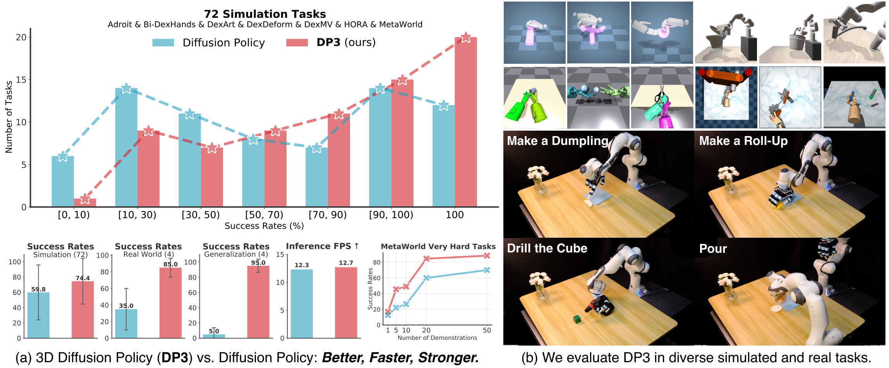
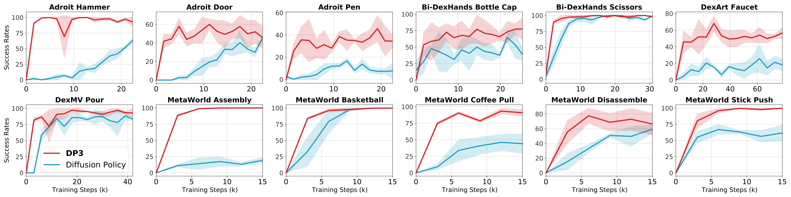
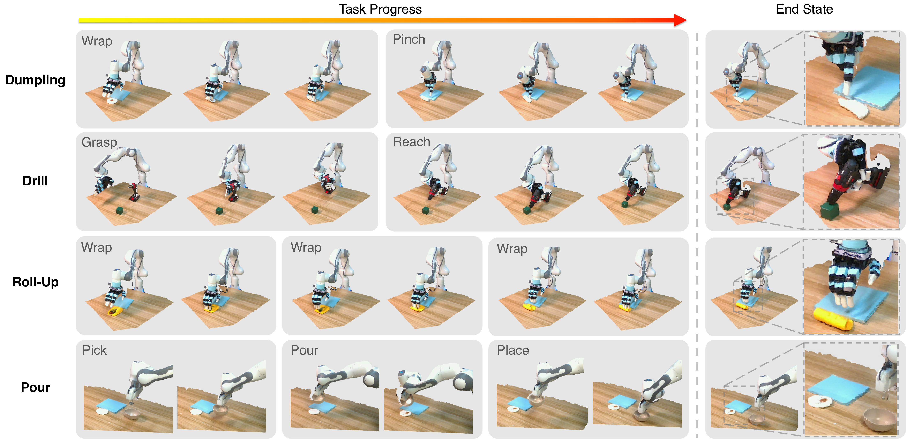
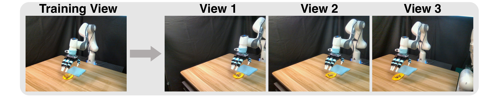

# P2. 3D Diffusion Policy: Generalizable Visuomotor Policy Learning via Simple 3D Representations

## 0. 읽기 전 약어 및 핵심 용어

이 문서를 읽기 전에 아래 약어와 용어를 먼저 정리한다. 이후 본문에서는 괄호 안의 약어를 사용한다.

- Artificial Intelligence (AI): 사람의 지각, 추론, 학습, 의사결정 능력을 기계가 수행하도록 만드는 인공지능 분야를 뜻한다.
- Vision-Language-Action (VLA): 시각 관측과 언어 명령을 함께 받아 로봇 action까지 생성하는 모델 또는 학습 패러다임이다.
- Red-Green-Blue image (RGB): 색상을 red, green, blue 세 채널로 표현하는 일반 image format이다.
- Red-Green-Blue plus Depth image (RGB-D): RGB image에 각 pixel의 depth 정보를 함께 포함한 visual observation이다.
- Behavior Cloning (BC): expert demonstration의 observation-action pair를 supervised learning으로 모방하는 imitation learning 방법이다.
- Multi-Layer Perceptron (MLP): fully connected layer를 여러 층 쌓은 feed-forward neural network이다.
- Denoising Diffusion Implicit Model (DDIM): DDPM보다 빠른 deterministic 또는 semi-deterministic sampling을 가능하게 하는 diffusion sampler이다.
- Mean Squared Error (MSE): 예측값과 정답의 차이를 제곱해 평균한 regression loss이다.
- A Low-cost Open-source Hardware System for Bimanual Teleoperation (ALOHA): 저비용 양팔 teleoperation hardware와 imitation learning setup을 뜻한다.
- Action Chunking with Transformers (ACT): 여러 timestep의 action chunk를 한 번에 예측해 fine-grained robot manipulation을 학습하는 transformer policy이다.
- 3D Diffusion Policy (DP3): point cloud 같은 3D representation을 조건으로 action diffusion policy를 학습하는 방법이다.
- Physical Intelligence pi-zero model (pi0): Physical Intelligence가 제안한 general robot control용 vision-language-action flow model이다.
- Frames Per Second (FPS): video나 control loop가 1초에 처리하는 frame 수를 나타내는 속도 단위다.
- Physical Artificial Intelligence (Physical AI): 디지털 공간의 예측을 넘어 물리 세계에서 지각, 예측, 계획, 행동, 안전 검사를 수행하는 AI 시스템을 뜻한다.

## 1. Metadata

| Field | 내용 |
|---|---|
| ID | `P2` |
| Title | 3D Diffusion Policy: Generalizable Visuomotor Policy Learning via Simple 3D Representations |
| Authors | Yanjie Ze, Gu Zhang, Kangning Zhang, Chenyuan Hu, Muhan Wang, Huazhe Xu |
| Affiliation / Team | Shanghai Qi Zhi Institute / Shanghai Jiao Tong University / Tsinghua University |
| Venue / Status | RSS 2024 |
| Date | 2024-03-06 |
| Link | https://arxiv.org/abs/2403.03954 |
| Local source | `paper_corpus/sources/P2` |
| Source figures | `paper_corpus/figures_source/P2/manifest.md` |

## 2. 핵심 요약

3D Diffusion Policy(DP3)는 Diffusion Policy의 action generation 능력에 simple sparse point cloud representation을 결합한 visuomotor imitation learning 방법이다. RGB image 대신 단일 RGB-D camera에서 얻은 depth를 point cloud로 변환하고, cropped/downsampled point cloud를 작은 MLP encoder로 64차원 feature로 압축한 뒤, diffusion policy가 action sequence를 생성한다.

논문의 핵심 주장은 "real robot manipulation에서 3D representation은 data efficiency, spatial/view/appearance/instance generalization, safety 측면에서 2D image보다 유리하다"는 것이다.

## 3. 왜 중요한가?

- Diffusion Policy가 2D image observation에 주로 의존했다면, DP3는 3D scene representation을 직접 policy input으로 사용한다.
- 72개 simulation task에서 10 demonstrations만으로 대부분 task를 해결하고, Diffusion Policy 대비 24.2% relative improvement를 보고한다.
- 4개 real robot task에서 task당 40 demonstrations만으로 평균 85% success를 보고한다.
- color를 제거한 sparse point cloud를 사용해 appearance generalization을 강화한다.
- safety violation이 image/depth baseline보다 현저히 적다고 보고해 real robot deployment 관점에서 중요하다.

## 4. Overall Concept

  

<em>Figure 1. 3D Diffusion Policy overview. DP3는 3D visual representation과 diffusion policy를 결합해 simulation과 real-world task에서 data-efficient imitation learning을 수행한다. Source figure: <code>figures/teaser_figure_v3.pdf</code>.</em>

DP3의 직관은 명확하다. robot action은 3D physical space에서 일어나므로, policy가 2D pixel만 보는 것보다 point cloud로 물체와 robot 주변 geometry를 직접 보는 편이 적은 demonstration에서도 더 잘 일반화할 수 있다.

## 5. Motivating Example: 3D 공간 일반화

  

<em>Figure 2. Generalization in 3D space with few data. MetaWorld Reach에서 5개 demonstration만 사용했을 때, DP3는 3D 공간 전반으로 성공 영역을 확장하지만 2D 기반 Diffusion Policy/IBC/BC-RNN은 제한적 영역에 머문다. Source figure: <code>figures/example.pdf</code>.</em>

이 예시는 발표에서 매우 유용하다. 같은 action diffusion backbone을 쓰더라도 observation representation이 2D인지 3D인지에 따라 extrapolation behavior가 달라질 수 있음을 보여준다.

## 6. Policy Formulation

DP3는 visual observation에서 action으로 가는 visuomotor policy를 학습한다.

$$
\pi:\mathcal{O}\rightarrow\mathcal{A}
$$

$$
o\in\mathcal{O},
\quad
a\in\mathcal{A}
$$

| Notation | 의미 |
|---|---|
| $\pi$ | visuomotor policy |
| $\mathcal{O}$ | observation space |
| $\mathcal{A}$ | action space |
| $o$ | visual observation |
| $a$ | robot action |

DP3는 크게 perception과 decision module로 구성된다. perception은 point cloud를 compact 3D feature로 변환하고, decision은 diffusion policy가 이 feature를 조건으로 action sequence를 생성한다.

## 7. Method Overview

  

<em>Figure 3. DP3 method. single-view RGB-D에서 depth를 point cloud로 변환하고, cropping과 farthest point sampling 후 DP3 encoder로 compact 3D feature를 만든다. diffusion policy는 3D feature와 robot pose를 조건으로 action sequence를 denoise한다. Source figure: <code>figures/method_v3.pdf</code>.</em>

| 단계 | 설명 |
|---|---|
| depth acquisition | single-view camera에서 $84\times84$ depth image 획득 |
| point cloud conversion | camera intrinsic/extrinsic으로 depth를 point cloud로 변환 |
| cropping | table/ground 등 redundant point 제거 |
| FPS downsampling | 512 또는 1024 point로 farthest point sampling |
| DP3 Encoder | 3-layer MLP + max pooling + projection head |
| diffusion action generation | 3D feature $v$와 robot pose $q$를 조건으로 action denoising |

## 8. 3D Representation

DP3는 sparse point cloud를 사용하며 color channel을 제거한다. 이 선택은 appearance generalization에 중요하다.

  

<em>Figure 4. Different vision modalities. real-world에서 image, depth, point cloud 등 modality를 비교하며, DP3는 color-free point cloud를 핵심 representation으로 사용한다. Source figure: <code>figures/different_3d_repr.pdf</code>.</em>

논문은 RGB-D, depth, voxel 등 다른 explicit 3D representation과 비교해 point cloud가 효율적이라고 주장한다. 또한 pretrained large point encoder보다 작고 단순한 DP3 Encoder가 visuomotor control에서는 더 나을 수 있다고 보고한다.

## 9. Conditional Denoising Diffusion Action Generation

DP3의 decision module은 3D feature $v$와 robot pose $q$를 조건으로 action을 생성하는 diffusion model이다.

$$
a^{k-1}
=
\alpha_k
\left(
a^k
-
\gamma_k
\boldsymbol{\epsilon}_{\theta}
(a^k,k,v,q)
\right)
+
\sigma_k
\mathcal{N}(0,\mathbf{I})
$$

| Notation | 의미 |
|---|---|
| $a^k$ | diffusion step $k$에서의 noisy action |
| $a^{k-1}$ | 한 단계 denoising 후 action |
| $a^0$ | 최종 noise-free action |
| $\boldsymbol{\epsilon}_{\theta}$ | noise prediction network |
| $\theta$ | denoising network parameter |
| $k$ | diffusion iteration index |
| $v$ | DP3 Encoder가 만든 compact 3D visual feature |
| $q$ | robot pose/proprioceptive state |
| $\alpha_k,\gamma_k,\sigma_k$ | noise scheduler에 의해 정해지는 coefficient |
| $\mathcal{N}(0,\mathbf{I})$ | standard Gaussian noise |

이 수식은 Diffusion Policy의 conditional denoising process와 같다. 차이는 image feature 대신 point cloud 기반 3D feature $v$를 condition으로 사용한다는 점이다.

## 10. Training Objective

training에서는 clean action $a^0$에 noise를 더하고, 그 noise를 예측하도록 학습한다.

$$
\mathcal{L}
=
\mathrm{MSE}
\left(
\boldsymbol{\epsilon}^{k},
\boldsymbol{\epsilon}_{\theta}
\left(
\bar{\alpha}_k a^0
+
\bar{\beta}_k \boldsymbol{\epsilon}^{k},
k,
v,
q
\right)
\right)
$$

| Notation | 의미 |
|---|---|
| $\mathcal{L}$ | diffusion noise prediction loss |
| $\mathrm{MSE}$ | mean squared error |
| $a^0$ | dataset에서 나온 clean expert action |
| $\boldsymbol{\epsilon}^{k}$ | step $k$에서 action에 더해진 noise |
| $\boldsymbol{\epsilon}_{\theta}$ | predicted noise |
| $\bar{\alpha}_k,\bar{\beta}_k$ | one-step noise adding schedule coefficient |
| $v$ | point cloud에서 추출한 3D feature |
| $q$ | robot pose |

논문 구현에서는 DDIM sampler를 사용하고, high-dimensional action generation에서 epsilon prediction보다 sample prediction이 더 잘 수렴한다고 보고한다.

## 11. Simulation Evaluation

  

<em>Figure 5. Simulation task suite. DP3는 MetaWorld, Adroit, Bi-DexHands, DexArt, DexDeform, DexMV, HORA 등 다양한 simulation manipulation task에서 평가된다. Source figure: <code>figures/sim3d.pdf</code>.</em>

논문은 72개 simulation task에서 DP3를 평가한다. task마다 10 demonstrations를 사용하며, 평균적으로 Diffusion Policy 대비 24.2% relative improvement를 보고한다.

  

<em>Figure 6. Learning efficiency. DP3는 적은 demonstration 수에서 2D 기반 baseline보다 빠르게 성능이 올라가는 경향을 보인다. Source figure: <code>figures/learning_efficiency_multi.pdf</code>.</em>

## 12. Real Robot Tasks

  

<em>Figure 7. Real robot benchmark. Allegro hand와 Franka gripper를 사용해 Dumpling, Drill, Roll-Up, Pour 등 4개 multi-stage real-world task를 평가한다. 각 trajectory의 point cloud도 함께 시각화된다. Source figure: <code>figures/real_task_visualization.pdf</code>.</em>

real-world setting은 다음과 같다.

| Task | Robot | 특징 |
|---|---|---|
| Roll-Up | Allegro hand | plasticine과 vegetable을 말아 올리는 deformable manipulation |
| Dumpling | Allegro hand | plasticine과 meat floss를 이용한 wrapping task |
| Drill | Allegro hand | 무거운 drill을 잡고 cube에 접근 |
| Pour | Franka gripper | bowl을 들어 dried meat floss를 붓는 task |

각 task는 40 demonstrations로 학습하고 10 trials로 평가한다. DP3는 평균 85% success를 보고하며, image-based Diffusion Policy와 depth-based Diffusion Policy보다 높다.

## 13. Generalization Results

DP3는 real-world에서 네 가지 generalization을 평가한다.

| Generalization | 설명 |
|---|---|
| spatial | training에 없던 bowl/cube 위치에서 성공하는가 |
| appearance | training color와 다른 색상 object를 다룰 수 있는가 |
| instance | 크기/형태/appearance가 다른 everyday object를 다룰 수 있는가 |
| viewpoint | camera view가 약간 바뀌어도 동작하는가 |

  

<em>Figure 8. Spatial generalization. Pour task에서 bowl을 training에 없던 5개 위치에 배치하고 평가한다. DP3는 5회 중 4회 성공하지만 baseline은 실패한다. Source figure: <code>figures/spatial_generalization.pdf</code>.</em>

  

<em>Figure 9. View generalization. Roll-Up task에서 camera view를 약간 바꾸어 평가한다. DP3는 point cloud transform과 cropping 조정으로 minor view change에 대응한다. Source figure: <code>figures/view_gen.pdf</code>.</em>

## 14. Safety Observation

논문은 real-world 실험에서 image/depth baseline이 종종 예측 불가능한 행동을 보이고 human intervention이 필요했다고 설명한다. 이를 safety violation으로 정의해 비교한다.

  

<em>Figure 10. Safety violation examples. DP3는 3D 정보를 직접 관찰하기 때문에 collision-prone behavior가 줄어드는 경향을 보인다고 논문은 해석한다. Source figure: <code>figures/safety.pdf</code>.</em>

이 결과는 정량적 safety guarantee라기보다 empirical observation에 가깝다. 저자들도 이 safety 평가가 주로 qualitative하며, 이론적 이해는 future work라고 언급한다.

## 15. Design Choices and Ablations

DP3의 성능은 거창한 3D backbone이 아니라 작은 설계 선택들의 합으로 나온다.

| Design choice | 효과 |
|---|---|
| point cloud cropping | table/ground point 제거로 accuracy 향상 |
| FPS downsampling | uniform sampling보다 3D coverage와 안정성 확보 |
| 512/1024 points | 대부분 task에 충분 |
| 3-layer MLP + max pooling | PointNet 계열보다 단순하지만 control에는 효과적 |
| LayerNorm | 다양한 task에서 training 안정화 |
| projection head | feature dimension 축소로 inference speed 개선 |
| no color channel | appearance generalization 개선 |
| short horizon $H=4,N_{act}=3$ | real robot에서 빠른 반응성 확보 |

appendix에서는 Simple DP3가 redundant UNet component를 제거해 약 2배 inference speed를 얻으면서 성능을 거의 유지한다고 보고한다.

## 16. Physical AI / World Model 관점

DP3는 world model을 명시적으로 학습하지 않는다. 하지만 physical AI에서 representation이 얼마나 중요한지를 잘 보여준다.

| 질문 | DP3의 답 |
|---|---|
| physical space를 어떻게 볼 것인가? | 2D RGB 대신 sparse point cloud |
| dynamics를 예측하는가? | future state prediction이 아니라 action denoising |
| generalization은 어디서 오는가? | geometry-aware representation과 diffusion action distribution |
| real-world safety는 어떻게 개선되는가? | 3D geometry가 collision-prone action을 줄이는 empirical effect |
| long-horizon planning은 다루는가? | 매우 긴 horizon은 다루지 않으며 future work |

world model 스터디에서는 DP3를 "explicit prediction model 없이도 3D representation이 policy generalization을 얼마나 바꾸는가"라는 사례로 읽으면 좋다.

## 17. 기존 논문들과의 연결

| 연결 논문 | 연결 포인트 |
|---|---|
| Diffusion Policy (`P1`) | action diffusion backbone의 직접 후속/확장 |
| ALOHA/ACT (`D2`) | action sequence prediction과 real robot imitation learning |
| Octo (`D4`) | diffusion action head를 쓰지만 Octo는 large-scale policy pretraining, DP3는 3D representation 중심 |
| pi0 (`P4`) | flow/diffusion 계열 continuous action generation |
| 3D VLA / spatial representation papers | 3D scene representation이 VLA generalization에 중요하다는 흐름 |

## 18. 한계와 주의점

- optimal 3D representation은 아직 확정되지 않았고, point cloud가 모든 task에서 최선이라고 단정하기 어렵다.
- single-view depth 기반 point cloud는 occlusion과 large viewpoint change에 취약할 수 있다.
- significant camera view change에는 manual point cloud transform/crop adjustment가 필요할 수 있다.
- extremely long-horizon task는 다루지 않는다.
- safety 결과는 경험적 관찰이며 formal guarantee는 아니다.

## 19. 발표 구성 제안

1. Diffusion Policy의 한계로 2D image observation generalization 문제를 제기한다.
2. MetaWorld Reach example로 3D representation이 왜 중요한지 직관을 만든다.
3. method figure로 depth-to-point-cloud, DP3 encoder, diffusion action generation을 설명한다.
4. denoising equation과 training loss를 Diffusion Policy와 비교한다.
5. simulation 72 task와 real robot 4 task 결과를 요약한다.
6. spatial/appearance/instance/view generalization과 safety observation을 설명한다.
7. 마지막에 "Physical AI에서 representation은 model size만큼 중요하다"는 메시지로 정리한다.

## 20. 토론 질문

- 3D point cloud가 2D image보다 일반화에 유리한 task와 그렇지 않은 task는 어떻게 구분할 수 있을까?
- color를 제거하는 것이 appearance generalization에는 좋지만 semantic recognition에는 손해일 수 있지 않을까?
- DP3의 simple encoder가 large pretrained point encoder보다 좋은 이유는 control task의 inductive bias 때문일까?
- VLA foundation model에 DP3식 compact 3D feature를 결합하면 어떤 이점이 있을까?
- 산업 현장에서는 RGB camera보다 depth/3D sensor를 추가하는 비용이 data efficiency와 safety 개선으로 상쇄될까?

## 21. 한 문장 정리

DP3는 sparse point cloud 기반 3D representation과 diffusion action generation을 결합해, 적은 demonstration에서도 real robot manipulation의 spatial/generalization/safety 성능을 크게 높일 수 있음을 보여준 논문이다.
