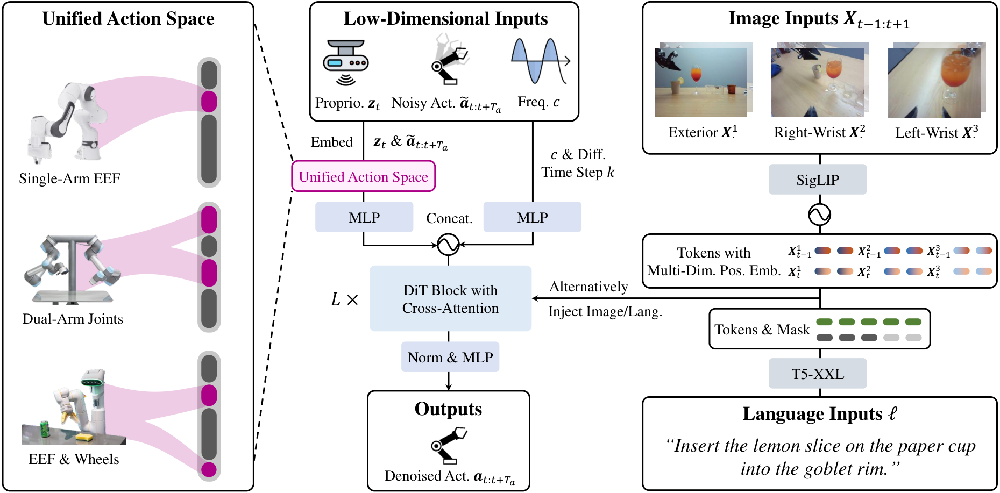
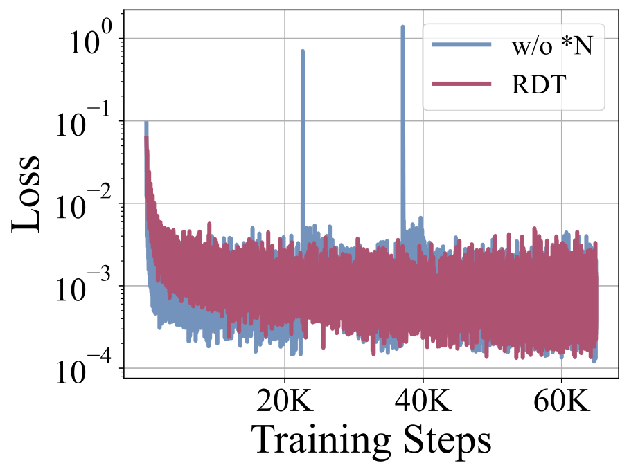
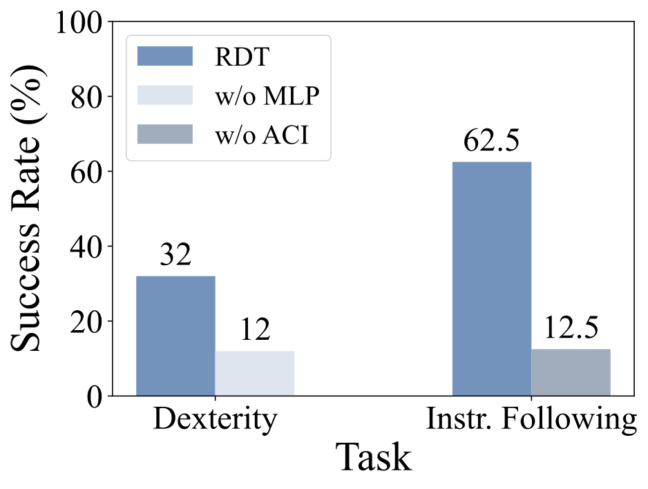
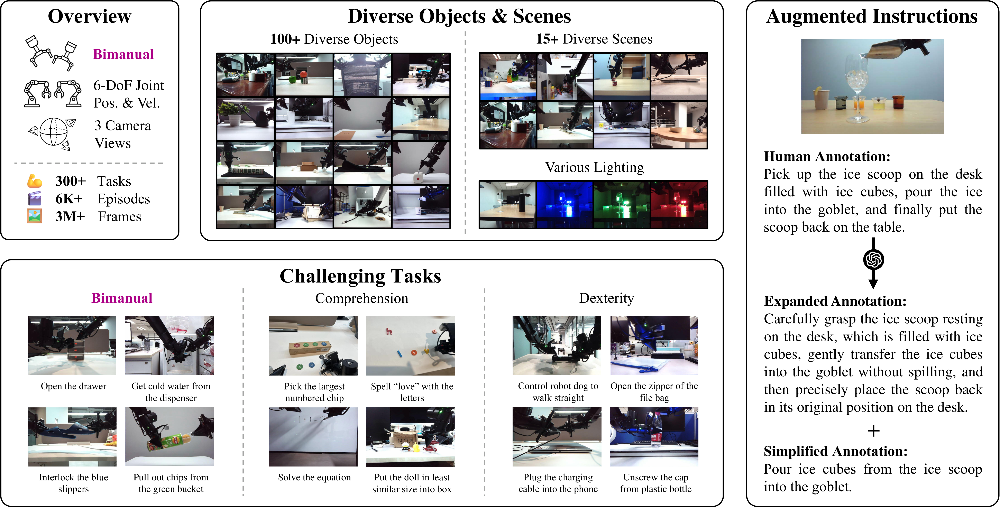
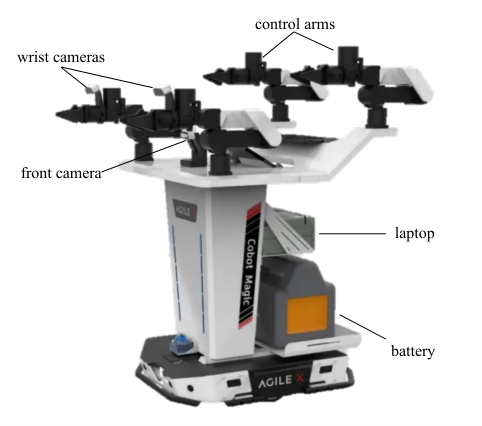
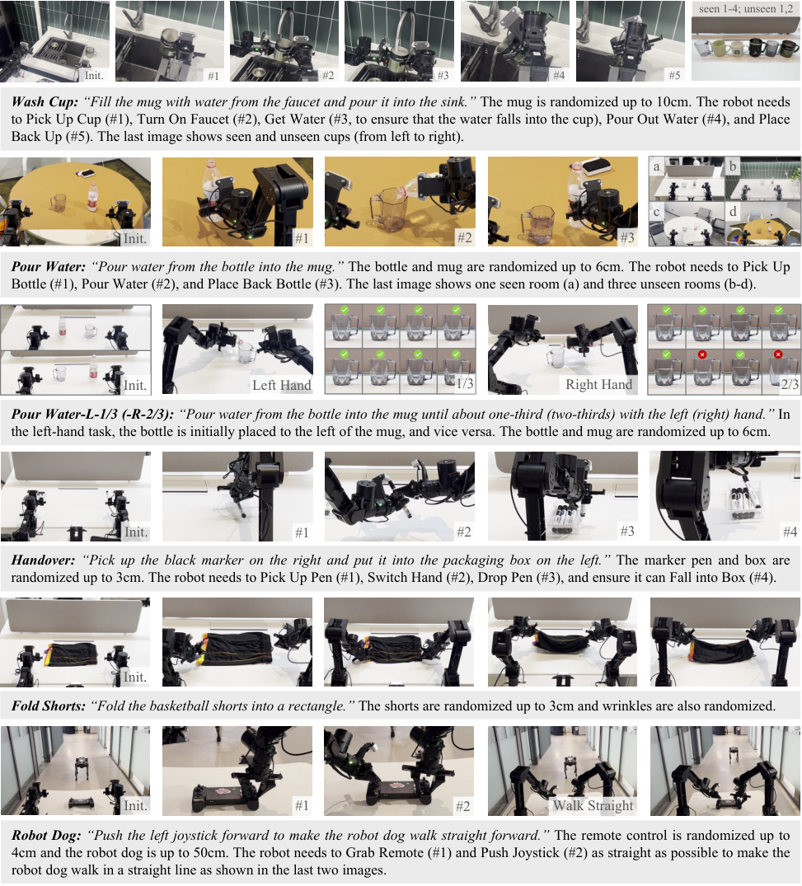
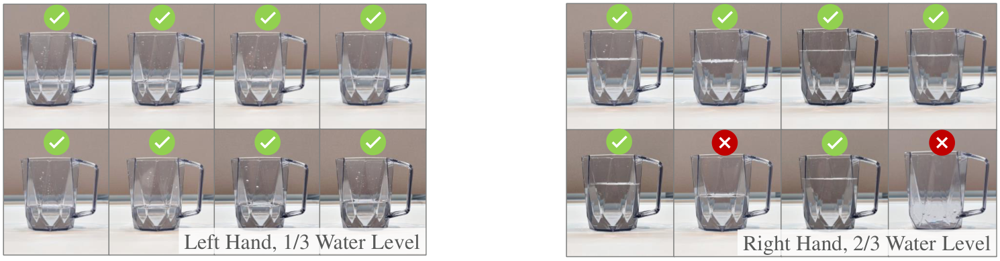

# P3. RDT-1B: a Diffusion Foundation Model for Bimanual Manipulation

## 0. 읽기 전 약어 및 핵심 용어

이 문서를 읽기 전에 아래 약어와 용어를 먼저 정리한다. 이후 본문에서는 괄호 안의 약어를 사용한다.

- Artificial Intelligence (AI): 사람의 지각, 추론, 학습, 의사결정 능력을 기계가 수행하도록 만드는 인공지능 분야를 뜻한다.
- Vision-Language-Action (VLA): 시각 관측과 언어 명령을 함께 받아 로봇 action까지 생성하는 모델 또는 학습 패러다임이다.
- Red-Green-Blue image (RGB): 색상을 red, green, blue 세 채널로 표현하는 일반 image format이다.
- Multi-Layer Perceptron (MLP): fully connected layer를 여러 층 쌓은 feed-forward neural network이다.
- Variational Autoencoder (VAE): latent variable의 확률분포를 학습해 data를 생성하거나 압축하는 generative model이다.
- Diffusion Probabilistic Model (DPM): data에 noise를 더하고 이를 되돌리는 denoising process를 학습하는 generative model 계열이다.
- Diffusion Transformer (DiT): U-Net 대신 transformer backbone을 사용해 diffusion denoising이나 flow prediction을 수행하는 architecture이다.
- Mean Squared Error (MSE): 예측값과 정답의 차이를 제곱해 평균한 regression loss이다.
- Robotics Transformer (RT): robot observation을 입력받아 action을 예측하는 transformer 기반 robot policy 계열을 뜻한다.
- Robotics Transformer 1 (RT-1): Google의 실제 로봇 demonstration data로 학습한 transformer 기반 robot control policy이다.
- Robotics Transformer-X model family (RT-X): Open X-Embodiment 데이터 위에서 여러 robot embodiment로 확장한 RT 계열 policy family를 뜻한다.
- RT-X shorthand (RTX): Open X-Embodiment 맥락에서 RT-X 계열 robot policy를 줄여 부르는 표기다.
- Distributed Robot Interaction Dataset (DROID): 여러 장소에서 수집한 in-the-wild robot manipulation demonstration dataset이다.
- A Low-cost Open-source Hardware System for Bimanual Teleoperation (ALOHA): 저비용 양팔 teleoperation hardware와 imitation learning setup을 뜻한다.
- Action Chunking with Transformers (ACT): 여러 timestep의 action chunk를 한 번에 예측해 fine-grained robot manipulation을 학습하는 transformer policy이다.
- Robotics Diffusion Transformer (RDT): diffusion model과 transformer를 결합해 robot action trajectory를 생성하는 robot foundation policy 계열이다.
- Robotics Diffusion Transformer 1B (RDT-1B): 약 1B parameter 규모의 bimanual manipulation diffusion foundation model이다.
- Physical Intelligence pi-zero model (pi0): Physical Intelligence가 제안한 general robot control용 vision-language-action flow model이다.
- Physical Intelligence pi-zero-point-five model (pi0.5): pi0를 open-world household manipulation으로 확장한 VLA model이다.
- Graphics Processing Unit (GPU): 대규모 neural network 학습과 병렬 연산을 빠르게 수행하는 processor이다.
- Physical Artificial Intelligence (Physical AI): 디지털 공간의 예측을 넘어 물리 세계에서 지각, 예측, 계획, 행동, 안전 검사를 수행하는 AI 시스템을 뜻한다.

## 1. Metadata

| Field | 내용 |
|---|---|
| ID | `P3` |
| Title | RDT-1B: a Diffusion Foundation Model for Bimanual Manipulation |
| Authors | Songming Liu, Lingxuan Wu, Bangguo Li, Hengkai Tan et al. |
| Affiliation / Team | Tsinghua University / Shanghai AI Laboratory and collaborators |
| Venue / Status | arXiv |
| Date | 2024-10-10 |
| Link | https://arxiv.org/abs/2410.07864 |
| Local source | `paper_corpus/sources/P3` |
| Source figures | `paper_corpus/figures_source/P3/manifest.md` |

## 2. 핵심 요약

RDT-1B는 bimanual manipulation을 위한 1.2B parameter 규모의 diffusion foundation model이다. 논문의 문제의식은 명확하다. 양팔 조작은 action dimension이 커지고 가능한 해가 여러 개로 갈라지기 때문에 multimodal action distribution이 강해진다. 동시에 양팔 robot data는 hardware와 teleoperation cost 때문에 적다. RDT는 이 문제를 diffusion transformer, physically interpretable unified action space, large-scale multi-robot pretraining, target bimanual fine-tuning으로 해결하려 한다.

핵심 메시지는 "bimanual manipulation에서는 discretized VLA나 deterministic regression보다 continuous diffusion action modeling이 더 적합하고, 서로 다른 robot의 action/proprioception을 물리적 의미가 보존되는 공간으로 정렬해야 pretraining이 유효하다"는 것이다.

## 3. 왜 중요한가?

- bimanual manipulation을 foundation model scale로 다룬 대표적 diffusion policy 계열 논문이다.
- ACT는 VAE/action chunking으로 bimanual imitation learning을 열었고, RDT는 이를 대규모 pretraining과 diffusion transformer로 확장한다.
- OpenVLA/RT 계열 VLA의 action discretization이 정밀 조작에서 갖는 한계를 직접 겨냥한다.
- 46개 robotics dataset, 1M+ trajectories, 21TB 규모의 pretraining collection을 사용한다.
- target robot fine-tuning dataset도 6K+ trajectories, 300+ tasks, 100+ objects, 15+ scenes로 크다.
- zero-shot unseen object/scene, instruction following, 1-5 shot unseen skill, dexterous joystick control을 real robot에서 평가한다.

## 4. Overall Concept

  

<em>Figure 1. Overview of Robotics Diffusion Transformer with 1B parameters. RDT-1B는 language-conditioned visuomotor policy로, multi-robot pretraining과 bimanual fine-tuning을 통해 양팔 조작 일반화를 목표로 한다. Source figure: <code>head.pdf</code>.</em>

RDT의 전체 구조는 "조건을 보고 action chunk를 denoise하는 policy"로 이해하면 쉽다. language instruction, multi-view images, proprioception, control frequency를 조건으로 넣고, noisy action chunk를 clean action chunk로 복원한다. 이때 action은 단일 robot 고유 좌표가 아니라 unified action space에 embedding된다.

## 5. Bimanual Manipulation의 핵심 난점

  

<em>Figure 2. Multimodality in bimanual manipulation. 같은 목표를 달성하는 양팔 행동에는 여러 feasible mode가 존재하며, demonstration 수집 과정에서 mode가 섞이면 평균 회귀가 물리적으로 어색한 action을 만들 수 있다. Source figure: <code>multi-modality.pdf</code>.</em>

RDT가 보는 난점은 두 가지다.

| 난점 | 설명 |
|---|---|
| architectural expressiveness | 양팔 조작은 가능한 action mode가 많아 단일 평균값 회귀로 표현하기 어렵다. |
| architectural scalability | vision, language, action, proprioception, control frequency를 함께 처리하면서 model size를 키워야 한다. |
| data scarcity | 특정 dual-arm robot의 공개 demonstration은 foundation model 학습에 충분하지 않다. |
| data heterogeneity | robot마다 joint, end-effector, gripper, base, camera, control frequency가 다르다. |

이 논문에서 diffusion은 multimodality를 다루기 위한 선택이고, unified action space는 heterogeneous robot data를 함께 쓰기 위한 선택이다.

## 6. Problem Formulation

RDT는 language-conditioned bimanual manipulation을 다음처럼 정의한다.

$$
\mathbf{o}_t
:=
\left(
\mathbf{X}_{t-T_{\mathrm{img}}+1:t+1},
\mathbf{z}_t,
c
\right)
$$

$$
\pi:
(\ell,\mathbf{o}_t)
\mapsto
\mathbf{a}_t
$$

| Notation | 의미 |
|---|---|
| $\ell$ | natural language instruction |
| $t$ | time step |
| $\mathbf{o}_t$ | time $t$의 observation |
| $\mathbf{X}_{t-T_{\mathrm{img}}+1:t+1}$ | 최근 $T_{\mathrm{img}}$개의 RGB image history |
| $\mathbf{z}_t$ | robot proprioception |
| $c$ | control frequency |
| $\mathbf{a}_t$ | 두 robot arm을 제어하기 위한 action |
| $\pi$ | language-conditioned visuomotor policy |

논문은 imitation learning dataset을 다음처럼 둔다.

$$
\mathcal{D}_{\cdot}
=
\left\{
\left(
\ell^{(i)},\mathbf{o}^{(i)}_t,\mathbf{a}^{(i)}_t
\right)
\mid
0\le t<T^{(i)},\ 1\le i\le N
\right\}
$$

| Notation | 의미 |
|---|---|
| $\mathcal{D}_{\cdot}$ | pretraining 또는 fine-tuning dataset |
| $i$ | trajectory index |
| $T^{(i)}$ | $i$번째 trajectory 길이 |
| $N$ | trajectory 수 |
| $(\ell^{(i)},\mathbf{o}^{(i)}_t,\mathbf{a}^{(i)}_t)$ | instruction, observation, action training tuple |

중요한 점은 이 논문이 "모든 robot에서 바로 동작하는 cross-embodiment policy"를 목표로 한다기보다, multi-robot data로 target bimanual robot의 generalization을 높이는 pretraining/fine-tuning pipeline을 목표로 한다는 것이다.

## 7. RDT Framework

  

<em>Figure 3. RDT framework. Heterogeneous robot action spaces are embedded into a unified action space. Proprioception, noisy action chunk, control frequency, and diffusion step are denoising inputs; images and language are conditions. Source figure: <code>framework.pdf</code>.</em>

RDT는 DiT(Diffusion Transformer)를 robot control에 맞게 바꾼 구조다.

| Component | 역할 |
|---|---|
| unified action embedding | 서로 다른 robot action/proprioception을 128-d physical vector로 정렬 |
| low-dimensional encoder | proprioception, noisy action chunk, frequency, diffusion step을 MLP/Fourier feature로 token화 |
| image encoder | frozen SigLIP으로 multi-view image token 추출 |
| language encoder | frozen T5-XXL로 instruction token 추출 |
| DiT backbone | noisy action token을 language/image condition으로 denoise |
| MLP decoder | latent token을 physical action space로 projection |

## 8. Diffusion Action Modeling

RDT는 deterministic mapping이 아니라 conditional distribution을 모델링한다.

$$
p(\mathbf{a}_t \mid \ell,\mathbf{o}_t)
$$

| Notation | 의미 |
|---|---|
| $p(\mathbf{a}_t \mid \ell,\mathbf{o}_t)$ | instruction과 observation이 주어졌을 때 가능한 action의 조건부 분포 |
| $\mathbf{a}_t$ | clean action |
| $\ell,\mathbf{o}_t$ | language 및 observation condition |

sampling에서는 Gaussian noise에서 시작해 clean action으로 denoise한다.

$$
\mathbf{a}_t^{k-1}
=
\frac{\sqrt{\bar{\alpha}^{k-1}}\beta^k}{1-\bar{\alpha}^{k}}
\mathbf{a}_t^{0}
+
\frac{\sqrt{\alpha^{k}}(1-\bar{\alpha}^{k-1})}{1-\bar{\alpha}^{k}}
\mathbf{a}_t^{k}
+
\sigma^k\mathbf{z},
\quad
k=K,\dots,1
$$

| Notation | 의미 |
|---|---|
| $\mathbf{a}_t^k$ | diffusion step $k$에서의 noisy action |
| $\mathbf{a}_t^{k-1}$ | 한 단계 denoise된 action |
| $\mathbf{a}_t^0$ | 최종 clean action sample |
| $K$ | diffusion denoising step 수 |
| $\alpha^k,\beta^k,\sigma^k$ | noise schedule coefficient |
| $\beta^k$ | $1-\alpha^k$ |
| $\bar{\alpha}^{k-1}$ | $\prod_{i=1}^{k-1}\alpha^i$ |
| $\mathbf{z}$ | Gaussian noise sample |

실제로 $\mathbf{a}_t^0$는 sampling이 끝나기 전에는 알 수 없으므로, RDT는 denoising network $f_{\theta}$가 clean action을 추정하게 한다.

## 9. Training Objective

training에서는 clean action에 noise를 섞고, network가 clean action을 복원하도록 학습한다.

$$
\mathcal{L}(\theta)
:=
\mathrm{MSE}
\left(
\mathbf{a}_{t},
f_{\theta}
\left(
\ell,
\mathbf{o}_t,
\sqrt{\bar{\alpha}^k}\mathbf{a}_{t}
+
\sqrt{1-\bar{\alpha}^k}\boldsymbol{\epsilon},
k
\right)
\right)
$$

$$
k\sim\mathrm{Uniform}(\{1,\dots,K\}),
\quad
\boldsymbol{\epsilon}\sim\mathcal{N}(\mathbf{0},\mathbf{I})
$$

| Notation | 의미 |
|---|---|
| $\mathcal{L}(\theta)$ | denoising mean-squared error loss |
| $\theta$ | denoising network parameter |
| $f_{\theta}$ | noisy action과 condition을 받아 clean action을 예측하는 RDT network |
| $\bar{\alpha}^{k}$ | cumulative noise schedule coefficient |
| $\boldsymbol{\epsilon}$ | action에 더하는 Gaussian noise |
| $\sqrt{\bar{\alpha}^k}\mathbf{a}_{t}+\sqrt{1-\bar{\alpha}^k}\boldsymbol{\epsilon}$ | noisy action input |
| $k$ | randomly sampled diffusion step |

논문은 단일 action보다 action chunk를 예측한다.

$$
p(\mathbf{a}_{t:t+T_a}\mid \ell,\mathbf{o}_t),
\quad
\mathbf{a}_{t:t+T_a}
:=
(\mathbf{a}_t,\dots,\mathbf{a}_{t+T_a-1})
$$

| Notation | 의미 |
|---|---|
| $\mathbf{a}_{t:t+T_a}$ | time $t$부터 $T_a$ 길이의 action chunk |
| $T_a$ | action chunk size |

action chunking은 ACT와 Diffusion Policy에서 이어지는 중요한 설계다. robot이 매 순간 독립적으로 action을 예측하면 error가 누적되므로, 여러 step을 한 번에 예측해 temporal consistency를 높인다.

## 10. Robot Data에 맞춘 DiT 수정

  

<em>Figure 4. Training instability without QKNorm and RMSNorm. Source figure: <code>loss2.pdf</code>.</em>

  

<em>Figure 5. Ablation without MLP decoder or alternating condition injection. Source figure: <code>ablation.pdf</code>.</em>

RDT는 이미지 생성용 DiT를 그대로 쓰지 않고 robot action의 특성에 맞게 세 가지를 바꾼다.

| 설계 | 이유 |
|---|---|
| QKNorm + RMSNorm | robot physical quantity의 unstable numerical range 때문에 attention/normalization 안정성이 중요하다. |
| MLP decoder | robot action은 nonlinear dynamics와 high-frequency 변화가 있어 linear decoder만으로 부족할 수 있다. |
| Alternating Condition Injection | image token 수가 language token보다 많아 text condition이 묻히는 문제를 줄이기 위해 image/text condition을 layer마다 번갈아 cross-attention으로 주입한다. |

이 부분은 발표에서 매우 중요하다. RDT는 "diffusion + transformer scale"만이 아니라, robot data가 image/video data와 다르다는 점을 architecture에 반영한다.

## 11. Physically Interpretable Unified Action Space

RDT의 unified action space는 128차원이다. 각 dimension은 joint position, gripper position, end-effector pose, velocity, base velocity처럼 물리적 의미를 가진다.

| Index range | Physical quantity |
|---|---|
| `[0, 50)` | right arm/gripper joint, velocity, end-effector position/pose/velocity |
| `[50, 100)` | left arm/gripper joint, velocity, end-effector position/pose/velocity |
| `[100, 103)` | base linear/angular velocity |
| `[103, 128)` | reserved |

이 설계의 포인트는 raw action vector를 임의로 normalize하거나 token화하는 것이 아니라, 같은 물리량은 같은 위치에 놓는다는 것이다. 예를 들어 single-arm robot은 right arm 영역에 mapping하고, 6-DoF arm은 10개 joint slot 중 앞 6개를 채운다.

padding zero와 실제 physical zero를 구분하기 위해 action/proprioception vector에 0-1 availability vector를 concatenate한다.

$$
\mathbf{u}
=
\left[
\mathbf{s};
\mathbf{m}
\right]
\in
\mathbb{R}^{256}
$$

| Notation | 의미 |
|---|---|
| $\mathbf{s}\in\mathbb{R}^{128}$ | unified action/proprioception vector |
| $\mathbf{m}\in\{0,1\}^{128}$ | 해당 dimension이 실제 관측/제어값인지 padding인지 나타내는 availability mask |
| $\mathbf{u}$ | MLP encoder에 들어가는 256-d vector |
| $[\cdot;\cdot]$ | vector concatenation |

이 부분은 cross-embodiment learning에서 자주 등장하는 "무엇을 공유할 것인가" 문제에 대한 RDT의 답이다. RDT는 morphology 자체를 완전히 추상화하기보다, 물리량의 의미를 보존한 sparse shared coordinate를 만든다.

## 12. Pretraining and Fine-Tuning Data

  

<em>Figure 6. Fine-tuning dataset. RDT는 diverse objects/scenes, challenging tasks, multi-modal features를 포함한 target bimanual dataset으로 fine-tuning된다. Source figure: <code>ft_dataset.pdf</code>.</em>

RDT의 학습 pipeline은 두 단계다.

| Stage | Data | 목적 |
|---|---|---|
| pretraining | 46 datasets, 1M+ trajectories, 21TB | multi-robot physical prior 학습 |
| fine-tuning | 6K+ bimanual trajectories, 300+ tasks | target ALOHA dual-arm capability 강화 |

pretraining에는 RT-1, DROID, RH20T, Mobile ALOHA, RoboSet, BridgeData V2, Open X-Embodiment 계열 데이터가 포함된다. dataset sampling은 단순히 trajectory 수에 비례시키지 않고, $\sqrt{N_j}$ 기반 initial weight와 dataset quality/diversity adjustment를 사용한다.

fine-tuning dataset은 다음 특징을 가진다.

| 특징 | 내용 |
|---|---|
| scale | 6K+ trajectories, 3M+ frames |
| task diversity | 300+ tasks |
| object diversity | 100+ objects |
| scene diversity | 15+ scenes |
| sensors | 3-view RGB cameras, joint information |
| language | human annotation + GPT-4-Turbo instruction augmentation |

## 13. Hardware and Deployment

  

<em>Figure 7. ALOHA hardware features used for bimanual experiments. Source figure: <code>aloha_figure.pdf</code>.</em>

RDT는 48 H100 80GB GPUs로 pretraining 1M steps, fine-tuning 130K steps를 수행한다. inference에서는 DPM-Solver++를 사용해 diffusion sampling step을 100에서 5로 줄인다. 논문은 target robot onboard RTX 4090 24GB GPU에서 action chunk inference 6 Hz, average action inference 381 Hz를 보고한다.

## 14. Real-Robot Evaluation

  

<em>Figure 8. Task definitions and visualizations. RDT는 Wash Cup, Pour Water, Handover, Fold Shorts, Robot Dog 등 7개 challenging task에서 평가된다. Source figure: <code>exp.pdf</code>.</em>

논문은 다음 질문을 real robot에서 검증한다.

| Question | Evaluation |
|---|---|
| Q1 | unseen objects/scenes에 zero-shot generalize 가능한가 |
| Q2 | unseen modality instruction을 따를 수 있는가 |
| Q3 | 1-5 demonstrations만으로 unseen skill을 배울 수 있는가 |
| Q4 | delicate operation이 필요한 task를 수행할 수 있는가 |
| Q5 | model size, data scale, diffusion modeling이 실제로 중요한가 |

baseline은 ACT, OpenVLA, Octo다. ACT는 bimanual manipulation 강한 baseline이지만 language-conditioned가 아니고 VAE 기반이다. OpenVLA는 7B open-source VLA지만 action discretization을 사용한다. Octo는 diffusion head를 갖지만 model/data scale이 RDT보다 작다.

정량 결과에서 RDT는 7개 task 전반에서 가장 안정적으로 높은 success rate를 보였다고 보고한다. 특히 논문은 전체 challenging tasks에서 baseline 대비 56% success rate improvement를 강조한다.

## 15. Ablation Results

논문은 diffusion, model size, pretraining의 중요성을 ablation으로 확인한다.

| Variant | 차이 | 관찰 |
|---|---|---|
| RDT regress | diffusion 없이 deterministic mapping | multimodal action을 평균화해 성능 저하 |
| RDT small | 166M parameters | 일부 task에서 scale 부족 |
| RDT scratch | pretraining 없이 fine-tuning | unseen object/scene generalization 저하 |
| RDT ours | diffusion + 1.2B + pretraining | 가장 높은 종합 성능 |

RDT가 주장하는 결론은 세 가지 요소가 모두 필요하다는 것이다. diffusion은 multimodal continuous action을 위해, scale은 복잡한 input/output distribution을 위해, pretraining은 unseen generalization을 위해 필요하다.

## 16. Dexterity Example: Water Level Control

  

<em>Figure 9. Water level visualization for Pour Water-L-1/3 and Pour Water-R-2/3. RDT가 instruction에 지정된 hand와 amount를 맞추는지 보여주는 qualitative result이다. Source figure: <code>water.pdf</code>.</em>

water pouring은 RDT의 강점을 잘 보여주는 task다. "왼손/오른손", "1/3/2/3"처럼 language instruction이 action mode와 trajectory endpoint를 바꾼다. discretized action이나 deterministic mapping은 이러한 세밀한 mode control에서 불리할 수 있고, RDT는 diffusion sampling과 language-conditioned denoising으로 이를 처리하려 한다.

## 17. Physical AI / World Model 관점

RDT는 explicit world model은 아니다. future state를 예측하거나 latent dynamics를 rollout하지 않는다. 하지만 physical AI 관점에서 중요한 세 가지 문제를 건드린다.

| 관점 | RDT의 의미 |
|---|---|
| embodiment heterogeneity | robot마다 다른 body/action space를 unified physical vector로 정렬한다. |
| action distribution | 양팔 조작의 multimodal feasible action을 diffusion distribution으로 표현한다. |
| scalable physical prior | multi-robot pretraining으로 target robot fine-tuning 이전에 transferable physical knowledge를 얻으려 한다. |

world model 스터디에서는 RDT를 "world dynamics를 예측하지 않아도, action space를 물리적으로 정렬하고 generative action model을 키우면 어디까지 갈 수 있는가"라는 사례로 읽으면 좋다.

## 18. 기존 논문들과의 연결

| 연결 논문 | 연결 포인트 |
|---|---|
| ALOHA / ACT (`D2`) | action chunking과 bimanual imitation learning의 직접 선행 연구 |
| Diffusion Policy (`P1`) | continuous action distribution을 diffusion으로 모델링하는 기반 |
| 3D Diffusion Policy (`P2`) | diffusion policy 계열에서 representation/action generation 결합을 보여주는 흐름 |
| Octo (`D4`) | diffusion head를 갖는 generalist policy지만 RDT는 bimanual과 scale에 집중 |
| OpenVLA (`D5`) | discretized VLA와 continuous diffusion policy의 대비 |
| pi0 / pi0.5 (`P4`, `P5`) | continuous action generation을 foundation policy scale로 확장하는 동시대 흐름 |
| Open X-Embodiment / RT-X (`D1`) | multi-robot data로 generalization을 강화하는 pretraining 철학 |

## 19. 한계와 주의점

- target robot이 ALOHA 계열로 제한되어 있어 완전한 cross-embodiment deployment를 보여준 것은 아니다.
- 48 H100 규모의 compute가 필요해 일반 연구실에서 재현하기 어렵다.
- unified action space는 gripper-arm 중심의 설계라 humanoid, dexterous hand, torque control까지 바로 확장되지는 않을 수 있다.
- diffusion sampling은 DPM-Solver++로 줄였지만, real-time control에서는 여전히 latency와 robustness를 careful하게 봐야 한다.
- success rate 중심 평가라 failure mode, safety, recovery, long-horizon autonomy는 추가 검증이 필요하다.

## 20. 발표 구성 제안

1. ACT와 OpenVLA의 대비로 시작한다. ACT는 bimanual에 강하지만 scale/language가 약하고, OpenVLA는 scale/language가 강하지만 discretized action 한계가 있다.
2. bimanual multimodality figure로 "왜 평균 회귀가 위험한가"를 설명한다.
3. RDT framework figure로 noisy action chunk denoising 구조를 설명한다.
4. diffusion sampling equation과 training objective를 action chunk 관점으로 풀어준다.
5. unified action space를 "robot data를 섞기 위한 물리적 공용 좌표계"로 설명한다.
6. pretraining/fine-tuning data scale을 보여주고, 결과를 zero-shot/few-shot/dexterity 축으로 정리한다.
7. 마지막에 RDT가 world model은 아니지만 physical prior와 action generative model을 scale-up한 사례라고 연결한다.

## 21. 토론 질문

- bimanual manipulation에서 diffusion이 VAE나 categorical action보다 우월한 조건은 무엇일까?
- unified action space는 physical meaning을 보존하지만, morphology-specific structure를 얼마나 잃을까?
- robot마다 다른 control frequency를 scalar condition으로 넣는 것만으로 충분할까?
- RDT의 compute/data requirement를 줄이려면 distillation, smaller expert, modular policy 중 무엇이 유망할까?
- world model 없이 action diffusion만 키우는 접근은 long-horizon planning에서 어디까지 갈 수 있을까?

## 22. 한 문장 정리

RDT-1B는 양팔 조작의 multimodal continuous action distribution과 robot data heterogeneity를 diffusion transformer와 physically interpretable unified action space로 다루려 한 대규모 bimanual manipulation foundation model이다.